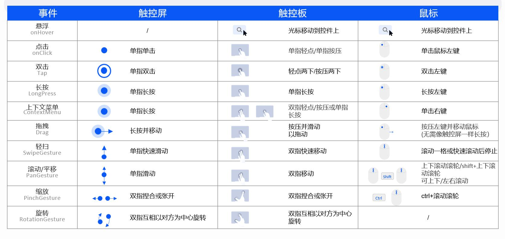

# 交互归一

对于不同类型的智能设备，用户可能有不同的交互方式，如通过触摸屏、鼠标、触控板等。如果针对不同的交互方式单独做适配，会增加开发工作量同时产生大量重复代码。为解决这一问题，我们统一了各种交互方式的API，即实现了**交互归一**。

## 基础输入

常见的基础输入方式及其在各输入设备上的表现如下图所示。

基础输入对应的开发接口，以及当前支持情况如下表所示。

  | 输入 | 开发接口 | 触控屏 | 触控板 |  鼠标
| -------- | -------- | -------- | -------- | -------- |
| 悬浮 | [onHover](../../reference/apis-arkui/arkui-ts/ts-universal-attributes-hover-effect.md) | NA | √ | √ |
| 点击 | [onClick](../../reference/apis-arkui/arkui-ts/ts-universal-events-click.md) | √ | √ | √ | 
| 双击 | [TapGesture](../../reference/apis-arkui/arkui-ts/ts-basic-gestures-tapgesture.md) | √ | √ | √ | 
| 长按 | [LongPressGesture](../../reference/apis-arkui/arkui-ts/ts-basic-gestures-longpressgesture.md) | √ | × | √ | 
| 上下文菜单 | [ContentMenu](../../reference/apis-arkui/arkui-ts/ts-universal-attributes-menu.md) | √ | √ | √ | 
| 拖拽 | [Drag](../../reference/apis-arkui/arkui-ts/ts-universal-attributes-drag-drop.md) | √ | √ | √ |
| 轻扫 | [SwipeGesture](../../reference/apis-arkui/arkui-ts/ts-basic-gestures-swipegesture.md) | √ | √ | √ | 
| 滚动及平移 | [PanGesture](../../reference/apis-arkui/arkui-ts/ts-basic-gestures-pangesture.md) | √ | √ | √ | 
| 缩放 | [PinchGesture](../../reference/apis-arkui/arkui-ts/ts-basic-gestures-pinchgesture.md) | √ | √ | √ | 
| 旋转 | [RotationGesture](../../reference/apis-arkui/arkui-ts/ts-basic-gestures-rotationgesture.md) | √ | √ | NA | 

> **说明：**
> - 点击事件（onClick）其实是点击手势（TapGesture）的一个特殊场景（单指单次点击）。该场景使用的非常广泛，为了方便开发者使用及符合传统开发习惯，所以专门提供了开发接口。
> 
> - 触控板支持长按输入的功能正在开发中。

## 拖拽事件

拖拽是应用开发中经常碰到的场景。拖拽发生在两个组件之间，它不是简单的单次输入，而是一个”过程”，通常包含如下步骤（以将组件A拖拽到组件B中为例）。

- 长按或点击组件A，触发拖拽。

- 保持按压或点击，持续将组件A向组件B拖拽。

- 抵达组件B中，释放按压点击，完成拖拽。

- 也可以在未抵达组件B的中途，释放按压点击，取消拖拽。

一个完整的拖拽事件，包含多个拖拽子事件，如下表所示（请访问拖拽事件了解详细用法）。当前触控屏和鼠标的拖拽事件已经实现”交互归一”，对手写笔的支持正在开发中。

  | 名称 | 功能描述 | 
| -------- | -------- |
| onDragStart | 绑定A组件，触控屏长按/鼠标左键按下后移动触发 | 
| onDragEnter | 绑定B组件，触控屏手指、鼠标移动进入B组件瞬间触发 | 
| onDragMove | 绑定B组件，触控屏手指、鼠标在B组件内移动触发 | 
| onDragLeave | 绑定B组件，触控屏手指、鼠标移动退出B组件瞬间触发 | 
| onDrop | 绑定B组件，在B组件内，触控屏手指抬起、鼠标左键松开时触发 | 