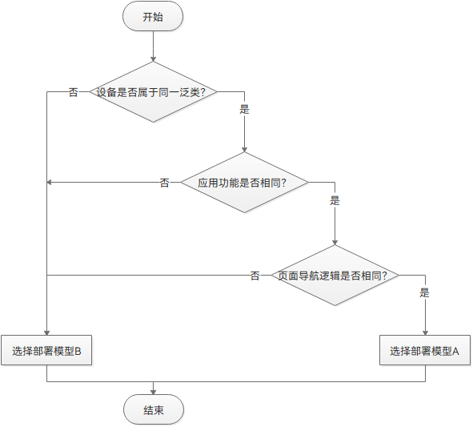

# 简介


## 背景

随着终端设备形态日益多样化，分布式技术逐渐打破单一硬件边界，一个应用或服务，可以在不同的硬件设备之间随意调用、互助共享，让用户享受无缝的全场景体验。而作为应用开发者，广泛的设备类型也能为应用带来广大的潜在用户群体。但是如果一个应用需要在多个设备上提供同样的内容，则需要适配不同的屏幕尺寸和硬件，开发成本较高。OpenHarmony 系统面向多终端提供了“一次开发，多端部署”（后文中简称为“一多”）的能力，让开发者可以基于一种设计，高效构建多端可运行的应用。


## 定义及目标

**定义**：一套代码工程，一次开发上架，多端按需部署。

**目标**：支撑开发者快速高效的开发支持多种终端设备形态的应用，实现对不同设备兼容的同时，提供跨设备的流转、迁移和协同的分布式体验。


为了实现“一多”的目标，需要解决两个基础问题：

- 不同设备间的屏幕尺寸、色彩风格等存在差异，页面如何适配。

- 不同设备的系统能力有差异，如智能穿戴设备是否具备定位能力、智慧屏是否具备摄像头等，功能如何兼容。

从第4章开始将从UX设计、系统能力等角度，详尽的解答上述问题。

>  **说明：**
> - 应用开发不仅包含应用页面开发，还包括应用后端功能开发以及服务器端开发等。
> 
> - 本文旨在指导开发者如何在OpenHarmony系统中开发“一多”应用，服务器端开发不在本文探讨范围内。


## 基础知识

为了更好的阅读后面的章节，本小节主要介绍了一些基础知识，方便读者理解内容。


### 应用程序包结构

OpenHarmony 的应用以APP Pack (Application Package) 形式发布，它是由一个或多个HAP包以及描述每个HAP包属性的pack.info文件组成。

HAP包是OpenHarmony的安装包，一个HAP在工程目录中对应一个Module，由Module编译而来，可分为entry和feature两种类型的HAP。

- **entry**：应用的主模块包。一个APP中，对于同一设备类型，可以有一个或多个entry类型的HAP，来支持该设备类型中不同规格（如API版本、屏幕规格等）的具体设备。

- **feature**：应用的动态特性模块包。一个APP Pack可以包含零个、一个或多个feature类型的HAP。


>  **说明：**
> - Module是开发者开发的相对独立的功能模块，由代码、资源、第三方库及应用配置文件组成，属于IDE开发视图的概念。Module分为entry、feature及har三种类型，相应的可以编译生成entry类型的HAP包、feature类型的HAP包，以及har包。
> 
> - 如果需要了解应用程序包结构更多详情，可以查看[包结构说明](../../quick-start/application-configuration-file-overview-fa.md)。


### 方舟开发框架

OpenHarmony提供了方舟开发框架（简称：ArkUI），提供开发者进行应用UI开发时所必须的能力。

方舟开发框架提供了两种开发范式，分别是基于JS扩展的类Web开发范式（后文中简称为“类Web开发范式”）和基于ArkTS的声明式开发范式（后文中简称为“声明式开发范式”）。

- **声明式开发范式**：采用TS语言并进行声明式UI语法扩展，从组件、动效和状态管理三个维度提供了UI绘制能力。UI开发更接近自然语义的编程方式，让开发者直观地描述UI界面，不必关心框架如何实现UI绘制和渲染，实现极简高效开发。同时，选用有类型标注的TS语言，引入编译期的类型校验，更适用大型的应用开发。

- **类Web开发范式**：采用经典的HML、CSS、JavaScript三段式开发方式。使用HML标签文件进行布局搭建，使用CSS文件进行样式描述，使用JavaScript文件进行逻辑处理。UI组件与数据之间通过单向数据绑定的方式建立关联，当数据发生变化时，UI界面自动触发更新。此种开发方式，更接近Web前端开发者的使用习惯，快速将已有的Web应用改造成方舟开发框架应用。主要适用于界面较为简单的中小型应用开发。


两种开发范式的对比如下。

  | **开发范式名称** | **语言生态** | **UI更新方式** | **适用场景** | **适用人群** | 
| -------- | -------- | -------- | -------- | -------- |
| 声明式开发范式 | ArkTS语言 | 数据驱动更新 | 复杂度较大、团队合作度较高的程序 | 移动系统应用开发人员、系统应用开发人员 | 
| 类Web开发范式 | JS语言 | 数据驱动更新 | 界面较为简单的中小型应用和卡片 | Web前端开发人员 | 

>  **说明：**
> - 声明式开发范式占用内存更少，**更推荐开发者选用声明式开发范式来搭建应用UI界面**。
> 
> - 可以查看[方舟开发框架概述](../../ui/arkui-overview.md)，了解方舟开发框架更多详情。


### 部署模型

“一多”有两种部署模型：

- **部署模型A**：不同类型的设备上按照一定的工程结构组织方式，通过一次编译生成**相同**的HAP包（或HAP包组合）。

- **部署模型B**：不同类型的设备上按照一定的工程结构组织方式，通过一次编译生成**不同**的HAP包（或HAP包组合）。

建议开发者从设备类型及应用功能两个维度，结合具体的业务场景，考虑选择哪种部署模型。但不管采用哪种部署模型，都应该采用一次编译。

**设备类型**

  从屏幕尺寸、交互方式及使用距离三个维度考虑，我们将常用的设备分为三大泛类：
- 默认设备、平板

- 车机、智慧屏

- 智能穿戴

对于相同泛类的设备，优先选择部署模型A，对于不同泛类设备，优先选择部署模型B。

**应用功能**

- 方舟开发框架提供了丰富的多设备适配能力，相同泛类的设备通常总是可以使用部署模型A。部署模型A需要的开发和维护工作量更小，而且可以保证不同类型设备上体验的一致性。

- 仅当同一泛类不同类型设备上规划的功能差异非常大时，才推荐使用部署模型B，如默认设备和平板分别交给两个团队设计、开发和维护等。

一般应用在不同设备上选择部署模型的思路如下：



>  **说明：**
> 页面导航逻辑是指应用内页面之间的跳转关系。假设默认设备上页面A跳转到页面B，平板设备上也是页面A跳转到页面B。因为两种设备屏幕大小不同，默认设备上页面B是覆盖显示在页面A上的，平板设备上页面B是在页面A的右边并且同时显示，但因为都是页面A跳转到页面B，那么我们认为它们的页面导航逻辑相同。

**工程结构**

“一多”推荐在应用开发过程中使用如下的“三层工程结构”。

- common：公共特性目录，如工具类、公共配置等。

- features：功能模块目录，存放应用中相对独立的各个功能的实现（包括该功能相关的UI代码及业务逻辑代码），如帐户管理等。

- product：产品层目录，通过引用common和feature目录中代码的方式做功能和特性的集成，同时也作为主入口。

>  **说明：**
> features层可横向调用和依赖common层能力；product层不可横向调用，可依赖features层和common层，且不能有反向依赖。

部署模型不同，相应的代码工程结构也有差异。部署模型A和部署模型B的主要差异点集中在product层：

- 部署模型A可以直接在product目录中做功能和特性集成。

- 部署模型B需要在product目录下再建一级子目录，在不同的子目录中对不同的产品做差异化的功能和特性集成。

部署模型A对应的代码工程结构抽象后一般如下所示：

  
```
/application
├── common                  # 可选。公共特性目录, har类型的module
├── features                # 可选。功能模块目录
│   ├── feature1            # 子功能1, har类型的module
│   ├── feature2            # 子功能2, har类型的module
│   └── ...
└── product                 # 必选。产品层目录, entry类型的module,编译后为hap包
```

部署模型B对应的代码工程结构抽象后一般如下所示：

  
```
/application
├── common                  # 可选。公共特性目录, har类型的module
├── features                # 可选。功能模块目录
│   ├── feature1            # 子功能1, har类型的module
│   ├── feature2            # 子功能2, har类型的module
│   └── ...
└── product                 # 必选。产品层目录
    ├── wearable            # 智能穿戴泛类目录, entry类型的module,编译后为hap包
    ├── default             # 默认设备泛类目录, entry类型的module,编译后为hap包
    └── ...
```

>  **说明：**
> 无论是用部署模型A还是部署模型B，在开发阶段，都应考虑**不同类型设备间最大程度的复用代码**，以减少开发及后续维护的工作量。
