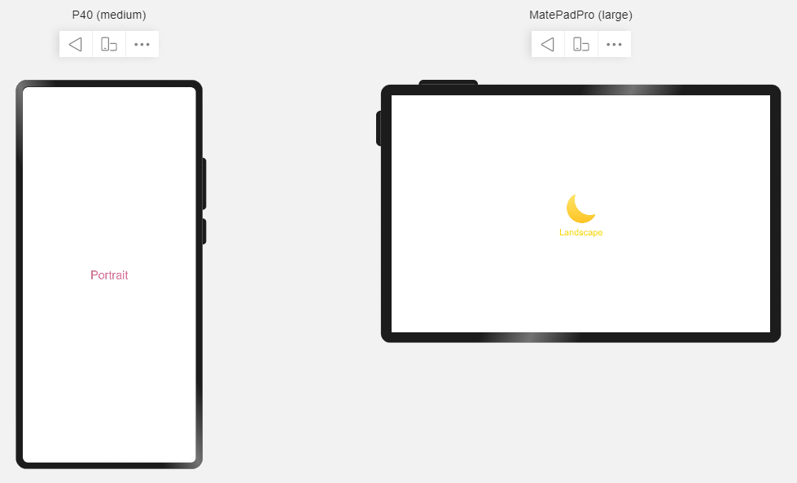

# 媒体查询


媒体查询是一种常用的功能，在移动设备上应用非常广泛。开发者经常需要根据设备的大致类型或特定的特征和设备参数（例如屏幕分辨率）来修改应用的样式。为此媒体查询提供了如下功能：


- 针对设备和应用的属性信息，可以设计出相匹配的布局样式。

- 当屏幕发生动态改变时（比如横竖屏切换、屏幕宽高比），页面布局同步更新。


当前支持对如下媒体特征做媒体查询。


| 类型 | 说明 |
| -------- | -------- |
| height | 应用页面显示区域的高度。 |
| min-height | 应用页面显示区域的最小高度。 |
| max-height | 应用页面显示区域的最大高度。 |
| width | 应用页面显示区域的宽度。 |
| min-width | 应用页面显示区域的最小宽度。 |
| max-width | 应用页面显示区域的最大宽度。 |
| resolution | 设备的分辨率，支持dpi，dppx和dpcm单位。 |
| min-resolution | 设备的最小分辨率。 |
| max-resolution | 设备的最大分辨率。 |
| orientation | 屏幕的方向，支持portrait（竖屏）和landscape（横屏）。 |
| device-type | 设备类型，支持tablet、tv、wearable等。 |


>  **说明：**
> - 声明式开发范式，请查看[媒体查询](https://gitee.com/openharmony/docs/blob/master/zh-cn/application-dev/ui/ui-ts-layout-mediaquery.md)了解详细用法。
> 
> - 类Web开发范式，支持在js文件和css文件中使用媒体查询，请查看[js媒体查询](https://gitee.com/openharmony/docs/blob/master/zh-cn/application-dev/reference/apis/js-apis-mediaquery.md)和[css媒体查询](https://gitee.com/openharmony/docs/blob/master/zh-cn/application-dev/reference/arkui-js/js-components-common-mediaquery.md)了解详细用法。
> 
> - 媒体查询能力最为强大，它可以改变页面组件结构，而自适应布局和栅格布局均无此能力。
> 
> - 相对于其它”一多”能力，媒体查询可能增加较多代码量。在可以满足需求的前提下，建议优先使用其它”一多”能力。


## 示例：

如下图，媒体查询不仅可以改变页面中的元素属性（文字内容、文字颜色），还可以改变页面结构（是否显示图片）。





```ts
import mediaquery from '@ohos.mediaquery'

@Entry
@Component
struct MediaQuerySample {
  @State color: string = '#DB7093';
  @State text: string = 'Portrait';
  @State flag: boolean = false;
  private listener: mediaquery.MediaQueryListener = mediaquery.matchMediaSync('(orientation: landscape)');

  onOrientationChange = (mediaQueryResult) => {
    if (mediaQueryResult.matches) {
      this.color = '#FFD700';
      this.text = 'Landscape';
      this.flag = true;
    } else {
      this.color = '#DB7093';
      this.text = 'Portrait';
      this.flag = false;
    }
  }

  private aboutToAppear(): void {
    this.listener.on('change', this.onOrientationChange);
  }

  private aboutToDisappear(): void {
    this.listener.off('change', this.onOrientationChange);
  }

  build() {
    Flex({ direction: FlexDirection.Column, alignItems: ItemAlign.Center, justifyContent: FlexAlign.Center }) {
      if (this.flag) {                          // 通过媒体查询，改变布局
        Image($r("app.media.my_image"))
          .width(100)
          .height(100)
      }
      Text(this.text).fontSize(24).fontColor(this.color)
    }
    .width('100%').height('100%')
  }
}
```
