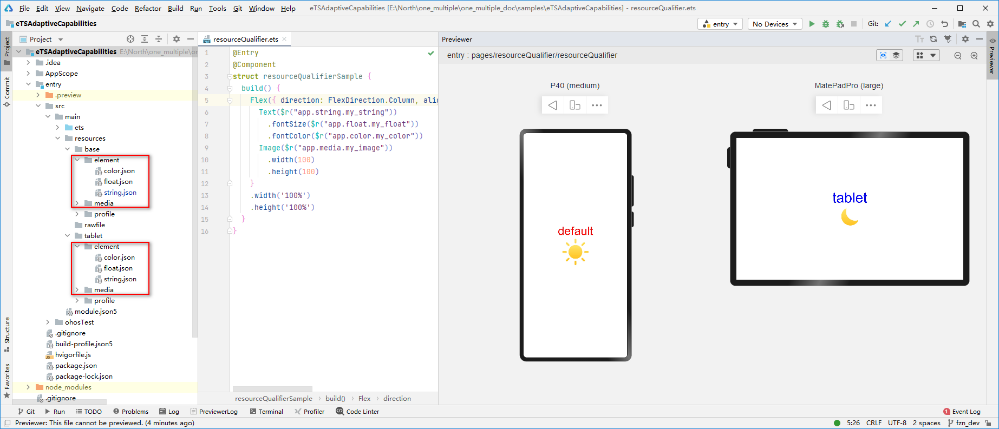

# 资源使用


在页面开发过程中，经常需要用到颜色、字体、间距、图片等资源，在不同的设备或配置中，这些资源的值可能不同。有两种方式处理：


- [应用资源](#应用资源)：借助资源文件能力，开发者在应用中自定义资源，自行管理这些资源在不同的设备或配置中的表现。

- [系统资源](#系统资源)：开发者直接使用系统预置的资源定义（即分层参数）。


## 应用资源


### 资源文件介绍

应用开发中使用的各类自定义资源文件，需要统一存放于应用的resources目录下，便于使用和维护。resources目录包括两大类目录，一类为base目录与限定词目录，另一类为rawfile目录，其基础目录结构如下所示。


```
resources
|---base  // 默认存在的目录
|   |---element
|   |   |---string.json
|   |---media
|   |   |---icon.png
|---en_GB-vertical-car-mdpi // 限定词目录示例，需要开发者自行创建   
|   |---element
|   |   |---string.json
|   |---media
|   |   |---icon.png
|---rawfile  // rawfile目录
```

base目录默认存在，而限定词目录需要开发者自行创建，其名称可以由一个或多个表征应用场景或设备特征的限定词组合而成。应用使用某资源时，系统会根据当前设备状态优先从相匹配的限定词目录中寻找该资源。只有当resources目录中没有与设备状态匹配的限定词目录，或者在限定词目录中找不到该资源时，才会去base目录中查找。rawfile是原始文件目录，它不会根据设备状态去匹配不同的资源，故不在本文的讨论范文内。

> **说明：**
> - 请访问[声明式开发范式资源文件分类](../../quick-start/resource-categories-and-access.md#资源分类)，了解限定词目录的命名规则、创建流程、匹配规则等，本文不展开介绍。
> 
> - 没有设备状态匹配的限定词目录，或者在限定词目录中找不到目标资源时，会继续在base目录中查找。**强烈建议对于所有应用自定义资源都在base目录中定义默认值**，防止出现找不到资源值的异常场景。
> 
> - 类Web开发范式的资源文件路径及资源限定词的使用与声明式范式不同，详情请参考[类Web开发范式资源限定与访问](../../ui/js-framework-resource-restriction.md)及[类Web开发范式文件组织](../../ui/js-framework-file.md)。

base目录与限定词目录下面可以创建资源组目录（包括element、media等），用于存放特定类型的资源文件。

  | 资源组目录 | 目录说明 | 资源文件 | 
| -------- | -------- | -------- |
| element | 表示元素资源，以下每一类数据都采用相应的JSON文件来表征。<br/>-&nbsp;boolean，布尔型<br/>-&nbsp;color，颜色<br/>-&nbsp;float，浮点型<br/>-&nbsp;intarray，整型数组<br/>-&nbsp;integer，整型<br/>-&nbsp;pattern，样式<br/>-&nbsp;plural，复数形式<br/>-&nbsp;strarray，字符串数组<br/>-&nbsp;string，字符串 | element目录中的文件名称建议与下面的文件名保持一致。每个文件中只能包含同一类型的数据。<br/>-&nbsp;boolean.json<br/>-&nbsp;color.json<br/>-&nbsp;float.json<br/>-&nbsp;intarray.json<br/>-&nbsp;integer.json<br/>-&nbsp;pattern.json<br/>-&nbsp;plural.json<br/>-&nbsp;strarray.json<br/>-&nbsp;string.json | 
| media | 表示媒体资源，包括图片、音频、视频等非文本格式的文件。 | 文件名可自定义，例如：icon.png。 | 

在element目录的各个资源文件中，以“name-value”的形式定义资源，如下所示。而在media目录中，直接以文件名作为name，故开发者将文件放入media目录即可，无需再额外定义name。


```json
// color.json 
{
    "color": [
        {
            "name": "color_red",
            "value": "#ffff0000"
        },
        {
            "name": "color_blue",
            "value": "#ff0000ff"
        }
    ]
}
```


### 访问应用资源

在工程中，通过 "$r('app.type.name')" 的形式引用应用资源。app代表是应用内resources目录中定义的资源；type 代表资源类型（或资源的存放位置），可以取 color、float、string、plural和media，name代表资源命名，由开发者添加资源时确定。

> **说明：**
> 可以查看[声明式范式访问应用资源](../../quick-start/resource-categories-and-access.md#资源分类与访问)，了解资源访问的更多细节。


### 示例

在应用的resources目录下，创建名为tablet的限定词子目录，并按照下表所示，在base目录和tablet限定词目录中添加相应的资源。

  | 资源名称 | 资源类型 | base目录中资源值 | 限定词目录（tablet）中资源值 | 
| -------- | -------- | -------- | -------- |
| my_string | string | default | tablet | 
| my_color | color | \#ff0000 | \#0000ff | 
| my_float | float | 60vp | 80vp | 
| my_image | media | my_image.png（太阳图标） | my_image.png（月亮图标） | 

在代码中通过 "$r('app.type.name')" 的形式使用应用资源，并分别在默认设备和平板上查看代码的运行效果，可以发现同一资源在不同设备上的取值不同。




```ts
@Entry
@Component
struct Index {
  build() {
    Flex({ direction: FlexDirection.Column, alignItems: ItemAlign.Center, justifyContent: FlexAlign.Center }) {
      Text($r("app.string.my_string"))
        .fontSize($r("app.float.my_float"))
        .fontColor($r("app.color.my_color"))
      Image($r("app.media.my_image"))
        .width(100)
        .height(100)
    }
    .width('100%')
    .height('100%')
  }
}
```


## 系统资源

除了自定义资源，开发者也可以使用系统中预定义的资源（即<!--RP1-->[分层参数](../../../design/ux-design/visual-basis.md)<!--RP1End-->，同一资源ID在设备类型、深浅色等不同配置下有不同的取值）。

在开发过程中，分层参数的用法与资源限定词基本一致。开发者可以通过"$r('sys.type.resource_id')"的形式引用系统资源。sys代表是系统资源；type代表资源类型，值可以取color、float、string和media；resource_id代表资源id。

<!--Del-->
可以查看[应用UX设计中关于资源的介绍](../../../design/ux-design/design-resources.md)，获取系统支持的资源ID及其在不同配置下的取值。<!--DelEnd-->

> **说明：**
> - 仅声明式开发范式支持使用分层参数，类Web开发范式不支持。
> 
> - 系统资源可以保证不同团队开发出的应用有较为一致的视觉风格。对于系统预置应用，强烈建议使用系统资源；对于三方应用，可以根据需要选择使用系统资源或自定义应用资源。<!--Del-->
> 
> - 可以查看[resources代码仓](https://gitee.com/openharmony/resources/tree/master/systemres/main/resources)了解系统预置资源的实现，这里的目录结构与工程中的resources目录类似，也是通过资源限定词匹配不同的设备或设备状态。<!--DelEnd-->
