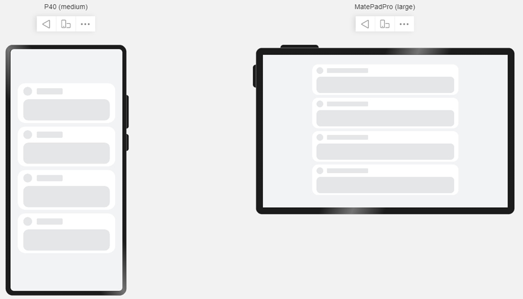
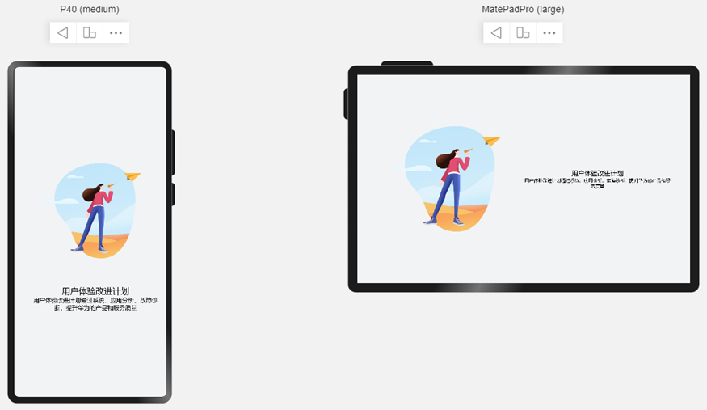
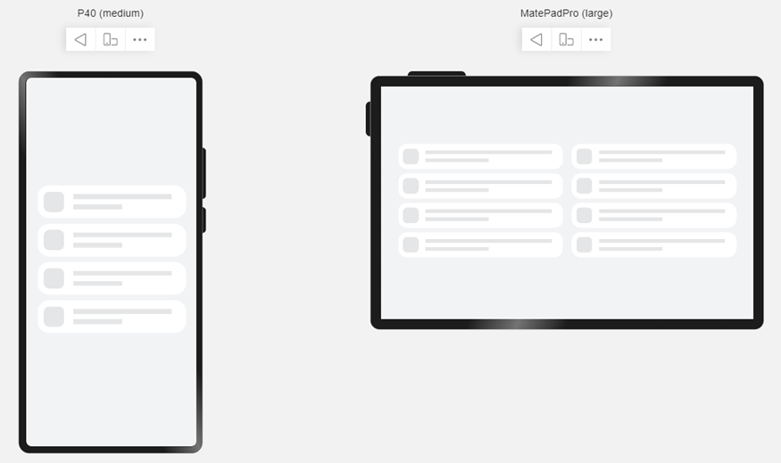

# 典型场景


当基本的自适应布局无法满足多终端上屏幕的体验要求时，我们可以针对不同终端的屏幕特点，借助栅格系统和媒体查询能力，实现更复杂的布局效果。


## 缩进布局

在上一小节“栅格系统”中，我们介绍了四种不同的设备宽度类型，在不同宽度类型的设备中，默认的Margin、Gutter及Column数量不同。借助栅格系统，我们可以很方便的在不同宽度的设备上实现不同的缩进效果。


### 示例




```ts
@Entry
@Component
struct IndentationSample {
  build() {
    Row() {
      GridContainer() {
        Column() {
          ForEach([0, 1, 2, 4], () => {
            Column() {
              ItemContent()
            }.useSizeType({ xs: 2, sm: 4, md: 6, lg: 8 })
          })
        }
      }
    }
    .alignItems(VerticalAlign.Center)
    .height('100%')
    .backgroundColor('#F1F3F5')
  }
}

@Component
struct ItemContent {
  build() {
    Column() {
      Row() {
        Row() {}
        .width(28).height(28).borderRadius(14).margin({ right: 15 })
        .backgroundColor('#E4E6E8')
        Row() {}
        .width('30%').height(20).borderRadius(4)
        .backgroundColor('#E4E6E8')
      }.width('100%').height(28)

      Row() {}
      .width('100%').height(68).borderRadius(16).margin({ top: 12 })
      .backgroundColor('#E4E6E8')
    }
    .height(128)
    .borderRadius(24)
    .backgroundColor('#FFFFFF')
    .padding({ top: 12, bottom: 12, left: 18, right: 18 })
    .margin({ bottom: 12 })
  }
}
```


## 挪移布局

挪移布局是栅格和折行能力的结合。当屏幕宽度发生改变，达到预设的断点时，栅格中子元素占据的列数会随着开发者的配置发生改变。当一行中的列数超过栅格组件在该断点的指定值时，可以自动换行。借助挪移布局，我们可以很方便的实现内容尺寸及相对位置的调整。


### 示例

当屏幕宽度发生变化时，图片和文字由”上下布局”切换为”左右布局”。




```ts
@Entry
@Component
struct DiversionSample {
  build() {
    Row() {
      GridContainer() {
        Flex({
          direction: FlexDirection.Row,
          alignItems: ItemAlign.Center,
          justifyContent: FlexAlign.Center,
          wrap: FlexWrap.Wrap
        }) {
          Row() {
            Image($r('app.media.illustrator'))
          }
          .aspectRatio(1)
          .useSizeType({ xs: 2, sm: 4, md: 4, lg: 6 })

          Flex({
            direction: FlexDirection.Column,
            alignItems: ItemAlign.Center,
            justifyContent: FlexAlign.Center
          }) {
            Text('用户体验改进计划')
              .textAlign(TextAlign.Center)
              .fontSize(20)
              .fontWeight(FontWeight.Medium)
            Text('用户体验改进计划通过系统、应用分析、故障诊断，提升华为的产品和服务质量')
              .textAlign(TextAlign.Center)
              .fontSize(14)
              .fontWeight(FontWeight.Medium)
          }
          .height(100)
          .useSizeType({ xs: 2, sm: 4, md: 4, lg: 6 })
        }
      }

    }.height('100%')
    .alignItems(VerticalAlign.Center)
    .backgroundColor('#F1F3F5')
  }
}
```


## 重复布局

充分利用屏幕尺寸优势，当屏幕变宽时，增加显示元素的数量。注意这种场景下，组件的数量发生了变化。可以使用媒体查询改变元素数量，同时借助栅格系统设置这些元素在不同宽度设备下的尺寸和位置。


### 示例




```ts
import mediaquery from '@ohos.mediaquery'

@Entry
@Component
struct RepeatSample {
  @State isWidescreen: boolean = false;
  private listener: mediaquery.MediaQueryListener = mediaquery.matchMediaSync('(width > 1200)');

  onWidthChange = (mediaQueryResult) => {
    if (mediaQueryResult.matches) {
      this.isWidescreen = true;
    } else {
      this.isWidescreen = false;
    }
  }

  private aboutToAppear(): void {
    this.listener.on('change', this.onWidthChange);
  }

  private aboutToDisappear(): void {
    this.listener.off('change', this.onWidthChange);
  }

  build() {
    Row() {
      GridContainer() {
        ForEach([0, 1, 2, 3], () => {
          Row() {
            Column() { RepeatItemContent() }
            .useSizeType({
              xs: { span: 2, offset: 0 }, sm: { span: 4, offset: 0 },
              md: { span: 4, offset: 0 }, lg: { span: 6, offset: 0 }
            })

            if (this.isWidescreen) {
              Column() { RepeatItemContent() }
              .useSizeType({
                md: { span: 4, offset: 4 }, lg: { span: 6, offset: 6 }
              })
            }
          }
        })
      }
    }
    .height('100%')
    .backgroundColor('#F1F3F5')
  }
}

@Component
struct RepeatItemContent {
  build() {
    Flex() {
      Row() {}.width(43).height(43).borderRadius(12).backgroundColor('#E4E6E8')
      Flex({ alignItems: ItemAlign.Start, direction: FlexDirection.Column, justifyContent: FlexAlign.SpaceAround }) {
        Row() {}.height(10).width('100%').backgroundColor('#E4E6E8')
        Row() {}.height(10).backgroundColor('#E4E6E8').width('50%')
      }.flexGrow(1).margin({ left: 13 })
    }
    .padding({ top: 13, bottom: 13, left: 13, right: 37 })
    .height(69)
    .backgroundColor('#FFFFFF')
    .margin({ bottom: 12 })
    .borderRadius(24)
  }
}
```
