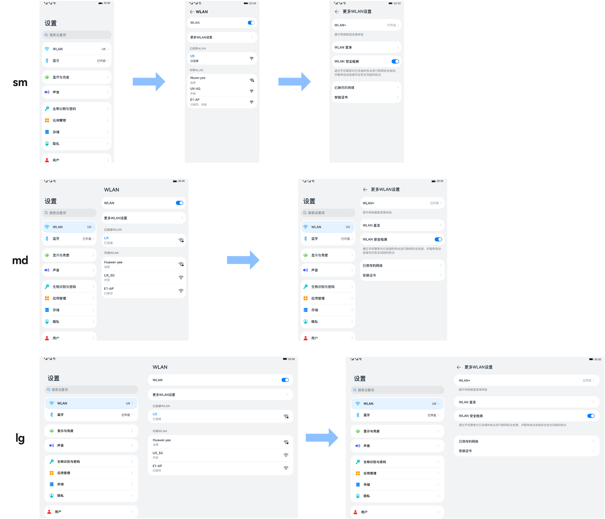
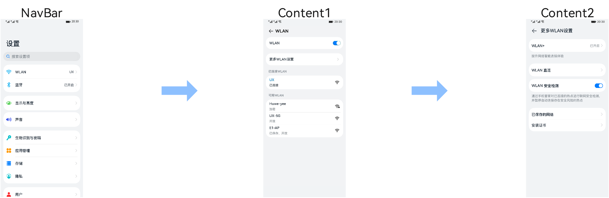
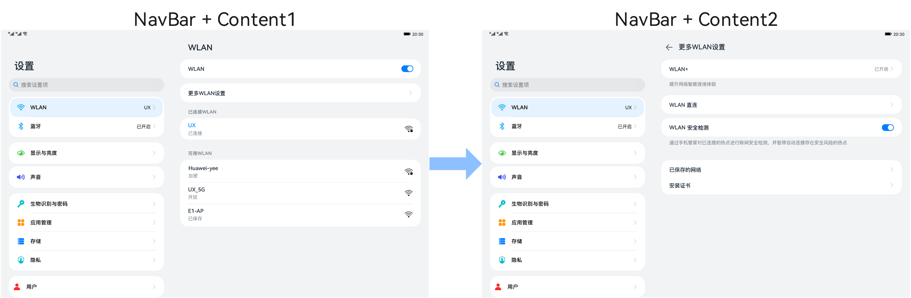
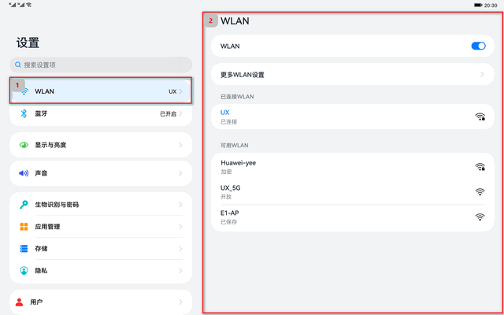
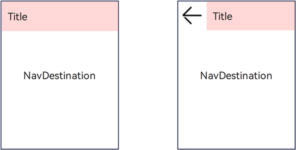
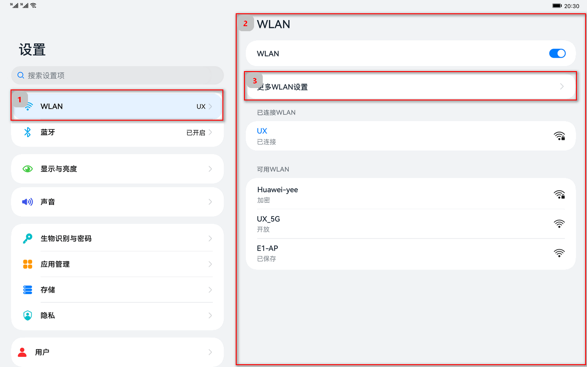
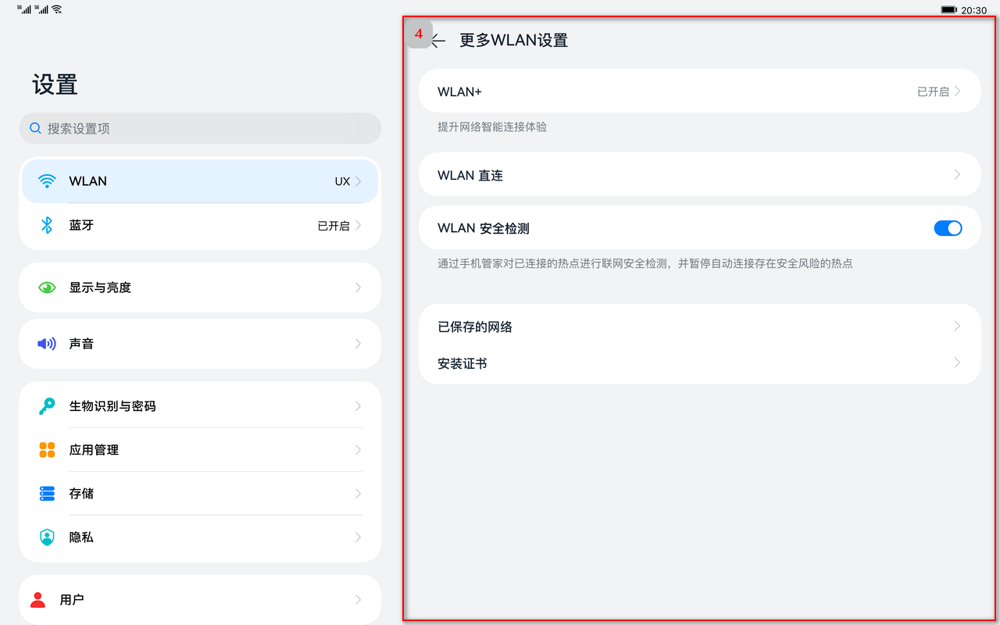
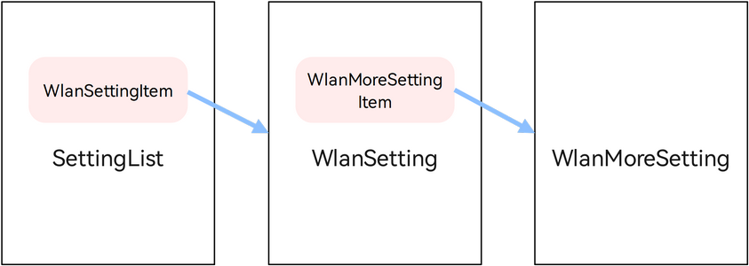

# 设置应用页面

本小节以“设置”应用页面为例，介绍如何使用自适应布局能力和响应式布局能力适配不同尺寸窗口。

## 页面设计

为充分利用屏幕尺寸优势，应用常常有在小屏设备上单栏显示，大屏设备上左右分两栏显示的设计，设置应用页面设计如下。



观察“设置”应用页面设计，不同断点下“设置主页”、“WLAN页面”和“更多WLAN设置页面”几乎完全一致，只是在sm断点下采用单栏显示，在md和lg断点下采用双栏显示。

在前面的典型页面场景中，已经介绍了如何分析及实现不同断点下设计相似的单个页面，本小节将展开介绍如何实现不同断点下存在单栏和双栏设计的场景。

为了方便读者理解，本小节将围绕以下三个问题进行介绍。

1. [如何实现单/双栏的显示效果](#如何实现单/双栏的显示效果)
2. [如何实现点击跳转或刷新](#如何实现点击跳转或刷新)
3. [如何实现多级跳转](#如何实现多级跳转)

## 如何实现单/双栏的显示效果

开发者可以使用Row、Column、[RowSplit](../../reference/arkui-ts/ts-container-rowsplit.md)等基础的组件，实现分栏显示的效果，但是需要较多的开发工作量。方舟开发框架在API 9重构了[Navigation组件](../../reference/arkui-ts/ts-basic-components-navigation.md)，开发者可以通过配置Navigation组件的属性，控制其按照单栏或双栏的效果进行显示。

Navigation组件由Navbar和Content两部分区域组成，Navigation组件支持Stack、Split以及Auto三种模式。Stack及Split模式下Navigation组件的表现如下图所示。

* Stack模式

  

* Split模式

  

* Auto模式

  Auto模式是指Navigation组件可以根据应用窗口尺寸，自动选择合适的模式：窗口宽度小于520vp时，采用Stack模式显示；窗口宽度大于等于520vp时，采用Split模式显示。当窗口尺寸发生改变时，Navigation组件也会自动在Stack模式和Split模式之间切换。

>  **说明：**
>
> * Navigation组件提供的title、navBarWidth、navBarPosition等属性来调整其显示效果。Navigation组件样式的配置与其它组件类似，这里不做赘述。
> * 首次加载Navigation组件所在的页面时，如果Navigation组件处于Split模式，Navigation组件会自动激活其第一个NavRouter孩子节点（后文会展开介绍NavRouter）来刷新Content区域的显示。

设置主页的核心代码如下所示。Navigation组件默认处于Auto模式，其样式会根据应用窗口尺寸在单栏和双栏之间自动切换。

```typescript
@Entry
@Component
struct Index { 
  build() {
    Navigation() {
      SettingList()
    }
    .title($r('app.string.settings'))
    .navBarWidth('40%')
    .width('100%')
    .height('100%')
    .backgroundColor($r("sys.color.ohos_id_color_sub_background"))
  }
}
```


## 如何实现点击跳转或刷新

Navigation组件通常搭配[NavRouter组件](../../reference/arkui-ts/ts-basic-components-navrouter.md)以及[NavDestination组件](../../reference/arkui-ts/ts-basic-components-navdestination.md)一起使用：

* NavRouter组件用于控制Navigation组件Content区域的显示和刷新逻辑。
* NavDestination组件用于实际刷新Navigation组件Content区域的显示。

### 刷新控制

NavRouter组件用于控制Navigation组件中Content区域的刷新逻辑，其必须包含两个孩子节点。

|                | 节点类型           | 节点功能                            |
| -------------- | ------------------ | ----------------------------------- |
| 第一个孩子节点 | 容器类组件         | 直接控制NavRouter的显示效果         |
| 第二个孩子节点 | NavDestination组件 | 刷新Navigation组件Content区域的显示 |

NavRouter组件默认提供了点击响应处理，不需要开发者自定义点击事件逻辑。另外，NavRouter组件还提供了onStateChange回调事件，用于通知开发者NavRouter的状态：用户点击NavRouter，激活NavRouter并加载对应的NavDestination子组件时，回调onStateChange(true)；NavRouter对应的NavDestination子组件不再显示时，回调onStateChange(false)。



结合设置应用的具体场景来看，上图1号小红框是NavRouter的第一个孩子节点，2号红框是NavRouter的第二个孩子节点，相应的核心代码实现如下。

```typescript
@Component
export struct WlanSettingItem {
  @LocalStorageLink('selectedLabel') selectedLabel: string  = ''

  build() {
    Column() {
      NavRouter() {
        MainItem({
          title: $r('app.string.wifiTab'),
          tag: 'UX',
          icon: $r('app.media.wlan'),
          label: 'WLAN'
        })

        NavDestination() {
          WlanSetting()
        }
        .title($r('app.string.wifiTab'))
        .backgroundColor($r('sys.color.ohos_id_color_sub_background'))
      }
    }
  }
}
```

### 显示刷新

NavDestination组件用于实际刷新Navigation组件Content区域的显示。激活后的NavRouter对应的NavDestination组件，会占满整个Content区域并刷新其显示。

开发者可以通过NavDestination组件提供的如下属性，调整其最终显示效果：

- backgroundColor：设置NavDestination组件的背景色。
- title：自定义NavDestination组件的标题。
- hideTitleBar：隐藏NavDestination组件的标题栏。

特别的，Navigation组件会根据当前的状态决定是否在NavDestination组件标题栏起始部分自动添加返回键图标。当Navigation组件添加了返回键图标时，还可以自动响应及处理系统三键导航中的返回键事件。 



## 如何实现多级跳转

可以在NavDesination组件中，继续使用NavRouter组件，以实现多级跳转。多级跳转场景下，Navigation组件同样会根据当前的状态决定是否自动添加返回键图标及响应系统三键导航中的返回键事件。

| 一级页面                          | 二级页面                            |
| --------------------------------- | ----------------------------------- |
|  |  |


结合具体场景，红框3是一个NavRouter组件，点击后可以控制Navigation组件中的Content区域刷新为红框4对应的NavDestination组件吗，其核心代码实现如下所示。

```typescript
@Component
export struct WlanMoreSettingItem {
  @LocalStorageLink('selectedLabel') selectedLabel: string = ''

  build() {
    NavRouter() {
      SubItemArrow({ title: $r('app.string.moreWlanSettings') })

      NavDestination() {
        WlanMoreSetting()
      }
      .title($r('app.string.moreWlanSettings'))
      .backgroundColor($r('sys.color.ohos_id_color_sub_background'))
    }
  }
}
```

## 总结



本示例的基础导航结构上图所示：

* 激活`SettingList`中的`WLANSettingItem`，可以加载及显示`WlanSetting`。
* 激活`WlanSetting`中的`WlanMoreSettingItem`，可以加载及显示`WlanMoreSetting`。

Navigation组件支持自动切换单栏和双栏的显示效果，同时可以根据当前状态自动添加返回键及响应系统的返回键事件。借助Navigation组件，开发者不用关心单栏和双栏场景的差异而更关注于应用本身，极大的减少开发工作量及提高开发效率。


## 相关实例

针对“设置”应用页面，有以下相关实例可以参考：

- [典型页面场景：设置应用页面（ArkTS）（API9）](https://gitee.com/openharmony/applications_app_samples/tree/OpenHarmony-3.2-Release/code/SuperFeature/MultiDeviceAppDev/Settings)
