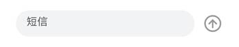

# 底部输入栏


有了顶部工具栏的开发经验，可以发现底部输入栏的结构更为简单，它同样以Flex组件作为父容器，同时包含文本输入框（请访问[文本输入组件](../../reference/arkui-ts/ts-basic-components-textarea.md)查看详细介绍）和消息发送图标两个子节点。





为了便于查看的效果，我们同样给底部输入栏设置了淡蓝色到背景色。注意这里有一个特殊的地方，我们给TextArea设置了flexGrow(1)属性。flexGrow属性仅在父组件是Flex组件时生效，表示Flex容器的剩余空间分配给此属性所在的组件的比例，flexGrow(1)表示父容器的剩余空间全部分配给此组件，详见[Flex布局](../../reference/arkui-ts/ts-universal-attributes-flex-layout.md)。


  | 默认设备 | 平板 | 
| -------- | -------- |
|  |  | 


```
@Component
 struct ButtomArea {
   build() {
     Flex({ direction: FlexDirection.Row, alignItems: ItemAlign.Center, justifyContent: FlexAlign.Center }) {
       TextArea({ placeholder:'短信' })
         .placeholderColor("#99000000")
         .caretColor("#007DFF")
         .backgroundColor("#F1F3F5")
         .borderRadius(20)
         .height(40)
         .flexGrow(1)           // 将父容器的剩余空间全部分配给此组件

       Image($r("app.media.send"))
         .height(36)
         .width(36)
         .opacity(0.4)
         .margin({ left:12 })
     }
     .height(72)
     .width('100%')
     .padding({ left:24, right:24, bottom:8, top:8 })
     .backgroundColor('#87CEFA')  // 底部输入栏背景色，仅用于开发测试
   }
 }
```
