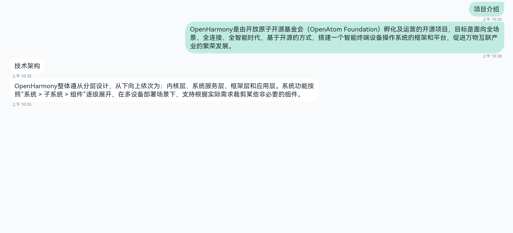
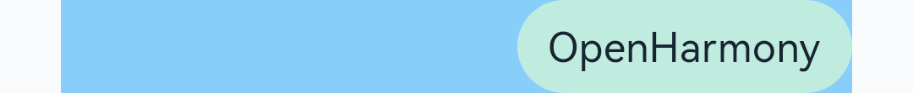
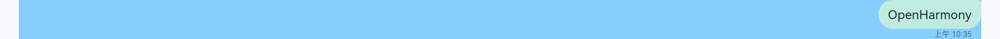
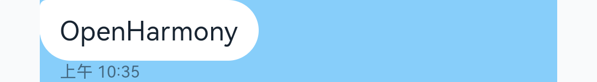

# 信息列表


观察信息列表区域，可以发现它是由一个个消息气泡组成的，另外消息气泡在默认设备和平板上的布局有差异。本小节将围绕如下两个主题介绍如何实现消息列表。


- 如何实现自定义消息气泡组件。

- 如何在默认设备和平板上自适应布局。


  | 默认设备 | 平板 | 
| -------- | -------- |
|  |  | 


## 消息气泡

先做一个最简单的消息气泡，通过borderRadius属性可以设置边框的圆角半径（详见[边框设置](https://gitee.com/openharmony/docs/blob/master/zh-cn/application-dev/reference/arkui-ts/ts-universal-attributes-border.md)）。

  | 默认设备 | 平板 | 
| -------- | -------- |
|  |  | 

  
```
@Component
struct MessageBubble {
  private content: string = "OpenHarmony";

  build() {
    Column() {
      Flex({ alignItems: ItemAlign.Center, justifyContent: FlexAlign.End }) {
        Text(this.content)
            .fontSize(16)
            .lineHeight(21)
            .padding({ left: 12, right: 12, top: 8, bottom: 8 })
            .backgroundColor("#C0EBDF")
            .borderRadius(24)
            .fontColor("#182431")
      }.width('100%')
    }
    .margin({left: 24, right: 24 })
    .backgroundColor('#87CEFA')  // 消息背景色，仅用于开发和测试 
  }
}
```

注意这个简单的消息气泡，左上角（或右上角）的样式，与实际期望不符。我们先修改发送消息右上角的样式，接收消息左上角的实现与之类似。

[Stack组件](https://gitee.com/openharmony/docs/blob/master/zh-cn/application-dev/reference/arkui-ts/ts-container-stack.md)是一个堆叠容器，其子组件按照轴方向依次堆叠，后一个子组件覆盖前一个子组件。通过其alignContent接口，可以设置子组件在容器内的对齐方式，如alignContent: Alignment.TopStart代表子组件从左上角对齐。

  | 默认设备 | 平板 | 
| -------- | -------- |
|  |  | 

  
```
@Component
struct MessageBubble {
  private content: string = "OpenHarmony";
  private time: string = "今天 上午 10:35";

  build() {
    Column() {
      Flex({ alignItems: ItemAlign.Center, justifyContent: FlexAlign.End }) {
        Stack({ alignContent: Alignment.TopEnd }) {  // 在左上角堆叠一个小色块
          Column()
            .backgroundColor("#C0EBDF")
            .borderRadius(4)
            .width(24)
            .height(24)
          Text(this.content)
            .fontSize(16)
            .lineHeight(21)
            .padding({ left: 12, right: 12, top: 8, bottom: 8 })
            .backgroundColor("#C0EBDF")
            .borderRadius(24)
            .fontColor("#182431")
        }
      }.width('100%')
    }
    .margin({left: 24, right: 24 })
    .backgroundColor('#87CEFA')  // 消息背景色，仅用于开发和测试 
  }
}
```

接下来我们在消息气泡下方加上时间显示，如下图所示，一个消息气泡自定义组件就基本完成了。

  | 默认设备 | 平板 | 
| -------- | -------- |
|  |  | 

  
```
@Component
struct MessageBubble {
  private content: string = "OpenHarmony";
  private time: string = "上午 10:35";

  build() {
    Column() {
      Flex({ alignItems: ItemAlign.Center, justifyContent: FlexAlign.End }) {
        Stack({ alignContent: Alignment.TopEnd }) {
          Column()
            .backgroundColor("#C0EBDF")
            .borderRadius(4)
            .width(24)
            .height(24)
          Text(this.content)
            .fontSize(16)
            .lineHeight(21)
            .padding({ left: 12, right: 12, top: 8, bottom: 8 })
            .backgroundColor("#C0EBDF")
            .borderRadius(24)
            .fontColor("#182431")
        }
      }.width('100%')

      // 在消息气泡底部增加时间显示
      Flex({ alignItems: ItemAlign.Center, direction: FlexDirection.Row,
        justifyContent: FlexAlign.End}) {
        Text(this.time)
          .textAlign(TextAlign.Start)
          .fontSize(10)
          .lineHeight(13)
          .fontColor("#99182431")
      }.width('100%').margin({ left: 12, right: 0 })
    }
    .margin({left: 24, right: 24 })
    .backgroundColor('#87CEFA')  // 消息背景色，仅用于开发和测试 
  }
}
```

发送出的消息和接收到的消息的消息气泡结构基本一致，可以通过增加一个标志位，让两种消息共用MessageBubble这个自定义组件，代码如下所示。将这个标志位设置true，可以查看接收消息的效果。

  | 默认设备 | 平板 | 
| -------- | -------- |
|  |  | 

  
```
@Component
 struct MessageBubble {
   private isReceived:boolean=false;  // 通过标志位，判断是发送or接收场景，进而使用不同的样式
   private content:string="OpenHarmony";
   private time:string="今天 10:00";

   build() {
     Column() {
       Flex({ justifyContent:this.isReceived? FlexAlign.Start: FlexAlign.End,
         alignItems: ItemAlign.Center }) {
         Stack({ alignContent:this.isReceived? Alignment.TopStart: Alignment.TopEnd }) {
           Column()
             .backgroundColor(this.isReceived?"#FFFFFF":"#C0EBDF")
             .borderRadius(4)
             .width(24)
             .height(24)
           Text(this.content)
             .fontSize(16)
             .lineHeight(21)
             .padding({ left:12, right:12, top:8, bottom:8 })
             .backgroundColor(this.isReceived?"#FFFFFF":"#C0EBDF")
             .borderRadius(24)
             .fontColor("#182431")
         }
       }.width('100%')

       Flex({ alignItems: ItemAlign.Center, direction: FlexDirection.Row,
         justifyContent:this.isReceived? FlexAlign.Start: FlexAlign.End }) {
         Text(this.time)
           .textAlign(TextAlign.Start)
           .fontSize(10)
           .lineHeight(13)
           .fontColor("#99182431")
       }.width('100%')
       .margin({ left:this.isReceived?12:0, right:this.isReceived?0:12 })
     }
     .margin({left:24, right:24 })
     .backgroundColor('#87CEFA')  // 消息背景色，仅用于开发和测试
   }
 }
```


## 栅格布局

回顾方舟开发框架一多能力，消息气泡在默认设备和平板上布局不同，可以借助栅格布局来解决。为了方便测试，我们预定义一个全局数组。

  
```
const globalMessageList:any[] = [
   {
     'time':'上午 10:20',
     'content':'项目介绍',
     'isReceived':false
   },
   {
     'time':'上午 10:28',
     'content':'OpenHarmony是由开放原子开源基金会（OpenAtom Foundation）孵化及运营的开源项目，目标是面向全场景、全连接、全智能时代，基于开源的方式，搭建一个智能终端设备操作系统的框架和平台，促进万物互联产业的繁荣发展。',
     'isReceived':false
   },{
     'time':'上午 10:32',
     'content':'技术架构',
     'isReceived':true
   },
   {
     'time':'上午 10:35',
     'content':'OpenHarmony整体遵从分层设计，从下向上依次为：内核层、系统服务层、框架层和应用层。系统功能按照“系统 > 子系统 > 组件”逐级展开，在多设备部署场景下，支持根据实际需求裁剪某些非必要的组件。',
     'isReceived':true
   }
 ];
```

结合[栅格组件](https://gitee.com/openharmony/docs/blob/master/zh-cn/application-dev/reference/arkui-ts/ts-container-gridcontainer.md)的定义，考虑我们当前的实际场景，GridContainer的各参数设置如下。

- columns：取默认值（auto），即根据设备尺寸自动设置栅格中的列数。

- sizeType：取默认值（SizeType.Auto），即根据设备类型自动选择。

- gutter：栅格布局列间距，当前场景未使用该参数，设置为0即可。

- margin： 栅格布局两侧间距，在开发消息气泡组件时，已经设置了左右间距，故该属性也配置为0。

栅格中仅包含我们自定义的消息气泡组件，该组件在各类型设备上的参数配置如下，可以通过[useSizeType属性](https://gitee.com/openharmony/docs/blob/master/zh-cn/application-dev/reference/arkui-ts/ts-universal-attributes-grid.md)设置消息气泡在不同场景下的尺寸和偏移值。

  | SizeType类型 | 设备宽度(vp) | 设备总列数 | 消息气泡占用的列数 | 接收场景偏移的列数 | 发送场景偏移的列数 | 
| -------- | -------- | -------- | -------- | -------- | -------- |
| XS | [0,&nbsp;320) | 2 | 2 | 0 | 0 | 
| SM | [320,&nbsp;600) | 4 | 4 | 0 | 0 | 
| MD | [600,&nbsp;840) | 8 | 6 | 0 | 2 | 
| LG | [840,&nbsp;+∞) | 12 | 8 | 0 | 4 | 

  | 默认设备 | 平板 | 
| -------- | -------- |
|  |  | 

  
```
@Component
 struct MessageItem {
   private isReceived:boolean;
   private content:string;
   private time:string;

   build() {
     GridContainer({gutter:0, margin:0 }) {
       Flex({ justifyContent: FlexAlign.End, alignItems: ItemAlign.End }) {
         MessageBubble({
           isReceived:this.isReceived,
           content:this.content,
           time:this.time
         })
       }
       .useSizeType({
         xs: { span:2, offset:0 },
         sm: { span:4, offset:0 },
         md: { span:6, offset:this.isReceived?0:2 },
         lg: { span:8, offset:this.isReceived?0:4 }
       })
     }.width('100%')
   }
 }

 @Entry
 @Component
 struct Conversation {
   build() {
     Column() {                      // 验证效果
        MessageItem({
         isReceived: globalMessageList[1].isReceived,
         content: globalMessageList[1].content,
         time: globalMessageList[1].time
       })
       MessageItem({
         isReceived: globalMessageList[3].isReceived,
         content: globalMessageList[3].content,
         time: globalMessageList[3].time
       })
     }.backgroundColor('#87CEFA')    // 消息背景色，仅用于开发和测试
   }
 }
```
