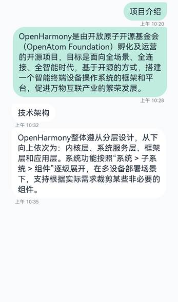

# 页面结构

  | 默认设备 | 平板 | 
| -------- | -------- |
|  |  | 

会话详情页面在默认设备和平板上的样式如上图所示，会话详情页面可以划分为三个部分：

  | 页面组成 | 介绍 | 
| -------- | -------- |
| 顶部标题栏 |  | 
| 信息列表 |  | 
| 底部输入栏 |  | 

接下来我们详细介绍各部分的实现。

>  **说明：**
> 为了方便理解，我们对会话详情页面做了一定的精简，本小节仅介绍会话详情页面最基础的实现。
