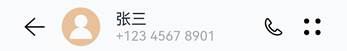
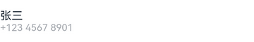
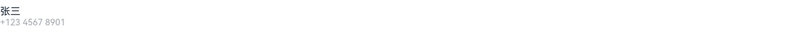

# 顶部标题栏


  | 默认设备 | 平板 | 
| -------- | -------- |
|  |  | 


顶部标题栏是一个简单的行布局，包含返回图标、联系人头像、联系人姓名和号码、拨号图标、设置图标共5个元素。其中，联系人姓名和号码以列布局的形式放在一起。


在默认设备和平板上，顶部标题栏的组件结构是相同的，仅联系人姓名和号码与拨号图标的间距不同。回顾方舟开发框架一多能力介绍，这个场景可以借助Blank组件使用拉伸能力。


  我们先实现联系人姓名和号码，用Flex组件作为父容器，其包含两个Text子组件，分别用于存放联系人姓名和号码。Flex组件的属性设置如下：
- direction: FlexDirection.Column：子组件在Flex容器上以列的方式排布，即主轴是垂直方向。

- justifyContent: FlexAlign.Center：子组件在Flex容器主轴（垂直方向）上居中对齐。

- alignItems: ItemAlign.Start：子组件在Flex容器交叉轴（水平方向）上首部对齐。


可以查看[Flex组件](../../reference/arkui-ts/ts-container-flex.md)及[Text组件](../../reference/arkui-ts/ts-basic-components-text.md)了解这两个组件各个属性的含义及详细用法。


  | 默认设备 | 平板 | 
| -------- | -------- |
|  |  | 


```
@Component
 struct TopArea {
   build() {
     Flex({ direction: FlexDirection.Column, justifyContent: FlexAlign.Center,
       alignItems: ItemAlign.Start}) {
       Text('张三').fontSize(16).fontColor("#182431")
       Text('+123 4567 8901').fontSize(14).fontColor("#66182431")
     }
   }
 }
```


接下来我们通过width属性和height属性设置四个图标的宽高（详见[尺寸设置](../../reference/arkui-ts/ts-universal-attributes-size.md)），并将它们与联系人姓名和电话以及Blank组件一起放到Flex父容器中。为了便于查看效果，对顶部标题栏设置了淡蓝色的背景色。


  | 默认设备 | 平板 | 
| -------- | -------- |
|  |  | 


```
@Component
 struct TopArea {
   build() {
     Flex({ alignItems: ItemAlign.Center }) {
       Image($r('app.media.back'))
         .width(24)
         .height(24)
       Image($r('app.media.contact'))
         .width(40)
         .height(40)
       Flex({ direction: FlexDirection.Column, justifyContent: FlexAlign.Center,
         alignItems: ItemAlign.Start}) {
         Text('张三').fontSize(16).fontColor("#182431")
         Text('+123 4567 8901').fontSize(14).fontColor("#66182431")
       }
       Blank()                  // 拉伸能力
       Image($r("app.media.call"))
         .width(24)
         .height(24)
       Image($r('app.media.dots'))
         .width(24)
         .height(24)
     }
     .width('100%')
     .height(56)
     .backgroundColor('#87CEFA')  // 顶部标题栏背景色，仅用于开发测试
   }
 }
```


当前标题栏中子组件的布局同预期还有些差异，接下来通过margin属性，设置各个元素的左右间距（详见[尺寸设置](../../reference/arkui-ts/ts-universal-attributes-size.md)）。如下图所示，最终顶部工具栏在默认设备和平板上都可以达到预期显示效果。


  | 默认设备 | 平板 | 
| -------- | -------- |
|  |  | 


```
@Component
 struct TopArea {
   build() {
     Flex({ alignItems: ItemAlign.Center }) {
       Image($r('app.media.back'))
         .width(24)
         .height(24)
         .margin({ left:24 })             // 设置间距
       Image($r('app.media.contact'))
         .width(40)
         .height(40)
         .margin({ left:16, right:16 })  // 设置间距
       Flex({ direction: FlexDirection.Column, justifyContent: FlexAlign.Center,
         alignItems: ItemAlign.Start}) {
         Text('张三').fontSize(16).fontColor("#182431")
         Text('+123 4567 8901').fontSize(14).fontColor("#66182431")
       }
       Blank()
       Image($r("app.media.call"))
         .width(24)
         .height(24)
       Image($r('app.media.dots'))
         .width(24)
         .height(24)
         .margin({ left:16, right:24 })  // 设置间距
     }
     .width('100%')
     .height(56)
     .backgroundColor('#87CEFA')           // 顶部标题栏背景色，仅用于开发测试
   }
 }
```
