# 从一个例子开始


本章通过一个天气应用，介绍一多应用的整体开发过程，包括UX设计、工程管理及调试、页面开发等。


## UX设计

本示例中的天气应用包含主页、管理城市和添加城市三个页面，其中主页中又包含菜单和更新间隔两个弹窗，基本业务逻辑如下所示。

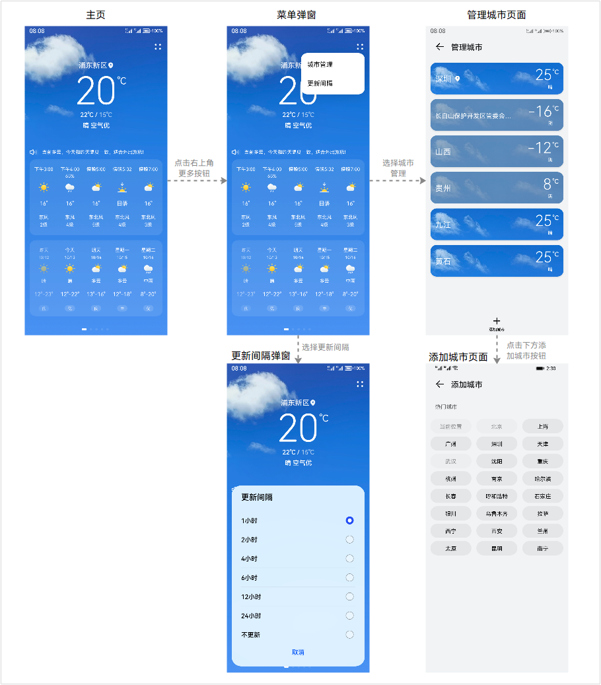

“一多”建议从最初的设计阶段开始就拉通多设备综合考虑。考虑实际智能终端设备种类繁多，设计师无法针对每种具体设备各自出一份UX设计图。“一多”建议从设备屏幕宽度的维度，将设备划分为四大类。设计师只需要针对这四大类设备做设计，而无需关心具体的设备形态。

  | 设备类型 | 屏幕宽度（vp） | 
| -------- | -------- |
| 超小设备 | [0,&nbsp;320) | 
| 小设备 | [320,&nbsp;600) | 
| 中设备 | [600,&nbsp;840) | 
| 大设备 | [840,&nbsp;+∞) | 

> **说明：**
> - vp是virtual pixel（虚拟像素）的缩写，是常用的长度单位<!--Del-->，详见[视觉基础](../../../design/ux-design/visual-basis.md)小节中的介绍<!--DelEnd-->。
> 
> - 此处基于设备屏幕宽度划分不同设备是为了方便理解。通常智能设备上的应用都是以全屏的形式运行，但随着移动技术的发展，当前部分智能设备支持应用以自由窗口模式运行（即用户可以通过拖拽等操作自由调整应用运行窗口的尺寸），故以应用窗口尺寸为基准进行划分更为合适，本文后续的响应式布局章节中将详细介绍相关内容。
> 
> - OpenHarmony当前仅有默认设备和平板两种设备形态，IDE在创建OpenHarmony工程时也仅可以选择默认设备和平板。随着演进，其支持的设备形态会不断丰富，本文也会定期刷新相关介绍。

默认设备和平板对应于小设备、中设备及大设备，本示例以这三类设备场景为例，介绍不同设备上的UX设计。天气主页在不同设备上的设计图如下所示。

  |  | 小设备 | 中设备 | 大设备 | 
| -------- | -------- | -------- | -------- |
| 主页 | 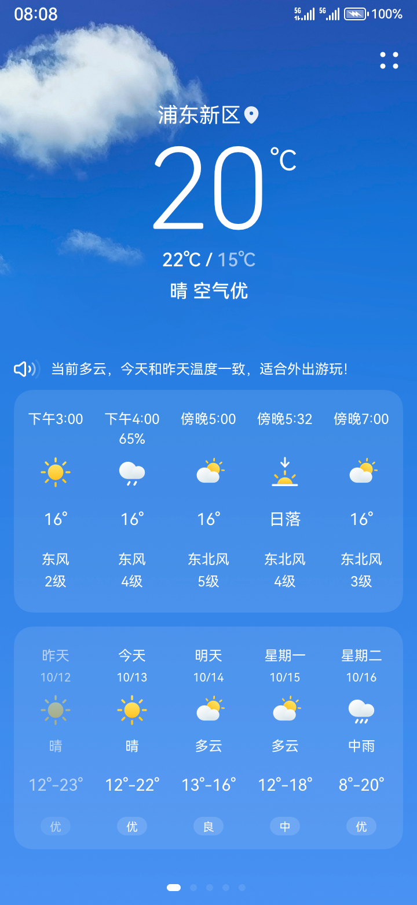 | 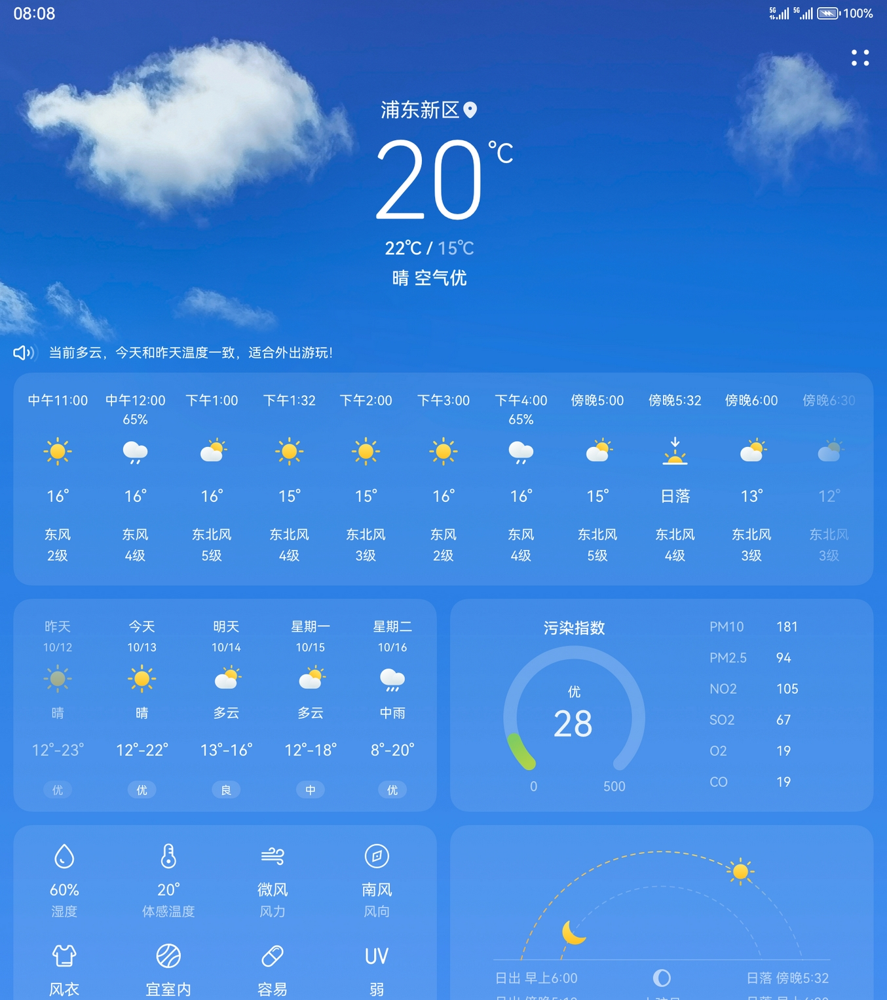 | 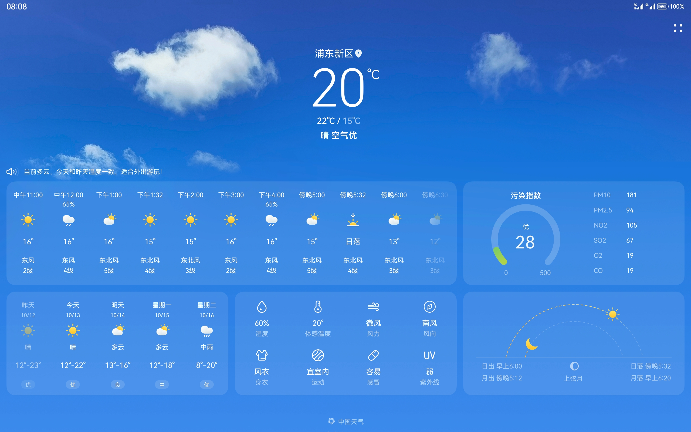 | 

另外，大设备中天气主页还允许用户开启或者隐藏侧边栏。

  | 开启侧边栏 | 隐藏侧边栏 | 
| -------- | -------- |
| 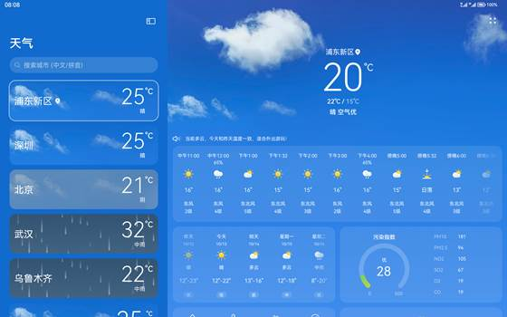 |  | 

从天气应用在各设备上的UX设计图中，可以观察到如下UX的一些“规律”：

- 在不同的屏幕宽度下，应用的整体风格基本保持一致。

- 在相近的屏幕宽度范围内，应用的布局基本不变；在不同的屏幕宽度范围内，应用的布局有较大差异。

- 应用在小屏幕下显示的元素，是大屏幕中显示元素的子集。
  - 考虑到屏幕尺寸及显示效果，大屏幕中可以显示的元素数量一定不少于小屏幕。
  - 为充分利用屏幕尺寸优势，大屏幕可以有其独有的元素或设计（如本示例中的侧边栏）。

如此，既在各设备上体现了UX的一致性，也在各设备上体现了UX的差异性，从而既可以保障各设备上应用界面的体验，也可以最大程度复用界面代码。

<!--Del-->
在[应用UX设计章节](../../../design/ux-design/app-ux-design.md)中，将详细介绍应用的UX设计规则。<!--DelEnd-->


## 工程管理及调试

在本文[IDE使用章节](ide-using.md)中，将详细介绍一多的工程创建及管理等，本小节仅介绍最基础的工程创建及多设备预览调试。


### 工程创建

一多应用的工程创建过程，与传统应用并无较大差异。只需在工程创建过程中，注意在“Device Type”选项中勾选所有该应用期望运行的目标设备类型，保证后续该应用可以在所有目标设备上正确安装即可。

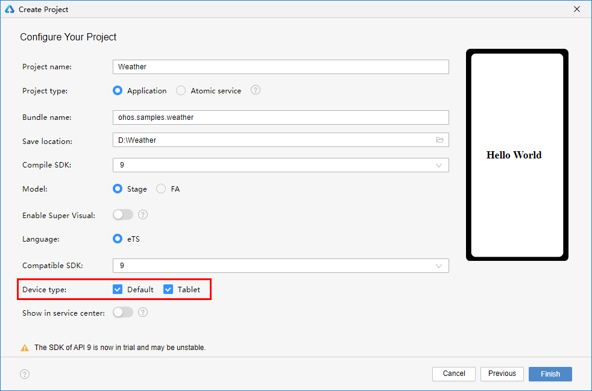


### 预览调试

在代码开发过程中，可以开启预览器，并打开“Multi-profile preview”开关，实时观察应用在不同设备下的表现。

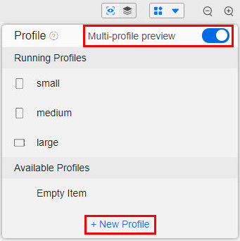

特别的，还可以点击“+ New Profile”按钮，新增自定义预览器。

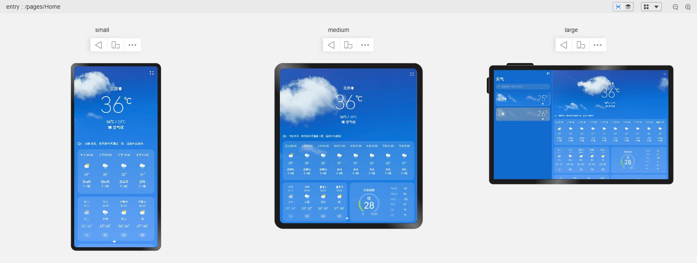


## 页面开发

天气应用中涉及较多的页面和弹窗，本小节以天气主页为例，简单介绍不同设备下的页面实现思路。

  观察天气主页在不同设备上的UX设计图，可以进行如下设计：
- 将天气主页划分为9个基础区域，如：
  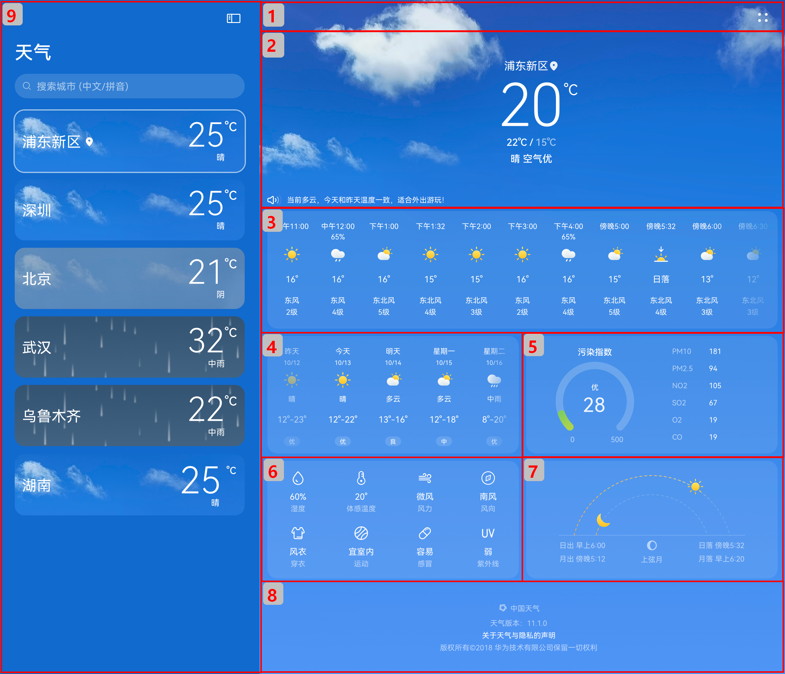

- 基础区域9仅在大设备上显示，基础区域1-8虽然在各设备上始终展示但其尺寸及区域内的布局基本保持不变，可以结合[自适应布局](adaptive-layout.md)能力以[自定义组件](../../quick-start/arkts-create-custom-components.md)的形式分别实现这9个基础区域。
    |  | 小设备 | 中设备 | 大设备 | 
  | -------- | -------- | -------- | -------- |
  | 主页 | 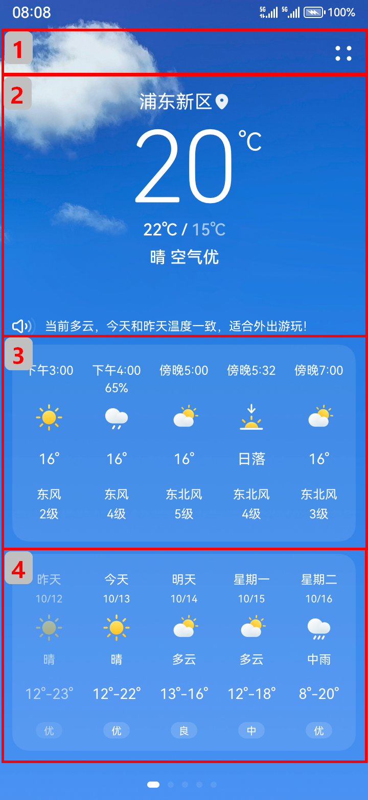 | 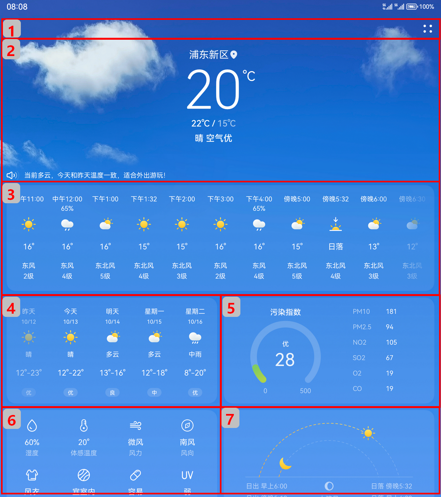 | 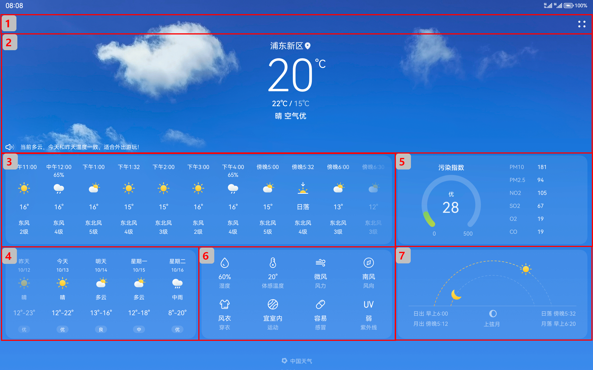 | 

- 基础区域1-8之间的布局在不同设备上有较大差异，可以使用响应式布局中的[栅格布局](responsive-layout.md#栅格布局)能力实现组件间的布局效果。

- 展开和隐藏侧边栏的功能可以通过[侧边栏组件](../../reference/apis-arkui/arkui-ts/ts-container-sidebarcontainer.md)来实现。侧边栏是大设备上独有的，借助响应式布局中的[媒体查询](responsive-layout.md#媒体查询)能力，控制仅在大设备上展示侧边栏即可。


### 主页基础区域

天气主页中的9个基础区域介绍及实现方案如下表所示。

  | 编号 | 简介 | 实现方案 | 
| -------- | -------- | -------- |
| 1 | 标题栏 | 自适应布局拉伸能力。| 
| 2 | 天气概览 | Row和Column组件，并指定其子组件按照主轴起始方向对齐或居中对齐。 | 
| 3 | 每小时天气 | 自适应布局延伸能力 。| 
| 4 | 每日天气 | 自适应布局延伸能力 。| 
| 5 | 空气质量 | Canvas画布组件绘制空气质量图，并使用Row组件和Column组件控制内部元素的布局。 | 
| 6 | 生活指数 | 自适应布局均分能力。 | 
| 7 | 日出日落 | Canvas画布组件绘制日出日落图 。| 
| 8 | 应用信息 | Row和Column组件，并指定其子组件居中对齐。 | 
| 9 | 侧边导航栏 | 综合运用自适应布局中的拉伸能力、占比能力和延伸能力 。| 

天气主页涉及的内容较多，因篇幅限制，本小节仅介绍区域3（每小时天气）的实现<!--Del-->，读者可以自行查看开源代码，了解其它基础区域的实现<!--DelEnd-->。

延伸能力是指容器组件内的子组件，按照其在列表中的先后顺序，随容器组件尺寸变化显示或隐藏。随着可用显示区域的增加，用户可以看到的“每小时天气”信息也不断增加，故“每小时天气”可以通过延伸能力实现，其核心代码如下所示。


```ts
import { Forecast, getHoursData, MyDataSource, Style } from '@ohos/common';

@Component
export default struct HoursWeather {
  private hoursData: Forecast[] = getHoursData(0);
  @State hoursDataResource: MyDataSource = new MyDataSource(this.hoursData);

  build() {
    // 通过列表组件实现延伸能力
    List() {
      LazyForEach(this.hoursDataResource, (hoursItem:IDataSource) => {
        ListItem() {
          // 具体每个小时的天气情况
          Column() { 
              // ... 
            }
        }
      })
    }
    .height(Style.CARD_HEIGHT)
    .borderRadius(Style.NORMAL_RADIUS)
    .backgroundColor(Style.CARD_BACKGROUND_COLOR)
    // 将列表方向设置为水平方向
    .listDirection(Axis.Horizontal)
  }
}
```


### 城市天气详情

天气主页右侧的城市天气详情由区域1-8组成，区域1（标题栏）始终固定在页面顶部，区域2-8在不同设备下的布局不同且可以随页面上下滚动。本小节介绍如何实现城市天气详情中区域2~8的布局效果。

设备屏幕可能无法一次性显示区域2-8的所有内容，故需要在外层增加滚动组件（即Scroll组件）以支持上下滚动。不同设备下区域2-8的相对位置一共有三套不同的布局，可以借助响应式布局中的[栅格布局](responsive-layout.md#栅格布局)实现这一效果。本示例中将栅格在不同场景下分别划分为4列、8列和12列，区域2-8在不同场景下的布局如下表所示。

  | 小设备 | 中设备&nbsp;或&nbsp;大设备（侧边栏显示状态） | 大设备（侧边栏隐藏状态） | 
| -------- | -------- | -------- |
| 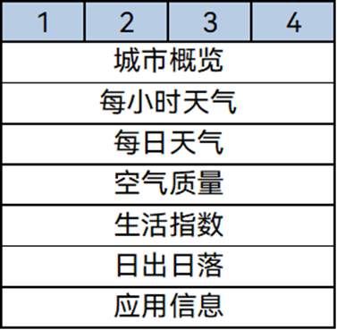 | 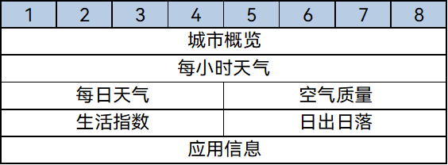 | 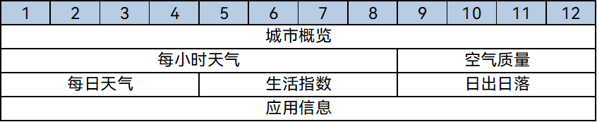 | 

> **说明：**
>
> 为提升用户体验，大设备侧边栏隐藏状态下，每日天气与空气质量的相对顺序发生了改变。可以通过调整GridCol栅格子组件的order属性，实现目标效果。


```ts
import AirQuality from './AirQuality'; //组件请参考相关实例
import HoursWeather from './HoursWeather';
import IndexHeader from './IndexHeader';
import IndexEnd from './IndexEnd';
import LifeIndex from './LifeIndex';
import MultidayWeather from './MultidayWeather';
import SunCanvas from './SunCanvas';
import { CityListData, Style } from '@ohos/common';

@Component
export default struct HomeContent {
  private cityListData: CityListData | undefined = undefined;
  private index: number = 1;
  @Prop showSideBar: boolean;
  @State headerOpacity: number = 1;

  build() {
    // 支持滚动
    Scroll() {
      GridRow({
        columns: { sm: 4, md: 8, lg: this.showSideBar ? 8 : 12 },
        gutter: { x: Style.GRID_GUTTER, y: Style.GRID_GUTTER },
        breakpoints: { reference: BreakpointsReference.WindowSize } }) {
        // 天气概览
        GridCol({ span: { sm: 4, md: 8, lg: this.showSideBar ? 8 : 12 }, order: 1 }) {
          IndexHeader({ headerDate: this.cityListData.header, index: this.index })
            .opacity(this.headerOpacity)
        }
        // 每小时天气
        GridCol({ span: { sm: 4, md: 8, lg: 8 }, order: 2 }) {
          HoursWeather({ hoursData: this.cityListData.hoursData })
        }
        // 每日天气
        GridCol({ span: 4, order: {sm: 3, md: 3, lg: this.showSideBar ? 3 : 4} }) {
          MultidayWeather({ weekData: this.cityListData.weekData })
        }
        // 空气质量
        GridCol({ span: 4, order: {sm: 4, md: 4, lg: this.showSideBar ? 4 : 3} }) {
          AirQuality({ airData: this.cityListData.airData, airIndexData: this.cityListData.airIndex })
        }
        // 生活指数
        GridCol({ span: 4, order: 5 }) {
          LifeIndex({ lifeData: this.cityListData.suitDate })
        }
        // 日出日落
        GridCol({ span: 4, order: 6 }) {
          SunCanvas()
        }
        // 应用信息
        GridCol({ span: { sm: 4, md: 8, lg: this.showSideBar ? 8 : 12 }, order: 7 }) {
          IndexEnd()
        }
      }
    }
    .width('100%')
  }
}
```


### 主页整体实现

综合考虑各设备下的效果，天气主页的根节点使用侧边栏组件：

- 小设备和中设备既不展示侧边栏，也不提供控制侧边栏显示和隐藏的按钮。

- 大设备默认展示侧边栏，同时提供控制侧边栏显示和隐藏的按钮。

另外主页右侧的城市天气详情，支持左右滑动切换城市，可以使用Swiper组件实现目标效果。

- 小设备和中设备开启Swiper组件的导航点，引导用户通过左右滑动切换不同城市。

- 大设备中用户通过点击侧边栏中的城市列表即可高效的切换不同城市，此时需要关闭Swiper组件的导航点。

  
```ts
import HomeContent from './home/HomeContent'; //组件请参考相关实例
import IndexTitleBar from './home/IndexTitleBar';
import SideContent from './home/SideContent';
import { CityListData,  getCityListWeatherData } from '@ohos/common';

@Entry
@Component
struct Home {
  @State cityListWeatherData: CityListData[] = getCityListWeatherData();
  @State curBp: string = 'md';
  @State showSideBar: boolean = false;
  
  build() {
    SideBarContainer(SideBarContainerType.Embed) {
      // 左侧侧边栏
      SideContent({ showSideBar: $showSideBar })
      // 右侧内容区
      Flex({direction: FlexDirection.Column}) {
        // 基础区域1标题栏
        IndexTitleBar({ curBp: this.curBp, showSideBar: $showSideBar })
          .height(56)
        // 天气详情，通过Swiper组件实现左右滑动切换城市的效果
        Swiper() {
          ForEach(this.cityListWeatherData, (item:CityListData, index) => {
            HomeContent({ showSideBar: this.showSideBar, cityListData: item, index: index })
          })
        }
        // 大设备关闭导航点
        .indicator(this.curBp !== 'lg')
        .width('100%')
      }
    }
    .height('100%')
    .sideBarWidth('33.3%')
    // 通过状态变量，控制不同设备下侧边栏的显隐状态
    .showSideBar(this.showSideBar)
  }
}
```


最终，天气首页的运行效果如下图所示。


  | 小设备 | 中设备 | 大设备（隐藏侧边栏） | 大设备（显示侧边栏） | 
| -------- | -------- | -------- | -------- |
| 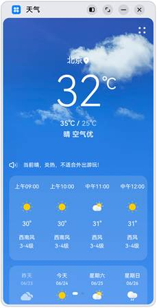 | 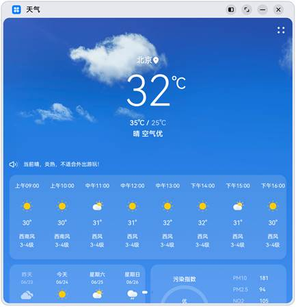 | 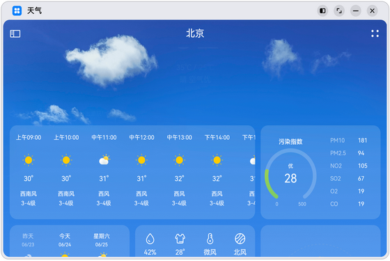 | 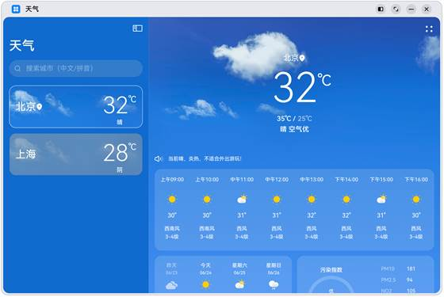 | 


## 功能开发

应用开发不仅包含应用页面开发，还包括应用后端功能开发以及服务器端开发等。服务器端开发不在本文的讨论范围内，本小节仅介绍多设备上应用功能开发的注意事项。

如前文所示，本示例的目标运行设备是小设备、中设备和大设备，对应实际的设备类型为默认设备和平板等。这些设备运行的都是标准系统，其系统能力一致，所以无需做特别考虑。但是在超小设备（对应的实际设备类型为智能穿戴设备等）上，考虑CPU、内存、硬盘等硬件限制，往往会对系统进行裁剪。如果在应用后端功能开发时调用当前系统没有的能力，就可能会引发异常。

通常有两种方式解决上述问题：

- 在应用安装包中描述其需要的系统能力，保证本应用仅被分发和安装到可以满足其诉求的系统中。

- 在使用特定系统能力前，通过canIUse接口判断系统能力是否存在，进而执行不同的逻辑。

在本文的[功能开发的一多能力介绍](development-intro.md)章节中，将详细展开介绍。

## 相关实例

针对天气应用，有以下相关实例可供参考：

天气应用：[天气应用示例](https://gitee.com/openharmony/applications_app_samples/tree/OpenHarmony-5.0.1-Release/code/SuperFeature/MultiDeviceAppDev/Weather)


<!--no_check-->