# 典型布局场景


虽然不同应用的页面千变万化，但对其进行拆分和分析，页面中的很多布局场景是相似的。本小节将介绍如何借助自适应布局、响应式布局以及常见的容器类组件，实现应用中的典型布局场景。


| 布局场景 | 实现方案 |
| -------- | -------- |
| [页签栏](#页签栏) | Tab组件&nbsp;+&nbsp;响应式布局 |
| [运营横幅（Banner）](#运营横幅banner) | Swiper组件&nbsp;+&nbsp;响应式布局 |
| [网格](#网格) | Grid组件&nbsp;/&nbsp;List组件&nbsp;+&nbsp;响应式布局 |
| [侧边栏](#侧边栏) | SideBar组件&nbsp;+&nbsp;响应式布局 |
| [单/双栏](#单双栏) | Navigation组件&nbsp;+&nbsp;响应式布局 |
| [三分栏](#三分栏) | SideBar组件&nbsp;+&nbsp;Navigation组件&nbsp;+&nbsp;响应式布局 |
| [自定义弹窗](#自定义弹窗) | CustomDialogController组件&nbsp;+&nbsp;响应式布局 |
| [大图浏览](#大图浏览) | Image组件 |
| [操作入口](#操作入口) | Scroll组件+Row组件横向均分 |
| [顶部](#顶部) | 栅格组件 |
| [缩进布局](#缩进布局) | 栅格组件 |
| [挪移布局](#挪移布局) | 栅格组件 |
| [重复布局](#重复布局) | 栅格组件 |


> **说明：**
> 在本文[媒体查询](responsive-layout.md#媒体查询)小节中已经介绍了如何通过媒体查询监听断点变化，后续的示例中不再重复介绍此部分代码。


## 页签栏

**布局效果**

| sm | md | lg |
| -------- | -------- | -------- |
| 页签在底部<br/>页签的图标和文字垂直布局<br/>页签宽度均分<br/>页签高度固定72vp | 页签在底部<br/>页签的图标和文字水平布局<br/>页签宽度均分<br/>页签高度固定56vp | 页签在左边<br/>页签的图标和文字垂直布局<br/>页签宽度固定96vp<br/>页签高度总占比‘60%’后均分 |
| 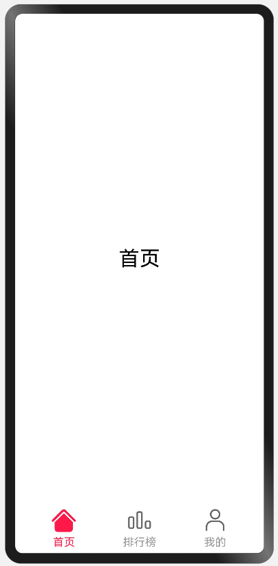 | 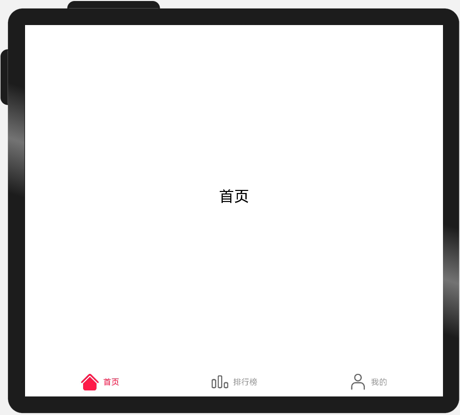 | 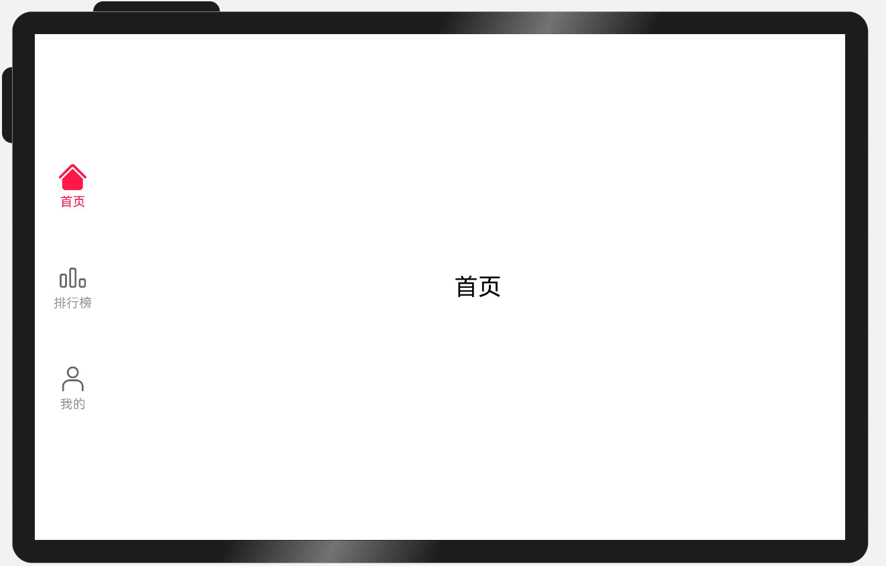 |


**实现方案**

不同断点下，页签在页面中的位置及尺寸都有差异，可以结合响应式布局能力，设置不同断点下[Tab组件](../../reference/apis-arkui/arkui-ts/ts-container-tabs.md)的barPosition、vertical、barWidth和barHeight属性实现目标效果。

另外，页签栏中的文字和图片的相对位置不同，同样可以通过设置不同断点下[tabBar](../../reference/apis-arkui/arkui-ts/ts-container-tabcontent.md#属性)对应的CustomBuilder中的布局方向，实现目标效果。


**参考代码**


```ts
import { BreakpointSystem, BreakpointState } from '../common/breakpointsystem'

interface TabBar  {
  name: string
  icon: Resource
  selectIcon: Resource
}
interface marginGenerate {
  top: number,
  left?:number
}

@Entry
@Component
struct Home {
  @State currentIndex: number = 0
  @State tabs: Array<TabBar> = [{
                                  name: '首页',
                                  icon: $r('app.media.ic_music_home'),
                                  selectIcon: $r('app.media.ic_music_home_selected')
                                }, {
                                  name: '排行榜',
                                  icon: $r('app.media.ic_music_ranking'),
                                  selectIcon: $r('app.media.ic_music_ranking_selected')
                                }, {
                                  name: '我的',
                                  icon: $r('app.media.ic_music_me_nor'),
                                  selectIcon: $r('app.media.ic_music_me_selected')
                                }]
  @State compStr: BreakpointState<string> = BreakpointState.of({ sm: "sm", md: "md", lg: "lg" })
  @State compDirection: BreakpointState<FlexDirection> = BreakpointState.of({
    sm: FlexDirection.Column,
    md: FlexDirection.Row,
    lg: FlexDirection.Column
  });
  @State compBarPose: BreakpointState<BarPosition> = BreakpointState.of({
    sm: BarPosition.End,
    md: BarPosition.End,
    lg: BarPosition.Start
  });
  @State compVertical: BreakpointState<boolean> = BreakpointState.of({
    sm: false,
    md: false,
    lg: true
  });
  @State compBarWidth: BreakpointState<string> = BreakpointState.of({
    sm: '100%', md: '100%', lg: '96vp'
  });
  @State compBarHeight: BreakpointState<string> = BreakpointState.of({
    sm: '72vp', md: '56vp', lg: '60%'
  });
  @State compMargin: BreakpointState<marginGenerate> = BreakpointState.of({
    sm: ({ top: 4 } as marginGenerate),
    md: ({ left: 8 } as marginGenerate),
    lg: ({ top: 4 } as marginGenerate)
  });

  @Builder TabBarBuilder(index: number, tabBar: TabBar) {
    Flex({
      direction: this.compDirection.value,
      justifyContent: FlexAlign.Center,
      alignItems: ItemAlign.Center
    }) {
      Image(this.currentIndex === index ? tabBar.selectIcon : tabBar.icon)
        .size({ width: 36, height: 36 })
      Text(tabBar.name)
        .fontColor(this.currentIndex === index ? '#FF1948' : '#999')
        .margin(this.compMargin.value)
        .fontSize(16)
    }
    .width('100%')
    .height('100%')
  }
  aboutToAppear() {
    BreakpointSystem.getInstance().attach(this.compStr)
    BreakpointSystem.getInstance().attach(this.compDirection)
    BreakpointSystem.getInstance().attach(this.compBarPose)
    BreakpointSystem.getInstance().attach(this.compVertical)
    BreakpointSystem.getInstance().attach(this.compBarWidth)
    BreakpointSystem.getInstance().attach(this.compBarHeight)
    BreakpointSystem.getInstance().attach(this.compMargin)
    BreakpointSystem.getInstance().start()
  }

  aboutToDisappear() {
    BreakpointSystem.getInstance().detach(this.compStr)
    BreakpointSystem.getInstance().detach(this.compDirection)
    BreakpointSystem.getInstance().detach(this.compBarPose)
    BreakpointSystem.getInstance().detach(this.compVertical)
    BreakpointSystem.getInstance().detach(this.compBarWidth)
    BreakpointSystem.getInstance().detach(this.compBarHeight)
    BreakpointSystem.getInstance().detach(this.compMargin)
    BreakpointSystem.getInstance().stop()
  }

  build() {
    Tabs({
      barPosition:this.compBarPose.value
    }) {
      ForEach(this.tabs, (item:TabBar, index) => {
        TabContent() {
          Stack() {
            Text(item.name).fontSize(30)
          }.width('100%').height('100%')
        }.tabBar(this.TabBarBuilder(index!, item))
      })
    }
    .vertical(this.compVertical.value)
    .barWidth(this.compBarWidth.value)
    .barHeight(this.compBarHeight.value)
    .animationDuration(0)
    .onChange((index: number) => {
      this.currentIndex = index
    })
  }
}
```


## 运营横幅（Banner）

**布局效果**

| sm | md | lg |
| -------- | -------- | -------- |
| 展示一个内容项 | 展示两个内容项 | 展示三个内容项 |
| 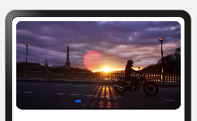 | 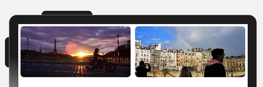 |  |

**实现方案**

运营横幅通常使用[Swiper组件](../../reference/apis-arkui/arkui-ts/ts-container-swiper.md)实现。不同断点下，运营横幅中展示的图片数量不同。只需要结合响应式布局，配置不同断点下Swiper组件的displayCount属性，即可实现目标效果。

**参考代码**


```ts
import { BreakpointSystem, BreakPointType } from '../common/breakpointsystem'

@Entry
@Component
export default struct Banner {
  private data: Array<Resource> = [
    $r('app.media.banner1'),
    $r('app.media.banner2'),
    $r('app.media.banner3'),
    $r('app.media.banner4'),
    $r('app.media.banner5'),
    $r('app.media.banner6'),
  ]
  private breakpointSystem: BreakpointSystem = new BreakpointSystem()
  @StorageProp('currentBreakpoint') currentBreakpoint: string = 'md'

  aboutToAppear() {
    this.breakpointSystem.register()
  }

  aboutToDisappear() {
    this.breakpointSystem.unregister()
  }

  build() {
    Swiper() {
      ForEach(this.data, (item:Resource) => {
        Image(item)
          .size({ width: '100%', height: 200 })
          .borderRadius(12)
          .padding(8)
      })
    }
    .indicator(new BreakPointType({ sm: true, md: false, lg: false }).getValue(this.currentBreakpoint)!)
    .displayCount(new BreakPointType({ sm: 1, md: 2, lg: 3 }).getValue(this.currentBreakpoint)!)
  }
}
```


## 网格

**布局效果**

| sm | md | lg |
| -------- | -------- | -------- |
| 展示两列 | 展示四列 | 展示六列 |
|  | 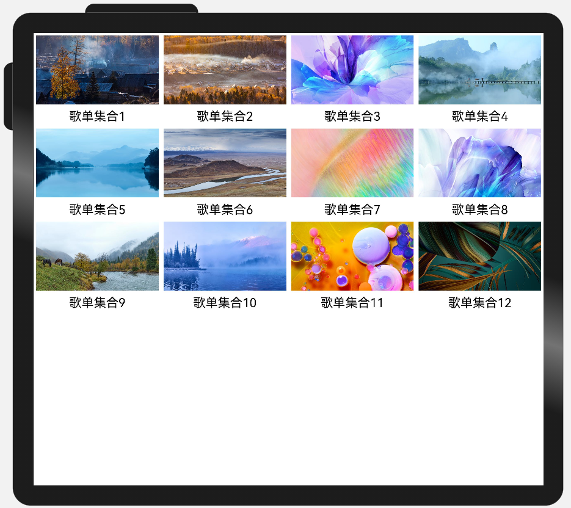 | 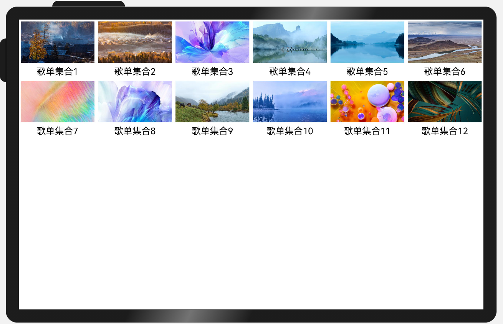 |


**实现方案**

不同断点下，页面中图片的排布不同，此场景可以通过响应式布局能力结合[Grid组件](../../reference/apis-arkui/arkui-ts/ts-container-grid.md)实现，通过调整不同断点下的Grid组件的columnsTemplate属性即可实现目标效果。

另外，由于本例中各列的宽度相同，也可以通过响应式布局能力结合[List组件](../../reference/apis-arkui/arkui-ts/ts-container-list.md)实现，通过调整不同断点下的List组件的lanes属性也可实现目标效果。


**参考代码**

通过Grid组件实现


```ts
import { BreakpointSystem, BreakPointType } from '../common/breakpointsystem'

interface GridItemInfo {
  name: string
  image: Resource
}

@Entry
@Component
struct MultiLaneList {
  private data: GridItemInfo[] = [
    { name: '歌单集合1', image: $r('app.media.1') },
    { name: '歌单集合2', image: $r('app.media.2') },
    { name: '歌单集合3', image: $r('app.media.3') },
    { name: '歌单集合4', image: $r('app.media.4') },
    { name: '歌单集合5', image: $r('app.media.5') },
    { name: '歌单集合6', image: $r('app.media.6') },
    { name: '歌单集合7', image: $r('app.media.7') },
    { name: '歌单集合8', image: $r('app.media.8') },
    { name: '歌单集合9', image: $r('app.media.9') },
    { name: '歌单集合10', image: $r('app.media.10') },
    { name: '歌单集合11', image: $r('app.media.11') },
    { name: '歌单集合12', image: $r('app.media.12') }
  ]
  private breakpointSystem: BreakpointSystem = new BreakpointSystem()
  @StorageProp('currentBreakpoint') currentBreakpoint: string = 'md'

  aboutToAppear() {
    this.breakpointSystem.register()
  }

  aboutToDisappear() {
    this.breakpointSystem.unregister()
  }

  build() {
    Grid() {
      ForEach(this.data, (item: GridItemInfo) => {
        GridItem() {
          Column() {
            Image(item.image)
              .aspectRatio(1.8)
            Text(item.name)
              .margin({ top: 8 })
              .fontSize(20)
          }.padding(4)
        }
      })
    }
    .columnsTemplate(new BreakPointType({
      sm: '1fr 1fr',
      md: '1fr 1fr 1fr 1fr',
      lg: '1fr 1fr 1fr 1fr 1fr 1fr'
    }).getValue(this.currentBreakpoint)!)
  }
}
```

通过List组件实现


```ts
import { BreakpointSystem, BreakPointType } from '../common/breakpointsystem'

interface ListItemInfo {
  name: string
  image: Resource
}

@Entry
@Component
struct MultiLaneList {
  private data: ListItemInfo[] = [
    { name: '歌单集合1', image: $r('app.media.1') },
    { name: '歌单集合2', image: $r('app.media.2') },
    { name: '歌单集合3', image: $r('app.media.3') },
    { name: '歌单集合4', image: $r('app.media.4') },
    { name: '歌单集合5', image: $r('app.media.5') },
    { name: '歌单集合6', image: $r('app.media.6') },
    { name: '歌单集合7', image: $r('app.media.7') },
    { name: '歌单集合8', image: $r('app.media.8') },
    { name: '歌单集合9', image: $r('app.media.9') },
    { name: '歌单集合10', image: $r('app.media.10') },
    { name: '歌单集合11', image: $r('app.media.11') },
    { name: '歌单集合12', image: $r('app.media.12') }
  ]
  private breakpointSystem: BreakpointSystem = new BreakpointSystem()
  @StorageProp('currentBreakpoint') currentBreakpoint: string = 'md'

  aboutToAppear() {
    this.breakpointSystem.register()
  }

  aboutToDisappear() {
    this.breakpointSystem.unregister()
  }

  build() {
    List() {
      ForEach(this.data, (item: ListItemInfo) => {
        ListItem() {
          Column() {
            Image(item.image)
            Text(item.name)
              .margin({ top: 8 })
              .fontSize(20)
          }.padding(4)
        }
      })
    }
    .lanes(new BreakPointType({ sm: 2, md: 4, lg: 6 }).getValue(this.currentBreakpoint)!)
    .width('100%')
  }
}
```


## 侧边栏

**布局效果**

| sm | md | lg |
| -------- | -------- | -------- |
| 默认隐藏侧边栏，同时提供侧边栏控制按钮，用户可以通过按钮控制侧边栏显示或隐藏。 | 始终显示侧边栏，不提供控制按钮，用户无法隐藏侧边栏。 | 始终显示侧边栏，不提供控制按钮，用户无法隐藏侧边栏。 |
|  |  | 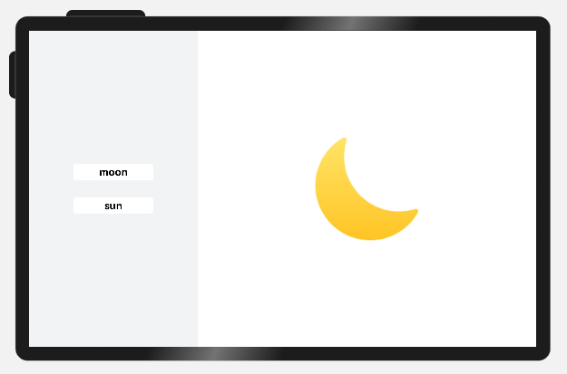 |

**实现方案**

侧边栏通常通过[SideBarContainer组件](../../reference/apis-arkui/arkui-ts/ts-container-sidebarcontainer.md)实现，结合响应式布局能力，在不同断点下为SideBarConContainer组件的sideBarWidth、showControlButton等属性配置不同的值，即可实现目标效果。

**参考代码**


```ts
import { BreakpointSystem, BreakPointType } from '../common/breakpointsystem'

interface imagesInfo{
  label:string,
  imageSrc:Resource
}
const images:imagesInfo[]=[
  {
    label:'moon',
    imageSrc:$r('app.media.my_image_moon')
  },
  {
    label:'sun',
    imageSrc:$r('app.media.my_image')
  }
]

@Entry
@Component
struct SideBarSample {
  @StorageLink('currentBreakpoint') private currentBreakpoint: string = "md";
  private breakpointSystem: BreakpointSystem = new BreakpointSystem()
  @State selectIndex: number = 0;
  @State showSideBar:boolean=false;

  aboutToAppear() {
    this.breakpointSystem.register() 
  }

  aboutToDisappear() {
    this.breakpointSystem.unregister()
  }

  @Builder itemBuilder(index: number) {
    Text(images[index].label)
      .fontSize(24)
      .fontWeight(FontWeight.Bold)
      .borderRadius(5)
      .margin(20)
      .backgroundColor('#ffffff')
      .textAlign(TextAlign.Center)
      .width(180)
      .height(36)
      .onClick(() => {
        this.selectIndex = index;
        if(this.currentBreakpoint === 'sm'){
          this.showSideBar=false
        }
      })
  }

  build() {
    SideBarContainer(this.currentBreakpoint === 'sm' ? SideBarContainerType.Overlay : SideBarContainerType.Embed) {
      Column() {
        this.itemBuilder(0)
        this.itemBuilder(1)
      }.backgroundColor('#F1F3F5')
      .justifyContent(FlexAlign.Center)

      Column() {
        Image(images[this.selectIndex].imageSrc)
          .objectFit(ImageFit.Contain)
          .height(300)
          .width(300)
      }
      .justifyContent(FlexAlign.Center)
      .width('100%')
      .height('100%')
    }
    .height('100%')
    .sideBarWidth(this.currentBreakpoint === 'sm' ? '100%' : '33.33%')
    .minSideBarWidth(this.currentBreakpoint === 'sm' ? '100%' : '33.33%')
    .maxSideBarWidth(this.currentBreakpoint === 'sm' ? '100%' : '33.33%')
    .showControlButton(this.currentBreakpoint === 'sm')
    .autoHide(false)
    .showSideBar(this.currentBreakpoint !== 'sm'||this.showSideBar)
    .onChange((isBarShow: boolean) => {
      if(this.currentBreakpoint === 'sm'){
          this.showSideBar=isBarShow
        }         
    })
  }
}
```

## 单/双栏

**布局效果**

| sm                                                           | md                                               | lg                                               |
| ------------------------------------------------------------ | ------------------------------------------------ | ------------------------------------------------ |
| 单栏显示，在首页中点击选项可以显示详情。<br>点击详情上方的返回键图标或使用系统返回键可以返回到主页。 | 双栏显示，点击左侧不同的选项可以刷新右侧的显示。 | 双栏显示，点击左侧不同的选项可以刷新右侧的显示。 |
| 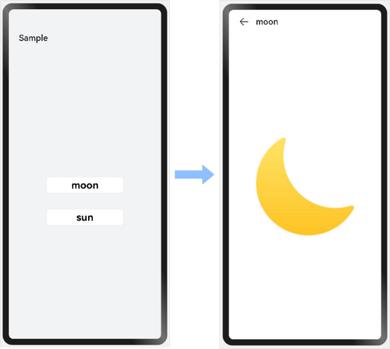                               | 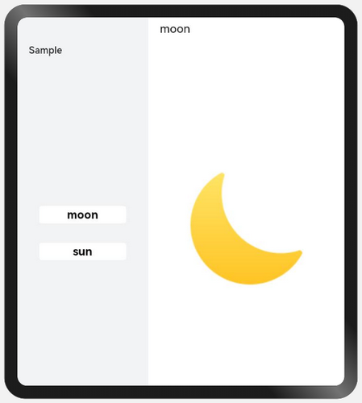                   | 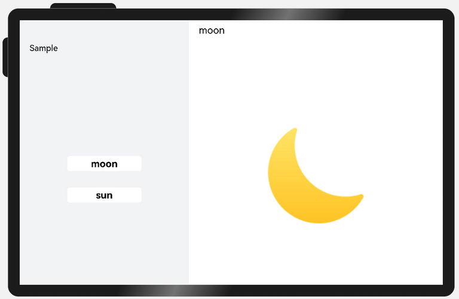                   |

**实现方案**

单/双栏场景可以使用[Navigation组件](../../reference/apis-arkui/arkui-ts/ts-basic-components-navigation.md)实现，Navigation组件可以根据窗口宽度自动切换单/双栏显示，减少开发工作量。

**参考代码**

```ts

// 工程配置文件module.json5中配置 {"routerMap": "$profile:route_map"}
// route_map.json
{
  "routerMap": [
    {
      "name": "Moon",
      "pageSourceFile": "src/main/ets/pages/Moon.ets",
      "buildFunction": "MoonBuilder",
      "data": {
        "description": "this is Moon"
      }
    },
    {
      "name": "Sun",
      "pageSourceFile": "src/main/ets/pages/Sun.ets",
      "buildFunction": "SunBuilder"
    }
  ]
}
// Moon.ets
@Builder
export function MoonBuilder(name: string, param: Object) {
  Moon()
}
@Component
export struct Moon {
  private imageSrc: Resource=$r('app.media.my_image_moon')
  private label: string='moon'
  build() {
    Column(){
    NavDestination(){
    Column() {
      Image(this.imageSrc)
        .objectFit(ImageFit.Contain)
        .height(300)
        .width(300)
    }
    .justifyContent(FlexAlign.Center)
    .width('100%')
    .height('100%')
     }.title(this.label)
     }
  }
}
// Sun.ets
@Builder
export function SunBuilder(name: string, param: Object) {
  Sun()
}
@Component
export struct Sun {
  private imageSrc: Resource=$r('app.media.my_image')
  private label: string='Sun'
  build() {
    Column(){
    NavDestination(){
    Column() {
      Image(this.imageSrc)
        .objectFit(ImageFit.Contain)
        .height(300)
        .width(300)
    }
    .justifyContent(FlexAlign.Center)
    .width('100%')
    .height('100%')
     }.title(this.label)
     }
  }
}
//NavigationSample.ets
interface arrSample{
  label:string,
  pagePath:string
}

@Entry
@Component
struct NavigationSample {
  pageInfos: NavPathStack = new NavPathStack();
  private arr:arrSample[]=[
    {
      label:'moon',
      pagePath:'Moon'
    },
    {
      label:'sun',
      pagePath:'Sun'
    }
  ]
  build() {
    Navigation(this.pageInfos) {
      Column({space: 30}) { 
      ForEach(this.arr, (item: arrSample) => {
         Text(item.label)
        .fontSize(24)
        .fontWeight(FontWeight.Bold)
        .borderRadius(5)
        .backgroundColor('#FFFFFF')
        .textAlign(TextAlign.Center)
        .width(180)
        .height(36)
        .onClick(()=>{
          this.pageInfos.clear();
          this.pageInfos.pushPath({name:item.pagePath})
        })
        })
      }
      .justifyContent(FlexAlign.Center)
      .height('100%')
      .width('100%')
    }
    .mode(NavigationMode.Auto)
    .backgroundColor('#F1F3F5')
    .height('100%')
    .width('100%')
    .navBarWidth(360)
    .hideToolBar(true)
    .title('Sample')
  }
}
```


## 三分栏

**布局效果**

| sm                                           | md                                      | lg                                      |
| -------------------------------------------- | --------------------------------------- | --------------------------------------- |
| 单栏显示。<br> 点击侧边栏控制按钮控制侧边栏的显示/隐藏。<br> 点击首页的选项可以进入到内容区，内容区点击返回按钮可返回首页。| 双栏显示。<br> 点击侧边栏控制按钮控制侧边栏的显示/隐藏。<br> 点击左侧导航区不同的选项可以刷新右侧内容区的显示。 | 三分栏显示。<br> 点击侧边栏控制按钮控制侧边栏的显示/隐藏，来回切换二分/三分栏显示。<br> 点击左侧导航区不同的选项可以刷新右侧内容区的显示。<br> 窗口宽度变化时，优先变化右侧内容区的宽度大小。 |
| 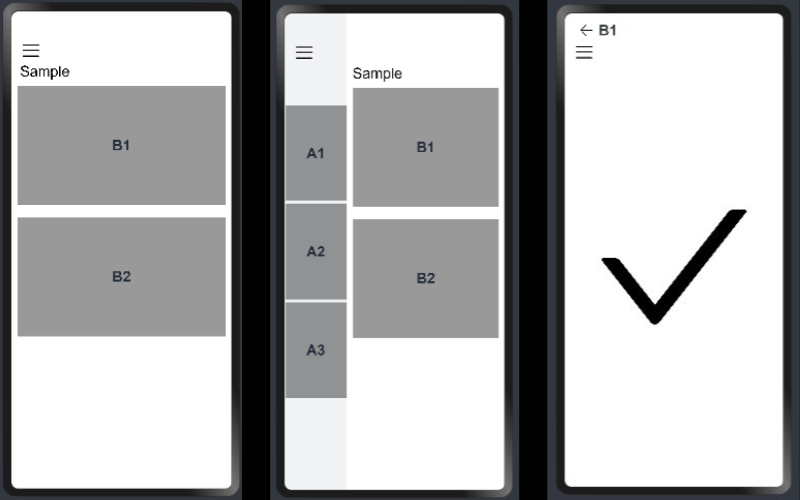            | 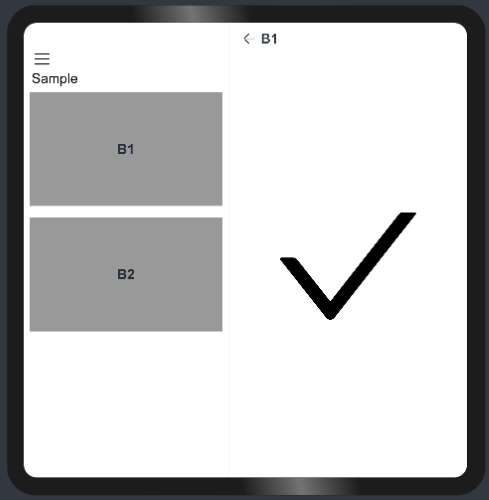       | 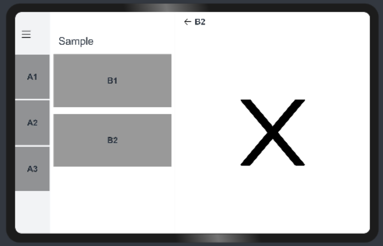       |
| 

**场景说明**

为充分利用设备的屏幕尺寸优势，应用在大屏设备上常常有二分栏或三分栏的设计，即“A+C”，“B+C”或“A+B+C”的组合，其中A是侧边导航区，B是列表导航区，C是内容区。在用户动态改变窗口宽度时，当窗口宽度大于或等于840vp时页面呈现A+B+C三列，放大缩小优先变化C列；当窗口宽度小于840vp大于等于600vp时呈现B+C列，放大缩小时优先变化C列；当窗口宽度小于600vp大于等于360vp时，仅呈现C列。

**实现方案**

三分栏场景可以组合使用[SideBarContainer](../../reference/apis-arkui/arkui-ts/ts-container-sidebarcontainer.md)组件与[Navigation组件](../../reference/apis-arkui/arkui-ts/ts-basic-components-navigation.md)实现，SideBarContainer组件可以通过侧边栏控制按钮控制显示/隐藏，Navigation组件可以根据窗口宽度自动切换该组件内单/双栏显示，结合响应式布局能力，在不同断点下为SideBarConContainer组件的minContentWidth属性配置不同的值，即可实现目标效果。设置minContentWidth属性的值可以通过[断点](../multi-device-app-dev/responsive-layout.md#断点)监听窗口尺寸变化的同时设置不同的值并储存成一个全局对象。

**参考代码**

```ts

// 工程配置文件module.json5中配置 {"routerMap": "$profile:route_map"}
// route_map.json
{
  "routerMap": [
    {
      "name": "B1Page",
      "pageSourceFile": "src/main/ets/pages/B1Page.ets",
      "buildFunction": "B1PageBuilder",
      "data": {
        "description": "this is B1Page"
      }
    },
    {
      "name": "B2Page",
      "pageSourceFile": "src/main/ets/pages/B2Page.ets",
      "buildFunction": "B2PageBuilder"
    }
  ]
}
// EntryAbility.ts
import { window, display } from '@kit.ArkUI'
import { Ability,UIAbility } from '@kit.AbilityKit'

export default class EntryAbility extends UIAbility {
  private windowObj?: window.Window
  private curBp?: string
  private myWidth?: number
  // ...
  // 根据当前窗口尺寸更新断点
  private updateBreakpoint(windowWidth:number) :void{
    // 将长度的单位由px换算为vp
    let windowWidthVp = windowWidth / (display.getDefaultDisplaySync().densityDPI / 160)
    let newBp: string = ''
    let newWd: number
    if (windowWidthVp < 320) {
      newBp = 'xs'
      newWd = 360
    } else if (windowWidthVp < 600) {
      newBp = 'sm'
      newWd = 360
    } else if (windowWidthVp < 840) {
      newBp = 'md'
      newWd = 600
    } else {
      newBp = 'lg'
      newWd = 600
    }
    if (this.curBp !== newBp) {
      this.curBp = newBp
      this.myWidth = newWd
      // 使用状态变量记录当前断点值
      AppStorage.setOrCreate('currentBreakpoint', this.curBp)
      // 使用状态变量记录当前minContentWidth值
      AppStorage.setOrCreate('myWidth', this.myWidth)
    }
  }

  onWindowStageCreate(windowStage: window.WindowStage) :void{
    windowStage.getMainWindow().then((windowObj) => {
      this.windowObj = windowObj
      // 获取应用启动时的窗口尺寸
      this.updateBreakpoint(windowObj.getWindowProperties().windowRect.width)
      // 注册回调函数，监听窗口尺寸变化
      windowObj.on('windowSizeChange', (windowSize)=>{
        this.updateBreakpoint(windowSize.width)
      })
    });
   // ...应用启动页面
   windowStage.loadContent('pages/Index', (err) => {
      if (err.code) {      
        return;
      }
    });
  }
    
  // 窗口销毁时，取消窗口尺寸变化监听
  onWindowStageDestroy() :void {
    if (this.windowObj) {
      this.windowObj.off('windowSizeChange')
    }
  }
  //...
}


// B1Page.ets
@Builder
export function B1PageBuilder() {
  B1Page()
}
@Component
export struct B1Page {
  private imageSrc: Resource = $r('app.media.startIcon');
  private label: string = "B1"
  build() {
    Column() {
      NavDestination() {
        Column() {
          Image(this.imageSrc)
            .objectFit(ImageFit.Contain)
            .height(300)
            .width(300)
        }
        .justifyContent(FlexAlign.Center)
        .width('100%')
        .height('100%')
      }.title(this.label)
    }
  }
}
// B2Page.ets
@Builder
export function B2PageBuilder() {
  B2Page()
}
@Component
export struct B2Page {
  private imageSrc: Resource = $r('app.media.startIcon');
  private label: string = "B2"
  build() {
    Column() {
      NavDestination() {
        Column() {
          Image(this.imageSrc)
            .objectFit(ImageFit.Contain)
            .height(300)
            .width(300)
        }
        .justifyContent(FlexAlign.Center)
        .width('100%')
        .height('100%')
      }.title(this.label)
    }
  }
}

//TripleColumnSample.ets
interface arrSampleObj{
  label:string,
  pagePath:string
}
@Entry
@Component
struct TripleColumnSample {
  @State arr: number[] = [1, 2, 3];
  @StorageProp('myWidth') myWidth: number = 360;
  pageInfos:NavPathStack = new NavPathStack();
  @State arrSample: arrSampleObj[] = [
    {
        label:'B1',
        pagePath:'B1Page'
    },
    {
        label:'B2',
        pagePath:'B2Page'
    }
  ];

  @Builder NavigationTitle() {
    Column() {
      Text('Sample')
        .fontColor('#000000')
        .fontSize(24)
        .width('100%')
        .height('100%')
        .align(Alignment.BottomStart)
        .margin({left:'5%'})
    }.alignItems(HorizontalAlign.Start)
  }

  build() {
    SideBarContainer() {
      Column() {
        List() {
          ForEach(this.arr, (item: number, index) => {
            ListItem() {
              Text('A' + item)
                .width('100%')
                .height("20%")
                .fontSize(24)
                .fontWeight(FontWeight.Bold)
                .textAlign(TextAlign.Center)
                .backgroundColor('#66000000')
            }
          })
        }.divider({ strokeWidth: 5, color: '#F1F3F5' })
      }.width('100%')
      .height('100%')
      .justifyContent(FlexAlign.SpaceEvenly)
      .backgroundColor('#F1F3F5')

      Column() {
        Navigation(this.pageInfos) {
          List() {
            ListItem() {
              Column() {
                ForEach(this.arrSample, (item: arrSampleObj, index) => {
                  ListItem() {
                    Text(item.label)
                      .fontSize(24)
                      .fontWeight(FontWeight.Bold)
                      .backgroundColor('#66000000')
                      .textAlign(TextAlign.Center)
                      .width('100%')
                      .height('30%')
                      .margin({
                        bottom:10
                      })
                  }.onClick(() => {
                    this.pageInfos.clear();
                    this.pageInfos.pushPath({ name: item.pagePath })
                  })
                })
              }
            }.width('100%')
          }
        }
        .mode(NavigationMode.Auto)
        .minContentWidth(360)
        .navBarWidth(240)
        .backgroundColor('#FFFFFF')
        .height('100%')
        .width('100%')
        .hideToolBar(true)
        .title(this.NavigationTitle)
      }.width('100%').height('100%')
    }.sideBarWidth(240)
    .minContentWidth(this.myWidth)
  }
}
```


## 自定义弹窗

**布局效果**

| sm                                           | md                                      | lg                                      |
| -------------------------------------------- | --------------------------------------- | --------------------------------------- |
| 弹窗横向居中，纵向位于底部显示，与窗口左右两侧各间距24vp。 | 弹窗横向居中，纵向位于底部显示。 | 弹窗居中显示，其宽度约为窗口宽度的1/3。 |
| 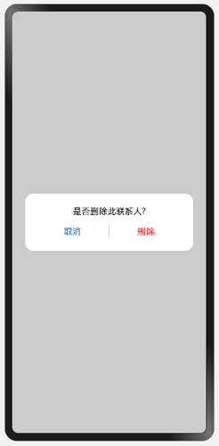            | 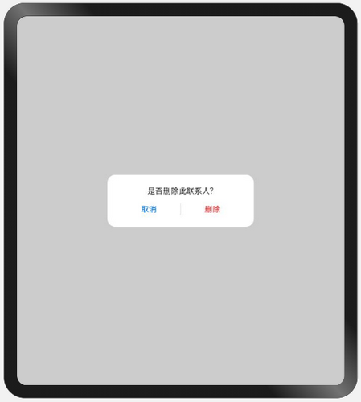       | 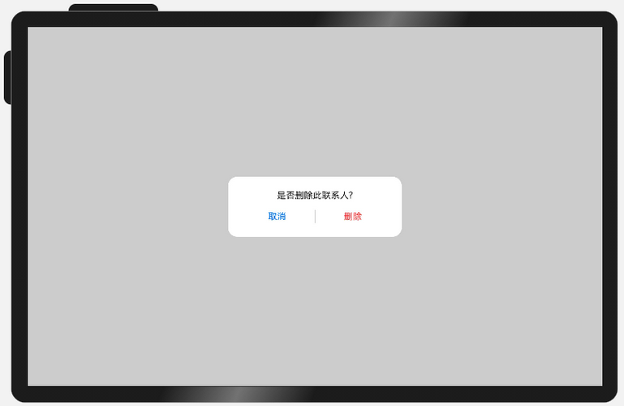       |

**实现方案**

自定义弹窗通常通过[CustomDialogController](../../reference/apis-arkui/arkui-ts/ts-methods-custom-dialog-box.md)实现，有两种方式实现本场景的目标效果：

* 通过gridCount属性配置自定义弹窗的宽度。

  系统默认对不同断点下的窗口进行了栅格化：sm断点下为4栅格，md断点下为8栅格，lg断点下为12栅格。通过gridCount属性可以配置弹窗占据栅格中的多少列，将该值配置为4即可实现目标效果。

* 将customStyle设置为true，即弹窗的样式完全由开发者自定义。

  开发者自定义弹窗样式时，开发者可以根据需要配置弹窗的宽高和背景色（非弹窗区域保持默认的半透明色）。自定义弹窗样式配合[栅格组件](../../reference/apis-arkui/arkui-ts/ts-container-gridrow.md)同样可以实现目标效果。

**参考代码**

```ts
@Entry
@Component
struct CustomDialogSample {
  // 通过gridCount配置弹窗的宽度
  dialogControllerA: CustomDialogController = new CustomDialogController({
    builder: CustomDialogA ({
      cancel: this.onCancel,
      confirm: this.onConfirm
    }),
    cancel: this.onCancel,
    autoCancel: true,
    gridCount: 4,
    customStyle: false
  })
  // 自定义弹窗样式
  dialogControllerB: CustomDialogController = new CustomDialogController({
    builder: CustomDialogB ({
      cancel: this.onCancel,
      confirm: this.onConfirm
    }),
    cancel: this.onCancel,
    autoCancel: true,
    customStyle: true
  })

  onCancel() {
    console.info('callback when dialog is canceled')
  }

  onConfirm() {
    console.info('callback when dialog is confirmed')
  }

  build() {
    Column() {
      Button('CustomDialogA').margin(12)
        .onClick(() => {
          this.dialogControllerA.open()
        })
      Button('CustomDialogB').margin(12)
        .onClick(() => {
          this.dialogControllerB.open()
        })
    }.width('100%').height('100%').justifyContent(FlexAlign.Center)
  }
}

@CustomDialog
struct CustomDialogA {
  controller?: CustomDialogController
  cancel?: () => void
  confirm?: () => void

  build() {
    Column() {
      Text('是否删除此联系人?')
        .fontSize(16)
        .fontColor('#E6000000')
        .margin({bottom: 8, top: 24, left: 24, right: 24})
      Row() {
        Text('取消')
          .fontColor('#007DFF')
          .fontSize(16)
          .layoutWeight(1)
          .textAlign(TextAlign.Center)
          .onClick(()=>{
            if(this.controller){
                 this.controller.close()
             }
            this.cancel!()
          })
        Line().width(1).height(24).backgroundColor('#33000000').margin({left: 4, right: 4})
        Text('删除')
          .fontColor('#FA2A2D')
          .fontSize(16)
          .layoutWeight(1)
          .textAlign(TextAlign.Center)
          .onClick(()=>{
             if(this.controller){
                 this.controller.close()
             }
            this.confirm!()
          })
      }.height(40)
      .margin({left: 24, right: 24, bottom: 16})
    }.borderRadius(24)
  }
}

@CustomDialog
struct CustomDialogB {
  controller?: CustomDialogController
  cancel?: () => void
  confirm?: () => void

  build() {
    GridRow({columns: {sm: 4, md: 8, lg: 12}}) {
      GridCol({span: 4, offset: {sm: 0, md: 2, lg: 4}}) {
        Column() {
          Text('是否删除此联系人?')
            .fontSize(16)
            .fontColor('#E6000000')
            .margin({bottom: 8, top: 24, left: 24, right: 24})
          Row() {
            Text('取消')
              .fontColor('#007DFF')
              .fontSize(16)
              .layoutWeight(1)
              .textAlign(TextAlign.Center)
              .onClick(()=>{
                if(this.controller){
                 this.controller.close()
                }
                this.cancel!()
              })
            Line().width(1).height(24).backgroundColor('#33000000').margin({left: 4, right: 4})
            Text('删除')
              .fontColor('#FA2A2D')
              .fontSize(16)
              .layoutWeight(1)
              .textAlign(TextAlign.Center)
              .onClick(()=>{
                 if(this.controller){
                 this.controller.close()
                }
                this.confirm!()
              })
          }.height(40)
          .margin({left: 24, right: 24, bottom: 16})
        }.borderRadius(24).backgroundColor('#FFFFFF')
      }
    }.margin({left: 24, right: 24})
  }
}
```


## 大图浏览

**布局效果**


| sm | md | lg |
| -------- | -------- | -------- |
| 图片长宽比不变，最长边充满全屏 | 图片长宽比不变，最长边充满全屏 | 图片长宽比不变，最长边充满全屏 |
| 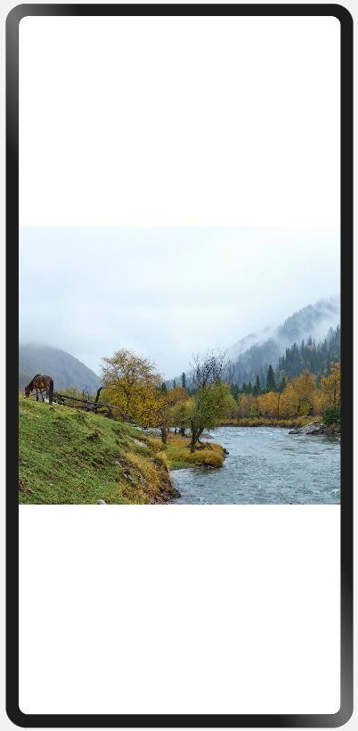 | 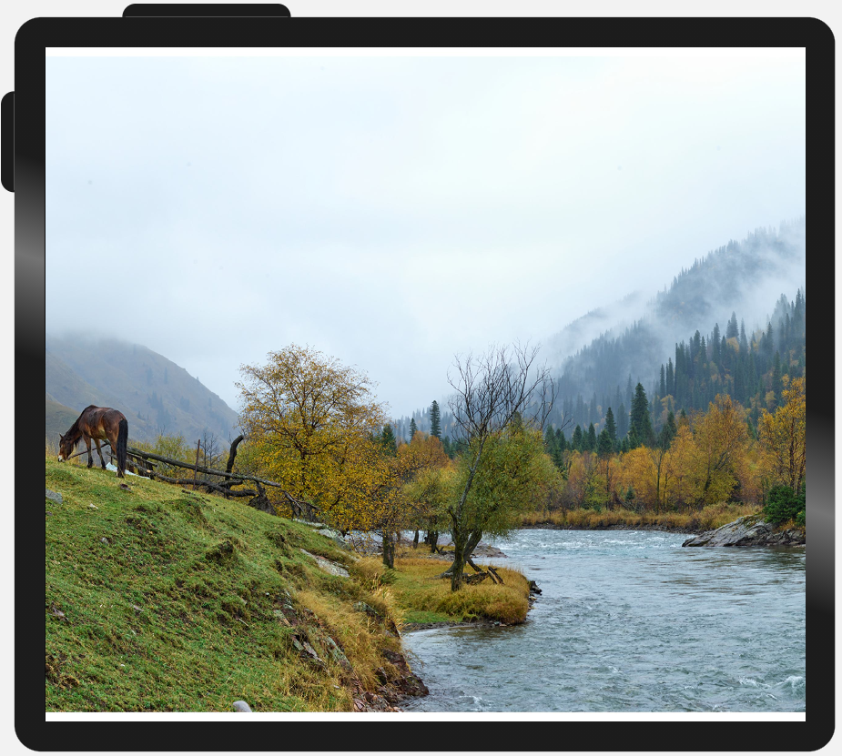 | 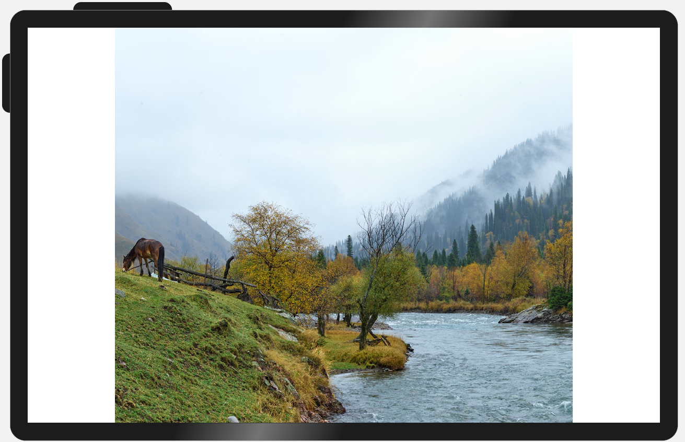 |

**实现方案**

图片通常使用[Image组件](../../reference/apis-arkui/arkui-ts/ts-basic-components-image.md)展示，Image组件的objectFit属性默认为ImageFit.Cover，即保持宽高比进行缩小或者放大以使得图片两边都大于或等于显示边界。在大图浏览场景下，因屏幕与图片的宽高比可能有差异，常常会发生图片被截断的问题。此时只需将Image组件的objectFit属性设置为ImageFit.Contain，即保持宽高比进行缩小或者放大并使得图片完全显示在显示边界内，即可解决该问题。


**参考代码**


```ts
@Entry
@Component
struct BigImage {
  build() {
    Row() {
      Image($r("app.media.image"))
        .objectFit(ImageFit.Contain)
    }
  }
}
```


## 操作入口

**布局效果**

| sm | md | lg |
| -------- | -------- | -------- |
| 列表项尺寸固定，超出内容可滚动查看 | 列表项尺寸固定，剩余空间均分 | 列表项尺寸固定，剩余空间均分 |
| 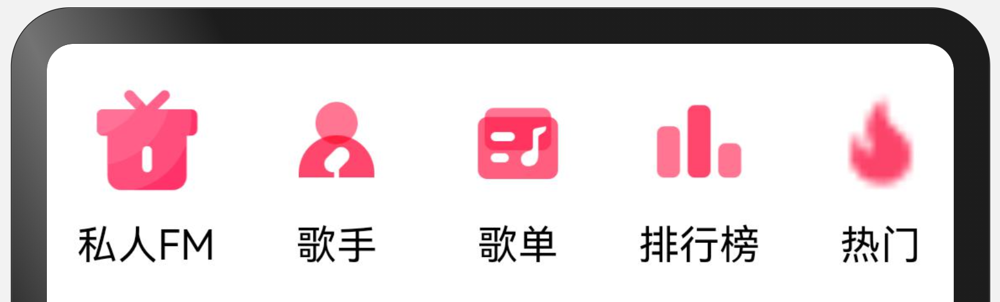 |  |  |


**实现方案**

Scroll（内容超出宽度时可滚动） + Row（横向均分：justifyContent（FlexAlign.SpaceAround）、 最小宽度约束：constraintSize({ minWidth: '100%' }）


**参考代码**


```ts
interface OperationItem {
  name: string
  icon: Resource
}

@Entry
@Component
export default struct OperationEntries {
  @State listData: Array<OperationItem> = [
    { name: '私人FM', icon: $r('app.media.self_fm') },
    { name: '歌手', icon: $r('app.media.singer') },
    { name: '歌单', icon: $r('app.media.song_list') },
    { name: '排行榜', icon: $r('app.media.rank') },
    { name: '热门', icon: $r('app.media.hot') },
    { name: '运动音乐', icon: $r('app.media.sport') },
    { name: '音乐FM', icon: $r('app.media.audio_fm') },
    { name: '福利', icon: $r('app.media.bonus') }]

  build() {
    Scroll() {
      Row() {
        ForEach(this.listData, (item:OperationItem) => {
          Column() {
            Image(item.icon)
              .width(48)
              .aspectRatio(1)
            Text(item.name)
              .margin({ top: 8 })
              .fontSize(16)
          }
          .justifyContent(FlexAlign.Center)
          .height(104)
          .padding({ left: 12, right: 12 })
        })
      }
      .constraintSize({ minWidth: '100%' }).justifyContent(FlexAlign.SpaceAround)
    }
    .width('100%')
    .scrollable(ScrollDirection.Horizontal)
  }
}
```


## 顶部


**布局效果**


| sm | md | lg |
| -------- | -------- | -------- |
| 标题和搜索框两行显示 | 标题和搜索框一行显示 | 标题和搜索框一行显示 |
| 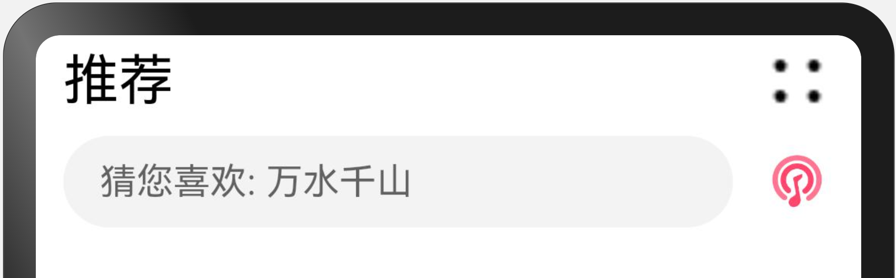 |  | 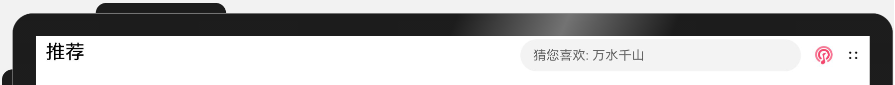 |

**实现方案**

最外层使用栅格行组件GridRow布局

文本标题使用栅格列组件GridCol

搜索框使用栅格列组件GridCol


**参考代码**


```ts
@Entry
@Component
export default struct Header {
  @State needWrap: boolean = true

  build() {
    GridRow() {
      GridCol({ span: { sm: 12, md: 6, lg: 7 } }) {
        Row() {
          Text('推荐').fontSize(24)
          Blank()
          Image($r('app.media.ic_public_more'))
            .width(32)
            .height(32)
            .objectFit(ImageFit.Contain)
            .visibility(this.needWrap ? Visibility.Visible : Visibility.None)
        }
        .width('100%').height(40)
        .alignItems(VerticalAlign.Center)
      }

      GridCol({ span: { sm: 12, md: 6, lg: 5 } }) {
        Flex({ direction: FlexDirection.Row, alignItems: ItemAlign.Center }) {
          Search({ placeholder: '猜您喜欢: 万水千山' })
            .placeholderFont({ size: 16 })
            .margin({ top: 4, bottom: 4 })
          Image($r('app.media.audio_fm'))
            .width(32)
            .height(32)
            .objectFit(ImageFit.Contain)
            .flexShrink(0)
            .margin({ left: 12 })
          Image($r('app.media.ic_public_more'))
            .width(32)
            .height(32)
            .objectFit(ImageFit.Contain)
            .flexShrink(0)
            .margin({ left: 12 })
            .visibility(this.needWrap ? Visibility.None : Visibility.Visible)
        }
      }
    }.onBreakpointChange((breakpoint: string) => {
      if (breakpoint === 'sm') {
        this.needWrap = true
      } else {
        this.needWrap = false
      }
    })
    .padding({ left: 12, right: 12 })
  }
}
```


## 缩进布局


**布局效果**


  | sm | md | lg | 
| -------- | -------- | -------- |
| 栅格总列数为4，内容占满所有列 | 栅格总列数为8，内容占中间6列。 | 栅格总列数为12，内容占中间8列。 | 
| 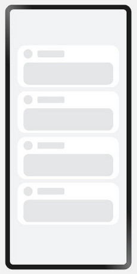 | 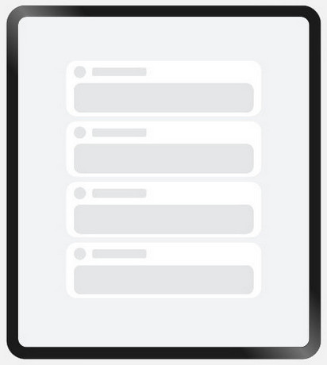 | 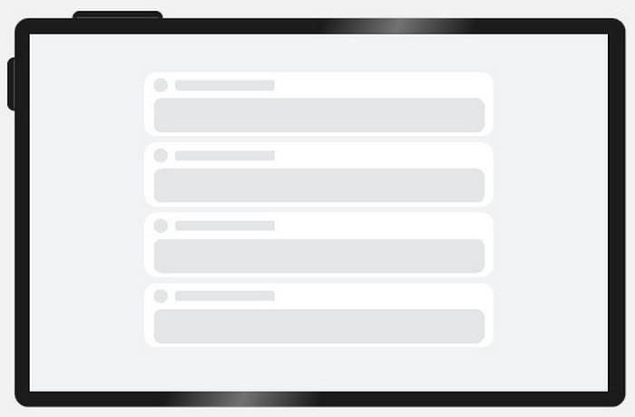 | 


**实现方案**

借助[栅格组件](../../reference/apis-arkui/arkui-ts/ts-container-gridrow.md)，控制待显示内容在不同的断点下占据不同的列数，即可实现不同设备上的缩进效果。另外还可以调整不同断点下栅格组件与两侧的间距，获得更好的显示效果。


**参考代码**


```ts
@Entry
@Component
struct IndentationSample {
  @State private gridMargin: number = 24
  build() {
    Row() {
      GridRow({columns: {sm: 4, md: 8, lg: 12}, gutter: 24}) {
        GridCol({span: {sm: 4, md: 6, lg: 8}, offset: {md: 1, lg: 2}}) {
          Column() {
            ForEach([0, 1, 2, 4], () => {
              Column() {
                ItemContent()
              }
            })
          }.width('100%')
        }
      }
      .margin({left: this.gridMargin, right: this.gridMargin})
      .onBreakpointChange((breakpoint: string) => {
        if (breakpoint === 'lg') {
          this.gridMargin = 48
        } else if (breakpoint === 'md') {
          this.gridMargin = 32
        } else {
          this.gridMargin = 24
        }
      })
    }
    .height('100%')
    .alignItems((VerticalAlign.Center))
    .backgroundColor('#F1F3f5')
  }
}

@Component
struct ItemContent {
  build() {
    Column() {
      Row() {
        Row() {
        }
        .width(28)
        .height(28)
        .borderRadius(14)
        .margin({ right: 15 })
        .backgroundColor('#E4E6E8')

        Row() {
        }
        .width('30%').height(20).borderRadius(4)
        .backgroundColor('#E4E6E8')
      }.width('100%').height(28)

      Row() {
      }
      .width('100%')
      .height(68)
      .borderRadius(16)
      .margin({ top: 12 })
      .backgroundColor('#E4E6E8')
    }
    .height(128)
    .borderRadius(24)
    .backgroundColor('#FFFFFF')
    .padding({ top: 12, bottom: 12, left: 18, right: 18 })
    .margin({ bottom: 12 })
  }
}
```


## 挪移布局

**布局效果**

  | sm | md | lg | 
| -------- | -------- | -------- |
| 图片和文字上下布局 | 图片和文字左右布局 | 图片和文字左右布局 | 
|  | 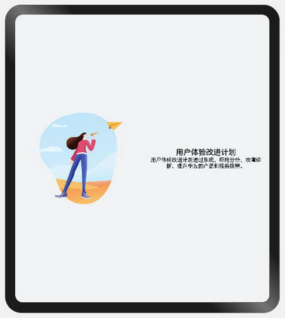 | 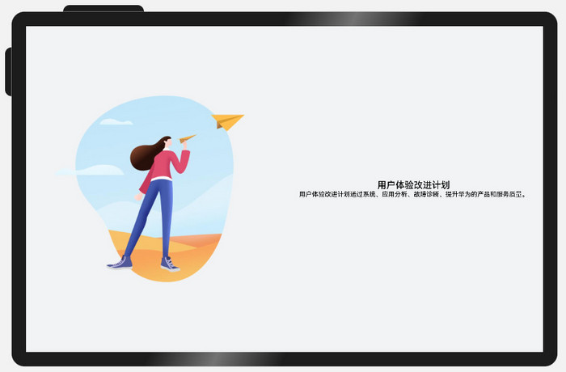 | 


**实现方案**

不同断点下，栅格子元素占据的列数会随着开发者的配置发生改变。当一行中的列数超过栅格组件在该断点的总列数时，可以自动换行，即实现”上下布局”与”左右布局”之间切换的效果。


**参考代码**


```ts
@Entry
@Component
struct DiversionSample {
  @State private currentBreakpoint: string = 'md'
  @State private imageHeight: number = 0
  build() {
    Row() {
      GridRow() {
        GridCol({span: {sm: 12, md: 6, lg: 6}}) {
          Image($r('app.media.illustrator'))
          .aspectRatio(1)
          .onAreaChange((oldValue: Area, newValue: Area) => {
            this.imageHeight = Number(newValue.height)
          })
          .margin({left: 12, right: 12})
        }

        GridCol({span: {sm: 12, md: 6, lg: 6}}) {
          Column(){
            Text($r('app.string.user_improvement'))
              .textAlign(TextAlign.Center)
              .fontSize(20)
              .fontWeight(FontWeight.Medium)
            Text($r('app.string.user_improvement_tips'))
              .textAlign(TextAlign.Center)
              .fontSize(14)
              .fontWeight(FontWeight.Medium)
          }
          .margin({left: 12, right: 12})
          .justifyContent(FlexAlign.Center)
          .height(this.currentBreakpoint === 'sm' ? 100 : this.imageHeight)
        }
      }.onBreakpointChange((breakpoint: string) => {
        this.currentBreakpoint = breakpoint;
      })
    }
    .height('100%')
    .alignItems((VerticalAlign.Center))
    .backgroundColor('#F1F3F5')
  }
}
```


## 重复布局

**布局效果**

| sm | md | lg |
| -------- | -------- | -------- |
| 单列显示，共8个元素<br>可以通过上下滑动查看不同的元素 | 双列显示，共8个元素 | 双列显示，共8个元素 |
| 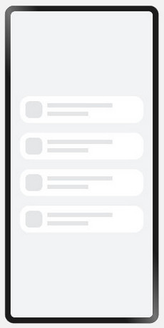 | 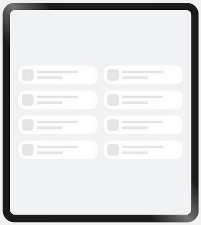  | 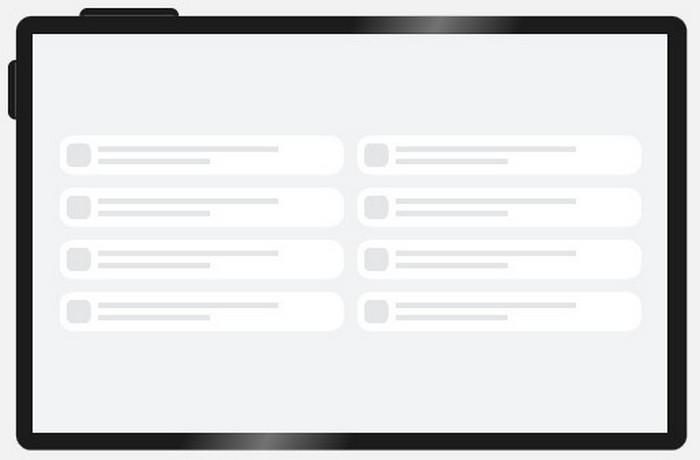 |


**实现方案**

不同断点下，配置栅格子组件占据不同的列数，即可实现“小屏单列显示、大屏双列显示”的效果。另外，还可以通过栅格组件的onBreakpointChange事件，调整页面中显示的元素数量。


**参考代码**


```ts
@Entry
@Component
struct RepeatSample {
  @State private currentBreakpoint: string = 'md'
  @State private listItems: number[] = [1, 2, 3, 4, 5, 6, 7, 8]
  @State private gridMargin: number = 24

  build() {
    Row() {
      // 当目标区域不足以显示所有元素时，可以通过上下滑动查看不同的元素
      Scroll() {
        GridRow({gutter: 24}) {
          ForEach(this.listItems, () => {
           // 通过配置元素在不同断点下占的列数，实现不同的布局效果
            GridCol({span: {sm: 12, md: 6, lg: 6}}) {
              Column() {
                RepeatItemContent()
              }
            }
          })
        }
        .margin({left: this.gridMargin, right: this.gridMargin})
        .onBreakpointChange((breakpoint: string) => {
          this.currentBreakpoint = breakpoint;
          if (breakpoint === 'lg') {
            this.gridMargin = 48
          } else if (breakpoint === 'md') {
            this.gridMargin = 32
          } else {
            this.gridMargin = 24
          }
        })
      }.height(348)
    }
    .height('100%')
    .backgroundColor('#F1F3F5')
  }
}

@Component
struct RepeatItemContent {
  build() {
    Flex() {
      Row() {
      }
      .width(43)
      .height(43)
      .borderRadius(12)
      .backgroundColor('#E4E6E8')
      .flexGrow(0)

      Flex({ direction: FlexDirection.Column, alignItems: ItemAlign.Start, justifyContent: FlexAlign.SpaceAround }) {
        Row() {
        }
        .height(10)
        .width('80%')
        .backgroundColor('#E4E6E8')

        Row() {
        }
        .height(10)
        .width('50%')
        .backgroundColor('#E4E6E8')
      }
      .flexGrow(1)
      .margin({ left: 13 })
    }
    .padding({ top: 13, bottom: 13, left: 13, right: 37 })
    .height(69)
    .backgroundColor('#FFFFFF')
    .borderRadius(24)
  }
}
```
