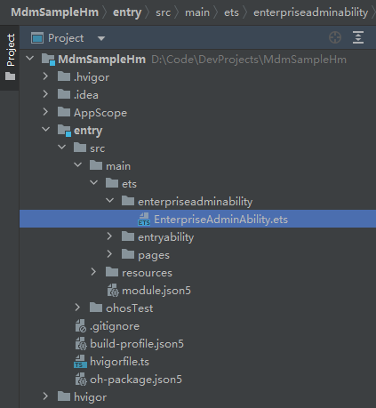

# EnterpriseAdminExtensionAbility开发指南

## 概述

企业设备管理扩展能力，是设备管理应用必备组件。当开发者为企业开发设备管理应用时，需继承EnterpriseAdminExtensionAbility，在EnterpriseAdminExtensionAbility实例中实现MDM业务逻辑，EnterpriseAdminExtensionAbility实现了系统管理状态变化通知功能，并定义了管理应用激活、去激活、应用安装、卸载事件等回调接口。

## 接口说明
以下为本次开发示例所使用的接口，更多接口及使用方式请见[企业设备管理扩展能力接口文档](../../application-dev/reference/apis-mdm-kit/js-apis-EnterpriseAdminExtensionAbility.md)。

| 接口名称                                  | 描述                         |
| ----------------------------------------- | ---------------------------- |
| [onAdminEnabled(): void](../../application-dev/reference/apis-mdm-kit/js-apis-EnterpriseAdminExtensionAbility.md#enterpriseadminextensionabilityonadminenabled)                    | 设备管理应用被激活回调方法。   |
| [onAdminDisabled(): void](../../application-dev/reference/apis-mdm-kit/js-apis-EnterpriseAdminExtensionAbility.md#enterpriseadminextensionabilityonadmindisabled)                   | 设备管理应用被解除激活回调方法。 |
| [onBundleAdded(bundleName: string): void](../../application-dev/reference/apis-mdm-kit/js-apis-EnterpriseAdminExtensionAbility.md#enterpriseadminextensionabilityonbundleadded)   | 应用安装回调方法。             |
| [onBundleRemoved(bundleName: string): void](../../application-dev/reference/apis-mdm-kit/js-apis-EnterpriseAdminExtensionAbility.md#enterpriseadminextensionabilityonbundleremoved) | 应用卸载回调方法。             |

## 开发步骤

新建一个工程后，结构如下：


首先，创建一个EnterpriseAdmin类型的ExtensionAbility（也就是EnterpriseAdminExtensionAbility）。



其次，打开新建的EnterpriseAdminAbility文件，导入EnterpriseAdminExtensionAbility模块，使其继承EnterpriseAdminExtensionAbility并加上需要的应用通知回调方法，如onAdminEnabled()、onAdminDisabled()等回调方法。当设备管理应用激活或者解除激活时，可以在对应回调方法中接受系统发送通知。

```ts
import { EnterpriseAdminExtensionAbility } from '@kit.MDMKit';

export default class EnterpriseAdminAbility extends EnterpriseAdminExtensionAbility {
  // 设备管理应用激活回调方法，应用可在此回调函数中进行初始化策略设置
  onAdminEnabled() {
    console.info("onAdminEnabled");
  }

  // 设备管理应用解除激活回调方法，应用可在此回调函数中通知企业管理员设备已脱管
  onAdminDisabled() {
    console.info("onAdminDisabled");
  }
  
  // 应用安装回调方法，应用可在此回调函数中进行事件上报，通知企业管理员
  onBundleAdded(bundleName: string) {
    console.info("EnterpriseAdminAbility onBundleAdded bundleName:" + bundleName);
  }

  // 应用卸载回调方法，应用可在此回调函数中进行事件上报，通知企业管理员
  onBundleRemoved(bundleName: string) {
    console.info("EnterpriseAdminAbility onBundleRemoved bundleName" + bundleName);
  }
};
```

最后，在工程Module对应的[module.json5](https://developer.huawei.com/consumer/cn/doc/harmonyos-guides-V2/module-configuration-file-0000001427744540-V2)配置文件中将EnterpriseAdminAbility注册为ExtensionAbility，type标签需要设置为“enterpriseAdmin”，srcEntry标签表示当前ExtensionAbility组件所对应的代码路径。

```ts
"extensionAbilities": [
  {
	"name": "EnterpriseAdminAbility",
	"type": "enterpriseAdmin",
	"exported": true,
	"srcEntry": "./ets/enterpriseadminability/EnterpriseAdminAbility.ets"
  }
]
```

## 相关实例

针对EnterpriseAdminExtensionAbility开发，有以下相关示例可供参考：

- [企业设备管理扩展（ArkTS）](https://gitee.com/openharmony/applications_app_samples/tree/master/code/SystemFeature/ApplicationModels/EnterpriseAdminExtensionAbility)