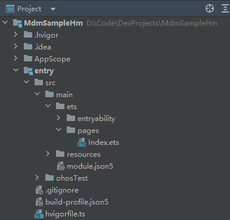
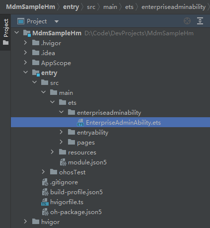

# EnterpriseAdminExtensionAbility开发指南
<!--Kit: MDM Kit-->
<!--Subsystem: Customization-->
<!--Owner: @huanleima; @weizai16-->
<!--Designer: @hp_guo-->
<!--Tester: @lpw_work-->
<!--Adviser: @zhang_yixin13-->

## 概述

企业设备管理扩展能力组件，是设备管理应用必备组件。当开发者为企业开发设备管理应用时，需继承EnterpriseAdminExtensionAbility，在EnterpriseAdminExtensionAbility实例中实现MDM业务逻辑，EnterpriseAdminExtensionAbility实现了系统管理状态变化通知功能，并定义了管理应用激活、去激活、应用安装、卸载事件等回调接口。

## 接口说明
以下为本次开发示例所使用的接口，更多接口及使用方式请见企业设备管理扩展能力接口文档[EnterpriseAdminExtensionAbility](../../application-dev/reference/apis-mdm-kit/js-apis-EnterpriseAdminExtensionAbility.md)。

| 接口名称                                  | 描述                         |
| ----------------------------------------- | ---------------------------- |
| [onAdminEnabled(): void](../../application-dev/reference/apis-mdm-kit/js-apis-EnterpriseAdminExtensionAbility.md#onadminenabled)                    | 设备管理应用被激活回调方法。   |
| [onAdminDisabled(): void](../../application-dev/reference/apis-mdm-kit/js-apis-EnterpriseAdminExtensionAbility.md#onadmindisabled)                   | 设备管理应用被解除激活回调方法。 |
| [onBundleAdded(bundleName: string): void](../../application-dev/reference/apis-mdm-kit/js-apis-EnterpriseAdminExtensionAbility.md#onbundleadded)   | 应用安装回调方法。             |
| [onBundleRemoved(bundleName: string): void](../../application-dev/reference/apis-mdm-kit/js-apis-EnterpriseAdminExtensionAbility.md#onbundleremoved) | 应用卸载回调方法。             |
| [onDeviceAdminEnabled(bundleName: string): void](../../application-dev/reference/apis-mdm-kit/js-apis-EnterpriseAdminExtensionAbility.md#ondeviceadminenabled23) | 普通设备管理应用被激活回调方法。 |
| [onDeviceAdminDisabled(bundleName: string): void](../../application-dev/reference/apis-mdm-kit/js-apis-EnterpriseAdminExtensionAbility.md#ondeviceadmindisabled23) | 普通设备管理应用被解除激活回调方法。 |

## 开发步骤

新建一个工程后，结构如下：



首先，创建一个EnterpriseAdmin类型的ExtensionAbility（也就是EnterpriseAdminExtensionAbility）。



其次，打开新建的EnterpriseAdminAbility文件，导入EnterpriseAdminExtensionAbility模块，使其继承EnterpriseAdminExtensionAbility并加上需要的应用通知回调方法，如onAdminEnabled()、onAdminDisabled()等回调方法。当设备管理应用激活或者解除激活时，可以在对应回调方法中接收系统发送通知。

<!-- @[enterprise_admin_extension_ability](https://gitcode.com/openharmony/applications_app_samples/blob/master/code/DocsSample/EnterpriseAdminExtensionAbility/EnterpriseAdminExtensionAbility/entry/src/main/ets/enterpriseadminability/EnterpriseAdminAbility.ets) -->   

``` TypeScript
import { EnterpriseAdminExtensionAbility } from '@kit.MDMKit';
// ...

export default class EnterpriseAdminAbility extends EnterpriseAdminExtensionAbility {
  // ...

  // 设备管理器应用激活回调方法，应用可在此回调函数中进行初始化策略设置。
  onAdminEnabled() {
    console.info('onAdminEnabled');
    // ...
  }

  // 设备管理器应用去激活回调方法，应用可在此回调函数中通知企业管理员设备已脱管。
  onAdminDisabled() {
    console.info('onAdminDisabled');
    // ...
  }

  // 应用安装回调方法，应用可在此回调函数中进行事件上报，通知企业管理员。
  onBundleAdded(bundleName: string) {
    console.info('EnterpriseAdminAbility onBundleAdded bundleName:' + bundleName);
  }

  // 应用卸载回调方法，应用可在此回调函数中进行事件上报，通知企业管理员。
  onBundleRemoved(bundleName: string) {
    console.info('EnterpriseAdminAbility onBundleRemoved bundleName:' + bundleName);
  }

  // 普通设备管理应用激活回调方法，应用可在此回调函数中进行初始化策略设置。
  onDeviceAdminEnabled(bundleName: string) {
    console.info('EnterpriseAdminAbility onDeviceAdminEnabled bundleName:' + bundleName);
  }

  // 普通设备管理应用解除激活回调方法，应用可在此回调函数中通知企业管理员设备已脱管。
  onDeviceAdminDisabled(bundleName: string) {
    console.info('EnterpriseAdminAbility onDeviceAdminDisabled bundleName:' + bundleName);
  }
};
```


最后，在工程Module对应的[module.json5](../quick-start/module-configuration-file.md)配置文件中将EnterpriseAdminAbility注册为ExtensionAbility，type标签需要设置为“enterpriseAdmin”，srcEntry标签表示当前ExtensionAbility组件所对应的代码路径。

<!-- @[extension_abilities](https://gitcode.com/openharmony/applications_app_samples/blob/master/code/DocsSample/EnterpriseAdminExtensionAbility/EnterpriseAdminExtensionAbility/entry/src/main/module.json5) -->

``` JSON5
"extensionAbilities": [
  {
    "name": "EnterpriseAdminAbility",
    "type": "enterpriseAdmin",
    "exported": true,
    "srcEntry": "./ets/enterpriseadminability/EnterpriseAdminAbility.ets"
  }
],
```


## 相关实例

针对EnterpriseAdminExtensionAbility开发，有以下相关示例可供参考：

- [企业设备管理扩展（ArkTS）](https://gitcode.com/openharmony/applications_app_samples/tree/master/code/DocsSample/EnterpriseAdminExtensionAbility/EnterpriseAdminExtensionAbility)