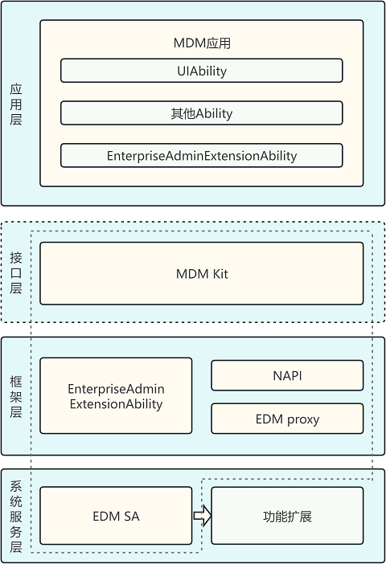

# MDM Kit简介
<!--Kit: MDM Kit-->
<!--Subsystem: Customization-->
<!--Owner: @huanleima-->
<!--SE: @liuzuming-->
<!--TSE: @lpw_work-->

## 业务介绍

MDM Kit（企业设备管理服务）为企业MDM（Mobile Device Management）应用提供设备管理API，用于管理并保护公司设备上的数据和应用程序。企业MDM应用可以通过集中管理、远程配置和监控来保障设备和数据的安全性和稳定性。它广泛应用于企业和政府机构，以确保员工和客户使用的设备和数据受到保护，实现企业高效管理、安全使用设备。

## 实现原理

<!--RP1-->
框架层和服务层提供了enterprise_device_management部件，enterprise_device_management部件提供了设备管理应用程序框架和基本设备管理能力。设备管理应用通过[EnterpriseAdminExtensionAbility](./mdm-kit-admin.md)来调用MDM Kit中的接口，实现管理设备的意图。<!--RP1End-->

## 约束与限制

- SDK版本为5.0.0（API 12）及以上。

- 仅支持Stage模型。

<!--RP3--><!--RP3End-->