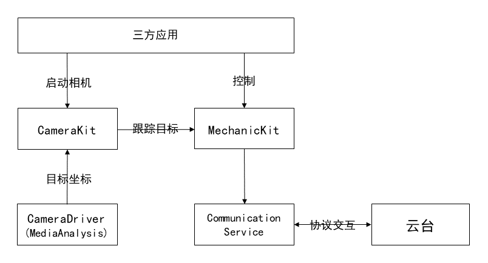

# Mechanic Kit简介
<!--Kit: Mechanic Kit-->
<!--Subsystem: Mechanic-->
<!--Owner: @hobbycao-->
<!--Designer: @saga2025-->
<!--Tester: @zhaodengqi-->
<!--Adviser: @foryourself-->

Mechanic Kit 是机械体设备控制器提供的API集合。从API version 20起，应用可使用Mechanic Kit控制机械体设备。Mechanic Kit 提供了完整的三方机械体设备配件集成方案，满足手机与云台、机械臂等设备间的交互需求。

Mechanic Kit 通过 `mechanicManager` 模块，实现设备连接管理、智能追踪<!--Del-->和状态监控，支持精准控制<!--Del-->，帮助开发者构建高质量的设备交互应用。

Mechanic Kit 通过 `mechanicManager` 模块支持对连接的机械体设备进行控制和交互，包括连接管理、控制和监控。

## 场景介绍

机械体设备管理主要面向云台、机械臂等智能机械体设备的交互控制场景：

- **智能拍摄辅助**：通过机械体设备实现人脸跟踪和物体追踪，提升拍摄质量。
- **拍摄控制**：手机作为控制终端，操控云台或机械臂等机械体设备进行精准的角度调整和运动轨迹控制。

Mechanic Kit提供设备连接、智能跟踪和精准控制功能，构建机械配件控制应用更便捷。

## 能力范围

Mechanic Kit为开发者提供全面的机械体设备操控能力，核心功能包括：

### 设备连接管理

- **设备发现**：获取当前连接的机械体设备列表，支持云台等多种机械体设备类型。
- **连接状态监听**：实时监听设备连接和断开状态变化。
- **设备信息查询**：获取设备ID、名称、类型等基本信息。

### 智能跟踪控制

- **摄像头跟踪开关**：启用或禁用摄像头智能跟踪功能。
- **跟踪布局设置**：支持默认、左侧、中间、右侧四种跟踪布局模式。
- **跟踪状态监听**：监听用户操作和布局变化等跟踪事件。

<!--Del-->
### 精准设备操控

- **相对角度旋转**：基于当前位置进行相对角度旋转控制。
- **绝对角度旋转**：按照绝对欧拉角进行旋转控制。
- **运动停止控制**：立即停止设备的所有运动操作。
<!--DelEnd-->

### 设备状态监控

- **当前角度查询**：实时获取设备在三个轴向的当前角度。
- **旋转限制查询**：获取设备在各轴向的最大旋转范围。
- **旋转轴状态监听**：监听各旋转轴的启用状态和限制情况。
- **运动参数查询**：获取最大旋转速度和连续旋转时间。

## 运作机制

**智能跟踪运作机制**：相机驱动检测到人脸后，上报给相机服务。相机服务结合人脸位置和相机参数，上报给机械体控制服务。控制服务将信息转换为转动指令，通过蓝牙服务下发给机械体。应用可通过开放接口控制智能跟踪功能。

**精准设备操控机制**：应用通过Mechanic Kit提供的接口控制机械体设备，按指定速度或轨迹转动。

## 约束限制

使用Mechanic Kit的能力前，需满足以下条件：

- **机械体设备**：机械体设备必须符合Mechanic Kit协议标准，例如厂商已对外宣称该设备支持Mechanic Kit。
- **开发设备**：如果要支持智能跟踪功能，开发设备上相机驱动必须具备摄像头人脸检测能力，支持上报人脸Metadata数据（Metadata符合HDI接口规范）。
- **设备连接要求**：开发设备必须与机械体设备建立连接，确保通信链路正常。
- **相机权限**：前台应用需要获得相机使用权限，用于支持智能追踪等视觉相关功能。
- **系统权限**：某些高级功能（如转动控制）需要系统应用权限。
- **硬件限制**：操作范围受限于机械体设备的运动限位。

> **说明**：
>
> 请在调用接口前完成条件检查，避免功能异常。
