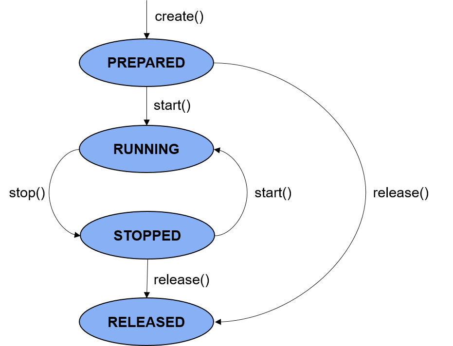

# 音频采集开发指导

## 简介

AudioCapturer提供了用于获取原始音频文件的方法。开发者可以通过本指导了解应用如何通过AudioCapturer接口的调用实现音频数据的采集。

- **状态检查**：在进行应用开发的过程中，建议开发者通过on('stateChange')方法订阅AudioCapturer的状态变更。因为针对AudioCapturer的某些操作，仅在音频采集器在固定状态时才能执行。如果应用在音频采集器处于错误状态时执行操作，系统可能会抛出异常或生成其他未定义的行为。

## 运作机制

该模块提供了音频采集模块的状态变化示意图。

**图1** 音频采集状态变化示意图



**PREPARED状态：** 通过调用create()方法进入到该状态。<br>
**RUNNING状态：** 正在进行音频数据播放，可以在prepared状态通过调用start()方法进入此状态，也可以在stopped状态通过调用start()方法进入此状态。<br>
**STOPPED状态：** 在running状态可以通过stop()方法停止音频数据的播放。<br>
**RELEASED状态：** 在prepared和stop状态，用户均可通过release()方法释放掉所有占用的硬件和软件资源，并且不会再进入到其他的任何一种状态了。<br>

## 约束与限制

开发者在进行音频数据采集功能开发前，需要先对所开发的应用配置麦克风权限（ohos.permission.MICROPHONE），权限配置相关内容可参考：[访问控制授权申请指导](../security/accesstoken-guidelines.md)

## 开发指导

详细API含义可参考：[音频管理API文档AudioCapturer](../reference/apis/js-apis-audio.md#audiocapturer8)

1. 使用createAudioCapturer()创建一个AudioCapturer实例。

   在audioCapturerOptions中设置音频采集器的相关参数。该实例可用于音频采集、控制和获取采集状态，以及注册通知回调。 

   ```js
   import audio from '@ohos.multimedia.audio';

   let audioStreamInfo = {
     samplingRate: audio.AudioSamplingRate.SAMPLE_RATE_44100,
     channels: audio.AudioChannel.CHANNEL_1,
     sampleFormat: audio.AudioSampleFormat.SAMPLE_FORMAT_S16LE,
     encodingType: audio.AudioEncodingType.ENCODING_TYPE_RAW
   }
   
   let audioCapturerInfo = {
     source: audio.SourceType.SOURCE_TYPE_MIC,
     capturerFlags: 0 // 0是音频采集器的扩展标志位，默认为0
   }
   
   let audioCapturerOptions = {
     streamInfo: audioStreamInfo,
     capturerInfo: audioCapturerInfo
   }
   
   let audioCapturer = await audio.createAudioCapturer(audioCapturerOptions);
   console.log('AudioRecLog: Create audio capturer success.');
   ```

2. 调用start()方法来启动/恢复采集任务。

   启动完成后，采集器状态将变更为STATE_RUNNING，然后应用可以开始读取缓冲区。

   ```js
   import audio from '@ohos.multimedia.audio';

   async function startCapturer() {
     let state = audioCapturer.state;
     // Capturer start时的状态应该是STATE_PREPARED、STATE_PAUSED和STATE_STOPPED之一.
     if (state != audio.AudioState.STATE_PREPARED || state != audio.AudioState.STATE_PAUSED ||
       state != audio.AudioState.STATE_STOPPED) {
       console.info('Capturer is not in a correct state to start');
       return;
     }
     await audioCapturer.start();

     let state = audioCapturer.state;
     if (state == audio.AudioState.STATE_RUNNING) {
       console.info('AudioRecLog: Capturer started');
     } else {
       console.error('AudioRecLog: Capturer start failed');
     }
   }
   ```

3. 读取采集器的音频数据并将其转换为字节流。重复调用read()方法读取数据，直到应用准备停止采集。   

   参考以下示例，将采集到的数据写入文件。 

   ```js
   import fileio from '@ohos.fileio';

    let state = audioCapturer.state;
    // 只有状态为STATE_RUNNING的时候才可以read.
    if (state != audio.AudioState.STATE_RUNNING) {
      console.info('Capturer is not in a correct state to read');
      return;
    }
      
   const path = '/data/data/.pulse_dir/capture_js.wav'; // 采集到的音频文件存储路径
   let fd = fileio.openSync(path, 0o102, 0o777);
   if (fd !== null) {
     console.info('AudioRecLog: file fd created');
   }
   else{
     console.info('AudioRecLog: file fd create : FAILED');
     return;
   }
      
   fd = fileio.openSync(path, 0o2002, 0o666);
   if (fd !== null) {
     console.info('AudioRecLog: file fd opened in append mode');
   }
      
   let numBuffersToCapture = 150; // 循环写入150次
   while (numBuffersToCapture) {
     let buffer = await audioCapturer.read(bufferSize, true);
     if (typeof(buffer) == undefined) {
       console.info('AudioRecLog: read buffer failed');
     } else {
       let number = fileio.writeSync(fd, buffer);
       console.info('AudioRecLog: data written: ' + number);
     }
      
     numBuffersToCapture--;
   }
   ```

4. 采集完成后，调用stop方法，停止录制。

   ```js
    async function StopCapturer() {
      let state = audioCapturer.state;
      // 只有采集器状态为STATE_RUNNING或STATE_PAUSED的时候才可以停止
      if (state != audio.AudioState.STATE_RUNNING && state != audio.AudioState.STATE_PAUSED) {
        console.info('AudioRecLog: Capturer is not running or paused');
        return;
      }

      await audioCapturer.stop();

      state = audioCapturer.state;
      if (state == audio.AudioState.STATE_STOPPED) {
        console.info('AudioRecLog: Capturer stopped');
      } else {
        console.error('AudioRecLog: Capturer stop failed');
      }
    }
   ```

5. 任务结束，调用release()方法释放相关资源。

   ```js
    async function releaseCapturer() {
      let state = audioCapturer.state;
      // 采集器状态不是STATE_RELEASED或STATE_NEW状态，才能release
      if (state == audio.AudioState.STATE_RELEASED || state == audio.AudioState.STATE_NEW) {
        console.info('AudioRecLog: Capturer already released');
        return;
      }

      await audioCapturer.release();

      state = audioCapturer.state;
      if (state == audio.AudioState.STATE_RELEASED) {
        console.info('AudioRecLog: Capturer released');
      } else {
        console.info('AudioRecLog: Capturer release failed');
      }
    }
   ```

6. （可选）获取采集器相关信息
   
   通过以下代码，可以获取采集器的相关信息。

   ```js
   // 获取当前采集器状态
   let state = audioCapturer.state;
   
   // 获取采集器信息
   let audioCapturerInfo : audio.AuduioCapturerInfo = await audioCapturer.getCapturerInfo();

   // 获取音频流信息
   let audioStreamInfo : audio.AudioStreamInfo = await audioCapturer.getStreamInfo();

   // 获取音频流ID
   let audioStreamId : number = await audioCapturer.getAudioStreamId();

   // 获取纳秒形式的Unix时间戳
   let audioTime : number = await audioCapturer.getAudioTime();

   // 获取合理的最小缓冲区大小
   let bufferSize : number = await audioCapturer.getBuffersize();
   ```

7. （可选）使用on('markReach')方法订阅采集器标记到达事件，使用off('markReach')取消订阅事件。

    注册markReach监听后，当采集器采集的帧数到达设定值时，会触发回调并返回设定的值。
   
    ```js
    audioCapturer.on('markReach', (reachNumber) => {
      console.info('Mark reach event Received');
      console.info('The Capturer reached frame: ' + reachNumber);
    });

    audioCapturer.off('markReach'); // 取消markReach事件的订阅，后续将无法监听到“标记到达”事件
    ```

8. （可选）使用on('periodReach')方法订阅采集器区间标记到达事件，使用off('periodReach')取消订阅事件。

    注册periodReach监听后，**每当**采集器采集的帧数到达设定值时，会触发回调并返回设定的值。
   
    ```js
    audioCapturer.on('periodReach', (reachNumber) => {
      console.info('Period reach event Received');
      console.info('In this period, the Capturer reached frame: ' + reachNumber);
    });

    audioCapturer.off('periodReach'); // 取消periodReach事件的订阅，后续将无法监听到“区间标记到达”事件
    ```

9. 如果应用需要在采集器状态更新时进行一些操作，可以订阅该事件，当采集器状态更新时，会受到一个包含有事件类型的回调。

    ```js
    audioCapturer.on('stateChange', (state) => {
      console.info('AudioCapturerLog: Changed State to : ' + state)
      switch (state) {
        case audio.AudioState.STATE_PREPARED:
          console.info('--------CHANGE IN AUDIO STATE----------PREPARED--------------');
          console.info('Audio State is : Prepared');
          break;
        case audio.AudioState.STATE_RUNNING:
          console.info('--------CHANGE IN AUDIO STATE----------RUNNING--------------');
          console.info('Audio State is : Running');
          break;
        case audio.AudioState.STATE_STOPPED:
          console.info('--------CHANGE IN AUDIO STATE----------STOPPED--------------');
          console.info('Audio State is : stopped');
          break;
        case audio.AudioState.STATE_RELEASED:
          console.info('--------CHANGE IN AUDIO STATE----------RELEASED--------------');
          console.info('Audio State is : released');
          break;
        default:
          console.info('--------CHANGE IN AUDIO STATE----------INVALID--------------');
          console.info('Audio State is : invalid');
          break;
      }
    });
    ```