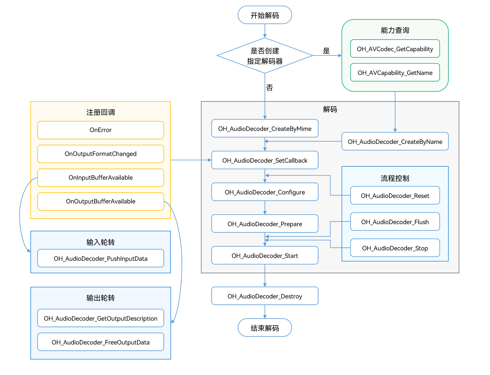

# 音频解码

开发者可以调用本模块的Native API接口，完成音频解码，即将媒体数据解码为PCM码流。

当前支持的解码能力如下:

| 容器规格 | 音频解码类型                 |
| -------- | :--------------------------- |
| mp4      | AAC、MPEG(MP3)、Flac、Vorbis |
| m4a      | AAC                          |
| flac     | Flac                         |
| ogg      | Vorbis                       |
| aac      | AAC                          |
| mp3      | MPEG(MP3)                    |

**适用场景**

- 音频播放

  在播放音频之前，需要先解码音频，再将数据输送到硬件扬声器播放。
- 音频渲染

  在对音频文件进行音效处理之前，需要先解码再由音频处理模块进行音频渲染。
- 音频编辑

  音频编辑（如调整单个声道的播放倍速等）需要基于PCM码流进行，所以需要先将音频文件解码。

## 开发步骤

详细的API说明请参考[API文档](../reference/native-apis/_audio_decoder.md)。
参考以下示例代码，完成音频解码的全流程，包括：创建解码器，设置解码参数（采样率/码率/声道数等），开始，刷新，重置，销毁资源。

在应用开发过程中，开发者应按一定顺序调用方法，执行对应操作，否则系统可能会抛出异常或生成其他未定义的行为。具体顺序可参考下列开发步骤及对应说明。
完整代码请参考[示例程序](https://gitee.com/openharmony/multimedia_av_codec/blob/master/test/nativedemo/audio_demo/avcodec_audio_decoder_demo.cpp)。

如下为音频解码调用关系图：


1. 创建解码器实例对象

    ```cpp
    //通过 codecname 创建解码器
    OH_AVCapability *capability = OH_AVCodec_GetCapability(OH_AVCODEC_MIMETYPE_AUDIO_MPEG, false);
    const char *name = OH_AVCapability_GetName(capability);
    OH_AVCodec *audioDec = OH_AudioDecoder_CreateByName(name);
    ```

    ```cpp
    //通过 Mimetype 创建解码器
    OH_AVCodec *audioDec = OH_AudioDecoder_CreateByMime(OH_AVCODEC_MIMETYPE_AUDIO_MPEG);
    ```

    ```cpp
    // 初始化队列
    class ADecSignal {
    public:
        std::mutex inMutex_;
        std::mutex outMutex_;
        std::mutex startMutex_;
        std::condition_variable inCond_;
        std::condition_variable outCond_;
        std::condition_variable startCond_;
        std::queue<uint32_t> inQueue_;
        std::queue<uint32_t> outQueue_;
        std::queue<OH_AVMemory *> inBufferQueue_;
        std::queue<OH_AVMemory *> outBufferQueue_;
        std::queue<OH_AVCodecBufferAttr> attrQueue_;
    };
    ADecSignal *signal_;
    ```

2. 调用OH_AudioDecoder_SetCallback()设置回调函数。
   注册回调函数指针集合OH_AVCodecAsyncCallback，包括：
   - OH_AVCodecOnError：解码器运行错误。
   - OH_AVCodecOnStreamChanged：码流信息变化，如声道变化等。
   - OH_AVCodecOnNeedInputData：运行过程中需要新的输入数据，即解码器已准备好，可以输入数据。
   - OH_AVCodecOnNewOutputData：运行过程中产生了新的输出数据，即解码完成。

   开发者可以通过处理该回调报告的信息，确保解码器正常运转。

    ```cpp
    // OH_AVCodecOnError回调函数的实现
    static void OnError(OH_AVCodec *codec, int32_t errorCode, void *userData)
    {
        (void)codec;
        (void)errorCode;
        (void)userData;
    }
    // OH_AVCodecOnStreamChanged回调函数的实现
    static void OnStreamChanged(OH_AVCodec *codec, OH_AVFormat *format, void*userData)
    {
        (void)codec;
        (void)format;
        (void)userData;
    }
    // OH_AVCodecOnNeedInputData回调函数的实现
    static void onNeedInputData(OH_AVCodec *codec, uint32_t index, OH_AVMemory*data, void *userData)
    {
        (void)codec;
        ADecSignal *signal = static_cast<ADecSignal *>(userData);
        unique_lock<mutex> lock(signal->inMutex_);
        signal->inQueue_.push(index);
        signal->inBufferQueue_.push(data);
        signal->inCond_.notify_all();
        // 解码输入码流送入InputBuffer队列
    }
    // OH_AVCodecOnNewOutputData回调函数的实现
    static void onNeedOutputData(OH_AVCodec *codec, uint32_t index, OH_AVMemory*data, OH_AVCodecBufferAttr *attr,
                                            void *userData)
    {
        (void)codec;
        ADecSignal *signal = static_cast<ADecSignal *>(userData);
        unique_lock<mutex> lock(signal->outMutex_);
        signal->outQueue_.push(index);
        signal->outBufferQueue_.push(data);
        if (attr) {
            signal->attrQueue_.push(*attr);
        }
        signal->outCond_.notify_all();
        // 将对应输出buffer的 index 送入OutputQueue_队列
        // 将对应解码完成的数据data送入OutputBuffer队列
    }
    signal_ = new ADecSignal();
    OH_AVCodecAsyncCallback cb = {&OnError, &OnStreamChanged, &onNeedInputData, &onNeedOutputData};
    // 配置异步回调
    int32_t ret = OH_AudioDecoder_SetCallback(audioDec, cb, signal_);
    if (ret != AV_ERR_OK) {
        // 异常处理
    }
    ```
3. 调用OH_AudioDecoder_Configure()配置解码器。
   配置必选项：采样率、码率、声道数；可选项：最大输入长度。

   - AAC解码 需要额外标识是否为adts类型否则会被认为是latm类型

   - vorbis解码 需要额外标识ID Header和Setup Header数据
    ```cpp
    enum AudioFormatType : int32_t {
        TYPE_AAC = 0,
        TYPE_FLAC = 1,
        TYPE_MP3 = 2,
        TYPE_VORBIS = 3,
    };  
    // 设置解码分辨率
    int32_t ret;
    // 配置音频采样率（必须）
    constexpr uint32_t DEFAULT_SMAPLERATE = 44100; 
    // 配置音频码率（必须）
    constexpr uint32_t DEFAULT_BITRATE = 32000;
    // 配置音频声道数（必须）
    constexpr uint32_t DEFAULT_CHANNEL_COUNT = 2;
    // 配置最大输入长度（可选）
    constexpr uint32_t DEFAULT_MAX_INPUT_SIZE = 1152;
    OH_AVFormat *format = OH_AVFormat_Create();
    // 写入format
    OH_AVFormat_SetIntValue(format, MediaDescriptionKey::MD_KEY_SAMPLE_RATE.data(),DEFAULT_SMAPLERATE);
    OH_AVFormat_SetIntValue(format, MediaDescriptionKey::MD_KEY_BITRATE.data(),DEFAULT_BITRATE);
    OH_AVFormat_SetIntValue(format, MediaDescriptionKey::MD_KEY_CHANNEL_COUNT.data(),DEFAULT_CHANNEL_COUNT);
    OH_AVFormat_SetIntValue(format, MediaDescriptionKey::MD_KEY_MAX_INPUT_SIZE.data(),DEFAULT_MAX_INPUT_SIZE);
    if (audioType == TYPE_AAC) {
        OH_AVFormat_SetIntValue(format, MediaDescriptionKey::MD_KEY_AAC_IS_ADTS.data(), DEFAULT_AAC_TYPE);
    }
    if (audioType == TYPE_VORBIS) {
        OH_AVFormat_SetStringValue(format, MediaDescriptionKey::MD_KEY_IDENTIFICATION_HEADER.data(), DEFAULT_ID_HEADER);
        OH_AVFormat_SetStringValue(format, MediaDescriptionKey::MD_KEY_SETUP_HEADER.data(), DEFAULT_SETUP_HEADER);
    }
    // 配置解码器
    ret = OH_AudioDecoder_Configure(audioDec, format);
    if (ret != AV_ERR_OK) {
        // 异常处理
    }
    ```
4. 调用OH_AudioDecoder_Prepare()，解码器就绪。

    ```cpp
    ret = OH_AudioDecoder_Prepare(audioDec);
    if (ret != AV_ERR_OK) {
        // 异常处理
    }
    ```
5. 调用OH_AudioDecoder_Start()启动解码器，进入运行态。

    ```c++
    inputFile_ = std::make_unique<std::ifstream>();
    // 打开待解码二进制文件路径
    inputFile_->open(inputFilePath.data(), std::ios::in | std::ios::binary); 
    //配置解码文件输出路径
    outFile_ = std::make_unique<std::ofstream>();
    outFile_->open(outputFilePath.data(), std::ios::out | std::ios::binary);
    // 开始解码
    ret = OH_AudioDecoder_Start(audioDec);
    if (ret != AV_ERR_OK) {
    // 异常处理
    }
    ```
6. 调用OH_AudioDecoder_PushInputData()，写入待解码的数据。
   如果是结束，需要对flag标识成AVCODEC_BUFFER_FLAGS_EOS
    ```c++
    // 配置buffer info信息
    OH_AVCodecBufferAttr info;
    // 设置输入pkt尺寸、偏移量、时间戳等信息
    info.size = pkt_->size;
    info.offset = 0;
    info.pts = pkt_->pts;
    info.flags = AVCODEC_BUFFER_FLAGS_CODEC_DATA;
    auto buffer = signal_->inBufferQueue_.front();
    if (inputFile_->eof()){
        info.size = 0;
        info.flags = AVCODEC_BUFFER_FLAGS_EOS;
    }else{
        inputFile_->read((char *)OH_AVMemory_GetAddr(buffer), INPUT_FRAME_BYTES);
    }
    uint32_t index = signal_->inQueue_.front();
    // 送入解码输入队列进行解码, index为对应队列下标
    int32_t ret = OH_AudioDecoder_PushInputData(audioDec, index, info);
    if (ret != AV_ERR_OK) {
        // 异常处理
    }
    ```
7. 调用OH_AudioDecoder_FreeOutputData()，输出解码后的PCM码流

    ```c++
    OH_AVCodecBufferAttr attr = signal_->attrQueue_.front();
    OH_AVMemory *data = signal_->outBufferQueue_.front();
    uint32_t index = signal_->outQueue_.front();
    // 将解码完成数据data写入到对应输出文件中
    outFile_->write(reinterpret_cast<char *>(OH_AVMemory_GetAddr(data)), attr.size);
    // buffer 模式, 释放已完成写入的数据
    ret = OH_AudioDecoder_FreeOutputData(audioDec, index);
    if (ret != AV_ERR_OK) {
        // 异常处理
    }
    ```
8. （可选）调用OH_AudioDecoder_Flush()刷新解码器。
    调用OH_AudioDecoder_Flush()后，解码器仍处于运行态，但会将当前队列清空，将已解码的数据释放。
    此时需要调用OH_AudioDecoder_Start()重新开始解码。
    使用情况：
    * 在文件EOS之后，需要调用刷新
    * 在执行过程中遇到可继续执行的错误时（即OH_AudioDecoder_IsValid 为true）调用
    ```c++
    // 刷新解码器 audioDec
    ret = OH_AudioDecoder_Flush(audioDec);
    if (ret != AV_ERR_OK) {
        // 异常处理
    }
    // 重新开始解码
    ret = OH_AudioDecoder_Start(audioDec);
    if (ret != AV_ERR_OK) {
        // 异常处理
    }
    ```
9. （可选）调用OH_AudioDecoder_Reset()重置解码器。
调用OH_AudioDecoder_Reset()后，解码器回到初始化的状态，需要调用OH_AudioDecoder_Configure()重新配置，然后调用OH_AudioDecoder_Start()重新开始解码。
    ```c++
    // 重置解码器 audioDec
    ret = OH_AudioDecoder_Reset(audioDec);
    if (ret != AV_ERR_OK) {
        // 异常处理
    }
    // 重新配置解码器参数
    ret = OH_AudioDecoder_Configure(audioDec, format);
    if (ret != AV_ERR_OK) {
    // 异常处理
    }
    ```
10. 调用OH_AudioDecoder_Stop()停止解码器。

    ```c++
    // 终止解码器 audioDec
    ret = OH_AudioDecoder_Stop(audioDec);
    if (ret != AV_ERR_OK) {
        // 异常处理
    }
    return ret;
    ```
11. 调用OH_AudioDecoder_Destroy()销毁解码器实例，释放资源。
    **注意**：不要重复销毁解码器

    ```c++
    // 调用OH_AudioDecoder_Destroy, 注销解码器
    ret = OH_AudioDecoder_Destroy(audioDec);
    if (ret != AV_ERR_OK) {
        // 异常处理
    } else {
        audioDec = NULL; //不可重复destroy
    }
    return ret;
    ```
