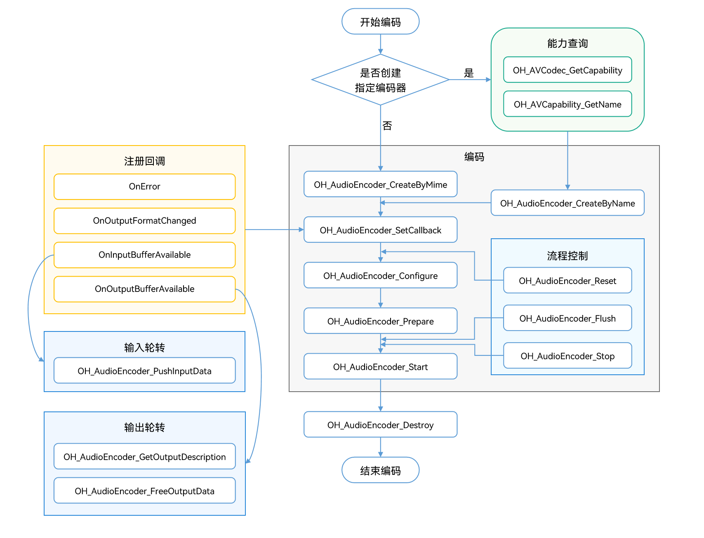

# 音频编码

开发者可以调用本模块的Native API接口，完成音频编码，即将音频PCM编码压缩成不同的格式。

接口不限制PCM数据的来源，开发者可以调用麦克风录制获取、也可以导入编辑后的PCM数据，通过音频编码，输出对应格式的码流，最后封装为目标格式文件。

当前支持的编码能力如下：

| 容器规格 | 音频编码类型 |
| -------- | :----------- |
| mp4      | AAC、Flac    |
| m4a      | AAC          |
| flac     | Flac         |
| aac      | AAC          |

**适用场景**

- 音频录制

  通过录制传入PCM，然后编码出对应格式的码流，最后封装成想要的格式
- 音频编辑

  编辑PCM后导出音频文件的场景，需要编码成对应音频格式后再封装成文件

## 开发指导

详细的API说明请参考[API文档](../reference/native-apis/_audio_encoder.md)。

参考以下示例代码，完成音频编码的全流程，包括：创建编码器，设置编码参数（采样率/码率/声道数等），开始，刷新，重置，销毁资源。

在应用开发过程中，开发者应按一定顺序调用方法，执行对应操作，否则系统可能会抛出异常或生成其他未定义的行为。具体顺序可参考下列开发步骤及对应说明。

如下为音频编码调用关系图：


### 在 CMake 脚本中链接动态库

```cmake
target_link_libraries(sample PUBLIC libnative_media_codecbase.so)
target_link_libraries(sample PUBLIC libnative_media_core.so)
target_link_libraries(sample PUBLIC libnative_media_aenc.so)
```

### 开发步骤

1. 添加头文件。

   ```cpp
   #include <multimedia/player_framework/native_avcodec_audioencoder.h>
   #include <multimedia/player_framework/avcodec_audio_channel_layout.h>
   #include <multimedia/player_framework/native_avcapability.h>
   #include <multimedia/player_framework/native_avcodec_base.h>
   #include <multimedia/player_framework/native_avformat.h>
   ```
2. 创建编码器实例对象

   应用可以通过名称或媒体类型创建编码器。

   ```cpp
   //c++标准库命名空间
   using namespace std;
   //通过 codecname 创建编码器
   OH_AVCapability *capability = OH_AVCodec_GetCapability(OH_AVCODEC_MIMETYPE_AUDIO_AAC, true);
   const char *name = OH_AVCapability_GetName(capability);
   OH_AVCodec *audioEnc = OH_AudioEncoder_CreateByName(name);
   ```

   ```cpp
   //通过媒体类型创建编码器
   OH_AVCodec *audioEnc = OH_AudioEncoder_CreateByMime(OH_AVCODEC_MIMETYPE_AUDIO_AAC); 
   ```

   ```cpp
   // 初始化队列
   class AEncSignal {
   public:
       mutex inMutex_;
       mutex outMutex_;
       mutex startMutex_;
       condition_variable inCond_;
       condition_variable outCond_;
       condition_variable startCond_;
       queue<uint32_t> inQueue_;
       queue<uint32_t> outQueue_;
       queue<OH_AVMemory *> inBufferQueue_;
       queue<OH_AVMemory *> outBufferQueue_;
       queue<OH_AVCodecBufferAttr> attrQueue_;
   };
   AEncSignal *signal_ = new AEncSignal();
   ```
3. 调用OH_AudioEncoder_SetCallback()设置回调函数。

   注册回调函数指针集合OH_AVCodecAsyncCallback，包括：

   - OH_AVCodecOnError：编码器运行错误。
   - OH_AVCodecOnStreamChanged：码流信息变化，如声道变化等。
   - OH_AVCodecOnNeedInputData：运行过程中需要新的输入数据，即编码器已准备好，可以输入PCM数据。
   - OH_AVCodecOnNewOutputData：运行过程中产生了新的输出数据，即编码完成。

   开发者可以通过处理该回调报告的信息，确保编码器正常运转。

   ```cpp
   // OH_AVCodecOnError回调函数的实现
   static void OnError(OH_AVCodec *codec, int32_t errorCode, void *userData)
   {
       (void)codec;
       (void)errorCode;
       (void)userData;
   }
   // OH_AVCodecOnStreamChanged回调函数的实现
   static void OnStreamChanged(OH_AVCodec *codec, OH_AVFormat *format, void *userData)
   {
       (void)codec;
       (void)format;
       (void)userData;
   }
   // OH_AVCodecOnNeedInputData回调函数的实现
   static void OnNeedInputData(OH_AVCodec *codec, uint32_t index, OH_AVMemory *data, void *userData)
   {
       (void)codec;
       // 编码输入码流送入InputBuffer队列
       AEncSignal *signal = static_cast<AEncSignal *>(userData);
       unique_lock<mutex> lock(signal->inMutex_);
       signal->inQueue_.push(index);
       signal->inBufferQueue_.push(data);
       signal->inCond_.notify_all();
   }
   // OH_AVCodecOnNewOutputData回调函数的实现
   static void OnNeedOutputData(OH_AVCodec *codec, uint32_t index, OH_AVMemory *data, OH_AVCodecBufferAttr *attr,
                                           void *userData)
   {
       (void)codec;
       // 将对应输出buffer的index送入OutputQueue_队列
       // 将对应编码完成的数据data送入outBuffer队列
       AEncSignal *signal = static_cast<AEncSignal *>(userData);
       unique_lock<mutex> lock(signal->outMutex_);
       signal->outQueue_.push(index);
       signal->outBufferQueue_.push(data);
       if (attr) {
           signal->attrQueue_.push(*attr);
       }
   }
   signal_ = new AEncSignal();
   OH_AVCodecAsyncCallback cb = {&OnError, &OnStreamChanged, &OnNeedInputData, &OnNeedOutputData};
   // 配置异步回调
   int32_t ret = OH_AudioEncoder_SetCallback(audioEnc, cb, signal_);
   if (ret != AV_ERR_OK) {
       // 异常处理
   }
   ```
4. 调用OH_AudioEncoder_Configure设置编码器
   设置必选项：采样率，码率，以及声道数，声道类型、位深；可选项：最大输入长度
   flac编码： 需要额外标识兼容性级别(Compliance Level)和采样精度

   例AAC调用流程：

   ```cpp
   int32_t ret;
   // 配置音频采样率（必须）
   constexpr uint32_t DEFAULT_SAMPLERATE = 44100; 
   // 配置音频码率（必须）
   constexpr uint64_t DEFAULT_BITRATE = 32000;
   // 配置音频声道数（必须）
   constexpr uint32_t DEFAULT_CHANNEL_COUNT = 2;
   // 配置音频声道类型（必须）
   constexpr AudioChannelLayout CHANNEL_LAYOUT = AudioChannelLayout::STEREO;
   // 配置音频位深（必须）aac只有SAMPLE_F32P
   constexpr OH_BitsPerSample SAMPLE_FORMAT = OH_BitsPerSample::SAMPLE_F32LE;
   // 配置音频compliance level (默认值0，取值范围-2~2)
   constexpr int32_t COMPLIANCE_LEVEL = 0;
   // 配置音频精度（必须） SAMPLE_S16LE和SAMPLE_S24LE和SAMPLE_S32LE
   constexpr OH_BitsPerSample BITS_PER_CODED_SAMPLE = OH_BitsPerSample::SAMPLE_S24LE;
   // 配置最大输入长度（可选）
   constexpr uint32_t DEFAULT_MAX_INPUT_SIZE = 1024*DEFAULT_CHANNEL_COUNT *sizeof(float);//aac
   OH_AVFormat *format = OH_AVFormat_Create();
   // 写入format
   OH_AVFormat_SetIntValue(format,OH_MD_KEY_AUD_CHANNEL_COUNT,DEFAULT_CHANNEL_COUNT);
   OH_AVFormat_SetIntValue(format,OH_MD_KEY_AUD_SAMPLE_RATE,DEFAULT_SAMPLERATE);
   OH_AVFormat_SetLongValue(format,OH_MD_KEY_BITRATE, DEFAULT_BITRATE);
   OH_AVFormat_SetIntValue(format, OH_MD_KEY_AUDIO_SAMPLE_FORMAT, SAMPLE_FORMAT);
   OH_AVFormat_SetLongValue(format,OH_MD_KEY_CHANNEL_LAYOUT,CHANNEL_LAYOUT);
   OH_AVFormat_SetIntValue(format,OH_MD_KEY_MAX_INPUT_SIZE,DEFAULT_MAX_INPUT_SIZE);
   // 配置编码器
   ret = OH_AudioEncoder_Configure(audioEnc, format);
   if (ret != AV_ERR_OK) {
       // 异常处理
   }
   ```

   例FLAC调用流程：

   ```cpp
   int32_t ret;
   // 配置音频采样率（必须）
   constexpr uint32_t DEFAULT_SMAPLERATE = 44100; 
   // 配置音频码率（必须）
   constexpr uint64_t DEFAULT_BITRATE = 32000;
   // 配置音频声道数（必须）
   constexpr uint32_t DEFAULT_CHANNEL_COUNT = 2;
   // 配置音频声道类型（必须）
   constexpr AudioChannelLayout CHANNEL_LAYOUT = AudioChannelLayout::STEREO;
   // 配置音频位深（必须） flac 只有SAMPLE_S16LE和SAMPLE_S32LE
   constexpr OH_BitsPerSample SAMPLE_FORMAT = OH_BitsPerSample::SAMPLE_S32LE;
   // 配置音频compliance level (默认值0，取值范围-2~2)
   constexpr int32_t COMPLIANCE_LEVEL = 0;
   // 配置音频精度（必须） SAMPLE_S16LE和SAMPLE_S24LE和SAMPLE_S32LE
   constexpr OH_BitsPerSample BITS_PER_CODED_SAMPLE = OH_BitsPerSample::SAMPLE_S24LE;
   OH_AVFormat *format = OH_AVFormat_Create();
   // 写入format
   OH_AVFormat_SetIntValue(format,OH_MD_KEY_AUD_CHANNEL_COUNT,DEFAULT_CHANNEL_COUNT);
   OH_AVFormat_SetIntValue(format,OH_MD_KEY_AUD_SAMPLE_RATE,DEFAULT_SMAPLERATE);
   OH_AVFormat_SetLongValue(format,OH_MD_KEY_BITRATE, DEFAULT_BITRATE);
   OH_AVFormat_SetIntValue(format, OH_MD_KEY_BITS_PER_CODED_SAMPLE, BITS_PER_CODED_SAMPLE); 
   OH_AVFormat_SetIntValue(format, OH_MD_KEY_AUDIO_SAMPLE_FORMAT, SAMPLE_FORMAT); 
   OH_AVFormat_SetLongValue(format,OH_MD_KEY_CHANNEL_LAYOUT,CHANNEL_LAYOUT);
   OH_AVFormat_SetLongValue(format, OH_MD_KEY_COMPLIANCE_LEVEL, COMPLIANCE_LEVEL); 
   // 配置编码器
   ret = OH_AudioEncoder_Configure(audioEnc, format);
   if (ret != AV_ERR_OK) {
       // 异常处理
   }
   ```
5. 调用OH_AudioEncoder_Prepare()，编码器就绪。

   ```c++
   OH_AudioEncoder_Prepare(audioEnc);
   ```
6. 调用OH_AudioEncoder_Start()启动编码器，进入运行态。

   ```c++
   unique_ptr<ifstream> inputFile_ = make_unique<ifstream>();
   unique_ptr<ofstream> outFile_ = make_unique<ofstream>();
   // 打开待编码二进制文件路径
   inputFile_->open(inputFilePath.data(), ios::in |ios::binary); 
   //配置编码文件输出路径
   outFile_->open(outputFilePath.data(), ios::out |ios::binary);
   // 开始编码
   ret = OH_AudioEncoder_Start(audioEnc);
   if (ret != AV_ERR_OK) {
       // 异常处理
   }
   ```
7. 调用OH_AudioEncoder_PushInputData()，写入待编码器的数据。
   如果是结束，需要对flag标识成AVCODEC_BUFFER_FLAGS_EOS

   aac： 样点数(FRAME_SIZE)固定为1024

   flac： 样点数(FRAME_SIZE)比较特殊需要，根据如下表格进行设置

   | 采样率 | 样点数 |
   | :----: | :----: |
   |  8000  |  576  |
   | 16000 |  1152  |
   | 22050 |  2304  |
   | 24000 |  2304  |
   | 32000 |  2304  |
   | 44100 |  4608  |
   | 48000 |  4608  |
   | 88200 |  8192  |
   | 96000 |  8192  |

   **注意**：aac的样点数固定为1024，其他值会直接返回错误码，flac的样点数建议根据采样率按照表格传入，大于这个值也会返回错误码，如果小于有可能出现编码文件损坏问题。


   ```c++
   constexpr int32_t FRAME_SIZE = 1024; //aac
   constexpr int32_t DEFAULT_CHANNEL_COUNT = 2;
   constexpr int32_t INPUT_FRAME_BYTES = DEFAULT_CHANNEL_COUNT * FRAME_SIZE * sizeof(float); //aac
   // 配置buffer info信息
   OH_AVCodecBufferAttr info;
   // 设置输入尺寸、偏移量、时间戳等信息
   info.size = INPUT_FRAME_BYTES;
   info.offset = 0;
   info.flags = AVCODEC_BUFFER_FLAGS_CODEC_DATA;
   auto buffer = signal_->inBufferQueue_.front();
   if (inputFile_->eof()){
       info.size = 0;
       info.flags = AVCODEC_BUFFER_FLAGS_EOS;
   }else{
       inputFile_->read((char *)OH_AVMemory_GetAddr(buffer), INPUT_FRAME_BYTES);
   }
   uint32_t index = signal_->inQueue_.front();
   // 送入编码输入队列进行编码, index为对应队列下标
   int32_t ret = OH_AudioEncoder_PushInputData(audioEnc, index,info);
   if (ret != AV_ERR_OK) {
       // 异常处理
   }
   ```
8. 调用OH_AudioEncoder_FreeOutputData()，输出编码格式码流

   ```c++
   OH_AVCodecBufferAttr attr = signal_->attrQueue_.front();
   OH_AVMemory *data = signal_->outBufferQueue_.front();
   uint32_t index = signal_->outQueue_.front();
   // 将编码完成数据data写入到对应输出文件中
   outFile_->write(reinterpret_cast<char *>(OH_AVMemory_GetAddr(data)), attr.size);
   // 释放已完成写入的数据
   ret = OH_AudioEncoder_FreeOutputData(audioEnc, index);
   if (ret != AV_ERR_OK) {
       // 异常处理
   }
   if (attr.flags == AVCODEC_BUFFER_FLAGS_EOS) {
       // 结束
   }
   ```
9. （可选）调用OH_AudioEncoder_Flush()刷新编码器。
   调用OH_AudioEncoder_Flush()后，编码器处于Flush状态，会将当前编码队列清空。
   此时需要调用OH_AudioEncoder_Start()重新开始编码。
   使用情况：

   * 在文件EOS之后，需要调用刷新
   * 在执行过程中遇到可继续执行的错误时（即OH_AudioEncoder_IsValid 为true）可以调用，然后重新调用OH_AudioEncoder_Start

   ```c++
   // 刷新编码器 audioEnc
   ret = OH_AudioEncoder_Flush(audioEnc);
   if (ret != AV_ERR_OK) {
       // 异常处理
   }
   // 重新开始编码
   ret = OH_AudioEncoder_Start(audioEnc);
   if (ret != AV_ERR_OK) {
       // 异常处理
   }
   ```
10. （可选）调用OH_AudioEncoder_Reset()重置编码器。
    调用OH_AudioEncoder_Reset()后，编码器回到初始化的状态，需要调用OH_AudioEncoder_Configure()重新配置，然后调用OH_AudioEncoder_Start()重新开始编码。

    ```c++
    // 重置编码器 audioEnc
    ret = OH_AudioEncoder_Reset(audioEnc);
    if (ret != AV_ERR_OK) {
        // 异常处理
    }
    // 重新配置编码器参数
    ret = OH_AudioEncoder_Configure(audioEnc, format);
    if (ret != AV_ERR_OK) {
        // 异常处理
    }
    ```
11. 调用OH_AudioEncoder_Stop()停止编码器。

    ```c++
    // 终止编码器 audioEnc
    ret = OH_AudioEncoder_Stop(audioEnc);
    if (ret != AV_ERR_OK) {
        // 异常处理
    }
    ```
12. 调用OH_AudioEncoder_Destroy()销毁编码器实例，释放资源。
    **注意**：资源不能重复销毁

    ```c++
    // 调用OH_AudioEncoder_Destroy, 注销编码器
    ret = OH_AudioEncoder_Destroy(audioEnc);
    if (ret != AV_ERR_OK) {
        // 异常处理
    } else {
        audioEnc = NULL; //不可重复destroy
    }
    ```

## 相关实例

针对音频编码，有以下相关实例可供参考：

- [音频编码](https://gitee.com/openharmony/multimedia_av_codec/blob/master/test/nativedemo/audio_demo/avcodec_audio_aac_encoder_demo.cpp)
