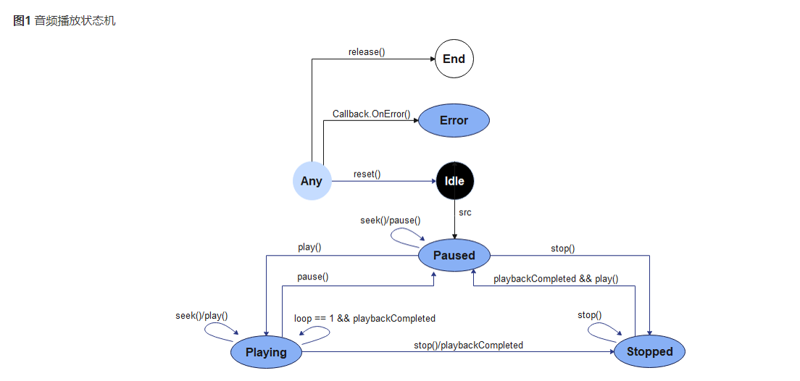
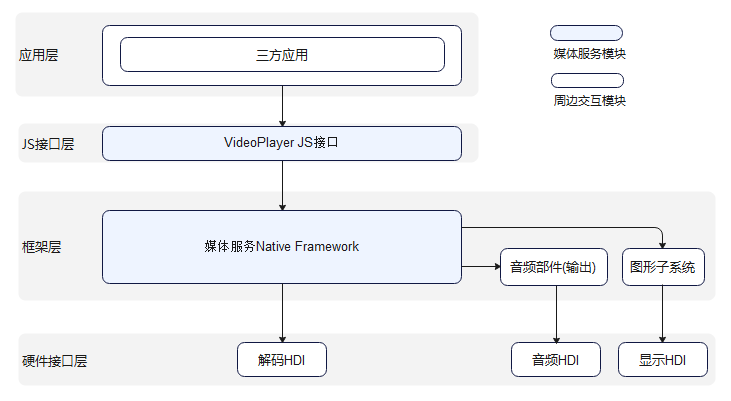

# 音频播放开发指导

## 简介

音频播放的主要工作是将音频数据转码为可听见的音频模拟信号，并通过输出设备进行播放，同时对播放任务进行管理，包括开始播放、暂停播放、停止播放、释放资源、设置音量、跳转播放位置、获取轨道信息等功能控制。

## 运作机制

该模块提供了音频播放状态变化示意图和音频播放外部模块交互图。

**图1** 音频播放状态变化示意图



**注意**：当前为Idle状态，设置src不会改变状态；且src设置成功后，不能再次设置其它src，需调用reset()接口后，才能重新设置src。


**图2** 音频播放外部模块交互图



**说明**：三方应用通过调用JS接口层提供的js接口实现相应功能时，框架层会通过Native Framework的媒体服务，调用音频部件，将软件解码后的音频数据输出至硬件接口层的音频HDI，实现音频播放功能。

## 开发指导

详细API含义可参考：[媒体服务API文档AudioPlayer](../reference/apis/js-apis-media.md#audioplayer)

### 全流程场景

音频播放的全流程场景包含：创建实例，设置uri，播放音频，跳转播放位置，设置音量，暂停播放，获取轨道信息，停止播放，重置，释放资源等流程。

AudioPlayer支持的src媒体源输入类型可参考：[src属性说明](../reference/apis/js-apis-media.md#audioplayer_属性)

```js
import media from '@ohos.multimedia.media'
import fileIO from '@ohos.fileio'

// 打印码流轨道信息
function printfDescription(obj) {
    for (let item in obj) {
        let property = obj[item];
        console.info('audio key is ' + item);
        console.info('audio value is ' + property);
    }
}

// 设置播放器回调函数
function setCallBack(audioPlayer) {
    audioPlayer.on('dataLoad', () => { // 设置'dataLoad'事件回调，src属性设置成功后，触发此回调
        console.info('audio set source success');
        audioPlayer.play(); // 需等待'dataLoad'事件回调完成后，才可调用play进行播放，触发'play'事件回调
    });
    audioPlayer.on('play', () => { // 设置'play'事件回调
        console.info('audio play success');
        audioPlayer.pause(); // 触发'pause'事件回调，暂停播放
    });
    audioPlayer.on('pause', () => { // 设置'pause'事件回调
        console.info('audio pause success');
        audioPlayer.seek(5000); // 触发'timeUpdate'事件回调，seek到5000ms处播放
    });
    audioPlayer.on('stop', () => { // 设置'stop'事件回调
        console.info('audio stop success');
        audioPlayer.reset(); // 触发'reset'事件回调后，重新设置src属性，可完成切歌
    });
    audioPlayer.on('reset', () => { // 设置'reset'事件回调
        console.info('audio reset success');
        audioPlayer.release(); // audioPlayer资源被销毁
        audioPlayer = undefined;
    });
    audioPlayer.on('timeUpdate', (seekDoneTime) => { // 设置'timeUpdate'事件回调
        if (typeof(seekDoneTime) == 'undefined') {
            console.info('audio seek fail');
            return;
        }
        console.info('audio seek success, and seek time is ' + seekDoneTime);
        audioPlayer.setVolume(0.5); // 触发'volumeChange'事件回调
    });
    audioPlayer.on('volumeChange', () => { // 设置'volumeChange'事件回调
        console.info('audio volumeChange success');
        audioPlayer.getTrackDescription((error, arrlist) => { // 通过回调方式获取音频轨道信息
            if (typeof (arrlist) != 'undefined') {
                for (let i = 0; i < arrlist.length; i++) {
                    printfDescription(arrlist[i]);
                }
            } else {
                console.log(`audio getTrackDescription fail, error:${error.message}`);
            }
            audioPlayer.stop(); // 触发'stop'事件回调，停止播放
        });
    });
    audioPlayer.on('finish', () => { // 设置'finish'事件回调，播放完成触发
        console.info('audio play finish');
    });
    audioPlayer.on('error', (error) => { // 设置'error'事件回调
        console.info(`audio error called, errName is ${error.name}`);
        console.info(`audio error called, errCode is ${error.code}`);
        console.info(`audio error called, errMessage is ${error.message}`);
    });
}

async function audioPlayerDemo() {
    // 1. 创建实例
    let audioPlayer = media.createAudioPlayer();
    setCallBack(audioPlayer); // 设置事件回调
    // 2. 用户选择音频，设置uri
    let fdPath = 'fd://'
    // path路径的码流可通过"hdc file send D:\xxx\01.mp3 /data/app/el1/bundle/public/ohos.acts.multimedia.audio.audioplayer/ohos.acts.multimedia.audio.audioplayer/assets/entry/resources/rawfile" 命令，将其推送到设备上
    let path = '/data/app/el1/bundle/public/ohos.acts.multimedia.audio.audioplayer/ohos.acts.multimedia.audio.audioplayer/assets/entry/resources/rawfile/01.mp3';
    await fileIO.open(path).then((fdNumber) => {
        fdPath = fdPath + '' + fdNumber;
        console.info('open fd success fd is' + fdPath);
    }, (err) => {
        console.info('open fd failed err is' + err);
    }).catch((err) => {
        console.info('open fd failed err is' + err);
    });
    audioPlayer.src = fdPath; // 设置src属性，并触发'dataLoad'事件回调
}
```

### 正常播放场景

```js
import media from '@ohos.multimedia.media'
import fileIO from '@ohos.fileio'
export class AudioDemo {
  // 设置播放器回调函数
  setCallBack(audioPlayer) {
    audioPlayer.on('dataLoad', () => { // 设置'dataLoad'事件回调，src属性设置成功后，触发此回调
      console.info('audio set source success');
      audioPlayer.play(); // 调用play方法开始播放，触发'play'事件回调
    });
    audioPlayer.on('play', () => { // 设置'play'事件回调
      console.info('audio play success');
    });
    audioPlayer.on('finish', () => { // 设置'finish'事件回调，播放完成触发
      console.info('audio play finish');
      audioPlayer.release(); // audioPlayer资源被销毁
      audioPlayer = undefined;
    });
  }

  async audioPlayerDemo() {
    let audioPlayer = media.createAudioPlayer(); // 创建一个音频播放实例
    this.setCallBack(audioPlayer); // 设置事件回调
    let fdPath = 'fd://'
    // path路径的码流可通过"hdc file send D:\xxx\01.mp3 /data/app/el1/bundle/public/ohos.acts.multimedia.audio.audioplayer/ohos.acts.multimedia.audio.audioplayer/assets/entry/resources/rawfile" 命令，将其推送到设备上
    let path = '/data/app/el1/bundle/public/ohos.acts.multimedia.audio.audioplayer/ohos.acts.multimedia.audio.audioplayer/assets/entry/resources/rawfile/01.mp3';
    await fileIO.open(path).then((fdNumber) => {
      fdPath = fdPath + '' + fdNumber;
      console.info('open fd success fd is' + fdPath);
    }, (err) => {
      console.info('open fd failed err is' + err);
    }).catch((err) => {
      console.info('open fd failed err is' + err);
    });
    audioPlayer.src = fdPath; // 设置src属性，并触发'dataLoad'事件回调
  }
}
```

### 切歌场景

```js
import media from '@ohos.multimedia.media'
import fileIO from '@ohos.fileio'
export class AudioDemo {
// 设置播放器回调函数
  private isNextMusic = false;
  setCallBack(audioPlayer) {
    audioPlayer.on('dataLoad', () => { // 设置'dataLoad'事件回调，src属性设置成功后，触发此回调
      console.info('audio set source success');
      audioPlayer.play(); // 调用play方法开始播放，触发'play'事件回调
    });
    audioPlayer.on('play', () => { // 设置'play'事件回调
      console.info('audio play success');
      audioPlayer.reset(); // 调用reset方法，触发'reset'事件回调
    });
    audioPlayer.on('reset', () => { // 设置'reset'事件回调
      console.info('audio play success');
      if (!this.isNextMusic) { // 当isNextMusic 为false时，实现切歌功能
        this.nextMusic(audioPlayer); // 实现切歌功能
      } else {
        audioPlayer.release(); // audioPlayer资源被销毁
        audioPlayer = undefined;
      }
    });
  }

  async nextMusic(audioPlayer) {
    this.isNextMusic = true;
    let nextFdPath = 'fd://'
    // path路径的码流可通过"hdc file send D:\xxx\02.mp3 /data/app/el1/bundle/public/ohos.acts.multimedia.audio.audioplayer/ohos.acts.multimedia.audio.audioplayer/assets/entry/resources/rawfile" 命令，将其推送到设备上
    let nextpath = '/data/app/el1/bundle/public/ohos.acts.multimedia.audio.audioplayer/ohos.acts.multimedia.audio.audioplayer/assets/entry/resources/rawfile/02.mp3';
    await fileIO.open(nextpath).then((fdNumber) => {
      nextFdPath = nextFdPath + '' + fdNumber;
      console.info('open fd success fd is' + nextFdPath);
    }, (err) => {
      console.info('open fd failed err is' + err);
    }).catch((err) => {
      console.info('open fd failed err is' + err);
    });
    audioPlayer.src = nextFdPath; // 设置src属性，并重新触发触发'dataLoad'事件回调
  }

  async audioPlayerDemo() {
    let audioPlayer = media.createAudioPlayer();       // 创建一个音频播放实例
    this.setCallBack(audioPlayer);                     // 设置事件回调
    let fdPath = 'fd://'
    // path路径的码流可通过"hdc file send D:\xxx\01.mp3 /data/app/el1/bundle/public/ohos.acts.multimedia.audio.audioplayer/ohos.acts.multimedia.audio.audioplayer/assets/entry/resources/rawfile" 命令，将其推送到设备上
    let path = '/data/app/el1/bundle/public/ohos.acts.multimedia.audio.audioplayer/ohos.acts.multimedia.audio.audioplayer/assets/entry/resources/rawfile/01.mp3';
    await fileIO.open(path).then((fdNumber) => {
      fdPath = fdPath + '' + fdNumber;
      console.info('open fd success fd is' + fdPath);
    }, (err) => {
      console.info('open fd failed err is' + err);
    }).catch((err) => {
      console.info('open fd failed err is' + err);
    });
    audioPlayer.src = fdPath; // 设置src属性，并触发'dataLoad'事件回调
  }
}
```

### 单曲循环场景

```js
import media from '@ohos.multimedia.media'
import fileIO from '@ohos.fileio'
export class AudioDemo {
  // 设置播放器回调函数
  setCallBack(audioPlayer) {
    audioPlayer.on('dataLoad', () => { // 设置'dataLoad'事件回调，src属性设置成功后，触发此回调
      console.info('audio set source success');
      audioPlayer.loop = true; // 设置循环播放属性
      audioPlayer.play(); // 调用play方法开始播放，触发'play'事件回调
    });
    audioPlayer.on('play', () => { // 设置'play'事件回调,开始循环播放
      console.info('audio play success');
    });
  }

  async audioPlayerDemo() {
    let audioPlayer = media.createAudioPlayer(); // 创建一个音频播放实例
    this.setCallBack(audioPlayer); // 设置事件回调
    let fdPath = 'fd://'
    // path路径的码流可通过"hdc file send D:\xxx\01.mp3 /data/app/el1/bundle/public/ohos.acts.multimedia.audio.audioplayer/ohos.acts.multimedia.audio.audioplayer/assets/entry/resources/rawfile" 命令，将其推送到设备上
    let path = '/data/app/el1/bundle/public/ohos.acts.multimedia.audio.audioplayer/ohos.acts.multimedia.audio.audioplayer/assets/entry/resources/rawfile/01.mp3';
    await fileIO.open(path).then((fdNumber) => {
      fdPath = fdPath + '' + fdNumber;
      console.info('open fd success fd is' + fdPath);
    }, (err) => {
      console.info('open fd failed err is' + err);
    }).catch((err) => {
      console.info('open fd failed err is' + err);
    });
    audioPlayer.src = fdPath; // 设置src属性，并触发'dataLoad'事件回调
  }
}
```

## 相关实例

针对音频播放开发，有以下相关实例可供参考：

- [`JsDistributedMusicPlayer:`分布式音乐播放（JS）（API8）（Full SDK）](https://gitee.com/openharmony/applications_app_samples/tree/master/ability/JsDistributedMusicPlayer)
- [`JsAudioPlayer`：音频播放和管理（JS）（API8）](https://gitee.com/openharmony/applications_app_samples/tree/master/media/JsAudioPlayer)
- [`eTsAudioPlayer`: 音频播放器（ArkTS）（API8）](https://gitee.com/openharmony/applications_app_samples/blob/master/media/Recorder/entry/src/main/ets/MainAbility/pages/Play.ets)
- [音频播放器（ArkTS）（API9）](https://gitee.com/openharmony/codelabs/tree/master/Media/Audio_OH_ETS)