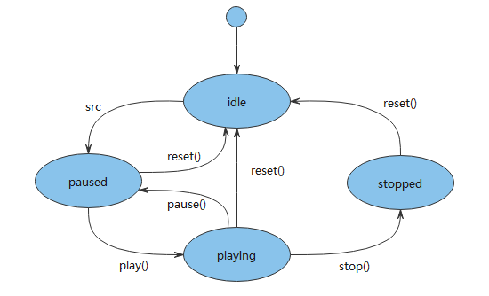

# 音频播放开发指导

- [场景介绍](#场景介绍)
- [接口说明](#接口说明)

## 场景介绍

音频播放的主要工作是将音频数据转码为可听见的音频模拟信号并通过输出设备进行播放，同时对播放任务进行管理。

**图1** 音频播放状态机



## 接口说明

**表1** media

| 接口名 | 描述 | 
| -------- | -------- |
| media.createAudioPlayer() | 创建AudioPlayer实例。 | 
| AudioPlayer | 提供音频播放相关功能，具体见表&nbsp;音频播放相关的interface&nbsp;AudioPlayer。 | 

**表2** 音频播放相关的interface  **AudioPlayer**

| 接口名 | 描述 | 
| -------- | -------- |
| release() | 释放音频资源。 | 
| play() | 开始播放音频源。 | 
| pause() | 暂停播放。 | 
| stop() | 停止播放。 | 
| reset()<sup>7+</sup> | 重置播放音频源。 | 
| setVolume(vol:&nbsp;number) | 改变音频播放音量 | 
| seek(timeMs:&nbsp;number) | 改变播放位置。 | 
| src:string | 音频播放的媒体URI。 | 
| state:AudioState | 播放的状态属性。 | 
| currentTime:number | 音频的当前播放位置。 | 
| duration:number | 音频播放的时长(当数据源不支持改变播放位置时返回-1, 比如实时流媒体场景)。 | 
| loop:boolean | 音频的循环播放属性。 | 
| on('play',&nbsp;function&nbsp;callback) | 订阅音频播放开始事件。 | 
| on('pause',&nbsp;function&nbsp;callback) | 订阅音频播放暂停事件。 | 
| on('stop',&nbsp;function&nbsp;callback) | 订阅音频播放停止事件。 | 
| on('reset',&nbsp;function&nbsp;callback) | 订阅音频播放重置事件。 | 
| on('finish',function&nbsp;callback) | 订阅音频播放结束事件。 | 
| on('error',&nbsp;function&nbsp;callback) | 订阅音频播放错误事件。 | 
| on('dataload',&nbsp;function&nbsp;callback) | 订阅音频播放加载数据事件。 | 
| on('volumeChange',&nbsp;function&nbsp;callback) | 订阅音频播放音量变化事件。 | 
| on('timeUpdate',&nbsp;function&nbsp;callback) | 订阅音频播放进度改变事件。 | 


1. 创建音频播放器。
   ```
   import media from '@ohos.multimedia.media';
   var player = media.createAudioPlayer();
   ```

2. 设置消息订阅事件。
   ```
   player.on('play', (err, action) => {
       if (err) {
           console.error('Error returned in the play() callback.');
           return;
        }
        console.info('Current player duration: '+ player.duration);
        console.info('Current player time: ' + player.currentTime);
        console.info('Current player status: '+player.state);
        console.info('Pause MP3');
        player.pause();
   });
   player.on('pause', (err, action) => {
        if (err) {
            console.error('Error returned in the pause() callback.');
            return;
         }
         console.info('Current player status: ' + player.state);
         console.info('Current player time: ' + player.currentTime);
         player.seek(30000); // Seek for 30 seconds.
   });
   player.on('stop', (err, action) => {
       if (err) {
           console.error('Error returned in the stop() callback.');
           return;
       }
       console.info('stop callback invoked. State:' + player.state);
       player.reset();
   });
   player.on('dataLoad', (err, action) => {
       if (err) {
           console.error('Error returned in the dataLoad() callback.');
           return;
       }
        console.info('dataLoad callback invoked. Current time: ' + player.currentTime);
        console.info('Duration of the source:' + player.duration);
        player.play();
   });
   player.on('reset', (err, action) => {
       if (err) {
           console.error('Error returned in the reset() callback.');
           return;
       }
       console.info('reset callback invoked.');
       player.release();
   });
   player.on('finish', (err, action) => {
        if (err) {
           console.error('Error returned in the finish() callback.');
           return;
        }
        console.info('finish callback invoked.');
   });
   player.on('timeUpdate', (seekTime, action) => {
       console.info('Seek time: ' + seekTime);
       console.info('Current player time: ' + player.currentTime);
       var newTime = player.currentTime;
       if(newTime == 30000) {
           console.info('Seek succeeded. New time: ' + newTime);
       } else {
           console.error('Seek failed: ', + newTime);
        }
           player.stop();
   });
   player.on('error', (err) => {
        console.error('Player error: ${err.message}');
   });
   ```

3. 启动播放。
   ```
   var audioSourceMp3 = 'file://test.mp3';
   player.src = audioSourceMp3;
   player.loop = true;
   ```
