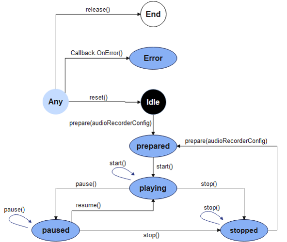
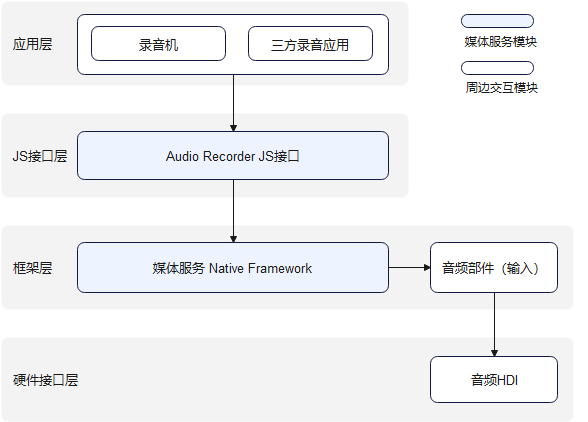

# 音频录制开发指导

## 场景介绍

音频录制的主要工作是捕获音频信号，完成音频编码并保存到文件中，帮助开发者轻松实现音频录制功能。它允许调用者指定音频录制的采样率、声道数、编码格式、封装格式、文件路径等参数。

**图1** 音频录制状态机




**图2** 音频录制零层图



## 开发步骤

详细API含义可参考：[媒体服务API文档AudioRecorder](../reference/apis/js-apis-media.md)

### 全流程场景

包含流程：创建实例，设置录制参数，录制音频，暂停录制，恢复录制，停止录制，释放资源等流程。

```js
import media from '@ohos.multimedia.media'
import mediaLibrary from '@ohos.multimedia.mediaLibrary'
export class AudioRecorderDemo {
  private testFdNumber; // 用于保存fd地址

  // 设置音频录制相关回调函数
  setCallBack(audioRecorder) {
    audioRecorder.on('prepare', () => {              					       	// 设置'prepare'事件回调
      console.log('prepare success');
      audioRecorder.start();                                         			// 调用start方法开始录制，并触发start回调
    });
    audioRecorder.on('start', () => {    		     						   	// 设置'start'事件回调
      console.log('audio recorder start success');
      audioRecorder.pause();                                         			// 调用pause方法暂停录制，并触发pause回调
    });
    audioRecorder.on('pause', () => {    		     							// 设置'pause'事件回调
      console.log('audio recorder pause success');
      audioRecorder.resume();                                        			// 调用resume方法恢复录制，并触发resume回调
    });
    audioRecorder.on('resume', () => {    		     							// 设置'resume'事件回调
      console.log('audio recorder resume success');
      audioRecorder.stop();                                          			// 调用stop方法停止录制，并触发stop回调
    });
    audioRecorder.on('stop', () => {    		     							// 设置'stop'事件回调
      console.log('audio recorder stop success');
      audioRecorder.reset();                                         			// 调用reset方法重置录制，并触发reset回调
    });
    audioRecorder.on('reset', () => {    		     							// 设置'reset'事件回调
      console.log('audio recorder reset success');
      audioRecorder.release();                                       			// 调用release方法，释放资源，并触发release回调
    });
    audioRecorder.on('release', () => {    		     							// 设置'release'事件回调
      console.log('audio recorder release success');
      audioRecorder = undefined;
    });
    audioRecorder.on('error', (error) => {             							// 设置'error'事件回调
      console.info(`audio error called, errName is ${error.name}`);
      console.info(`audio error called, errCode is ${error.code}`);
      console.info(`audio error called, errMessage is ${error.message}`);
    });
  }

  // pathName是传入的录制文件名，例如：01.mp3，生成后的文件地址：/storage/media/100/local/files/Video/01.mp3
  // 使用mediaLibrary需要添加以下权限, ohos.permission.MEDIA_LOCATION、ohos.permission.WRITE_MEDIA、ohos.permission.READ_MEDIA
  async getFd(pathName) {
    let displayName = pathName;
    const mediaTest = mediaLibrary.getMediaLibrary();
    let fileKeyObj = mediaLibrary.FileKey;
    let mediaType = mediaLibrary.MediaType.VIDEO;
    let publicPath = await mediaTest.getPublicDirectory(mediaLibrary.DirectoryType.DIR_VIDEO);
    let dataUri = await mediaTest.createAsset(mediaType, displayName, publicPath);
    if (dataUri != undefined) {
      let args = dataUri.id.toString();
      let fetchOp = {
        selections : fileKeyObj.ID + "=?",
        selectionArgs : [args],
      }
      let fetchFileResult = await mediaTest.getFileAssets(fetchOp);
      let fileAsset = await fetchFileResult.getAllObject();
      let fdNumber = await fileAsset[0].open('Rw');
      this.testFdNumber = "fd://" + fdNumber.toString();
    }
  }

  async audioRecorderDemo() {
    // 1.创建实例
    let audioRecorder = media.createAudioRecorder();
    // 2.设置回调
    this.setCallBack(audioRecorder);
    await this.getFd('01.mp3'); 							// 调用getFd方法获取需要录制文件的fd地址
    // 3.设置录制参数
    let audioRecorderConfig = {
      audioEncodeBitRate : 22050,
      audioSampleRate : 22050,
      numberOfChannels : 2,
      uri : this.testFdNumber,                             	// testFdNumber由getFd生成
      location : { latitude : 30, longitude : 130},
      audioEncoderMime : media.CodecMimeType.AUDIO_AAC,
      fileFormat : media.ContainerFormatType.CFT_MPEG_4A,
    }
    audioRecorder.prepare(audioRecorderConfig); 			// 调用prepare方法，触发prepare回调函数
  }
}
```

### 正常录制场景

与全流程场景不同，不包括暂停录制，恢复录制的过程。

```js
import media from '@ohos.multimedia.media'
import mediaLibrary from '@ohos.multimedia.mediaLibrary'
export class AudioRecorderDemo {
  private testFdNumber; // 用于保存fd地址

  // 设置音频录制相关回调函数
  setCallBack(audioRecorder) {
    audioRecorder.on('prepare', () => {              					       // 设置'prepare'事件回调
      console.log('prepare success');
      audioRecorder.start();                                         			// 调用start方法开始录制，并触发start回调
    });
    audioRecorder.on('start', () => {    		     							// 设置'start'事件回调
      console.log('audio recorder start success');
      audioRecorder.stop();                                          			// 调用stop方法停止录制，并触发stop回调
    });
    audioRecorder.on('stop', () => {    		     							// 设置'stop'事件回调
      console.log('audio recorder stop success');
      audioRecorder.release();                                       			// 调用release方法，释放资源，并触发release回调
    });
    audioRecorder.on('release', () => {    		     							// 设置'release'事件回调
      console.log('audio recorder release success');
      audioRecorder = undefined;
    });
    audioRecorder.on('error', (error) => {             							// 设置'error'事件回调
      console.info(`audio error called, errName is ${error.name}`);
      console.info(`audio error called, errCode is ${error.code}`);
      console.info(`audio error called, errMessage is ${error.message}`);
    });
  }

  // pathName是传入的录制文件名，例如：01.mp3，生成后的文件地址：/storage/media/100/local/files/Video/01.mp3
  // 使用mediaLibrary需要添加以下权限, ohos.permission.MEDIA_LOCATION、ohos.permission.WRITE_MEDIA、ohos.permission.READ_MEDIA
  async getFd(pathName) {
    let displayName = pathName;
    const mediaTest = mediaLibrary.getMediaLibrary();
    let fileKeyObj = mediaLibrary.FileKey;
    let mediaType = mediaLibrary.MediaType.VIDEO;
    let publicPath = await mediaTest.getPublicDirectory(mediaLibrary.DirectoryType.DIR_VIDEO);
    let dataUri = await mediaTest.createAsset(mediaType, displayName, publicPath);
    if (dataUri != undefined) {
      let args = dataUri.id.toString();
      let fetchOp = {
        selections : fileKeyObj.ID + "=?",
        selectionArgs : [args],
      }
      let fetchFileResult = await mediaTest.getFileAssets(fetchOp);
      let fileAsset = await fetchFileResult.getAllObject();
      let fdNumber = await fileAsset[0].open('Rw');
      this.testFdNumber = "fd://" + fdNumber.toString();
    }
  }

  async audioRecorderDemo() {
    // 1.创建实例
    let audioRecorder = media.createAudioRecorder();
    // 2.设置回调
    this.setCallBack(audioRecorder);
    await this.getFd('01.mp3'); 							// 调用getFd方法获取需要录制文件的fd地址
    // 3.设置录制参数
    let audioRecorderConfig = {
      audioEncodeBitRate : 22050,
      audioSampleRate : 22050,
      numberOfChannels : 2,
      uri : this.testFdNumber,                             	// testFdNumber由getFd生成
      location : { latitude : 30, longitude : 130},
      audioEncoderMime : media.CodecMimeType.AUDIO_AAC,
      fileFormat : media.ContainerFormatType.CFT_MPEG_4A,
    }
    audioRecorder.prepare(audioRecorderConfig); 			// 调用prepare方法，触发prepare回调函数
  }
}
```

## 相关实例

针对音频录制开发，有以下相关实例可供参考：

- [`Recorder`：录音机（eTS）（API8）](https://gitee.com/openharmony/app_samples/tree/master/media/Recorder)
- [`JsRecorder`：录音机（JS）（API8)](https://gitee.com/openharmony/app_samples/tree/master/media/JSRecorder)
- [`eTsAudioPlayer`: 音频播放器（eTS）](https://gitee.com/openharmony/app_samples/blob/master/media/Recorder/entry/src/main/ets/MainAbility/pages/Play.ets)
- [音频播放器](https://gitee.com/openharmony/codelabs/tree/master/Media/Audio_OH_ETS)
