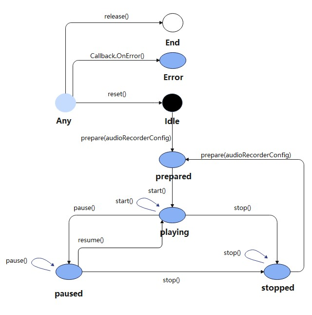
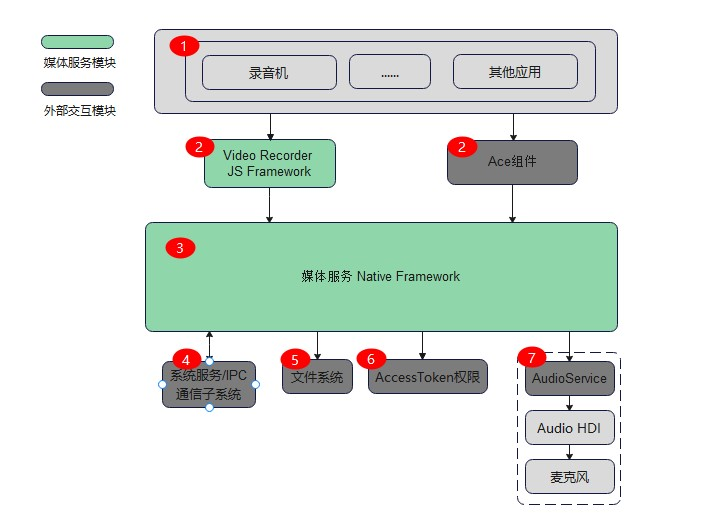

# 音频录制开发指导

## 场景介绍

音频录制的主要工作是捕获音频信号，完成音频编码并保存到文件中，帮助开发者轻松实现音频录制功能。它允许调用者指定音频录制的采样率、声道数、编码格式、封装格式、文件路径等参数。

**图1** 音频录制状态机



## 音频录制零层图

**图2** 音频录制零层图



音频录制零层图简单说明：

1、JS应用，包括系统录音机等音频录制类应用。

2、表示应用可以通过调用音频录制JS层的接口与音频录制JS Framework进行交互，或者通过ACE组件调用到音频录制Native接口，与音频录制的Native Framework进行交互。

3、媒体服务模块。

4、系统服务/IPC通信子系统。

5、音频录制访问文件涉及权限子系统。

6、音频录制中涉及的系统权限校验系统。

7、音频录制涉及的音频服务模块。

## 音频录制开发步骤

详细API含义可参考：[js-apis-media.md](../reference/apis/js-apis-media.md)

### 全流程场景

包含流程：创建实例，设置录制参数，录制音频，暂停录制，恢复录制，停止录制，释放资源等流程。

```js
function SetCallBack(audioRecorder) {
    audioRecorder.on('prepare', () => {              								// 设置'prepare'事件回调
        console.log('prepare success');    
        // 录制界面可切换至已准备好，可点击录制按钮进行录制
    });
    audioRecorder.on('start', () => {    		     								// 设置'start'事件回调
    	console.log('audio recorder start success');
        // 将录制按钮切换至可暂停状态
    });
    audioRecorder.on('pause', () => {    		     								// 设置'pause'事件回调
        console.log('audio recorder pause success');
        // 将录制按钮切换至可录制状态
    });
    audioRecorder.on('resume', () => {    		     								// 设置'resume'事件回调
        console.log('audio recorder resume success');
        // 将录制按钮切换至可暂停状态
    });
    audioRecorder.on('stop', () => {    		     								// 设置'stop'事件回调
        console.log('audio recorder stop success');
    });
    audioRecorder.on('release', () => {    		     								// 设置'release'事件回调
        console.log('audio recorder release success');
    });
    audioRecorder.on('reset', () => {    		     								// 设置'reset'事件回调
        console.log('audio recorder reset success');
        // 需要重新设置录制参数才能再次录制
    });
    audioRecorder.on('error', (error) => {             								// 设置'error'事件回调
        console.info(`audio error called, errName is ${error.name}`);
        console.info(`audio error called, errCode is ${error.code}`);
        console.info(`audio error called, errMessage is ${error.message}`);
    });
}

// 1.创建实例
let audioRecorder = media.createAudioRecorder();    
// 2.设置回调
SetCallBack(audioRecorder);    
// 3.设置录制参数
let audioRecorderConfig = {
    audioEncoder : media.AudioEncoder.AAC_LC ,
    audioEncodeBitRate : 22050,
    audioSampleRate : 22050,
    numberOfChannels : 2,
    format : media.AudioOutputFormat.AAC_ADTS,
    uri : 'file:///data/accounts/account_0/appdata/appdata/recorder/test.m4a',       // 文件需先由调用者创建，并给予适当的权限
    location : { latitude : 30, longitude : 130},
}																					
audioRecorder.prepare(audioRecorderConfig);
// 4.开始录制
audioRecorder.start();                            	// 需等待'prepare'事件回调完成后，才可调用start进行录制，触发'start'事件回调
// 5.暂停录制
audioRecorder.pause();                             	// 需等待'start'事件回调完成后，才可调用pause进行暂停，触发'pause'事件回调
// 6.恢复录制
audioRecorder.resume();                             // 需等待'pause'事件回调完成后，才可调用resume进行录制，触发'resume'事件回调
// 7.停止录制
audioRecorder.stop();                             	// 需等待'start'或'resume'事件回调完成后，才可调用stop进行暂停，触发'stop'事件回调
// 8.重置录制
audioRecorder.reset();                              // 触发'reset'事件回调后，重新进行prepare，才可重新录制
// 9.释放资源
audioRecorder.release();                           	// audioRecorder资源被销毁
audioRecorder = undefined;
```

### 正常录制场景

与全流程场景不同，不包括暂停录制，恢复录制的过程。

```js
function SetCallBack(audioPlayer) {
    audioRecorder.on('prepare', () => {              								// 设置'prepare'事件回调
        console.log('prepare success');    
        // 录制界面可切换至已准备好，可点击录制按钮进行录制
    });
    audioRecorder.on('start', () => {    		     								// 设置'start'事件回调
    	console.log('audio recorder start success');
        // 将录制按钮切换至可暂停状态
    });  
    audioRecorder.on('stop', () => {    		     								// 设置'stop'事件回调
        console.log('audio recorder stop success');
    });    
    audioRecorder.on('release', () => {    		     								// 设置'release'事件回调
        console.log('audio recorder release success');
    });    
}
// 1.创建实例
let audioRecorder = media.createAudioRecorder();   
// 2.设置回调
SetCallBack(audioRecorder);       
// 3.设置录制参数
let audioRecorderConfig = {
    audioEncoder : media.AudioEncoder.AAC_LC ,
    audioEncodeBitRate : 22050,
    audioSampleRate : 22050,
    numberOfChannels : 2,
    format : media.AudioOutputFormat.AAC_ADTS,
    uri : 'file:///data/accounts/account_0/appdata/appdata/recorder/test.m4a',      // 文件需先由调用者创建，并给予适当的权限
    location : { latitude : 30, longitude : 130},
}
audioRecorder.prepare(audioRecorderConfig)
// 4.开始录制
audioRecorder.start();                            	// 需等待'prepare'事件回调完成后，才可调用start进行录制，触发'start'事件回调
// 5.停止录制
audioRecorder.stop();                             	// 需等待'start'或'resume'事件回调完成后，才可调用stop进行暂停，触发'stop'事件回调
// 6.释放资源
audioRecorder.release();                           	// audioRecorder资源被销毁
audioRecorder = undefined;
```

