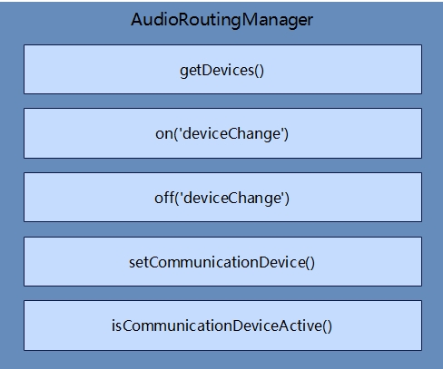

# 路由、设备管理开发指导

## 简介

AudioRoutingManager提供了音频路由、设备管理的方法。开发者可以通过本指导了解应用如何通过AudioRoutingManager获取当前工作的输入、输出音频设备，监听音频设备的连接状态变化，激活通信设备等。

## 运作机制

该模块提供了路由、设备管理模块常用接口

**图1** 音量管理常用接口



**说明：**AudioRoutingManager主要接口有：获取设备列表信息、监听与取消监听设备连接状态、激活通信设备、查询通信设备激活状态。更多介绍请参考[API参考文档](../reference/apis/js-apis-audio.md)。


## 开发指导

详细API含义可参考：[音频路由、设备管理API文档AudioRoutingManager](../reference/apis/js-apis-audio.md#audioroutingmanager9)

1. 创建AudioRoutingManager实例。

   在使用AudioRoutingManager的API前，需要使用getRoutingManager创建一个AudioRoutingManager实例。

   ```js
   import audio from '@ohos.multimedia.audio';
   async loadAudioRoutingManager() {
     var audioRoutingManager = await audio.getAudioManager().getRoutingManager();
     console.info('audioRoutingManager------create-------success.');
   }

   ```

2. （可选）获取设备列表信息、监听设备链接状态变化。
   
   如果开发者需要获取设备列表信息（输入、输出、分布式输入、分布式输出等），或者监听音频设备的链接状态变化时，可参考并调用以下接口。

   ```js
   import audio from '@ohos.multimedia.audio';
   //创建AudioRoutingManager实例
   async loadAudioRoutingManager() {
     var audioRoutingManager = await audio.getAudioManager().getRoutingManager();
     console.info('audioRoutingManager------create-------success.');
   }
   //获取全部音频设备信息（开发者可以根据自身需要填入适当的DeviceFlag）
   async getDevices() {
     await loadAudioRoutingManager();
     await audioRoutingManager.getDevices(audio.DeviceFlag.ALL_DEVICES_FLAG).then((data) => {
       console.info(`getDevices success and data is: ${JSON.stringify(data)}.`);
     });
    }
   //监听音频设备状态变化 
   async onDeviceChange() {  
     await loadAudioRoutingManager();
     await audioRoutingManager.on('deviceChange', audio.DeviceFlag.ALL_DEVICES_FLAG, (deviceChanged) => {
       console.info('on device change type : ' + deviceChanged.type);
       console.info('on device descriptor size : ' + deviceChanged.deviceDescriptors.length);
       console.info('on device change descriptor : ' + deviceChanged.deviceDescriptors[0].deviceRole);
       console.info('on device change descriptor : ' + deviceChanged.deviceDescriptors[0].deviceType);
     });
   }
   //取消监听音频设备状态变化
   async offDeviceChange() {  
     await loadAudioRoutingManager();
     await audioRoutingManager.off('deviceChange', (deviceChanged) => {
       console.info('off device change type : ' + deviceChanged.type);
       console.info('off device descriptor size : ' + deviceChanged.deviceDescriptors.length);
       console.info('off device change descriptor : ' + deviceChanged.deviceDescriptors[0].deviceRole);
       console.info('off device change descriptor : ' + deviceChanged.deviceDescriptors[0].deviceType);
     });
   }
   //综合调用：先查询所有设备，设置监听，然后开发者手动变更设备连接（例如有线耳机），再次查询所有设备，最后取消设备状态变化的监听。
   async test(){  
     await getDevices();
     await onDeviceChange()();
     //开发者手动断开/连接设备
     await getDevices();
     await offDeviceChange();
   }
   ```

3. （可选）设置通信设备激活并查询激活状态。

   ```js
   import audio from '@ohos.multimedia.audio';
   //创建AudioRoutingManager实例
   async loadAudioRoutingManager() {
     var audioRoutingManager = await audio.getAudioManager().getRoutingManager();
     console.info('audioRoutingManager------create-------success.');
   }
   //设置通信设备激活状态
   async setCommunicationDevice() {  
     await loadAudioRoutingManager();
     await audioRoutingManager.setCommunicationDevice(audio.CommunicationDeviceType.SPEAKER, true).then(() => {
       console.info('setCommunicationDevice true is success.');
     });
   }
  //查询通信设备激活状态
   async isCommunicationDeviceActive() {   
     await loadAudioRoutingManager();
     await audioRoutingManager.isCommunicationDeviceActive(audio.CommunicationDeviceType.SPEAKER).then((value) => {
       console.info(`CommunicationDevice state is： ${value}.`);
     });
   }
   //综合调用：先设置设备激活，然后查询设备状态。
   async test(){  
     await setCommunicationDevice();
     await isCommunicationDeviceActive();
   }
   ```   

