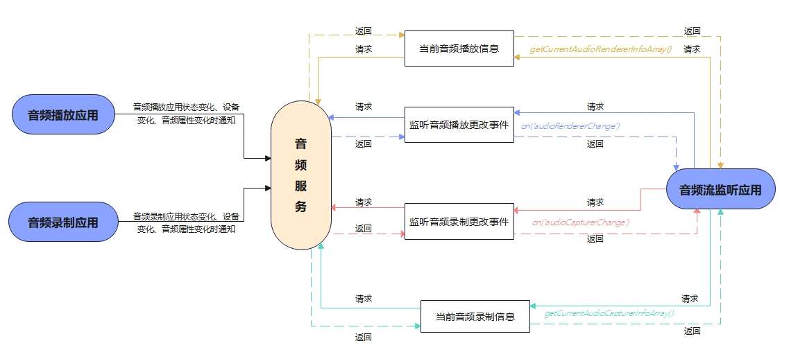

# 音频流管理开发指导

## 简介

AudioStreamManager提供了音频流管理的方法。开发者可以通过本指导了解应用如何通过AudioStreamManager管理音频流。

## 运作机制

该模块提供了音频流管理调用关系图

**图1** 音频流管理调用关系图



**说明**：在进行应用开发的过程中，开发者需要使用getStreamManager()创建一个AudioStreamManager实例，进而通过该实例管理音频流。开发者可通过调用on('audioRendererChange')、on('audioCapturerChange')监听音频播放应用和音频录制应用，在应用状态变化、设备变化、音频属性变化时获得通知。同时可通过off('audioRendererChange')、off('audioCapturerChange')取消相关事件的监听。与此同时，开发者可以通过调用（可选）使用getCurrentAudioRendererInfoArray()获取当前音频播放应用的音频流唯一ID、音频播放客户端的UID、音频状态等信息，同理可调用getCurrentAudioCapturerInfoArray()获取音频录制应用的信息。

## 开发指导

详细API含义可参考：[音频管理API文档AudioStreamManager](../reference/apis/js-apis-audio.md#audiostreammanager9)

1. 创建AudioStreamManager实例。

   在使用AudioStreamManager的API前，需要使用getStreamManager()创建一个AudioStreamManager实例。

   ```js
   var audioManager = audio.getAudioManager();
   var audioStreamManager = audioManager.getStreamManager();
   ```

2. （可选）使用on（'audioRendererChange'）监听音频渲染器更改事件。
如果音频流监听应用需要在音频播放应用状态变化、设备变化、音频属性变化时获取通知，可以订阅该事件。更多事件请参考[API参考文档](../reference/apis/js-apis-audio.md)。

   ```js
   audioStreamManager.on('audioRendererChange',  (AudioRendererChangeInfoArray) => {
     for (let i = 0; i < AudioRendererChangeInfoArray.length; i++) {
       AudioRendererChangeInfo = AudioRendererChangeInfoArray[i];
       console.info('## RendererChange on is called for ' + i + ' ##');
       console.info('StreamId for ' + i + ' is:' + AudioRendererChangeInfo.streamId);
       console.info('ClientUid for ' + i + ' is:' + AudioRendererChangeInfo.clientUid);
       console.info('Content for ' + i + ' is:' + AudioRendererChangeInfo.rendererInfo.content);
       console.info('Stream for ' + i + ' is:' + AudioRendererChangeInfo.rendererInfo.usage);
       console.info('Flag ' + i + ' is:' + AudioRendererChangeInfo.rendererInfo.rendererFlags);
       console.info('State for ' + i + ' is:' + AudioRendererChangeInfo.rendererState);  
       var devDescriptor = AudioRendererChangeInfo.deviceDescriptors;
       for (let j = 0; j < AudioRendererChangeInfo.deviceDescriptors.length; j++) {
         console.info('Id:' + i + ':' + AudioRendererChangeInfo.deviceDescriptors[j].id);
         console.info('Type:' + i + ':' + AudioRendererChangeInfo.deviceDescriptors[j].deviceType);
         console.info('Role:' + i + ':' + AudioRendererChangeInfo.deviceDescriptors[j].deviceRole);
         console.info('Name:' + i + ':' + AudioRendererChangeInfo.deviceDescriptors[j].name);
         console.info('Address:' + i + ':' + AudioRendererChangeInfo.deviceDescriptors[j].address);
         console.info('SampleRates:' + i + ':' + AudioRendererChangeInfo.deviceDescriptors[j].sampleRates[0]);
         console.info('ChannelCounts' + i + ':' + AudioRendererChangeInfo.deviceDescriptors[j].channelCounts[0]);
         console.info('ChannelMask:' + i + ':' + AudioRendererChangeInfo.deviceDescriptors[j].channelMasks);
       }
     }
   });
   ```

3. （可选）使用off（'audioRendererChange'）取消监听音频渲染器更改事件。

   ```js
   audioStreamManager.off('audioRendererChange');
   console.info('######### RendererChange Off is called #########');
   ```   

4. （可选）使用on（'audioCapturerChange'）监听音频捕获器更改事件。
如果音频流监听应用需要在音频录制应用状态变化、设备变化、音频属性变化时获取通知，可以订阅该事件。更多事件请参考[API参考文档](../reference/apis/js-apis-audio.md)。

   ```js
   audioStreamManager.on('audioCapturerChange', (AudioCapturerChangeInfoArray) =>  {
     for (let i = 0; i < AudioCapturerChangeInfoArray.length; i++) {
       console.info(' ## audioCapturerChange on is called for element ' + i + ' ##');
       console.info('StreamId for ' + i + 'is:' + AudioCapturerChangeInfoArray[i].streamId);
       console.info('ClientUid for ' + i + 'is:' + AudioCapturerChangeInfoArray[i].clientUid);
       console.info('Source for ' + i + 'is:' + AudioCapturerChangeInfoArray[i].capturerInfo.source);
       console.info('Flag ' + i + 'is:' + AudioCapturerChangeInfoArray[i].capturerInfo.capturerFlags);
       console.info('State for ' + i + 'is:' + AudioCapturerChangeInfoArray[i].capturerState);  
       for (let j = 0; j < AudioCapturerChangeInfoArray[i].deviceDescriptors.length; j++) {
         console.info('Id:' + i + ':' + AudioCapturerChangeInfoArray[i].deviceDescriptors[j].id);
         console.info('Type:' + i + ':' + AudioCapturerChangeInfoArray[i].deviceDescriptors[j].deviceType);
         console.info('Role:' + i + ':' + AudioCapturerChangeInfoArray[i].deviceDescriptors[j].deviceRole);
         console.info('Name:' + i + ':' + AudioCapturerChangeInfoArray[i].deviceDescriptors[j].name);
         console.info('Address:' + i + ':' + AudioCapturerChangeInfoArray[i].deviceDescriptors[j].address);
         console.info('SampleRates:' + i + ':' + AudioCapturerChangeInfoArray[i].deviceDescriptors[j].sampleRates[0]);
         console.info('ChannelCounts' + i + ':' + AudioCapturerChangeInfoArray[i].deviceDescriptors[j].channelCounts[0]);
         console.info('ChannelMask:' + i + ':' + AudioCapturerChangeInfoArray[i].deviceDescriptors[j].channelMasks);
       }
     }
   });
   ```  

5. （可选）使用off（'audioCapturerChange'）取消监听音频捕获器更改事件。

   ```js
   audioStreamManager.off('audioCapturerChange');
   console.info('######### CapturerChange Off is called #########');
   ```  

6. （可选）使用getCurrentAudioRendererInfoArray()获取当前音频渲染器的信息。
该接口可获取音频流唯一ID，音频播放客户端的UID，音频状态以及音频播放器的其他信息。需注意的是若对第三方音频流监听应用未配置ohos.permission.USE_BLUETOOTH权限，则查询到的设备名称和设备地址为空字符串，若正确配置权限，则显示的实际的设备名称和设备地址信息。
   
   ```js
   await audioStreamManager.getCurrentAudioRendererInfoArray().then( function (AudioRendererChangeInfoArray) {
     console.info('######### Get Promise is called ##########');
     if (AudioRendererChangeInfoArray != null) {
       for (let i = 0; i < AudioRendererChangeInfoArray.length; i++) {
         AudioRendererChangeInfo = AudioRendererChangeInfoArray[i];
         console.info('StreamId for ' + i +' is:' + AudioRendererChangeInfo.streamId);
         console.info('ClientUid for ' + i + ' is:' + AudioRendererChangeInfo.clientUid);
         console.info('Content ' + i + ' is:' + AudioRendererChangeInfo.rendererInfo.content);
         console.info('Stream' + i +' is:' + AudioRendererChangeInfo.rendererInfo.usage);
         console.info('Flag' + i + ' is:' + AudioRendererChangeInfo.rendererInfo.rendererFlags); 
         console.info('State for ' + i + ' is:' + AudioRendererChangeInfo.rendererState);  
         var devDescriptor = AudioRendererChangeInfo.deviceDescriptors;
         for (let j = 0; j < AudioRendererChangeInfo.deviceDescriptors.length; j++) {
           console.info('Id:' + i + ':' + AudioRendererChangeInfo.deviceDescriptors[j].id);
           console.info('Type:' + i + ':' + AudioRendererChangeInfo.deviceDescriptors[j].deviceType);
           console.info('Role:' + i + ':' + AudioRendererChangeInfo.deviceDescriptors[j].deviceRole);
           console.info('Name:' + i + ':' + AudioRendererChangeInfo.deviceDescriptors[j].name);
           console.info('Address:' + i + ':' + AudioRendererChangeInfo.deviceDescriptors[j].address);
           console.info('SampleRates:' + i + ':' + AudioRendererChangeInfo.deviceDescriptors[j].sampleRates[0]);
           console.info('ChannelCounts' + i + ':' + AudioRendererChangeInfo.deviceDescriptors[j].channelCounts[0]);
           console.info('ChannelMask:' + i + ':' + AudioRendererChangeInfo.deviceDescriptors[j].channelMasks);
         }
       }
     }
   }).catch((err) => {
     console.log('getCurrentAudioRendererInfoArray :ERROR: ' + err.message);
   });
   ``` 

7. （可选）使用getCurrentAudioCapturerInfoArray()获取当前音频捕获器的信息。
该接口可获取音频流唯一ID，音频录制客户端的UID，音频状态以及音频捕获器的其他信息。需注意的是若对第三方音频流监听应用未配置ohos.permission.USE_BLUETOOTH权限，则查询到的设备名称和设备地址为空字符串，若正确配置权限，则显示的实际的设备名称和设备地址信息。
   
   ```js
   await audioStreamManager.getCurrentAudioCapturerInfoArray().then( function (AudioCapturerChangeInfoArray) {
     console.info('getCurrentAudioCapturerInfoArray： **** Get Promise Called ****');
     if (AudioCapturerChangeInfoArray != null) {
       for (let i = 0; i < AudioCapturerChangeInfoArray.length; i++) {
         console.info('StreamId for ' + i + 'is:' + AudioCapturerChangeInfoArray[i].streamId);
         console.info('ClientUid for ' + i + 'is:' + AudioCapturerChangeInfoArray[i].clientUid);
         console.info('Source for ' + i + 'is:' + AudioCapturerChangeInfoArray[i].capturerInfo.source);
         console.info('Flag ' + i + 'is:' + AudioCapturerChangeInfoArray[i].capturerInfo.capturerFlags);
         console.info('State for ' + i + 'is:' + AudioCapturerChangeInfoArray[i].capturerState);  
         var devDescriptor = AudioCapturerChangeInfoArray[i].deviceDescriptors;
         for (let j = 0; j < AudioCapturerChangeInfoArray[i].deviceDescriptors.length; j++) {
           console.info('Id:' + i + ':' + AudioCapturerChangeInfoArray[i].deviceDescriptors[j].id);
           console.info('Type:' + i + ':' + AudioCapturerChangeInfoArray[i].deviceDescriptors[j].deviceType);
           console.info('Role:' + i + ':' + AudioCapturerChangeInfoArray[i].deviceDescriptors[j].deviceRole);
           console.info('Name:' + i + ':' + AudioCapturerChangeInfoArray[i].deviceDescriptors[j].name)
           console.info('Address:' + i + ':' + AudioCapturerChangeInfoArray[i].deviceDescriptors[j].address);
           console.info('SampleRates:' + i + ':' + AudioCapturerChangeInfoArray[i].deviceDescriptors[j].sampleRates[0]);
           console.info('ChannelCounts' + i + ':' + AudioCapturerChangeInfoArray[i].deviceDescriptors[j].channelCounts[0]);
           console.info('ChannelMask:' + i + ':' + AudioCapturerChangeInfoArray[i].deviceDescriptors[j].channelMasks);
         }
       }
     }
   }).catch((err) => {
     console.log('getCurrentAudioCapturerInfoArray :ERROR: ' + err.message);
   });
   ```      