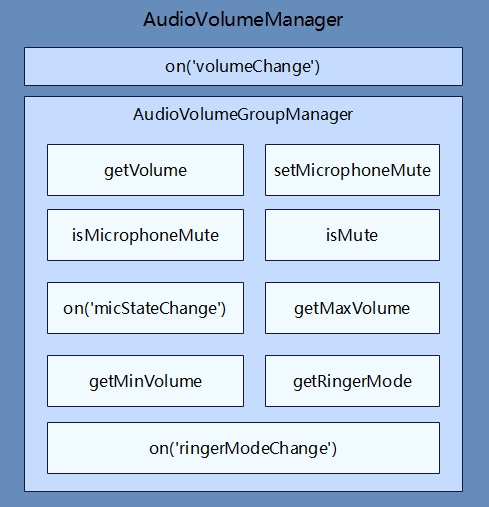

# 音量管理开发指导

## 简介

AudioVolumeManager提供了音量管理的方法。开发者可以通过本指导了解应用如何通过AudioVolumeManager获取指定流音量信息、监听铃声模式变化、设置麦克风静音等。

## 运作机制

该模块提供了音量管理模块常用接口

**图1** 音量管理常用接口



**说明：** AudioVolumeManager包含音量变化监听处理和音频音量组管理相关（AudioVolumeGroupManager），开发者调用AudioVolumeGroupManager的相关方法，需要先调用getVolumeGroupManager方法创建AudioVolumeGroupManager实例，从而调用对应的接口实现相应的功能，主要接口有：获取指定流的音量、设置麦克风静音、监听麦克风状态变化等。更多介绍请参考[API参考文档](../reference/apis/js-apis-audio.md)。

## 约束与限制

开发者在进行麦克风管理开发前，需要先对所开发的应用配置麦克风权限（ohos.permission.MICROPHONE），如果要设置麦克风状态，则需要配置音频管理配置权限（ohos.permission.MANAGE_AUDIO_CONFIG），需注意该权限为系统级别权限。配置方式请参见[访问控制授权申请](../security/accesstoken-guidelines.md#配置文件权限声明)。

## 开发指导

详细API含义可参考：[音量管理API文档AudioVolumeManager](../reference/apis/js-apis-audio.md#audiovolumemanager9)

1. 创建AudioVolumeGroupManager实例。

   在使用AudioVolumeGroupManager的API前，需要使用getVolumeGroupManager创建一个AudioStreamManager实例。

   ```js
   import audio from '@ohos.multimedia.audio';
   async loadVolumeGroupManager() {
     const groupid = audio.DEFAULT_VOLUME_GROUP_ID;
     var audioVolumeGroupManager = await audio.getAudioManager().getVolumeManager().getVolumeGroupManager(groupid);
     console.error('audioVolumeGroupManager create success.');
   }

   ```

2. （可选）获取音量信息、铃声模式。
   
   如果开发者需要获取指定音频流的音量信息（铃声、语音电话、媒体、语音助手等），或者获取当前设备是静音、震动、响铃模式，可参考并调用以下接口。更多事件请参考[API参考文档](../reference/apis/js-apis-audio.md)。

   ```js
   import audio from '@ohos.multimedia.audio';
   async loadVolumeGroupManager() {
     const groupid = audio.DEFAULT_VOLUME_GROUP_ID;
     var audioVolumeGroupManager = await audio.getAudioManager().getVolumeManager().getVolumeGroupManager(groupid);
     console.info('audioVolumeGroupManager create success.');
   }
   
   //获取指定流的当前音量（范围为0 ~ 15）
   async getVolume() {
    await loadVolumeGroupManager();
    await audioVolumeGroupManager.getVolume(audio.AudioVolumeType.MEDIA).then((value) => {
      console.info(`getVolume success and volume is: ${value}.`);
    });
   }
   //获取指定流的最小音量
   async getMinVolume() {
     await loadVolumeGroupManager();
     await audioVolumeGroupManager.getMinVolume(audio.AudioVolumeType.MEDIA).then((value) => {
       console.info(`getMinVolume success and volume is: ${value}.`);
     });
   }
   //获取指定流的最大音量
   async getMaxVolume() {
     await loadVolumeGroupManager();
     await audioVolumeGroupManager.getMaxVolume(audio.AudioVolumeType.MEDIA).then((value) => {
       console.info(`getMaxVolume success and volume is: ${value}.`);
     });
   }
   //获取当前铃声模式：  静音（0）| 震动（1） | 响铃（2）
   async getRingerMode() {
     await loadVolumeGroupManager();
     await audioVolumeGroupManager.getRingerMode().then((value) => {
       console.info(`getRingerMode success and RingerMode is: ${value}.`);
     });
   }
   ```

3. （可选）查询、设置、监听麦克风状态。

   如果开发者需要获取、设置麦克风状态，或者监听麦克风状态变化等信息，可参考并调用以下接口。

   ```js
   import audio from '@ohos.multimedia.audio';
   async loadVolumeGroupManager() {
     const groupid = audio.DEFAULT_VOLUME_GROUP_ID;
     var audioVolumeGroupManager = await audio.getAudioManager().getVolumeManager().getVolumeGroupManager(groupid);
     console.info('audioVolumeGroupManager create success.');
   }
   
   async on() {   //监听麦克风状态变化
     await loadVolumeGroupManager();
     await audioVolumeGroupManager.audioVolumeGroupManager.on('micStateChange', (micStateChange) => {
       console.info(`Current microphone status is: ${micStateChange.mute} `);
     });
   }
   
   async isMicrophoneMute() { //查询麦克风是否静音
     await audioVolumeGroupManager.audioVolumeGroupManager.isMicrophoneMute().then((value) => {
       console.info(`isMicrophoneMute is: ${value}.`);
     });
   }
    
   async setMicrophoneMuteTrue() { //设置麦克风静音
     await loadVolumeGroupManager();
     await audioVolumeGroupManager.audioVolumeGroupManager.setMicrophoneMute(true).then(() => {
       console.info('setMicrophoneMute to mute.');
     });
   }
    
   async setMicrophoneMuteFalse() { //取消麦克风静音
     await loadVolumeGroupManager();
     await audioVolumeGroupManager.audioVolumeGroupManager.setMicrophoneMute(false).then(() => {
       console.info('setMicrophoneMute to not mute.');
     });
   }
   async test(){  //综合调用：先设置监听，然后查询麦克风状态，设置麦克风静音后再查询状态，最后取消麦克风静音。
     await on();
     await isMicrophoneMute();
     await setMicrophoneMuteTrue();
     await isMicrophoneMute();
     await setMicrophoneMuteFalse();
   }
   ```

