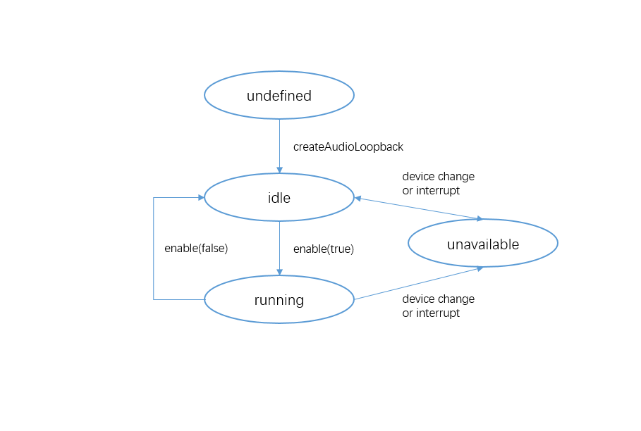

# 实现低时延耳返
<!--Kit: Audio Kit-->
<!--Subsystem: Multimedia-->
<!--Owner: @tom_guo-->
<!--Designer: @trytocalm-->
<!--Tester: @Filger-->
<!--Adviser: @w_Machine_cc-->

从API version 20开始，支持音频低时延耳返。

AudioLoopback是音频返听器，可将音频以更低时延的方式实时传输到耳机中，让用户可以实时听到自己或者其他的相关声音。

常用于K歌类应用，将录制的人声和背景音乐实时传送到耳机中，使用户通过反馈即时进行调整，获得更好的使用体验。

当启用音频返听时，系统会创建低时延渲染器与低时延采集器，实现低时延耳返功能。采集的音频直接通过内部路由返回到渲染器。对于渲染器，其音频焦点策略与[STREAM_USAGE_MUSIC](../../reference/apis-audio-kit/arkts-apis-audio-e.md#streamusage)相匹配。对于采集器，其音频焦点策略与[SOURCE_TYPE_MIC](../../reference/apis-audio-kit/arkts-apis-audio-e.md#sourcetype8)相匹配。

输入/输出设备由系统自动选择。如果当前输入/输出不支持低时延，则音频返听无法启用。在运行过程中，如果音频焦点被另一个音频流抢占，或输入/输出设备切换到不支持低时延的设备，系统会自动禁用音频返听。

## 使用前提

- 当前支持通过有线耳机及部分星闪耳机实现低时延返听功能。当连接有线耳机时，音频由耳机进行采集并播放；当连接星闪耳机时，音频由手机进行采集，耳机进行播放。

- 低功耗渲染器和低时延渲染器在API version 20不能实现并发。若要启用渲染器，建议采用[STREAM_USAGE_UNKNOWN](../../reference/apis-audio-kit/arkts-apis-audio-e.md#streamusage)；系统内决策采用[STREAM_USAGE_MUSIC](../../reference/apis-audio-kit/arkts-apis-audio-e.md#streamusage)创建普通渲染器。

## 使用场景

通过系统提供的AudioLoopback接口来实现耳返，系统将会在内部直接搭建低时延耳返数据链路，适用于对时延要求更高的场景。若应用需要实时处理耳返数据且对时延不敏感，可以参考[实现自定义耳返](audio-ear-monitor.md)。

## 开发指导

使用AudioLoopback音频返听涉及到[isAudioLoopbackSupported](../../reference/apis-audio-kit/arkts-apis-audio-AudioStreamManager.md#isaudioloopbacksupported20)返听能力查询、AudioLoopback实例创建、返听音量设置、返听状态监听与返听启用禁用等。本开发指导将以一次启用返听的过程为例，向开发者讲解如何使用AudioLoopback进行音频返听，建议搭配[AudioLoopback](../../reference/apis-audio-kit/arkts-apis-audio-AudioLoopback.md)的API说明阅读。

下图展示了AudioLoopback的状态变化。在创建实例后，调用对应的方法可以进入指定的状态实现对应行为。

需要注意的是在确定的状态执行不合适的方法可能导致AudioLoopback发生错误，建议开发者在调用状态转换的方法前进行状态检查，避免程序运行产生预期以外的结果。

**AudioLoopback状态变化示意图**



使用[on('statusChange')](../../reference/apis-audio-kit/arkts-apis-audio-AudioLoopback.md#onstatuschange20)方法可以监听AudioLoopback的状态变化，每个状态对应值与说明见[AudioLoopbackStatus](../../reference/apis-audio-kit/arkts-apis-audio-e.md#audioloopbackstatus20)。

### 开发步骤及注意事项

  以下各步骤示例为片段代码，可通过示例代码右下方链接获取[完整示例](https://gitcode.com/openharmony/applications_app_samples/tree/master/code/DocsSample/Media/Audio/AudioCaptureSampleJS)。

1. 查询返听能力并创建AudioLoopback实例。关于音频返听模式，请查看[AudioLoopbackMode](../../reference/apis-audio-kit/arkts-apis-audio-e.md#audioloopbackmode20)。

   > **说明：**
   > 
   > 返听需要申请麦克风权限ohos.permission.MICROPHONE，申请方式参考：[向用户申请授权](../../security/AccessToken/request-user-authorization.md)。

   <!-- @[create_AudioLoopback](https://gitcode.com/openharmony/applications_app_samples/blob/master/code/DocsSample/Media/Audio/AudioCaptureSampleJS/entry/src/main/ets/pages/AudioLoopback.ets) -->    
   
   ``` TypeScript
   import { audio } from '@kit.AudioKit'; // 导入audio模块。
   import { BusinessError } from '@kit.BasicServicesKit'; // 导入BusinessError。
   // ...
   let mode: audio.AudioLoopbackMode = audio.AudioLoopbackMode.HARDWARE;
   let audioLoopback: audio.AudioLoopback | undefined = undefined;
   // ...
     let isSupported = audio.getAudioManager().getStreamManager().isAudioLoopbackSupported(mode);
     if (isSupported) {
       audio.createAudioLoopback(mode).then((loopback) => {
         console.info('Succeeded in creating audio loopback.');
         // ...
         audioLoopback = loopback;
       }).catch((err: BusinessError) => {
         console.error(`Failed to create audio loopback. Code: ${err.code}, message: ${err.message}`);
         // ...
       });
     } else {
       console.error('Audio loopback is unsupported.');
       // ...
     }
   ```
   


2. 从API版本26.0.0开始，支持调用[getSupportedDevicePairs](../../reference/apis-audio-kit/arkts-apis-audio-AudioLoopback.md#getsupporteddevicepairs)方法，查询当前支持返听的音频输入输出设备组合。

   > **注意：**
   > 
   > - 如果当前没有可用的返听输入输出设备组合，将返回空数组。
   > - 建议优先判断返回数组是否为空，再处理输入输出设备组合信息。
   
   <!-- @[get_SupportedDevicePairs](https://gitcode.com/openharmony/applications_app_samples/blob/master/code/DocsSample/Media/Audio/AudioCaptureSampleJS/entry/src/main/ets/pages/AudioLoopback.ets) -->    
   
   ``` TypeScript
   import { BusinessError } from '@kit.BasicServicesKit'; // 导入BusinessError。
   // ...
       let devicePairs = audioLoopback.getSupportedDevicePairs();
       // ...
   ```
   


3. 从API版本26.0.0开始，支持调用[getPreferredDevicePair](../../reference/apis-audio-kit/arkts-apis-audio-AudioLoopback.md#getpreferreddevicepair)方法，查询当前系统推荐的返听输入输出设备组合。

   > **注意：**
   > 
   > 如果当前没有可用的返听输入输出设备组合，将返回null。
   
   <!-- @[get_PreferredDevicePair](https://gitcode.com/openharmony/applications_app_samples/blob/master/code/DocsSample/Media/Audio/AudioCaptureSampleJS/entry/src/main/ets/pages/AudioLoopback.ets) -->    
   
   ``` TypeScript
   import { BusinessError } from '@kit.BasicServicesKit'; // 导入BusinessError。
   // ...
       let devicePair = audioLoopback.getPreferredDevicePair();
       // ...
   ```
   


4. 调用[getStatus](../../reference/apis-audio-kit/arkts-apis-audio-AudioLoopback.md#getstatus20)方法，查询当前返听状态。

   > **注意：**
   > 
   > 音频返听状态受音频焦点、低时延管控、采集与播放设备等因素影响。

   <!-- @[get_Status](https://gitcode.com/openharmony/applications_app_samples/blob/master/code/DocsSample/Media/Audio/AudioCaptureSampleJS/entry/src/main/ets/pages/AudioLoopback.ets) -->    
   
   ``` TypeScript
   import { BusinessError } from '@kit.BasicServicesKit'; // 导入BusinessError。
   // ...
       audioLoopback.getStatus().then((status: audio.AudioLoopbackStatus) => {
         console.info(`Succeeded in getting status, status is ${status}.`);
         // ...
       }).catch((err: BusinessError) => {
         console.error(`Failed to get status. Code: ${err.code}, message: ${err.message}`);
         // ...
       })
   ```

5. 调用[setVolume](../../reference/apis-audio-kit/arkts-apis-audio-AudioLoopback.md#setvolume20)方法，设置音频返听音量。

   > **注意：**
   > 
   > - 在启用返听前设置音量，音量将在启用返听成功后生效。
   > - 在启用返听后设置音量，音量将立即生效。
   > - 启用返听前未设置音量，启用返听时将采用默认音量0.5。

   <!-- @[set_Volume](https://gitcode.com/openharmony/applications_app_samples/blob/master/code/DocsSample/Media/Audio/AudioCaptureSampleJS/entry/src/main/ets/pages/AudioLoopback.ets) -->    
   
   ``` TypeScript
   import { BusinessError } from '@kit.BasicServicesKit'; // 导入BusinessError。
   // ...
       try {
         await audioLoopback.setVolume(volume);
         console.info('Succeeded in setting volume.');
         // ...
       } catch (err) {
         console.error(`Failed to set volume. Code: ${err.code}, message: ${err.message}`);
         // ...
       }
   ```


6. 从API版本26.0.0开始，支持调用[getVolume](../../reference/apis-audio-kit/arkts-apis-audio-AudioLoopback.md#getvolume)方法，查询当前返听音量。

   > **注意：**
   > 
   > 返回的音量范围为[0.0, 1.0]。
   
   <!-- @[get_Volume](https://gitcode.com/openharmony/applications_app_samples/blob/master/code/DocsSample/Media/Audio/AudioCaptureSampleJS/entry/src/main/ets/pages/AudioLoopback.ets) -->    
   
   ``` TypeScript
   import { BusinessError } from '@kit.BasicServicesKit'; // 导入BusinessError。
   // ...
       let volume = audioLoopback.getVolume();
       // ...
   ```
   


7. 从API version 21开始，支持调用[setReverbPreset](../../reference/apis-audio-kit/arkts-apis-audio-AudioLoopback.md#setreverbpreset21)方法，设置音频返听的混响模式。

   > **注意：**
   > 
   > - 在启用返听前设置混响模式，混响模式将在启用返听成功后生效。
   > - 在启用返听后设置混响模式，混响模式将立即生效。
   > - 启用返听前未设置混响模式，启用返听时将采用默认混响模式[THEATER](../../reference/apis-audio-kit/arkts-apis-audio-e.md#audioloopbackreverbpreset21)。

   <!-- @[set_ReverbPreset](https://gitcode.com/openharmony/applications_app_samples/blob/master/code/DocsSample/Media/Audio/AudioCaptureSampleJS/entry/src/main/ets/pages/AudioLoopback.ets) -->    
   
   ``` TypeScript
   import { BusinessError } from '@kit.BasicServicesKit'; // 导入BusinessError。
   // ...
       try {
         if (audioLoopback.setReverbPreset(preset)) {
           console.info('Succeeded in setting reverb preset.');
           // ...
           // 获取当前的混响模式，防止设置失败。
           currentReverbPreset = preset;
         } else {
           console.error('Failed to set reverb preset.');
           // ...
         }
       } catch (err) {
         console.error(`Failed to set reverb preset. Code: ${err.code}, message: ${err.message}`);
         // ...
       }
   ```
   


8. 从API version 21开始，支持调用[getReverbPreset](../../reference/apis-audio-kit/arkts-apis-audio-AudioLoopback.md#getreverbpreset21)方法，查询当前的音频返听的混响模式。

   > **注意：**
   > 
   > 若未设置混响模式，查询得到将是默认混响模式[THEATER](../../reference/apis-audio-kit/arkts-apis-audio-e.md#audioloopbackreverbpreset21)。

   <!-- @[get_ReverbPreset](https://gitcode.com/openharmony/applications_app_samples/blob/master/code/DocsSample/Media/Audio/AudioCaptureSampleJS/entry/src/main/ets/pages/AudioLoopback.ets) -->    
   
   ``` TypeScript
   import { BusinessError } from '@kit.BasicServicesKit'; // 导入BusinessError。
   // ...
       let reverbPreset = audioLoopback.getReverbPreset();
   ```
   


9. 从API version 21开始，支持调用[setEqualizerPreset](../../reference/apis-audio-kit/arkts-apis-audio-AudioLoopback.md#setequalizerpreset21)方法，设置音频返听的均衡器类型。

   > **注意：**
   > 
   > - 在启用返听前设置均衡器类型，均衡器类型将在启用返听成功后生效。
   > - 在启用返听后设置均衡器类型，均衡器类型将立即生效。
   > - 启用返听前未设置均衡器类型，启用返听时将采用默认均衡器类型[FULL](../../reference/apis-audio-kit/arkts-apis-audio-e.md#audioloopbackequalizerpreset21)。

   <!-- @[set_EqualizerPreset](https://gitcode.com/openharmony/applications_app_samples/blob/master/code/DocsSample/Media/Audio/AudioCaptureSampleJS/entry/src/main/ets/pages/AudioLoopback.ets) -->    
   
   ``` TypeScript
   import { BusinessError } from '@kit.BasicServicesKit'; // 导入BusinessError。
   // ...
       try {
         if (audioLoopback.setEqualizerPreset(preset)) {
           console.info('Succeeded in setting equalizer preset.');
           // ...
           // 获取当前的均衡器类型，防止设置失败。
           currentEqualizerPreset = preset;
         } else {
           console.error('Failed to set equalizer preset.');
           // ...
         }
       } catch (err) {
         console.error(`Failed to set equalizer preset. Code: ${err.code}, message: ${err.message}`);
         // ...
       }
   ```
   


10. 从API version 21开始，支持调用[getEqualizerPreset](../../reference/apis-audio-kit/arkts-apis-audio-AudioLoopback.md#getequalizerpreset21)方法，查询当前的音频返听的均衡器类型。

    > **注意：**
    > 
    > 若未设置均衡器类型，查询得到将是默认均衡器类型[FULL](../../reference/apis-audio-kit/arkts-apis-audio-e.md#audioloopbackequalizerpreset21)。

    <!-- @[get_EqualizerPreset](https://gitcode.com/openharmony/applications_app_samples/blob/master/code/DocsSample/Media/Audio/AudioCaptureSampleJS/entry/src/main/ets/pages/AudioLoopback.ets) -->    
    
    ``` TypeScript
    import { BusinessError } from '@kit.BasicServicesKit'; // 导入BusinessError。
    // ...
        let equalizerPreset = audioLoopback.getEqualizerPreset();
    ```
    


11. 调用[enable](../../reference/apis-audio-kit/arkts-apis-audio-AudioLoopback.md#enable20)方法，启用或禁用音频返听功能。

    <!-- @[enable](https://gitcode.com/openharmony/applications_app_samples/blob/master/code/DocsSample/Media/Audio/AudioCaptureSampleJS/entry/src/main/ets/pages/AudioLoopback.ets) -->    
    
    ``` TypeScript
    import { BusinessError } from '@kit.BasicServicesKit'; // 导入BusinessError。
    // ...
    // 设置监听事件，启用音频返听。
    async function enable(updateCallback?: (msg: string, isError: boolean) => void): Promise<void> {
      if (audioLoopback !== undefined) {
        try {
          let status = await audioLoopback.getStatus();
          if (status == audio.AudioLoopbackStatus.AVAILABLE_IDLE) {
            // 注册监听。
            audioLoopback.on('statusChange', statusChangeCallback);
            // 启动返听。
            let isSuccess = await audioLoopback.enable(true);
            if (isSuccess) {
              console.info('Succeeded in using enable function.');
              // ...
            } else {
              status = await audioLoopback.getStatus();
              statusChangeCallback(status);
            }
          } else {
            statusChangeCallback(status);
          }
        } catch (err) {
          console.error(`Failed to use enable function. code: ${err.code}, message: ${err.message}`);
          // ...
        }
      } else {
        console.error('Audio loopback not created.');
        // ...
      }
    }
    
    // 禁用音频返听，关闭监听事件。
    async function disable(updateCallback?: (msg: string, isError: boolean) => void): Promise<void> {
      if (audioLoopback !== undefined) {
        try {
          let status = await audioLoopback.getStatus();
          if (status == audio.AudioLoopbackStatus.AVAILABLE_RUNNING) {
            // 禁用返听。
            let isSuccess = await audioLoopback.enable(false);
            if (isSuccess) {
              console.info('Succeeded in using enable function.');
              // ...
              // 关闭监听。
              audioLoopback.off('statusChange', statusChangeCallback);
            } else {
              status = await audioLoopback.getStatus();
              statusChangeCallback(status);
            }
          } else {
            statusChangeCallback(status);
          }
        } catch (err) {
          console.error(`Failed to use enable function. code: ${err.code}, message: ${err.message}`);
          // ...
        }
      } else {
        console.error('Audio loopback not created.');
        // ...
      }
    }
    ```
    


### 完整示例

使用AudioLoopback启用音频低时延返听示例代码如下所示。

<!-- @[all_audioLoopback](https://gitcode.com/openharmony/applications_app_samples/blob/master/code/DocsSample/Media/Audio/AudioCaptureSampleJS/entry/src/main/ets/pages/AudioLoopback.ets) -->    

``` TypeScript
import { audio } from '@kit.AudioKit'; // 导入audio模块。
import { BusinessError } from '@kit.BasicServicesKit'; // 导入BusinessError。
import { common, abilityAccessCtrl, PermissionRequestResult } from '@kit.AbilityKit'; // 导入UIAbilityContext。

const TAG = 'AudioLoopbackDemo';
let mode: audio.AudioLoopbackMode = audio.AudioLoopbackMode.HARDWARE;
let audioLoopback: audio.AudioLoopback | undefined = undefined;
let currentReverbPreset: audio.AudioLoopbackReverbPreset = audio.AudioLoopbackReverbPreset.THEATER;
let currentEqualizerPreset: audio.AudioLoopbackEqualizerPreset = audio.AudioLoopbackEqualizerPreset.FULL;
let statusChangeCallback = (status: audio.AudioLoopbackStatus) => {
  if (status == audio.AudioLoopbackStatus.UNAVAILABLE_DEVICE) {
    console.info('Audio loopback status is: UNAVAILABLE_DEVICE');
  } else if (status == audio.AudioLoopbackStatus.UNAVAILABLE_SCENE) {
    console.info('Audio loopback status is: UNAVAILABLE_SCENE');
  } else if (status == audio.AudioLoopbackStatus.AVAILABLE_IDLE) {
    console.info('Audio loopback status is: AVAILABLE_IDLE');
  } else if (status == audio.AudioLoopbackStatus.AVAILABLE_RUNNING) {
    console.info('Audio loopback status is: AVAILABLE_RUNNING');
  }
};

async function requestMicrophonePermission(context: common.UIAbilityContext): Promise<boolean> {
  let atManager = abilityAccessCtrl.createAtManager();
  let result: PermissionRequestResult = await atManager
    .requestPermissionsFromUser(context, ['ohos.permission.MICROPHONE']);
  return result.authResults[0] === 0;
}

// 查询能力，创建实例。
function init(updateCallback?: (msg: string, isError: boolean) => void): void {
  let isSupported = audio.getAudioManager().getStreamManager().isAudioLoopbackSupported(mode);
  if (isSupported) {
    audio.createAudioLoopback(mode).then((loopback) => {
      console.info('Succeeded in creating audio loopback.');
      // ...
      audioLoopback = loopback;
    }).catch((err: BusinessError) => {
      console.error(`Failed to create audio loopback. Code: ${err.code}, message: ${err.message}`);
      // ...
    });
  } else {
    console.error('Audio loopback is unsupported.');
    // ...
  }
}

// 设置音频返听音量。
async function setVolume(volume: number, updateCallback?: (msg: string, isError: boolean) => void): Promise<void> {
  if (audioLoopback !== undefined) {
    try {
      await audioLoopback.setVolume(volume);
      console.info('Succeeded in setting volume.');
      // ...
    } catch (err) {
      console.error(`Failed to set volume. Code: ${err.code}, message: ${err.message}`);
      // ...
    }
  } else {
    console.error('Audio loopback not created.');
    // ...
  }
}

// 设置音频返听的混响模式。
async function setReverbPreset(preset: audio.AudioLoopbackReverbPreset, updateCallback?: (msg: string,
  isError: boolean) => void): Promise<void> {
  if (audioLoopback !== undefined) {
    try {
      if (audioLoopback.setReverbPreset(preset)) {
        console.info('Succeeded in setting reverb preset.');
        // ...
        // 获取当前的混响模式，防止设置失败。
        currentReverbPreset = preset;
      } else {
        console.error('Failed to set reverb preset.');
        // ...
      }
    } catch (err) {
      console.error(`Failed to set reverb preset. Code: ${err.code}, message: ${err.message}`);
      // ...
    }
  } else {
    console.error('Audio loopback not created.');
    // ...
  }
}

// 设置音频返听的均衡器类型。
async function setEqualizerPreset(preset: audio.AudioLoopbackEqualizerPreset, updateCallback?:
  (msg: string, isError: boolean) => void): Promise<void> {
  if (audioLoopback !== undefined) {
    try {
      if (audioLoopback.setEqualizerPreset(preset)) {
        console.info('Succeeded in setting equalizer preset.');
        // ...
        // 获取当前的均衡器类型，防止设置失败。
        currentEqualizerPreset = preset;
      } else {
        console.error('Failed to set equalizer preset.');
        // ...
      }
    } catch (err) {
      console.error(`Failed to set equalizer preset. Code: ${err.code}, message: ${err.message}`);
      // ...
    }
  } else {
    console.error('Audio loopback not created.');
    // ...
  }
}

// 设置监听事件，启用音频返听。
async function enable(updateCallback?: (msg: string, isError: boolean) => void): Promise<void> {
  if (audioLoopback !== undefined) {
    try {
      let status = await audioLoopback.getStatus();
      if (status == audio.AudioLoopbackStatus.AVAILABLE_IDLE) {
        // 注册监听。
        audioLoopback.on('statusChange', statusChangeCallback);
        // 启动返听。
        let isSuccess = await audioLoopback.enable(true);
        if (isSuccess) {
          console.info('Succeeded in using enable function.');
          // ...
        } else {
          status = await audioLoopback.getStatus();
          statusChangeCallback(status);
        }
      } else {
        statusChangeCallback(status);
      }
    } catch (err) {
      console.error(`Failed to use enable function. code: ${err.code}, message: ${err.message}`);
      // ...
    }
  } else {
    console.error('Audio loopback not created.');
    // ...
  }
}

// 禁用音频返听，关闭监听事件。
async function disable(updateCallback?: (msg: string, isError: boolean) => void): Promise<void> {
  if (audioLoopback !== undefined) {
    try {
      let status = await audioLoopback.getStatus();
      if (status == audio.AudioLoopbackStatus.AVAILABLE_RUNNING) {
        // 禁用返听。
        let isSuccess = await audioLoopback.enable(false);
        if (isSuccess) {
          console.info('Succeeded in using enable function.');
          // ...
          // 关闭监听。
          audioLoopback.off('statusChange', statusChangeCallback);
        } else {
          status = await audioLoopback.getStatus();
          statusChangeCallback(status);
        }
      } else {
        statusChangeCallback(status);
      }
    } catch (err) {
      console.error(`Failed to use enable function. code: ${err.code}, message: ${err.message}`);
      // ...
    }
  } else {
    console.error('Audio loopback not created.');
    // ...
  }
}
```

