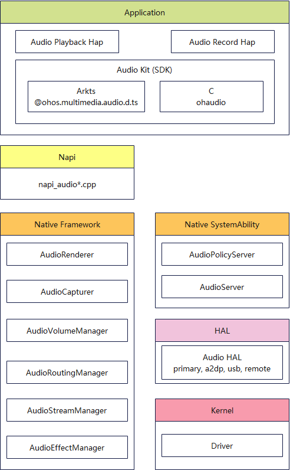

# Audio Kit简介
<!--Kit: Audio Kit-->
<!--Subsystem: Multimedia-->
<!--Owner: @songshenke-->
<!--SE: @caixuejiang; @hao-liangfei; @zhanganxiang-->
<!--TSE: @Filger-->

Audio Kit（音频服务）旨在提供场景化的音频播放和录制接口，助力开发者迅速构建音频高清采集及沉浸式播放能力。

## 亮点/特征

- 低时延播放
  
   提供统一音频低时延/非低时延播放能力接口，通过垂直打通硬件，达成最低的音频输出时延。在游戏、提示/告警音、K歌等场景下，可以通过低时延接口，实现音频快速流畅播放。
<!--Del-->
- 低功耗播放

   针对应用播放音乐、听书类长时间音频播放场景，为确保更佳续航体验，在亮/灭屏播放时采用差异化音频缓冲区处理机制，减少CPU被唤醒的频率来降低音频播放功耗。
<!--DelEnd-->
- 音效模式

   提供系统音效模式设置，应用可以按需开/关系统音效，确保最佳音效输出体验。

   系统默认为音乐、听书、影院等不同场景进行相应音效处理，但应用内部自身也存在一些定制化音效，为确保最终音效不产生冲突，系统提供音效模式配置开关，允许应用按需开/关系统音效。
<!--Del-->
- 空间音频

   提供空间音频能力，支持用户佩戴TWS耳机时，使用应用播放音源（立体声/多声道/Audio Vivid格式），可主观感受到空间音频渲染效果（方位感/空间感）。
<!--DelEnd-->
- 音振协同

   提供音振协同能力接口，实现音频及振动流的低时延同步控制。达成在输入法中开启音频和振动效果，打字输入时音振协同、节奏一致，来电铃声和振动同时响起，铃音和振动节奏同步一致的体验。

## 音频架构

开发者可以利用Audio Kit的接口，使用音频系统提供的播放、录音及音频策略管理能力，进而访问相应的音频硬件。音频架构定义了系统如何封装和管理音频硬件能力。音频架构图如下：

**Application**

应用开发者通过Audio Kit提供的公开API接口，利用音频系统提供的软硬件能力，实现应用所需的播放和录音功能。

**Napi**

通过NAPI，一种Node.js推出的用于开发C++模块的接口，封装了操作系统底层能力并对外提供ArkTS接口。通过NAPI可实现ArkTS与C/C++代码互相访问。

**Native framework**

在Native框架层，音频系统实现了播放、录音、音量控制、设备路由和音效处理等接口的框架实现，通过跨进程接口连接音频服务。

**Native SystemAility**

音频服务进程audio_server承载了软件实现的音频系统功能组件，提供了丰富的音频策略管理和数据处理能力。组件通过HDI接口与HAL层连接，从而使用音频硬件能力。

**HAL**

HAL通过统一的HDI接口对外提供服务，不同的音频硬件开发人员实现HDI接口，使得音频服务可以通过不同类型的音频设备进行播放和录音。

**Kernel**

内核驱动程序负责与音频硬件交互，针对不同规模的操作系统，可以选择多种内核，如Linux、LiteOS、OpenHarmony内核等。

## 开发说明

在每个功能中，会介绍多种实现方式以应对不同的使用场景，以及该场景相关的子功能点。比如在音频播放功能内，会同时介绍音频的并发策略、音量管理和输出设备等在操作系统中的处理方式，帮助开发者能够开发出功能覆盖更全面的应用。

本开发指导仅针对音频播放或录制本身，Audio Kit提供相关能力，不涉及UI界面、图形处理、媒体存储或其他相关领域功能。

在开发音频功能之前，尤其是要实现处理音频数据的功能前，建议开发者先了解声学相关的知识，帮助理解操作系统提供的API是如何控制音频系统，从而开发出更易用、体验更好的音视频类应用。建议了解的相关概念包括但不限于：

- 音频量化的过程：采样 &gt; 量化 &gt; 编码

- 音频量化过程的相关概念：模拟信号和数字信号、采样率、声道、采样格式、位宽、码率、常见编码格式（如AAC、MP3、PCM、WMA等）、常见封装格式（如WAV、MPA、FLAC、AAC、OGG等）

## 音频流介绍

在开发音频应用之前，还需要了解什么是音频流，它是OpenHarmony音频系统中的关键概念，在之后的章节中会多次提及。

音频流，是指音频系统中一个具备音频格式和音频使用场景信息的独立音频数据处理单元。可以表示播放，也可以表示录制，并且具备独立音量调节和音频设备路由切换能力。

音频流基础信息通过[AudioStreamInfo](../../reference/apis-audio-kit/arkts-apis-audio-i.md#audiostreaminfo8)表示，包含采样、声道、位宽、编码信息，是创建音频播放或录制流的必要参数，描述了音频数据的基本属性。在配置时开发者需要保证基础信息与传输的音频数据相匹配，音频系统才能正确处理数据。

### 音频流使用场景信息

除了基本属性，音频流还需要具备使用场景信息。基础信息只能对音频数据进行描述，但在实际的使用过程中，不同的音频流，在音量大小、设备路由、并发策略上是有区别的。系统就是通过音频流所附带的使用场景信息，为不同的音频流制定合适的处理策略，以达到更好的音频用户体验。

- 播放场景

  音频播放场景的信息，通过[StreamUsage](../../reference/apis-audio-kit/arkts-apis-audio-e.md#streamusage)进行描述。

  StreamUsage指音频流本身的用途类型，包括媒体、语音通信、语音播报、通知、铃声等。

- 录制场景

  音频流录制场景的信息，通过[SourceType](../../reference/apis-audio-kit/arkts-apis-audio-e.md#sourcetype8)进行描述。

  SourceType指音频流中录音源的类型，包括麦克风音频源、语音识别音频源、语音通话音频源等。

可参考[使用合适的音频流类型](using-right-streamusage-and-sourcetype.md)进行设置。

## 支持的音频格式

audio模块下的接口支持PCM编码，包括AudioRenderer、AudioCapturer、TonePlayer、OpenSL ES等。

音频格式说明：

- 支持的音频采样率（Hz）：8000、11025、12000、16000、22050、24000、32000、44100、48000、64000、8820012+、96000，17640012+、19200012+具体参考枚举[AudioSamplingRate](../../reference/apis-audio-kit/arkts-apis-audio-e.md#audiosamplingrate8)。
  不同设备支持的采样率规格会存在差异。

- 支持单声道、双声道，具体参考[AudioChannel](../../reference/apis-audio-kit/arkts-apis-audio-e.md#audiochannel8)。

- 支持的采样格式：U8（无符号8位整数）、S16LE（带符号的16位整数，小尾数）、S24LE（带符号的24位整数，小尾数）、S32LE（带符号的32位整数，小尾数）、F32LE（带符号的32位浮点数，小尾数），具体参考[AudioSampleFormat](../../reference/apis-audio-kit/arkts-apis-audio-e.md#audiosampleformat8)。
  由于系统限制，S24LE、S32LE、F32LE仅部分设备支持，请根据实际情况使用。

  小尾数指的是小端模式，即数据的高字节保存在内存的高地址中，而数据的低字节保存在内存的低地址中。这种存储模式将地址的高低和数据的位权有效结合起来，高地址部分权值高，低地址部分权值低。

## 相关实例

针对Audio Kit开发，有以下相关实例可供参考：

- [音频管理（ArkTS）（API10）](https://gitcode.com/openharmony/applications_app_samples/tree/master/code/BasicFeature/Media/Audio)
