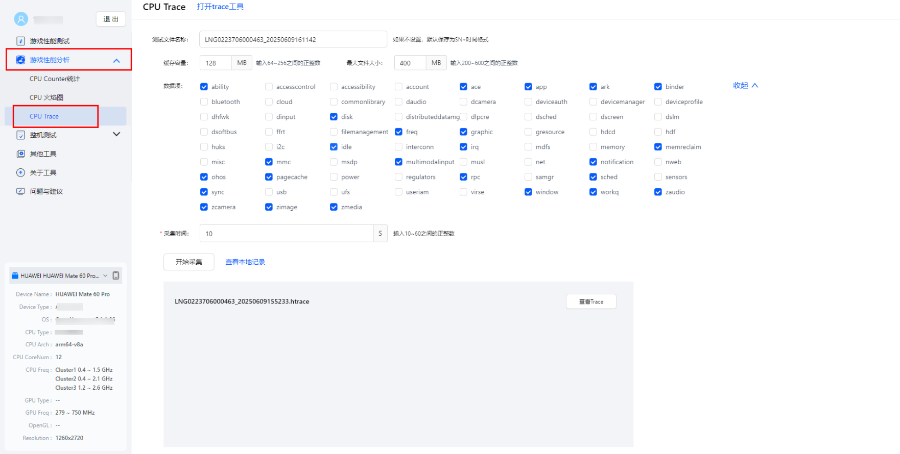
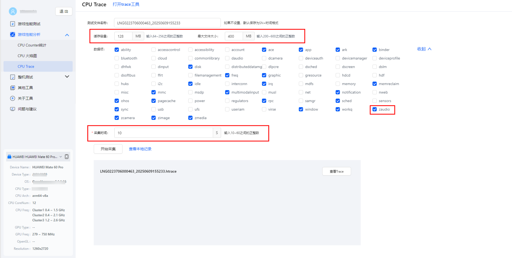
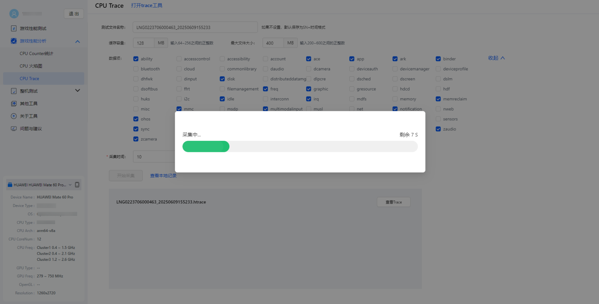
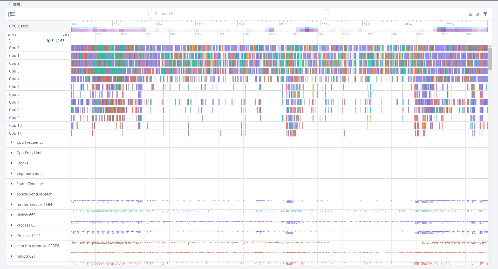
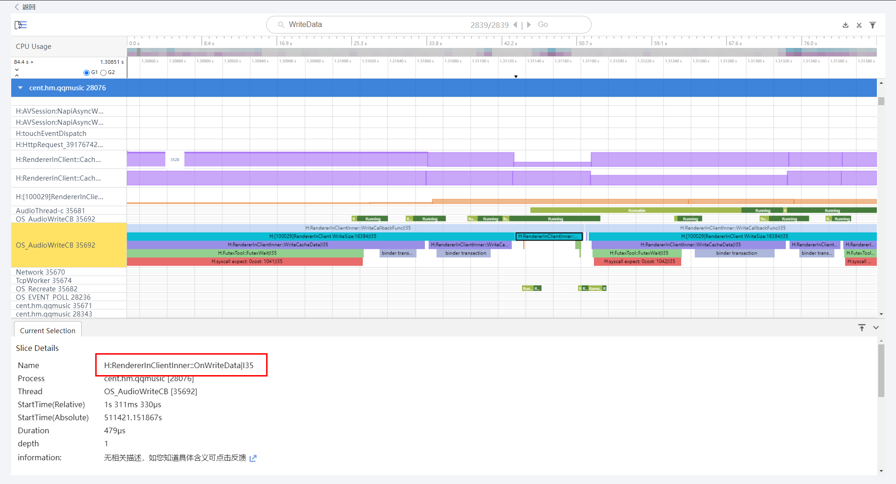
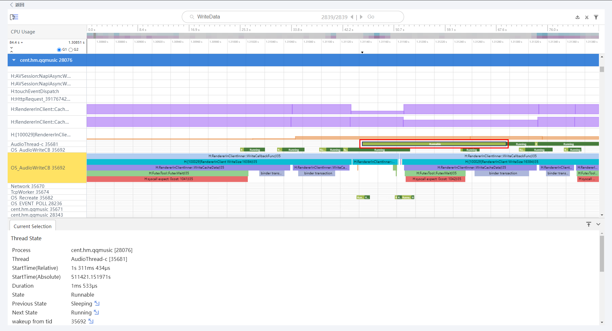
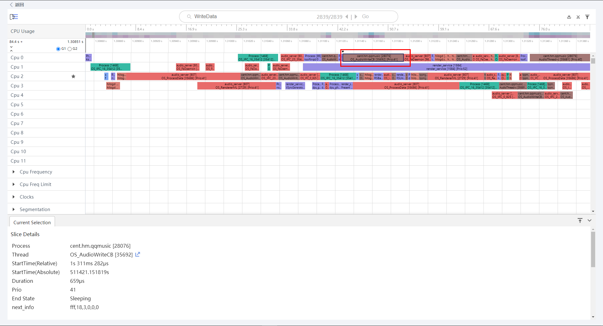

# 提升音频性能体验
<!--Kit: Audio Kit-->
<!--Subsystem: Multimedia-->
<!--Owner: @songshenke-->
<!--Designer: @caixuejiang; @hao-liangfei; @zhanganxiang-->
<!--Tester: @Filger-->
<!--Adviser: @zengyawen-->

在各种终端设备的使用过程中，对于音频相关功能的体验，用户在不同场景下，有多方面的核心性能诉求，包含流畅度、响应速度、省电等，典型的场景如下：

- 在听音乐和听书的场景，希望能更加省电，加长续航时间。
- 在玩游戏的场景，希望按键音效极快响应，体验更加沉浸。
- 在K歌的场景，希望耳返延迟更低，提升演唱效果。
- 在会议和语音聊天的场景，希望语音可以实时传输，交流畅通无阻。

为了满足用户在这些场景下的音频体验要求，系统通过接口方式提供了一系列的音频能力，让开发者能够利用系统内部的硬件和软件能力，进一步提升应用的音频播放与录音功能的性能体验。

## 通过系统能力提升性能

### 了解系统音频通路

不同的性能指标，由于硬件性能和电源大小的限制，往往无法兼顾。比如更短的音频响应时间，意味着要更快的进行数据处理，会导致牺牲一些功耗和效果。

因此，系统中的音频通路也并不是一成不变的。为应对不同的用户使用场景，系统针对性的提供多种不同方向的通路选择，有的更节省功耗，有的更偏向响应速度，还有的则相对平衡。

通路的选择，对应不同的场景，但系统无法直接感知应用所开发音频功能对应的使用场景，因此需要开发者准确提供对应的场景信息，通过StreamUsage和SourceType。系统会针对场景选择，提供一套默认的音频通路配置作用于输出/输入通路，如果开发者认为默认配置还不满足需要，也可以通过独立的设置接口进行调整。

### 低时延音频播放与录音

时延是指音频数据在系统中处理和传输的时间，播放场景下指系统收到数据到数据被硬件输出的时间，录音场景下指硬件麦克风采集到数据到从系统接口传递给应用的时间。

为支持低时延音频场景，系统专门提供了低时延音频通路，开发者需要显式通过接口参数进行设置，参考：[低时延音频使用](audio-latency.md)。

需要注意的是，低时延通常使用更小的数据缓冲，对数据处理的性能要求更高，需要开发者尽可能优化音频数据生产的性能，确保每次系统请求数据时，能在极短时间内获取到数据开始处理，避免系统内部缓冲出现数据不足引起杂音。并且为了尽可能降低时延，系统在各环节的数据处理方面有所精简，音频的效果与其他通路也存在一定差异。因此，开发者需要结合应用的实际功能场景，来决定是否需要使能低时延模式，通常游戏音效、K歌耳返、短提示音以及乐器模拟等场景，更适合使用低时延通路。

### 音频工作组

音频工作组是一套通过标记来帮助系统识别应用内音频关键线程的接口，系统通过应用提供的关键音频线程以及工作组运行信息可以让音频线程的运行状态更加健康。

音频工作组的目标是：​​更低的音频延迟​​；避免音频断断续续​​；降低音频失真​​；更流畅、更可靠的音频播放体验。

在开发播放音频类应用时，开发者需要先创建音频工作组，再将工作组运行信息的周期性告知系统。当运行结束后，需要及时清理音频工作组。更多具体的音频工作组的使用和示例，可以参考：[音频工作组使用说明](audio-workgroup.md)​。

### 音频时间戳与音画同步

音频时间戳，描述的是对于一帧音频数据，其对应的被实际硬件播放或采集到的时间，通常用于实现播放进度条和音视频同步功能。

由于不同音频硬件设备通路多种多样，系统从设备获取的时间信息并无法确保准确，时间戳的计算过程也会存在一些预估值处理，因此与实际硬件数据时间并不完全对等，存在一定误差是正常的。

典型的用途是音视频同步，音频时间戳在此场景的使用方式，可以参考：[音画同步最佳实践](https://developer.huawei.com/consumer/cn/doc/best-practices/bpta-audio-video-synchronization)。

## 音频性能分析方法

当开发者测试所开发应用的音频功能时，如测试出现卡顿、杂音类型的问题导致无法满足消费端的数据实时性要求，一般的流水日志较难用于定位此类问题，因为这些问题的原因通常是音频数据处理的某些环节，系统性能不足而引起underrun或overrun。

本文接下来将提供一些专门用于分析音频性能的日志获取方法，并简单介绍如何通过日志，找出可能存在性能问题的地方。

### 性能日志与分析

**使用DevEco Profiler**

DevEco Profiler是一个帮助开发者更高效地进行性能问题的分析的场景化调优工具，集成在DevEco Studio中，可以在应用开发过程中
直接使用。工具的具体使用方式可参考指南：[DevEco Profiler性能调优概述](https://developer.huawei.com/consumer/cn/doc/harmonyos-guides/ide-insight-description)。

DevEco Profiler主要用于对应用内运行流程进行分析和调优，指南中有详细的分析步骤说明，此文不再赘述。

**使用HiSmartPerf**

HiSmartPerf工具是一个独立的性能调优工具，用于采集测试时间段内系统、CPU和GPU的性能数据。通过可视化界面进行直观的呈现，便于开发者分析所开发应用运行时的性能表现和原因，以此为基础进行深入的性能优化，以使应用运行更加流畅。

HiSmartPerf工具完整的介绍可参考指南：[HiSmartPerf工具使用指南](https://developer.huawei.com/consumer/cn/doc/AppGallery-connect-Guides/smartperf-tool-0000001873208929)。

在此，提供使用HiSmartPerf分析音频播放场景的案例。

1. 进入CPU Trace。

   

   打开HiSmartPerf工具，进入游戏性能分析的CPU Trace页面。虽然标题是游戏性能分析，但分析场景并不仅限于游戏场景。

2. 抓取配置。

   

   配置项主要有数据文件名、缓存容量、最大文件大小、数据项和采集时间。要抓取系统音频相关的数据项，需要勾选zaudio。采集时间可以按测试场景进行调节，需要注意，测试时长和勾选的数据项数量会影响文件大小，往往需要同步调节。

3. 开始采集。

   

   采集完成后将提示文件回传，当文件较大时请耐心等待。

4. 查看Trace。

   

   采集时间内的cpu性能分析结果。

5. 找到音频数据处理线程。

   

   对于音频播放业务，可以通过OnWriteData搜索目标测试应用为系统输入播放数据的位置，进一步分析数据的生产来源的性能情况。

   

    runnable表示线程在等待调度，当存在由于过长的runnable导致数据未能被及时写入的情况，包括应用自身的数据生产线程，则需要考虑接入音频工作组，以提升线程的优先级并保障CPU资源分配。

    

    在CPU Usage中可以查看每个任务的CPU占用情况。

    从Trace中找出问题原因后，可以参考[常见性能问题和解决方案](#常见性能问题和解决方案)，进行性能调优。

## 常见性能问题和解决方案

### 音频播放卡顿

播放卡顿是音频最常见的性能类问题。问题原因多样，由于音频数据的生产和播放链路较长，任一环节都可能导致最终播放卡顿。

音频数据的处理，通常采用生产消费者模型，生产端生成音频数据写入公共缓冲区，消费端按需从缓冲区取数据进行下一步处理。当消费端取数据时，如发现数据不足，为了避免影响后续流程，不会阻塞等待，而是直接使用静音帧数据处理。在播放过程中，间歇性出现静音帧，听感上表现为电流杂音；大量静音帧出现时，听感表现为卡顿。

定位此类问题，主要从消费端逐层向上分析，某一层缓冲出现静音帧，大概率是前一层生产不及时引起。数据生产不及时的常见情况及解决思路如下：

- 网络传输问题：由于网络传输不稳定导致音频数据生产不及时，需暂停播放，等待可播放数据达到一定水平后恢复播放。
- 数据处理复杂度过高：在实时音频播放场景，数据算法处理耗时过长，可能导致消费端无法及时取到数据。一方面需考虑算法优化，另一方面可加长缓冲区，确保缓冲数据消耗时间能够覆盖算法处理，但这种处理方式将会增加时延。
- 线程处理性能不足：在部分高负载场景或音频数据处理与其他业务并发时，会出现系统资源供给不足，导致线程无法及时生产音频数据。开发者在优化应用整体处理流程性能的同时，也可通过接入音频工作组能力，由系统保障线程资源分配满足预期时间要求。

### 音频播放暂停和拖动进度时杂音

暂停和拖动进度导致的问题，是由于音频数据在播放结尾会出现截断的波形情况，当音频输出硬件播放这种波形时，可能会出现短暂的杂音。

系统会在播放暂停接口被调用时进行优化，但开发者也可以在此场景下对送入系统的音频数据进行淡出和淡入的优化，进一步提升播放体验。

### 音频播放时延高

音频播放时延高，通常是由于数据处理耗时长，或是缓冲区设置过大。

对时延比较敏感的音频场景，不建议做过多的数据前处理。可以使用系统提供的低时延模式进行播放。提示音类功能，建议使用[SoundPool](../../reference/apis-media-kit/js-apis-inner-multimedia-soundPool.md)接口进行播放。

### 视频音画不同步

音画同步有两类常见原因，一类是时间戳未正确使用，一类是输出时延过大。需要结合发生不同步的实际情况，尤其是音视频快慢情况进行分析。
