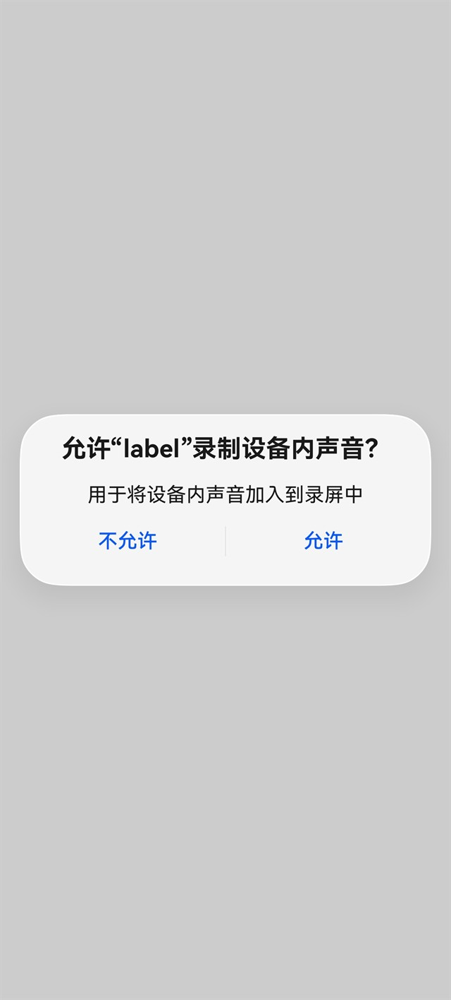

# 实现录制系统音频
<!--Kit: Audio Kit-->
<!--Subsystem: Multimedia-->
<!--Owner: @zyy0412-->
<!--Designer: @weixin_41398971-->
<!--Tester: @Filger-->
<!--Adviser: @w_Machine_cc-->

从API版本26.0.0开始，Audio Kit支持应用使用AudioCapturer（ArkTS API）或OH_AudioCapturer（C API）录制系统音频。本文介绍具体开发方法。

Phone、Tablet和TV设备支持`SystemCapability.Multimedia.Audio.PlaybackCapture`系统能力，其他设备可以通过[canIUse()](../../reference/common/js-apis-syscap.md#caniuse)检查是否支持该系统能力。使用ArkTS API开发时，仅支持Stage模型。

创建AudioCapturer时通过`playbackCaptureMode`配置内录模式，创建OH_AudioCapturer时通过`OH_AudioStreamBuilder_SetPlaybackCaptureMode()`配置内录模式。

配置内录模式后，需分别通过`requestPlaybackCaptureStart()`或`OH_AudioCapturer_RequestPlaybackCaptureStart()`启动，不支持通过`start()`或`OH_AudioCapturer_Start()`接口启动。

如果需要同时录制屏幕画面和系统音频，请参考[AVScreenCapture录屏基础流程](../media/avscreencapture-c-basic-process.md)。

## 开发指导

使用AudioCapturer（ArkTS API）或OH_AudioCapturer（C API）采集内录音频的基本流程如下：

1. 创建音频采集器，配置音频流参数和内录模式。
2. 注册音频数据回调，准备接收采集到的PCM数据。
3. 调用对应语言的内录启动接口，并在异步回调中确认启动结果。
4. 启动成功后，通过音频数据回调处理内录PCM数据。
5. 停止采集，取消监听并释放音频采集器资源。

ArkTS开发建议搭配[AudioCapturer](../../reference/apis-audio-kit/arkts-apis-audio-AudioCapturer.md)、[AudioCapturerOptions](../../reference/apis-audio-kit/arkts-apis-audio-i.md#audiocaptureroptions8)和[AudioPlaybackCaptureMode](../../reference/apis-audio-kit/arkts-apis-audio-e.md#audioplaybackcapturemode)的API说明阅读。

C/C++开发建议搭配[OH_AudioStreamBuilderStruct](../../reference/apis-audio-kit/capi-ohaudio-oh-audiostreambuilderstruct.md)、[OH_AudioCapturerStruct](../../reference/apis-audio-kit/capi-ohaudio-oh-audiocapturerstruct.md)和[OH_AudioStream_PlaybackCaptureMode](../../reference/apis-audio-kit/capi-native-audiostream-base-h.md#oh_audiostream_playbackcapturemode)的API说明阅读。

### 用户授权流程

应用调用内录启动接口后，系统会自动拉起隐私确认弹框，应用无需实现弹框。不同设备形态的弹框表现可能存在差异，请以实际设备表现为准。

用户选择允许后，异步回调返回启动成功；用户选择拒绝，或系统未能拉起弹框时，异步回调返回用户未授权。应用应根据异步回调结果进行处理：回调返回成功时开始处理内录PCM数据；回调返回未授权或启动失败时，提示用户并释放已创建的音频采集器。

启动接口为非阻塞接口。等待用户操作弹框和系统返回异步回调期间，应用不应通过循环等待、同步锁等待等方式阻塞当前线程。C API启动接口返回`AUDIOSTREAM_SUCCESS`仅表示启动请求提交成功，不能作为最终授权结果。

**系统弹框示意图：**



### AudioCapturer（ArkTS API）开发步骤及注意事项

以下ArkTS示例为片段代码，开发者可根据实际业务将采集到的PCM数据写入文件、送入编码器或交给自定义音频处理模块。

1. 导入模块。

   ``` TypeScript
   import { audio } from '@kit.AudioKit';
   import { BusinessError } from '@kit.BasicServicesKit';
   ```

2. 配置音频采集参数并创建AudioCapturer实例。

   创建AudioCapturer时，通过[AudioCapturerOptions](../../reference/apis-audio-kit/arkts-apis-audio-i.md#audiocaptureroptions8)中的`playbackCaptureMode`配置内录模式。该字段支持[AudioPlaybackCaptureMode](../../reference/apis-audio-kit/arkts-apis-audio-e.md#audioplaybackcapturemode)枚举值、按位或组合。未配置`playbackCaptureMode`时，AudioCapturer按普通音频采集器创建。

   当前支持的内录模式如下：

   | 内录模式 | 录制范围 |
   | -------- | -------- |
   | `MODE_DEFAULT` | 默认模式，录制大部分音频流，不包括提示音流和隐私流。 |
   | `MODE_MEDIA` | 媒体模式，录制媒体、语音消息和未知类型的音频流。 |
   | `MODE_EXCLUDING_SELF` | 排除自身模式，录制除应用自身播放音频以外的音频流。 |
   | `MODE_MEDIA \| MODE_EXCLUDING_SELF` | 录制媒体类音频，同时排除应用自身播放的音频。 |

   > **说明：**
   >
   > - 内录启动时还会进行用户授权检查，部分设备会展示系统授权或隐私提示弹窗，授权结果通过`requestPlaybackCaptureStart()`回调返回。

   <!-- @[SetPlaybackCaptureMode](https://gitcode.com/openharmony/applications_app_samples/blob/master/code/DocsSample/Media/Audio/AudioCaptureSampleJS/entry/src/main/ets/pages/PlaybackCapture.ets) -->
   ``` TypeScript
   let audioStreamInfo: audio.AudioStreamInfo = {
     samplingRate: audio.AudioSamplingRate.SAMPLE_RATE_48000,
     channels: audio.AudioChannel.CHANNEL_2,
     sampleFormat: audio.AudioSampleFormat.SAMPLE_FORMAT_S16LE,
     encodingType: audio.AudioEncodingType.ENCODING_TYPE_RAW
   };

   let audioCapturerInfo: audio.AudioCapturerInfo = {
     source: audio.SourceType.SOURCE_TYPE_MIC,
     capturerFlags: 0
   };

   let audioCapturerOptions: audio.AudioCapturerOptions = {
     streamInfo: audioStreamInfo,
     capturerInfo: audioCapturerInfo,
     playbackCaptureMode: audio.AudioPlaybackCaptureMode.MODE_MEDIA |
       audio.AudioPlaybackCaptureMode.MODE_EXCLUDING_SELF
   };

   let audioCapturer: audio.AudioCapturer | undefined =
     await audio.createAudioCapturer(audioCapturerOptions);
   ```

3. 调用[on('readData')](../../reference/apis-audio-kit/arkts-apis-audio-AudioCapturer.md#onreaddata11)订阅音频数据读入回调。

   回调返回PCM数据，应用可根据业务写入文件、送入编码器或交给自定义音频处理模块。以下示例统计接收到的PCM数据字节数。

   ``` TypeScript
   let readBytes: number = 0;
   let isPlaybackCaptureStarted: boolean = false;
   let playbackCaptureRequestId: number = 0;
   let playbackCaptureStartState: audio.PlaybackCaptureStartState | undefined = undefined;

   let readDataCallback: Callback<ArrayBuffer> = (buffer: ArrayBuffer): void => {
     readBytes += buffer.byteLength;
   };

   audioCapturer.on('readData', readDataCallback);
   ```

   > **注意：**
   >
   > `readData`回调中不建议执行耗时任务。若需要编码、网络发送或复杂算法处理，建议将PCM数据转交给独立任务处理，避免数据回调阻塞导致丢帧、卡顿或杂音。

4. 调用[requestPlaybackCaptureStart()](../../reference/apis-audio-kit/arkts-apis-audio-AudioCapturer.md#requestplaybackcapturestart)请求启动内录。

   该接口为非阻塞接口，系统会继续处理用户授权检查和内录流启动，最终结果通过[PlaybackCaptureStartState](../../reference/apis-audio-kit/arkts-apis-audio-e.md#playbackcapturestartstate)返回。

   示例通过递增`playbackCaptureRequestId`标识每次启动请求。回调返回时同时校验采集器实例和请求ID，避免旧请求回调修改当前内录状态。等待授权期间，应用应继续处理其他业务，避免同步阻塞当前线程。

   > **注意：**
   >
   > 内录采集器不能通过`start()`接口启动。调用`requestPlaybackCaptureStart()`后，只有收到`STATE_SUCCESS`时，应用才应认为内录已启动成功。

   ``` TypeScript
   if (audioCapturer === undefined) {
     return;
   }
   // 为每次异步启动请求分配唯一ID，避免旧请求回调修改当前状态。
   const requestId: number = ++playbackCaptureRequestId;
   const capturer: audio.AudioCapturer = audioCapturer;
   capturer.requestPlaybackCaptureStart((state: audio.PlaybackCaptureStartState): void => {
     if (audioCapturer !== capturer || playbackCaptureRequestId !== requestId) {
       return;
     }
     playbackCaptureStartState = state;

     if (state === audio.PlaybackCaptureStartState.STATE_SUCCESS) {
       isPlaybackCaptureStarted = true;
       console.info('Succeeded in starting playback capture.');
       return;
     }
     releasePlaybackCapture().catch((error: BusinessError): void => {
       console.error(`Release playback capture failed, code is ${error.code}, message is ${error.message}`);
     });
   });
   ```

   启动结果请参考[PlaybackCaptureStartState](../../reference/apis-audio-kit/arkts-apis-audio-e.md#playbackcapturestartstate)。如果启动结果不是`STATE_SUCCESS`，应用应根据业务提示用户，并及时释放已创建的AudioCapturer实例。应用主动停止内录流后，还应忽略旧请求返回的异步回调。

5. 调用[stop](../../reference/apis-audio-kit/arkts-apis-audio-AudioCapturer.md#stop8)停止采集，并调用[release](../../reference/apis-audio-kit/arkts-apis-audio-AudioCapturer.md#release8)释放AudioCapturer资源。

   应用结束内录后，需要停止AudioCapturer并释放资源。释放前应取消`readData`监听，避免对象释放后仍处理回调。

   ``` TypeScript
   async function releasePlaybackCapture(): Promise<void> {
     if (audioCapturer === undefined) {
       return;
     }
     const capturer: audio.AudioCapturer = audioCapturer;
     audioCapturer = undefined;
     playbackCaptureRequestId++;
     capturer.off('readData', readDataCallback);
     try {
       if (isPlaybackCaptureStarted) {
         await capturer.stop();
       }
     } finally {
       isPlaybackCaptureStarted = false;
       await capturer.release();
     }
   }
   ```

### OH_AudioCapturer（C API）开发步骤及注意事项

以下C/C++示例为片段代码，展示创建、启动、停止和释放OH_AudioCapturer的完整生命周期。OH_AudioCapturer的基础录制流程可参考[推荐使用OHAudio开发音频录制功能(C/C++)](using-ohaudio-for-recording.md)。

1. 引入头文件，并定义用于保存内录采集器及启动状态的变量。

   内录启动接口为异步接口，需要在启动函数返回后继续保存`OH_AudioCapturer`实例，确保在启动结果回调中处理失败场景，并在业务结束时停止和释放实例。互斥锁（Mutual Exclusion Lock）用于保护全局采集器指针，避免启动结果回调、重复启动和主动停止同时访问该指针。

   ``` C++
   #include <atomic>
   #include <cstdint>
   #include <mutex>
   #include <ohaudio/native_audiocapturer.h>
   #include <ohaudio/native_audiostream_base.h>
   #include <ohaudio/native_audiostreambuilder.h>

   constexpr int32_t PLAYBACK_CAPTURE_SAMPLE_RATE = 48000;
   constexpr int32_t PLAYBACK_CAPTURE_CHANNEL_COUNT = 2;
   constexpr uint32_t PLAYBACK_CAPTURE_MODE = AUDIOSTREAM_PLAYBACKCAPTURE_MODE_MEDIA |
       AUDIOSTREAM_PLAYBACKCAPTURE_MODE_EXCLUDING_SELF;

   std::mutex g_playbackCaptureMutex;
   OH_AudioCapturer* g_playbackCaptureCapturer = nullptr;
   std::atomic<int32_t> g_playbackCaptureStartState{-1};
   std::atomic<uint64_t> g_playbackCaptureReadBytes{0};
   ```

2. 定义音频数据回调和内录启动结果回调。

   音频数据回调返回内录PCM数据，不建议在回调中执行耗时任务。内录启动失败或用户未授权时，及时释放已创建的采集器。

   ``` C++
   void MyOnPlaybackCaptureReadData(
       OH_AudioCapturer* capturer,
       void* userData,
       void* audioData,
       int32_t audioDataSize)
   {
       if (audioData == nullptr || audioDataSize <= 0) {
           return;
       }
       g_playbackCaptureReadBytes.fetch_add(static_cast<uint64_t>(audioDataSize));
   }

   void MyOnPlaybackCaptureStart(OH_AudioCapturer* capturer, void* userData,
       OH_AudioStream_PlaybackCaptureStartState state)
   {
       int32_t stateValue = static_cast<int32_t>(state);
       g_playbackCaptureStartState.store(stateValue);

       if (state == AUDIOSTREAM_PLAYBACKCAPTURE_START_STATE_SUCCESS) {
           return;
       }

       OH_AudioCapturer* capturerToRelease = nullptr;
       {
           std::lock_guard<std::mutex> lock(g_playbackCaptureMutex);
           if (g_playbackCaptureCapturer == capturer) {
               capturerToRelease = g_playbackCaptureCapturer;
               g_playbackCaptureCapturer = nullptr;
           }
       }
       if (capturerToRelease != nullptr) {
           OH_AudioCapturer_Release(capturerToRelease);
       }
   }
   ```

3. 创建音频采集器并配置内录模式。

   通过[OH_AudioStreamBuilder_SetPlaybackCaptureMode()](../../reference/apis-audio-kit/capi-native-audiostreambuilder-h.md#oh_audiostreambuilder_setplaybackcapturemode)配置内录模式。内录启动时，系统会进行用户授权检查，并通过启动结果回调返回授权结果。

   当前支持的内录模式如下：

   | 内录模式 | 录制范围 |
   | -------- | -------- |
   | `AUDIOSTREAM_PLAYBACKCAPTURE_MODE_DEFAULT` | 默认模式，录制大部分音频流，不包括提示音流和隐私流。 |
   | `AUDIOSTREAM_PLAYBACKCAPTURE_MODE_MEDIA` | 媒体模式，录制媒体、语音消息和未知流等。 |
   | `AUDIOSTREAM_PLAYBACKCAPTURE_MODE_EXCLUDING_SELF` | 排除自身模式，录制除应用自身播放音频以外的音频流。 |
   | `AUDIOSTREAM_PLAYBACKCAPTURE_MODE_MEDIA \| AUDIOSTREAM_PLAYBACKCAPTURE_MODE_EXCLUDING_SELF` | 录制媒体类音频，同时排除应用自身播放的音频。 |

   单独使用排除自身模式时，会录制大部分允许被采集的音频流并排除应用自身播放的音频；与媒体模式组合时，只录制媒体类音频并排除应用自身播放的音频。

   <!-- @[SetPlaybackCaptureMode](https://gitcode.com/openharmony/applications_app_samples/blob/master/code/DocsSample/Media/Audio/AudioCapturerSampleC/entry/src/main/cpp/AudioCapture.cpp) -->
   ``` C++
   bool ConfigurePlaybackCaptureBuilder(OH_AudioStreamBuilder* builder)
   {
       OH_AudioStreamBuilder_SetSamplingRate(builder, PLAYBACK_CAPTURE_SAMPLE_RATE);
       OH_AudioStreamBuilder_SetChannelCount(builder, PLAYBACK_CAPTURE_CHANNEL_COUNT);
       OH_AudioStreamBuilder_SetSampleFormat(builder, AUDIOSTREAM_SAMPLE_S16LE);
       OH_AudioStreamBuilder_SetEncodingType(builder, AUDIOSTREAM_ENCODING_TYPE_RAW);
       OH_AudioStreamBuilder_SetCapturerReadDataCallback(builder, MyOnPlaybackCaptureReadData, nullptr);

       OH_AudioStream_Result result =
           OH_AudioStreamBuilder_SetPlaybackCaptureMode(builder, PLAYBACK_CAPTURE_MODE);
       return result == AUDIOSTREAM_SUCCESS;
   }

   OH_AudioCapturer* CreatePlaybackCapture()
   {
       OH_AudioStreamBuilder* builder = nullptr;
       OH_AudioStream_Result result =
           OH_AudioStreamBuilder_Create(&builder, AUDIOSTREAM_TYPE_CAPTURER);
       if (result != AUDIOSTREAM_SUCCESS || builder == nullptr) {
           return nullptr;
       }
       if (!ConfigurePlaybackCaptureBuilder(builder)) {
           OH_AudioStreamBuilder_Destroy(builder);
           return nullptr;
       }

       OH_AudioCapturer* audioCapturer = nullptr;
       result = OH_AudioStreamBuilder_GenerateCapturer(builder, &audioCapturer);
       OH_AudioStreamBuilder_Destroy(builder);
       if (result != AUDIOSTREAM_SUCCESS || audioCapturer == nullptr) {
           return nullptr;
       }
       return audioCapturer;
   }

   bool StorePlaybackCapture(OH_AudioCapturer* audioCapturer)
   {
       std::lock_guard<std::mutex> lock(g_playbackCaptureMutex);
       if (g_playbackCaptureCapturer != nullptr) {
           return false;
       }
       g_playbackCaptureCapturer = audioCapturer;
       g_playbackCaptureStartState.store(-1);
       g_playbackCaptureReadBytes.store(0);
       return true;
   }

   <!-- @[RequestPlaybackCaptureStart](https://gitcode.com/openharmony/applications_app_samples/blob/master/code/DocsSample/Media/Audio/AudioCapturerSampleC/entry/src/main/cpp/AudioCapture.cpp) -->
   bool RequestPlaybackCaptureStart(OH_AudioCapturer* audioCapturer)
   {
       OH_AudioStream_Result result = OH_AudioCapturer_RequestPlaybackCaptureStart(
           audioCapturer, MyOnPlaybackCaptureStart, nullptr);
       if (result == AUDIOSTREAM_SUCCESS) {
           return true;
       }

       bool shouldRelease = false;
       {
           std::lock_guard<std::mutex> lock(g_playbackCaptureMutex);
           if (g_playbackCaptureCapturer == audioCapturer) {
               g_playbackCaptureCapturer = nullptr;
               shouldRelease = true;
           }
       }
       if (shouldRelease) {
           OH_AudioCapturer_Release(audioCapturer);
       }
       return false;
   }

   void StartPlaybackCapture()
   {
       {
           std::lock_guard<std::mutex> lock(g_playbackCaptureMutex);
           if (g_playbackCaptureCapturer != nullptr) {
               return;
           }
       }

       OH_AudioCapturer* audioCapturer = CreatePlaybackCapture();
       if (audioCapturer == nullptr) {
           return;
       }
       if (!StorePlaybackCapture(audioCapturer)) {
           OH_AudioCapturer_Release(audioCapturer);
           return;
       }
       RequestPlaybackCaptureStart(audioCapturer);
   }
   ```

   生成`OH_AudioCapturer`后，构造器不再使用，需要立即调用`OH_AudioStreamBuilder_Destroy()`释放构造器资源。设置内录模式失败时也需要销毁构造器。

   > **注意：**
   >
   > - `OH_AudioCapturer_RequestPlaybackCaptureStart()`返回`AUDIOSTREAM_SUCCESS`仅表示启动请求提交成功。只有异步回调返回`AUDIOSTREAM_PLAYBACKCAPTURE_START_STATE_SUCCESS`时，才表示内录启动成功。
   > - 用户拒绝授权或系统未能拉起授权弹框时，回调返回`AUDIOSTREAM_PLAYBACKCAPTURE_START_STATE_NOT_AUTHORIZED`。
   
4. 停止并释放内录采集器。

   业务结束后，通过[OH_AudioCapturer_Stop()](../../reference/apis-audio-kit/capi-native-audiocapturer-h.md#oh_audiocapturer_stop)停止采集，并通过[OH_AudioCapturer_Release()](../../reference/apis-audio-kit/capi-native-audiocapturer-h.md#oh_audiocapturer_release)释放资源。

   ``` C++
   void StopPlaybackCapture()
   {
       OH_AudioCapturer* capturerToRelease = nullptr;
       {
           std::lock_guard<std::mutex> lock(g_playbackCaptureMutex);
           capturerToRelease = g_playbackCaptureCapturer;
           g_playbackCaptureCapturer = nullptr;
       }
       if (capturerToRelease == nullptr) {
           return;
       }

       OH_AudioCapturer_Stop(capturerToRelease);
       OH_AudioCapturer_Release(capturerToRelease);
       g_playbackCaptureStartState.store(-1);
       g_playbackCaptureReadBytes.store(0);
   }
   ```

### 配置目标播放流的内录策略

播放端可以通过配置自身音频流的隐私属性，控制是否允许其他应用录制。系统建立内录采集链路时，会过滤标记为隐私保护的播放流，因此通话内容、账号信息或其他隐私内容不会被内录采集。该配置属于播放端能力，不需要内录应用额外处理。

- 使用ArkTS API开发时，播放端可通过[AudioRendererOptions](../../reference/apis-audio-kit/arkts-apis-audio-i.md#audiorendereroptions8)中的`privacyType`控制播放流是否允许被其他应用录制。
- 使用C API开发时，播放端可通过[OH_AudioStreamBuilder_SetRendererPrivacy()](../../reference/apis-audio-kit/capi-native-audiostreambuilder-h.md#oh_audiostreambuilder_setrendererprivacy)控制播放流是否允许被其他应用录制。
