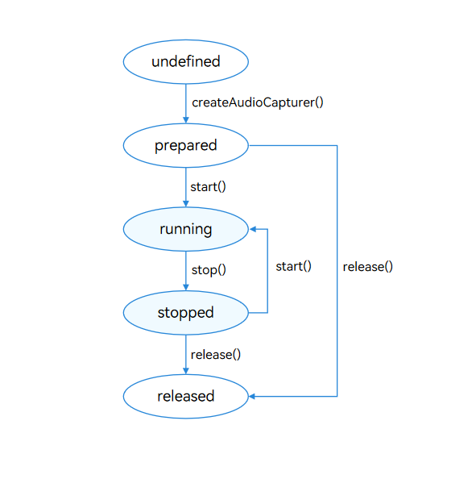

# 使用AudioCapturer开发音频录制功能(ArkTS)
<!--Kit: Audio Kit-->
<!--Subsystem: Multimedia-->
<!--Owner: @zyy0412-->
<!--Designer: @weixin_41398971-->
<!--Tester: @Filger-->
<!--Adviser: @w_Machine_cc-->

AudioCapturer是音频采集器，用于录制PCM（Pulse Code Modulation）音频数据，适合有音频开发经验的开发者实现更灵活的录制功能。

## 开发指导

使用AudioCapturer录制音频涉及AudioCapturer实例的创建、音频采集参数的配置、采集的开始与停止、资源的释放等。本开发指导将以一次录制音频数据的过程为例，向开发者讲解如何使用AudioCapturer进行音频录制，建议搭配[AudioCapturer](../../reference/apis-audio-kit/arkts-apis-audio-AudioCapturer.md)的API说明阅读。

下图展示了AudioCapturer的状态变化，在创建实例后，调用对应的方法可以进入指定的状态实现对应的行为。需要注意的是，在确定的状态执行不合适的方法可能导致AudioCapturer发生错误，建议开发者在调用状态转换的方法前进行状态检查，避免程序运行产生预期以外的结果。

使用[on('stateChange')](../../reference/apis-audio-kit/arkts-apis-audio-AudioCapturer.md#onstatechange8)方法可以监听AudioCapturer的状态变化，每个状态对应值与说明见[AudioState](../../reference/apis-audio-kit/arkts-apis-audio-e.md#audiostate8)。

当音频流处于工作状态（非released状态）时，会占用系统的音频流资源。由于系统对音频流数量有限制，所以当客户端暂时不使用音频流时，调用release()回收音频资源，做好资源利用，避免后续创建音频流失败。

**图1** AudioCapturer状态变化示意图



### 开发步骤及注意事项

以下各步骤示例为片段代码，可通过示例代码右下方链接获取[完整示例](https://gitcode.com/openharmony/applications_app_samples/tree/master/code/DocsSample/Media/Audio/AudioCaptureSampleJS)。

1. 配置音频采集参数并创建AudioCapturer实例，音频采集参数的详细信息可以查看[AudioCapturerOptions](../../reference/apis-audio-kit/arkts-apis-audio-i.md#audiocaptureroptions8)。

   > **说明：**
   >
   > 当设置Mic音频源（即[SourceType](../../reference/apis-audio-kit/arkts-apis-audio-e.md#sourcetype8)为SOURCE_TYPE_MIC、SOURCE_TYPE_VOICE_RECOGNITION、SOURCE_TYPE_VOICE_COMMUNICATION、SOURCE_TYPE_VOICE_MESSAGE、SOURCE_TYPE_LIVE（从API version 20开始支持））时，需要申请麦克风权限ohos.permission.MICROPHONE，申请方式参考：[向用户申请授权](../../security/AccessToken/request-user-authorization.md)。

   <!-- @[create_AudioCapturer](https://gitcode.com/openharmony/applications_app_samples/blob/master/code/DocsSample/Media/Audio/AudioCaptureSampleJS/entry/src/main/ets/pages/AudioCapture.ets) -->
   
   ``` TypeScript
   import { audio } from '@kit.AudioKit';
   // ...
   let audioStreamInfo: audio.AudioStreamInfo = {
     samplingRate: audio.AudioSamplingRate.SAMPLE_RATE_48000, // 采样率。
     channels: audio.AudioChannel.CHANNEL_2, // 通道。
     sampleFormat: audio.AudioSampleFormat.SAMPLE_FORMAT_S16LE, // 采样格式。
     encodingType: audio.AudioEncodingType.ENCODING_TYPE_RAW // 编码格式。
   };
   let audioCapturerInfo: audio.AudioCapturerInfo = {
     source: audio.SourceType.SOURCE_TYPE_MIC, // 音源类型:Mic音频源。根据业务场景配置,参考SourceType。
     capturerFlags: 0 // 音频采集器标志。
   };
   let audioCapturerOptions: audio.AudioCapturerOptions = {
     streamInfo: audioStreamInfo,
     capturerInfo: audioCapturerInfo
   };
   // ...
     audio.createAudioCapturer(audioCapturerOptions, (err, capturer) => { // 创建AudioCapturer实例。
       if (err) {
         console.error(`${TAG}: Invoke createAudioCapturer failed, code is ${err.code}, message is ${err.message}`);
         // ...
         return;
       }
       console.info(`${TAG}: create AudioCapturer success`);
       // ...
       audioCapturer = capturer;
       if (audioCapturer !== undefined) {
         audioCapturer.on('readData', onReadData);
         // ...
       }
     });
   ```

2. 调用[on('readData')](../../reference/apis-audio-kit/arkts-apis-audio-AudioCapturer.md#onreaddata11)方法，订阅监听音频数据读入回调。
   > **注意：**
   > 
   > - **线程管理**：不建议使用多线程来处理数据读取。若需使用多线程读取数据，需要做好线程管理。
   > - **线程耗时**：`readData` 方法所在的线程中，不建议执行耗时任务。否则可能会导致数据处理线程响应回调延迟，进而引发录音数据缺失、卡顿、杂音等音频效果问题。
   > - **注册回调**：开发者应避免在主线程中注册回调，以免被其他业务阻塞导致响应回调不及时造成卡顿。建议使用独立的异步线程池处理回调。

   <!-- @[listen_AudioCapturer](https://gitcode.com/openharmony/applications_app_samples/blob/master/code/DocsSample/Media/Audio/AudioCaptureSampleJS/entry/src/main/ets/pages/AudioCapture.ets) --> 
   
   ``` TypeScript
   import { BusinessError } from '@kit.BasicServicesKit';
   import { fileIo as fs } from '@kit.CoreFileKit';
   import { common, abilityAccessCtrl, PermissionRequestResult } from '@kit.AbilityKit';
   
   // ...
   class Options {
     public offset?: number;
     public length?: number;
   }
   
   // ...
      let writtenBytes: number = 0;
      pendingRecordingWrite = Promise.resolve();
      let path = context.cacheDir;
      let filePath = path + '/S16LE_2_48000.pcm';
      recordingFile = fs.openSync(filePath, fs.OpenMode.READ_WRITE | fs.OpenMode.CREATE);
      onReadData = (buffer: ArrayBuffer) => {
        // ...
        let recordingBuffer = buffer.slice(0);
        let writeOffset = writtenBytes;
        writtenBytes += recordingBuffer.byteLength;
        let options: Options = {
          offset: writeOffset,
          length: recordingBuffer.byteLength
        }
        pendingRecordingWrite = pendingRecordingWrite.then(async () => {
          await fs.write(recordingFile.fd, recordingBuffer, options);
        }).catch((error: BusinessError) => {
          console.error(`${TAG}: Write recording data failed, code: ${error.code}, message: ${error.message}`);
        });
      };
     // ...
         audioCapturer.on('readData', onReadData);
   ```

3. 调用[start](../../reference/apis-audio-kit/arkts-apis-audio-AudioCapturer.md#start8)方法进入running状态，开始录制音频。

   <!-- @[start_AudioCapturer](https://gitcode.com/openharmony/applications_app_samples/blob/master/code/DocsSample/Media/Audio/AudioCaptureSampleJS/entry/src/main/ets/pages/AudioCapture.ets) -->
   
   ``` TypeScript
   import { BusinessError } from '@kit.BasicServicesKit';
   // ...
       try {
         await audioCapturer.start();
         // ...
         console.info(`${TAG}: Capturer start success.`);
       } catch (err) {
         let error = err as BusinessError;
         // ...
         console.error(`${TAG}: Capturer start failed, code: ${error.code}, message: ${error.message}`);
       }
   ```

4. 调用[stop](../../reference/apis-audio-kit/arkts-apis-audio-AudioCapturer.md#stop8)方法停止录制。

   <!-- @[stop_AudioCapturer](https://gitcode.com/openharmony/applications_app_samples/blob/master/code/DocsSample/Media/Audio/AudioCaptureSampleJS/entry/src/main/ets/pages/AudioCapture.ets) -->
   
   ``` TypeScript
   import { BusinessError } from '@kit.BasicServicesKit';
   // ...
       try {
         await audioCapturer.stop();
         // ...
         console.info(`${TAG}: Capturer stop success.`);
       } catch (err) {
         let error = err as BusinessError;
         // ...
         console.error(`${TAG}: Capturer stop failed, code: ${error.code}, message: ${error.message}`);
      }
   ```

5. 调用[release](../../reference/apis-audio-kit/arkts-apis-audio-AudioCapturer.md#release8)方法销毁实例，释放资源。
   <!-- @[release_AudioCapturer](https://gitcode.com/openharmony/applications_app_samples/blob/master/code/DocsSample/Media/Audio/AudioCaptureSampleJS/entry/src/main/ets/pages/AudioCapture.ets) --> 
   
   ``` TypeScript
   import { BusinessError } from '@kit.BasicServicesKit';
   // ...
       try {
        await audioCapturer.release();
        capturerMuteHintEnabledByApp = false;
        console.info(`${TAG}: Capturer release success.`);
        // ...
       } catch (err) {
        let error = err as BusinessError;
        // ...
        console.error(`${TAG}: Capturer release failed, code: ${error.code}, message: ${error.message}`);
      } finally {
        await pendingRecordingWrite;
        fs.closeSync(recordingFile.fd);
      }
   ```

### 完整示例

下面展示了使用AudioCapturer录制音频的完整示例代码。

<!-- @[all_audioCapturer](https://gitcode.com/openharmony/applications_app_samples/blob/master/code/DocsSample/Media/Audio/AudioCaptureSampleJS/entry/src/main/ets/pages/AudioCapture.ets) --> 

``` TypeScript
import { audio } from '@kit.AudioKit';
import { BusinessError } from '@kit.BasicServicesKit';
import { fileIo as fs } from '@kit.CoreFileKit';
import { common, abilityAccessCtrl, PermissionRequestResult } from '@kit.AbilityKit';

const TAG = 'AudioCapturerDemo';

class Options {
  public offset?: number;
  public length?: number;
}

let audioRenderer: audio.AudioRenderer | undefined = undefined;
let audioCapturer: audio.AudioCapturer | undefined = undefined;
let capturerMuteHintEnabledByApp: boolean = false;
let audioStreamInfo: audio.AudioStreamInfo = {
  samplingRate: audio.AudioSamplingRate.SAMPLE_RATE_48000, // 采样率。
  channels: audio.AudioChannel.CHANNEL_2, // 通道。
  sampleFormat: audio.AudioSampleFormat.SAMPLE_FORMAT_S16LE, // 采样格式。
  encodingType: audio.AudioEncodingType.ENCODING_TYPE_RAW // 编码格式。
};
let audioCapturerInfo: audio.AudioCapturerInfo = {
  source: audio.SourceType.SOURCE_TYPE_MIC, // 音源类型:Mic音频源。根据业务场景配置,参考SourceType。
  capturerFlags: 0 // 音频采集器标志。
};
let audioCapturerOptions: audio.AudioCapturerOptions = {
  streamInfo: audioStreamInfo,
  capturerInfo: audioCapturerInfo
};
let audioRendererInfo: audio.AudioRendererInfo = {
  usage: audio.StreamUsage.STREAM_USAGE_MUSIC, // 音频流使用类型：音乐。根据业务场景配置，参考StreamUsage。
  rendererFlags: 0 // 音频渲染器标志。
};
let audioRendererOptions: audio.AudioRendererOptions = {
  streamInfo: audioStreamInfo,
  rendererInfo: audioRendererInfo
};

let file: fs.File;
let recordingFile: fs.File;
let onReadData: Callback<ArrayBuffer>;
let writeDataCallback: audio.AudioRendererWriteDataCallback;
let pendingRecordingWrite: Promise<void> = Promise.resolve();

// ...

async function initRecordingResources(context: common.UIAbilityContext): Promise<void> {
  let writtenBytes: number = 0;
  pendingRecordingWrite = Promise.resolve();
  let path = context.cacheDir;
  let filePath = path + '/S16LE_2_48000.pcm';
  recordingFile = fs.openSync(filePath, fs.OpenMode.READ_WRITE | fs.OpenMode.CREATE);
  onReadData = (buffer: ArrayBuffer) => {
    let recordingBuffer = buffer.slice(0);
    let writeOffset = writtenBytes;
    writtenBytes += recordingBuffer.byteLength;
    let options: Options = {
      offset: writeOffset,
      length: recordingBuffer.byteLength
    }
    pendingRecordingWrite = pendingRecordingWrite.then(async () => {
      await fs.write(recordingFile.fd, recordingBuffer, options);
    }).catch((error: BusinessError) => {
      console.error(`${TAG}: Write recording data failed, code: ${error.code}, message: ${error.message}`);
    });
  };
}

async function initRender(context: common.UIAbilityContext) {
  let bufferSize: number = 0;
  let path = context.cacheDir;
  // 此处仅作示例，实际使用时需要将文件替换为应用要播放的PCM文件。
  let filePath = path + '/S16LE_2_48000.pcm';
  file = fs.openSync(filePath, fs.OpenMode.READ_ONLY);
  writeDataCallback = (buffer: ArrayBuffer) => {
    let options: Options = {
      offset: bufferSize,
      length: buffer.byteLength
    };

    try {
      let bufferLength = fs.readSync(file.fd, buffer, options);
      bufferSize += buffer.byteLength;
      // 如果当前回调传入的数据不足一帧，空白区域需要使用静音数据填充，否则会导致播放出现杂音。
      if (bufferLength < buffer.byteLength) {
        let view = new DataView(buffer);
        for (let i = bufferLength; i < buffer.byteLength; i++) {
          // 空白区域填充静音数据。当使用音频采样格式为SAMPLE_FORMAT_U8时0x7F为静音数据，使用其他采样格式时0为静音数据。
          view.setUint8(i, 0);
        }
      }
      // API version 11不支持返回回调结果，从API version 12开始支持返回回调结果。
      // 如果开发者不希望播放某段buffer，返回audio.AudioDataCallbackResult.INVALID即可。
      return audio.AudioDataCallbackResult.VALID;
    } catch (error) {
      console.error('Error reading file:', error);
      // API version 11不支持返回回调结果，从API version 12开始支持返回回调结果。
      return audio.AudioDataCallbackResult.INVALID;
    }
  };
  audio.createAudioRenderer(audioRendererOptions, (err, renderer) => { // 创建AudioRenderer实例。
    if (!err) {
      console.info(`${TAG}: creating AudioRenderer success`);
      audioRenderer = renderer;
      if (audioRenderer !== undefined) {
        audioRenderer.on('writeData', writeDataCallback);
      }
    } else {
      console.info(`${TAG}: creating AudioRenderer failed, error: ${err.message}`);
    }
  });
}

// 开始一次音频渲染。
async function startRender(updateCallback?: (msg: string, isError: boolean) => void): Promise<void> {
  if (audioRenderer !== undefined) {
    let stateGroup = [audio.AudioState.STATE_PREPARED, audio.AudioState.STATE_PAUSED, audio.AudioState.STATE_STOPPED];
    if (stateGroup.indexOf(audioRenderer.state.valueOf()) === -1) { // 当且仅当状态为prepared、paused和stopped之一时才能启动渲染。
      console.error(TAG + 'start failed');
      return;
    }
    // 启动渲染。
    audioRenderer.start((err: BusinessError) => {
      if (err) {
        console.error('Renderer start failed.');
      } else {
        console.info('Renderer start success.');
      }
    });
  }
}

// 停止渲染。
async function stopRender(updateCallback?: (msg: string, isError: boolean) => void): Promise<void> {
  if (audioRenderer !== undefined) {
    // 只有渲染器状态为running或paused的时候才可以停止。
    if (audioRenderer.state.valueOf() !== audio.AudioState.STATE_RUNNING &&
      audioRenderer.state.valueOf() !== audio.AudioState.STATE_PAUSED) {
      console.info('Renderer is not running or paused.');
      return;
    }
    // 停止渲染。
    audioRenderer.stop((err: BusinessError) => {
      if (err) {
        console.error('Renderer stop failed.');
      } else {
        console.info('Renderer stop success.');
      }
    });
  }
}

// 销毁实例，释放资源。
async function releaseRender(updateCallback?: (msg: string, isError: boolean) => void): Promise<void> {
  if (audioRenderer !== undefined) {
    // 渲染器状态不是released状态，才能release。
    if (audioRenderer.state.valueOf() === audio.AudioState.STATE_RELEASED) {
      console.info('Renderer already released');
      return;
    }
    // 释放资源。
    audioRenderer.release((err: BusinessError) => {
      if (err) {
        console.error('Renderer release failed.');
      } else {
        await pendingRecordingWrite;
        fs.closeSync(recordingFile.fd);
        console.info('Renderer release success.');
      }
    });
  }
}

// 初始化,创建实例,设置监听事件。
async function init(updateCallback?: (msg: string, isError: boolean) => void, stateCallback?:
  (msg: string) => void): Promise<void> {
  audio.createAudioCapturer(audioCapturerOptions, (err, capturer) => { // 创建AudioCapturer实例。
    if (err) {
      console.error(`${TAG}: Invoke createAudioCapturer failed, code is ${err.code}, message is ${err.message}`);
      // ...
      return;
    }
    console.info(`${TAG}: create AudioCapturer success`);
    // ...
    audioCapturer = capturer;
    if (audioCapturer !== undefined) {
      audioCapturer.on('readData', onReadData);
      // ...
    }
  });
}

// 开始一次音频采集。
async function start(updateCallback?: (msg: string, isError: boolean) => void): Promise<void> {
  if (audioCapturer !== undefined) {
    let stateGroup = [audio.AudioState.STATE_PREPARED
      , audio.AudioState.STATE_PAUSED, audio.AudioState.STATE_STOPPED];
    // 当且仅当状态为STATE_PREPARED、STATE_PAUSED和STATE_STOPPED之一时才能启动采集。
    if (stateGroup.indexOf(audioCapturer.state.valueOf()) === -1) {
      console.error(`${TAG}: start failed`);
      // ...
      return;
    }

    // 启动采集。
    try {
      await audioCapturer.start();
      // ...
      console.info(`${TAG}: Capturer start success.`);
    } catch (err) {
      let error = err as BusinessError;
      // ...
      console.error(`${TAG}: Capturer start failed, code: ${error.code}, message: ${error.message}`);
    }
  }
}

// 设置或解除录音流静音提示。
async function setAudioCapturerMuteHint(muteHint: boolean, updateCallback?: (msg: string, isError: boolean) => void):
  Promise<boolean> {
  if (audioCapturer === undefined) {
    const errorMsg = 'AudioCapturer has not been created.';
    console.error(errorMsg);
    if (updateCallback) {
      updateCallback(errorMsg, true);
    }
    return false;
  }

  if (audioCapturer.state.valueOf() !== audio.AudioState.STATE_RUNNING) {
    const errorMsg = 'AudioCapturer is not running.';
    console.error(errorMsg);
    if (updateCallback) {
      updateCallback(errorMsg, true);
    }
    return false;
  }

  try {
    await audioCapturer.setMuteHint(muteHint);
    capturerMuteHintEnabledByApp = muteHint;
    console.info(`setMuteHint ${muteHint} success.`);
    if (updateCallback) {
      updateCallback(`setMuteHint ${muteHint} success.`, false);
    }
    return true;
  } catch (err) {
    let error = err as BusinessError;
    console.error(`setMuteHint ${muteHint} failed. Code: ${error.code}, message: ${error.message}`);
    if (updateCallback) {
      updateCallback(`setMuteHint ${muteHint} failed. Code: ${error.code}, message: ${error.message}`, true);
    }
    return false;
  }
}

// 停止采集。
async function stop(updateCallback?: (msg: string, isError: boolean) => void): Promise<void> {
  if (audioCapturer !== undefined) {
    // 只有采集器状态为STATE_RUNNING或STATE_PAUSED的时候才可以停止。
    if (audioCapturer.state.valueOf() !== audio.AudioState.STATE_RUNNING &&
      audioCapturer.state.valueOf() !== audio.AudioState.STATE_PAUSED) {
      console.info(`${TAG}: Capturer is not running or paused`);
      // ...
      return;
    }

    // 停止采集。
    try {
      await audioCapturer.stop();
      // ...
      console.info(`${TAG}: Capturer stop success.`);
    } catch (err) {
      let error = err as BusinessError;
      // ...
      console.error(`${TAG}: Capturer stop failed, code: ${error.code}, message: ${error.message}`);
    }
  }
}

// 销毁实例,释放资源。
async function release(updateCallback?: (msg: string, isError: boolean) => void): Promise<void> {
  if (audioCapturer !== undefined) {
    // 采集器状态不是STATE_RELEASED或STATE_NEW状态,才能release。
    if (audioCapturer.state.valueOf() === audio.AudioState.STATE_RELEASED ||
      audioCapturer.state.valueOf() === audio.AudioState.STATE_NEW) {
      console.info(`${TAG}: Capturer already released`);
      // ...
      return;
    }

    // 释放资源。
    try {
      await audioCapturer.release();
      capturerMuteHintEnabledByApp = false;
      console.info(`${TAG}: Capturer release success.`);
      // ...
    } catch (err) {
      let error = err as BusinessError;
      // ...
      console.error(`${TAG}: Capturer release failed, code: ${error.code}, message: ${error.message}`);
      } finally {
        await pendingRecordingWrite;
        fs.closeSync(recordingFile.fd);
      }
  }
}

// ...

// ...
```

### 设置静音打断模式

如果需要实现录音全程不被系统基于焦点并发规则打断的效果，提供将打断策略从停止录音切换为静音录制的功能，录音过程中也不影响其他应用启动录音。开发者在创建AudioCapturer实例时，调用[setWillMuteWhenInterrupted](../../reference/apis-audio-kit/arkts-apis-audio-AudioCapturer.md#setwillmutewheninterrupted20)接口设置是否开启静音打断模式。默认不开启，此时由音频焦点策略管理并发音频流的执行顺序。开启后，被其他应用打断导致停止或暂停录制时会进入静音录制状态，在此状态下录制的音频没有声音。

### 设置录音流静音提示

从API version 24开始，当应用已在业务侧将某条录音流静音时，可以调用[setMuteHint](../../reference/apis-audio-kit/arkts-apis-audio-AudioCapturer.md#setmutehint24)接口将该状态上报给系统音频模块，系统音频模块会基于上报的状态调整策略以降低功耗。注意，此功能当前仅在部分PC/2in1设备上生效。该接口不会实际触发静音，也不会对录音数据做静音处理。它只是告知系统音频模块，应用已将当前录音流进行过静音。应用仍需自行处理录音数据，例如不发送采集数据或发送静音数据。

该接口仅允许在AudioCapturer处于running状态时调用，否则会返回错误码`6800103`。如果同一录音流同时设置了流级静音提示和会话级静音提示[setCapturerMuteHint](../../reference/apis-audio-kit/arkts-apis-audio-AudioSessionManager.md#setcapturermutehint24)，流级静音提示优先级更高，以流级设置值为准。当前未提供系统查询接口，如需在界面展示静音提示状态，应用需要自行维护最近一次设置成功的状态。以下示例中，`muteHint`为`true`表示上报静音提示，`false`表示解除静音提示；`capturerMuteHintEnabledByApp`为应用本地维护的状态，记录当前设置的muteHint的值。

<!-- @[set_mute_hint](https://gitcode.com/openharmony/applications_app_samples/blob/master/code/DocsSample/Media/Audio/AudioCaptureSampleJS/entry/src/main/ets/pages/AudioCapture.ets) --> 

``` TypeScript
try {
  await audioCapturer.setMuteHint(muteHint);
  capturerMuteHintEnabledByApp = muteHint;
  console.info(`setMuteHint ${muteHint} success.`);
  // ...
} catch (err) {
  let error = err as BusinessError;
  console.error(`setMuteHint ${muteHint} failed. Code: ${error.code}, message: ${error.message}`);
  // ...
}
```

### 回声消除功能

回声消除功能可在支持的设备上有效消除录音过程中的回声干扰，提升音频采集质量。开发者可通过指定特定的Mic音频源[SourceType](../../reference/apis-audio-kit/arkts-apis-audio-e.md#sourcetype8)（SOURCE_TYPE_VOICE_COMMUNICATION、SOURCE_TYPE_LIVE）来启用该功能，系统将会自动对采集的音频信号进行回声消除处理。

在启用前，建议先调用[isAcousticEchoCancelerSupported](../../reference//apis-audio-kit/arkts-apis-audio-AudioStreamManager.md#isacousticechocancelersupported20)接口（从API version 20开始支持）查询当前设备对音频输入源类型[SourceType](../../reference/apis-audio-kit/arkts-apis-audio-e.md#sourcetype8)是否支持回声消除功能，以确保功能的可用性。若支持，则可在创建音频录制构造器时设置相应的Mic音频源，从而激活回声消除处理流程。
