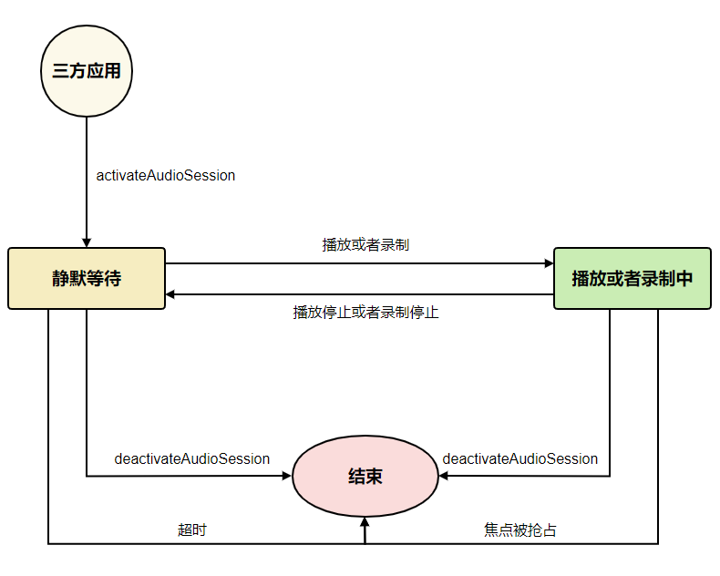

# 音频并发策略扩展(C/C++)

**OpenHarmony音频系统本身会根据播放音频的流类型指定默认并发策略，音频会话是OpenHarmony音频系统对默认音频并发策略的一个扩展，应用可以使用音频会话来定制化自身应用并发时的策略，满足应用特定的使用场景。**

- 应用连续播放短音频时不希望后台被暂停的媒体应用漏音，可以通过申请音频会话来确保整个播放过程的有机统一。

- 系统默认的并发策略不满足应用播放诉求时，应用通过申请音频会话并指定特定策略来实现应用自身并发的诉求。

音频会话流程示意图：


## 使用入门

应用要使用OHAudio提供的音频会话管理能力，需要添加对应的头文件。

### 在 CMake 脚本中链接动态库

``` cmake
target_link_libraries(sample PUBLIC libohaudio.so)
```

### 添加头文件

应用通过引入[native_audio_session_manager.h](../../reference/apis-audio-kit/native__audio__session__manager_8h.md)头文件，使用音频播放相关API。

```cpp
#include <ohaudio/native_audio_session_manager.h>
```

## 音频会话策略

在多音频并发，即多个音频流同时播放场景下，应用可以主动设置音频会话策略，控制当前应用获取音频焦点后其它正在播放音频应用的行为。

### 音频并发模式

当默认模式下的策略不能满足应用需求场景时应用可通过配置音频并发模式改变默认策略。

音频并发模式预设了四种音频并发模式：

**下列各模式下的适用场景分别描述配置该模式前的焦点策略和配置该模式后的焦点策略，应用可根据需求选择需要配置的音频并发模式。**

- 默认模式（CONCURRENCY_DEFAULT）：即未使用音频会话策略时的默认并发策略。

- 混音模式（CONCURRENCY_MIX_WITH_OTHERS）：和其它正在播放应用进行混音。

  **正在播放的应用采取了混音模式和后来申请播放的应用的作用关系：**

  | 配置该模式前的应用行为 | 配置该模式后的应用行为 |
    | ------------ | ------------------ |
  | 正在播放的应用拒绝后来申请播放的应用 | 正在播放的应用可以和后来申请播放的应用混音播放 |
  | 正在播放的应用暂停后来申请播放的应用 | 正在播放的应用可以和后来申请播放的应用混音播放 |
  | 正在播放的应用压低后来申请播放的应用的音量 | 正在播放的应用可以和后来申请播放的应用混音播放 |
  | 后来申请播放的应用压低正在播放的应用的音量 | 若正在播放的应用和后来申请播放的应用具有相近的类型，则正在播放的应用可以和后来申请播放的应用混音播放 |
  | 后来申请播放的应用暂停正在播放的应用 | 若正在播放的应用和后来申请播放的应用具有相近的类型，则正在播放的应用可以和后来申请播放的应用混音播放 |
  | 后来申请播放的应用停止正在播放的应用 | 若正在播放的应用和后来申请播放的应用具有相近的类型，则正在播放的应用可以和后来申请播放的应用混音播放 |

  **后来播放的应用采取了混音模式和正在播放的应用的作用关系：**

  | 配置该模式前的应用行为 | 配置该模式后的应用行为 |
    | ------------ | ------------------ |
  | 正在播放的应用拒绝后来申请播放的应用 | 若正在播放的应用和后来申请播放的应用具有相近的类型，正在播放的应用可以和后来申请播放的应用混音播放 |
  | 正在播放的应用暂停后来申请播放的应用 | 若正在播放的应用和后来申请播放的应用具有相近的类型，正在播放的应用可以和后来申请播放的应用混音播放 |
  | 正在播放的应用压低后来申请播放的应用的音量 | 若正在播放的应用和后来申请播放的应用具有相近的类型，正在播放的应用可以和后来申请播放的应用混音播放 |
  | 后来申请播放的应用压低正在播放的应用的音量 | 正在播放的应用可以和后来申请播放的应用混音播放 |
  | 后来申请播放的应用暂停正在播放的应用 | 正在播放的应用可以和后来申请播放的应用混音播放 |
  | 后来申请播放的应用停止正在播放的应用 | 正在播放的应用可以和后来申请播放的应用混音播放 |

- 混音降低音量模式（CONCURRENCY_DUCK_OTHERS）：后来播放应用压低正在播放应用的音量。

  **后来申请播放的应用采取了压低音量的策略和正在播放的应用的作用关系：**

  | 配置该模式前的应用行为 | 配置该模式后的应用行为 |
    | ------------ | ------------------ |
  | 后来申请播放的应用暂停正在播放的应用 | 后来申请播放的应用压低正在播放应用的音量 |
  | 后来申请播放的应用停止正在播放的应用 | 后来申请播放的应用压低正在播放应用的音量 |

- 暂停模式（CONCURRENCY_PAUSE_OTHERS）：后来播放应用暂停正在播放应用。

  **后来申请播放的应用采取了暂停的策略和正在播放的应用的作用关系：**

  | 配置该模式前的应用行为 | 配置该模式后的应用行为 |
    | ------------ | ------------------ |
  | 后来申请播放的应用停止正在播放的应用 | 后来申请播放的应用暂停正在播放的应用 |

## 音频会话停用事件

在应用激活音频会话时，推荐应用监听音频会话停用事件，当音频会话停止事件发生时，系统会根据音频会话停用原因，对相关音频流做出相应的操作。

若应用想重新通过音频会话定制并发策略，需要重新激活音频会话。

### 音频会话停用原因

音频会话停用原因预设了两种停用原因：

- 应用焦点被抢占（DEACTIVATED_LOWER_PRIORITY）：清除其占位焦点，伴随正在播放的应用的焦点释放。

- 超时（DEACTIVATED_TIME_OUT）：应用创建音频会后或者播放停流超过系统默认的时长后，系统会上报会话超时事件。这时被该会话压低音量的播放应用音量恢复为原来大小，被该会话暂停的播放应用会收到停止播放的焦点事件。

## 获取音频会话管理器

创建[OH_AudioSessionManager](../../reference/apis-audio-kit/_o_h_audio.md#oh_audiosessionmanager)实例。在使用音频会话管理功能前，需要先通过[OH_AudioManager_GetAudioSessionManager](../../reference/apis-audio-kit/_o_h_audio.md#oh_audiomanager_getaudiosessionmanager)创建音频会话管理实例。

  ```cpp
  OH_AudioSessionManager *audioSessionManager;
  OH_AudioManager_GetAudioSessionManager(&audioSessionManager);
  ```

## 激活音频会话

应用可以通过[OH_AudioSessionManager_ActivateAudioSession](../../reference/apis-audio-kit/_o_h_audio.md#oh_audiosessionmanager_activateaudiosession)接口激活当前应用的音频会话。

  ```cpp
  OH_AudioSession_Strategy strategy = {CONCURRENCY_MIX_WITH_OTHERS};
  
  OH_AudioSessionManager_ActivateAudioSession(audioSessionManager, &strategy);
  ```

## 停用音频会话

使用结束后，应用确保通过[OH_AudioSessionManager_DeactivateAudioSession](../../reference/apis-audio-kit/_o_h_audio.md#oh_audiosessionmanager_deactivateaudiosession)接口停用当前应用的音频会话。

  ```cpp
  OH_AudioSessionManager_DeactivateAudioSession(audioSessionManager);
  ```

## 查询音频会话是否已激活。

应用可以通过[OH_AudioSessionManager_IsAudioSessionActivated](../../reference/apis-audio-kit/_o_h_audio.md#oh_audiosessionmanager_isaudiosessionactivated)接口检查当前应用的音频会话是否已激活。

  ```cpp
  bool isActivated = OH_AudioSessionManager_IsAudioSessionActivated(audioSessionManager);
  ```

## 注册音频会话停用事件回调&取消注册音频会话停用事件回调

### 定义回调函数

  ```cpp
  int32_t MyAudioSessionDeactivatedCallback(OH_AudioSession_DeactivatedEvent event)
  {
    switch(event.reason) {
      case DEACTIVATED_LOWER_PRIORITY:
        // 应用焦点被抢占
        return 0;
      case DEACTIVATED_TIMEOUT:
        // 超时
        return 0;
    }
  }
  ```

### 注册音频会话停用事件回调
应用可以通过[OH_AudioSessionManager_RegisterSessionDeactivatedCallback](../../reference/apis-audio-kit/_o_h_audio.md#oh_audiosessionmanager_registersessiondeactivatedcallback)接口监听音频会话停用事件。

  ```cpp
  OH_AudioSessionManager_RegisterSessionDeactivatedCallback(audioSessionManager, MyAudioSessionDeactivatedCallback);
  ```

### 取消注册音频会话停用事件回调

应用可以通过[OH_AudioSessionManager_UnregisterSessionDeactivatedCallback](../../reference/apis-audio-kit/_o_h_audio.md#oh_audiosessionmanager_unregistersessiondeactivatedcallback)接口取消监听音频会话停用事件。

  ```cpp
  OH_AudioSessionManager_UnregisterSessionDeactivatedCallback(audioSessionManager, MyAudioSessionDeactivatedCallback);
  ```

## 完整示例

参考以下示例，完成音频会话从创建到激活并监听的过程。

  ```cpp
  #include <cstdint>
  #include "ohaudio/native_audio_session_manager.h"
  
  int32_t MyAudioSessionDeactivatedCallback(OH_AudioSession_DeactivatedEvent event)
  {
    switch(event.reason) {
      case DEACTIVATED_LOWER_PRIORITY:
        // 应用焦点被抢占
        return 0;
      case DEACTIVATED_TIMEOUT:
        // 超时
        return 0;
    }
  }
  
  OH_AudioSessionManager *audioSessionManager;

  // 创建音频会话管理器
  OH_AudioCommon_Result resultManager = OH_AudioManager_GetAudioSessionManager(&audioSessionManager);
  
  OH_AudioSession_Strategy strategy = {CONCURRENCY_MIX_WITH_OTHERS};

  // 设置音频并发模式并激活音频会话
  OH_AudioCommon_Result resultActivate = OH_AudioSessionManager_ActivateAudioSession(audioSessionManager, &strategy);
  
  // 查询音频会话是否已激活。
  bool isActivated = OH_AudioSessionManager_IsAudioSessionActivated(audioSessionManager);
  
  // 监听音频会话停用事件
  OH_AudioCommon_Result resultRegister = OH_AudioSessionManager_RegisterSessionDeactivatedCallback(audioSessionManager, MyAudioSessionDeactivatedCallback);

  // 音频会话激活后应用在此处正常执行音频播放、暂停、停止、释放等操作即可。 
  
  // 取消监听音频会话停用事件
  OH_AudioCommon_Result resultUnregister = OH_AudioSessionManager_UnregisterSessionDeactivatedCallback(audioSessionManager, MyAudioSessionDeactivatedCallback);
  
  // 停用音频会话
  OH_AudioCommon_Result resultDeactivate = OH_AudioSessionManager_DeactivateAudioSession(audioSessionManager);
  ```