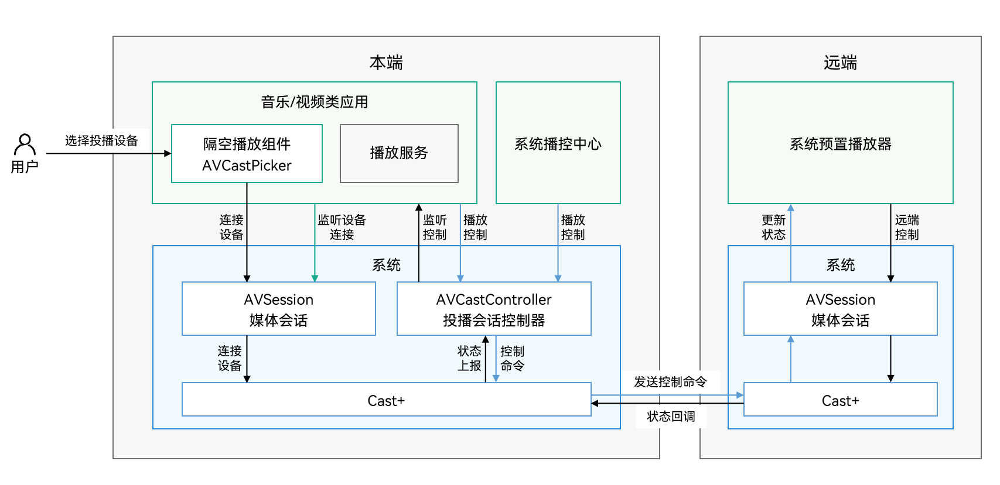

# 音视频投播概述

OpenHarmony提供了统一的应用内音视频投播功能设计，通过提供投播组件和标准的接口，帮助开发者可以简单高效地实现将音视频资源投放到其他设备播放，即实现跨端投播。

同时，系统提供默认投播协议Cast+，可以有效提升投播体验。

使用系统提供的投播组件和接口，应用只需要设置对应的资源信息、监听投播中的相关状态，以及应用主动控制的行为（如：播放、暂停）。其他动作包括图标切换、设备的发现、连接、认证等，均由系统完成。

## 基本概述

- **媒体会话（AVSession）**

  音视频管控服务，用于对系统中所有音视频行为进行统一的管理。

  本地播放时，应用需要向媒体会话提供播放的媒体信息（如正在播放的歌曲、歌曲的播放状态等），并接收和响应播控中心发出的控制命令（如暂停、下一首等）。具体请参考[本地媒体会话](using-avsession-developer.md)。

  投播时，通过AVSession，应用可以投播能力的设置和查询，并创建投播控制器。

- **投播组件[AVCastPicker](../reference/arkui-ts/ohos-avcastpicker.md)**
  
  系统级的投播组件，可嵌入应用界面的UI组件。当用户点击该组件后，系统将进行设备发现、连接、认证等流程，应用仅需要通过接口获取投播中相关的回调信息。

- **投播控制器[AVCastController](../reference/apis/js-apis-avsession.md#avcastcontroller10)**
  
  在投播后，由应用发起的对远端播放控制的接口，包括播放、暂停、调节音量、设置播放模式、设置播放速度等能力。

- **后台长时任务**
  
  应用实现后台播放，需申请后台长时任务，避免应用在投播后被系统后台清理或冻结。具体参考[长时任务开发指导](../task-management/continuous-task-dev-guide.md)。

## 分布式投播交互过程

1. 用户在应用界面上点击AVCastPicker组件，触发系统发现可用于投播的设备。用户在设备列表中选择对应设备后，系统连接对应设备。
2. 应用通过AVSession监听设备的连接情况，监听到设备已连接后，创建一个AVCastController用于发送控制命令（如播放、暂停、下一首等）。
3. 在本端（包括应用内和播控中心）控制播放时，控制命令将通过AVCastController发送，本端和远端基于Cast+的能力进行数据传输和信息同步，然后更新远端系统预置播放器的状态。
4. 用户同样可以在远端直接控制播放，会直接修改远端播放器的状态。
5. 当远端播放器状态变更后，会触发回调，将状态信息返回到本端。应用可以通过AVCastController监听到远端播放器的状态变化。

## 接入说明

### 基本原则

应用需要接入AVSession，才可以使用系统提供的统一投播能力，由系统进行设备发现和管理。系统不额外提供音视频设备发现的接口给应用进行选择和切换设备。

使用系统提供的统一投播组件，应用无需关注设备的发现连接过程，仅需关注设备在远端是否可用。当用户通过投播组件，选择了某个远端设备并连接成功，应用将通过回调获取到信息，然后可以创建一个AVCastController，用于控制远端设备的播放。

当进入到远端设备投播状态时，应用也可以对应用界面进行重新绘制，比如界面变更为一个遥控器，可控制远端播放。建议应用在进入远端投播时，停止本地的播放器，避免本端和远端设备同时播放的情况，提升用户体验。

### 音视频投播与分布式媒体会话的关联与差异

1. 分布式会话是基于分布式软总线的能力在双端设备之间进行会话信息的同步；投播能力基于Cast+的能力进行数据传输和信息同步，支持的设备类型更丰富。
2. 分布式会话投播音频，需要由用户先进行双端设备的连接，投播成功后，应用在本端设备的控制和本地播放类似；而投播能力支持在远端设备进行播放的展示，体验上会更有优势。
3. 分布式会话仅支持音频投播，不支持视频投播；投播能力后续会扩展，将支持视频投播。