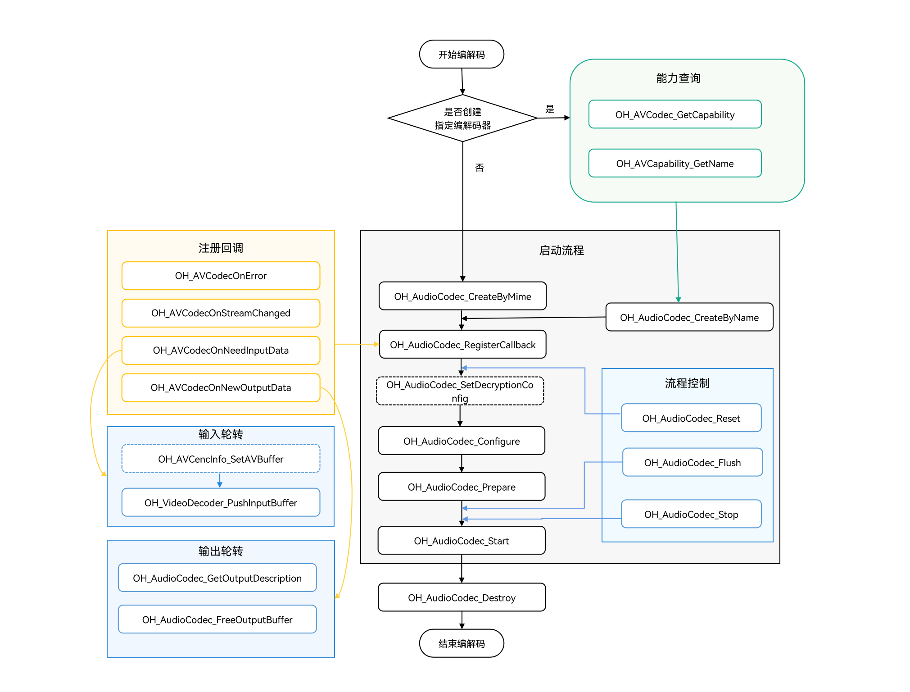

# 音频解码

开发者可以调用本模块的Native API接口，完成音频解码，即将媒体数据解码为PCM码流。

当前支持的解码能力请参考[AVCodec支持的格式](avcodec-support-formats.md#音频解码)。

**适用场景**

- 音频播放

  在播放音频之前，需要先解码音频，再将数据输送到硬件扬声器播放。
- 音频渲染

  在对音频文件进行音效处理之前，需要先解码再由音频处理模块进行音频渲染。
- 音频编辑

  音频编辑（如调整单个声道的播放倍速等）需要基于PCM码流进行，所以需要先将音频文件解码。
> **说明：**
>
> 通过MP3音频编码流程生成的码流无法直接通过MP3音频解码流程进行解码。建议通过（PCM码流->MP3音频编码->封装->解封装->MP3音频解码）流程进行。

## 开发指导

详细的API说明请参考[API文档](../../reference/apis-avcodec-kit/_audio_codec.md)。

参考以下示例代码，完成音频解码的全流程，包括：创建解码器、设置解码参数（采样率/码率/声道数等）、开始、刷新、重置、销毁资源。

在应用开发过程中，开发者应按一定顺序调用方法，执行对应操作，否则系统可能会抛出异常或生成其他未定义的行为。具体顺序可参考下列开发步骤及对应说明。

如下为音频解码调用关系图：

- 虚线表示可选。

- 实线表示必选。



### 在 CMake 脚本中链接动态库

```cmake
target_link_libraries(sample PUBLIC libnative_media_codecbase.so)
target_link_libraries(sample PUBLIC libnative_media_core.so)
target_link_libraries(sample PUBLIC libnative_media_acodec.so)
```

### 开发步骤

1. 添加头文件。

    ```cpp
    #include <multimedia/player_framework/native_avcodec_audiocodec.h>
    #include <multimedia/native_audio_channel_layout.h>
    #include <multimedia/player_framework/native_avcapability.h>
    #include <multimedia/player_framework/native_avcodec_base.h>
    #include <multimedia/player_framework/native_avformat.h>
    #include <multimedia/player_framework/native_avbuffer.h>
    ```

2. 创建解码器实例对象，OH_AVCodec *为解码器实例指针。

    ```cpp
    //c++标准库命名空间。
    using namespace std;
    // 通过 codec name 创建解码器。
    OH_AVCapability *capability = OH_AVCodec_GetCapability(OH_AVCODEC_MIMETYPE_AUDIO_MPEG, false);
    const char *name = OH_AVCapability_GetName(capability);
    OH_AVCodec *audioDec_ = OH_AudioCodec_CreateByName(name);
    ```

    ```cpp
    // 设置判定是否为编码；设置false表示当前是解码。
    bool isEncoder = false;
    // 通过 Mimetype 创建解码器。
    OH_AVCodec *audioDec_ = OH_AudioCodec_CreateByMime(OH_AVCODEC_MIMETYPE_AUDIO_MPEG, isEncoder);
    ```

    ```cpp
    // 初始化队列。
    class ADecBufferSignal {
    public:
        std::mutex inMutex_;
        std::mutex outMutex_;
        std::mutex startMutex_;
        std::condition_variable inCond_;
        std::condition_variable outCond_;
        std::condition_variable startCond_;
        std::queue<uint32_t> inQueue_;
        std::queue<uint32_t> outQueue_;
        std::queue<OH_AVBuffer *> inBufferQueue_;
        std::queue<OH_AVBuffer *> outBufferQueue_;
    };
    ADecBufferSignal *signal_;
    ```
   
3. 调用OH_AudioCodec_RegisterCallback()注册回调函数。

   注册回调函数指针集合OH_AVCodecCallback，包括：

    - OH_AVCodecOnError：解码器运行错误。
    - OH_AVCodecOnStreamChanged：码流信息变化回调，包括采样率变化、声道数变化、音频采样格式变化，支持检测此变化的解码格式有：<!--RP5--><!--RP5End-->AAC，FLAC，MP3，VORBIS。(API 15开始支持)
    - OH_AVCodecOnNeedInputBuffer：运行过程中需要新的输入数据，即解码器已准备好，可以输入数据。
    - OH_AVCodecOnNewOutputBuffer：运行过程中产生了新的输出数据，即解码完成。

   开发者可以通过处理该回调报告的信息，确保解码器正常运转。

   > **注意：**
   > 回调中不建议进行耗时操作。

    ```cpp
    // OH_AVCodecOnError回调函数的实现。
    static void OnError(OH_AVCodec *codec, int32_t errorCode, void *userData)
    {
        (void)codec;
        (void)errorCode;
        (void)userData;
    }
    // OH_AVCodecOnStreamChanged回调函数的实现。
    static void OnOutputFormatChanged(OH_AVCodec *codec, OH_AVFormat *format, void *userData)
    {
        (void)codec;
        (void)userData;
        // 解码输出参数变化后的回调处理，应用根据实际情况进行处理。
        int32_t sampleRate;
        int32_t channelCount;
        int32_t sampleFormat;
        if (OH_AVFormat_GetIntValue(format, OH_MD_KEY_AUD_SAMPLE_RATE, &sampleRate)) {
            // 判断采样率是否发生变化，进行对应处理。
        }
        if (OH_AVFormat_GetIntValue(format, OH_MD_KEY_AUD_CHANNEL_COUNT, &channelCount)) {
            // 判断声道数是否发生变化，进行对应处理。
        }
        if (OH_AVFormat_GetIntValue(format, OH_MD_KEY_AUDIO_SAMPLE_FORMAT, &sampleFormat)) {
            // 判断音频采样格式是否发生变化，进行对应处理。
        }
    }
    // OH_AVCodecOnNeedInputBuffer回调函数的实现。
    static void OnInputBufferAvailable(OH_AVCodec *codec, uint32_t index, OH_AVBuffer *data, void *userData)
    {
        (void)codec;
        ADecBufferSignal *signal = static_cast<ADecBufferSignal *>(userData);
        unique_lock<mutex> lock(signal->inMutex_);
        signal->inQueue_.push(index);
        signal->inBufferQueue_.push(data);
        signal->inCond_.notify_all();
        // 解码输入码流送入inBufferQueue_队列。
    }
    // OH_AVCodecOnNewOutputBuffer回调函数的实现。
    static void OnOutputBufferAvailable(OH_AVCodec *codec, uint32_t index, OH_AVBuffer *data, void *userData)
    {
        (void)codec;
        ADecBufferSignal *signal = static_cast<ADecBufferSignal *>(userData);
        unique_lock<mutex> lock(signal->outMutex_);
        signal->outQueue_.push(index);
        signal->outBufferQueue_.push(data);
        signal->outCond_.notify_all();
        // 将对应输出buffer的 index 送入outQueue_队列。
        // 将对应解码完成的数据data送入outBufferQueue_队列。
    }
    signal_ = new ADecBufferSignal();
    OH_AVCodecCallback cb_ = {&OnError, &OnOutputFormatChanged, &OnInputBufferAvailable, &OnOutputBufferAvailable};
    int32_t ret = OH_AudioCodec_RegisterCallback(audioDec_, cb_, signal_);
    if (ret != AVCS_ERR_OK) {
        // 异常处理。
    }
    ```

4. （可选）OH_AudioCodec_SetDecryptionConfig设置解密配置。

    当获取到DRM信息(参考[音视频解封装](audio-video-demuxer.md)开发步骤第4步)后，通过此接口进行解密配置。

    DRM相关接口详见[DRM API文档](../../reference/apis-drm-kit/_drm.md)。

    此接口需在Prepare前调用。

    添加头文件:

    ```c++
    #include <multimedia/drm_framework/native_mediakeysystem.h>
    #include <multimedia/drm_framework/native_mediakeysession.h>
    #include <multimedia/drm_framework/native_drm_err.h>
    #include <multimedia/drm_framework/native_drm_common.h>
    ```
    在 CMake 脚本中链接动态库:

    ``` cmake
    target_link_libraries(sample PUBLIC libnative_drm.so)
    ```

    使用示例:
    ```c++
    // 根据DRM信息创建指定的DRM系统, 以创建"com.clearplay.drm"为例。
    MediaKeySystem *system = nullptr;
    int32_t ret = OH_MediaKeySystem_Create("com.clearplay.drm", &system);
    if (system == nullptr) {
        printf("create media key system failed");
        return;
    }

    // 创建解密会话。
    MediaKeySession *session = nullptr;
    DRM_ContentProtectionLevel contentProtectionLevel = CONTENT_PROTECTION_LEVEL_SW_CRYPTO;
    ret = OH_MediaKeySystem_CreateMediaKeySession(system, &contentProtectionLevel, &session);
    if (ret != DRM_OK) {
        // 如创建失败，请查看DRM接口文档及日志信息。
        printf("create media key session failed.");
        return;
    }
    if (session == nullptr) {
        printf("media key session is nullptr.");
        return;
    }
    // 获取许可证请求、设置许可证响应等。
    // 设置解密配置, 即将解密会话、安全通路标志(当前音频解密不支持安全通路，应设置为false)设置到解码器中。
    bool secureAudio = false;
    ret = OH_AudioCodec_SetDecryptionConfig(audioDec_, session, secureAudio);
    ```

5. 调用OH_AudioCodec_Configure()配置解码器。

   配置选项key值说明：

   |             key              |       描述       |                AAC                 | Flac |               Vorbis               | MPEG |       G711mu        |          AMR(amrnb、amrwb)         | APE |
   | ---------------------------- | :--------------: | :--------------------------------: | :--: | :--------------------------------: | :--: | :-----------------: | :-------------------------------: | :--: |
   | OH_MD_KEY_AUD_SAMPLE_RATE    |      采样率      |                必须                | 必须 |                必须                 | 必须 |        必须          |                必须                | 必须 |
   | OH_MD_KEY_AUD_CHANNEL_COUNT  |      声道数      |                必须                | 必须 |                必须                 | 必须 |        必须          |                必须                | 必须 |
   | OH_MD_KEY_MAX_INPUT_SIZE     |    最大输入长度   |                可选                | 可选 |                可选                 | 可选 |        可选           |               可选                | 可选 |
   | OH_MD_KEY_AAC_IS_ADTS        |     是否adts     |             可选，默认1             |  -   |                 -                  |  -   |         -             |               -                  |  -  |
   | OH_MD_KEY_AUDIO_SAMPLE_FORMAT   |  输出音频流格式  | 可选（SAMPLE_S16LE，SAMPLE_F32LE） | 可选 | 可选（SAMPLE_S16LE，SAMPLE_F32LE） |  可选 | 可选（默认SAMPLE_S16LE）| 可选（SAMPLE_S16LE，SAMPLE_F32LE）| 可选 |
   | OH_MD_KEY_BITRATE               |       码率      |                可选                | 可选 |                可选                | 可选 |         可选           |              可选                 | 可选 |
   | OH_MD_KEY_IDENTIFICATION_HEADER |    ID Header    |                 -                  |  -   |    必须（和Codec_Config二选一）    |  -   |          -            |                -                  |  -  |
   | OH_MD_KEY_SETUP_HEADER          |   Setup Header  |                 -                  |  -   |    必须（和Codec_Config二选一）    |  -   |          -            |                -                 |  -  |
   | OH_MD_KEY_CODEC_CONFIG          | 编解码器特定数据 |                可选                 |  -   |   必须（和上述ID和Setup二选一）    |  -   |           -            |                -                 | 可选 |
   
   各音频解码类型参数范围说明：

   | 音频解码类型 |                                          采样率(Hz)                                              | 声道数 |
   | ----------- | ----------------------------------------------------------------------------------------------  | :----: |
   | AAC         | 8000、11025、12000、16000、22050、24000、32000、44100、48000、64000、88200、96000                 |  1~8   |
   | Flac        | 8000、11025、12000、16000、22050、24000、32000、44100、48000、64000、88200、96000、192000         |  1~8   |
   | Vorbis      | 8000、11025、12000、16000、22050、24000、32000、44100、48000、64000、88200、96000、176400、192000 |  1~8   |
   | MPEG(MP3)   | 8000、11025、12000、16000、22050、24000、32000、44100、48000                                     |  1~2   |
   | G711mu      | 8000                                                                                            |   1    |
   | AMR(amrnb)  | 8000                                                                                            |   1    |
   | AMR(amrwb)  | 16000                                                                                           |   1    |
   | APE         | 8000、11025、12000、16000、22050、24000、32000、44100、48000、64000、88200、96000、176400、192000 |  1~2   |
   <!--RP4-->
   <!--RP4End-->

   ```cpp
   // 设置解码分辨率。
   int32_t ret;
   // 配置音频采样率（必须）。
   constexpr uint32_t DEFAULT_SAMPLERATE = 44100;
   // 配置音频码率（可选）。
   constexpr uint32_t DEFAULT_BITRATE = 32000;
   // 配置音频声道数（必须）。
   constexpr uint32_t DEFAULT_CHANNEL_COUNT = 2;
   // 配置最大输入长度（可选）。
   constexpr uint32_t DEFAULT_MAX_INPUT_SIZE = 1152;
   // 配置是否为ADTS解码（aac解码时可选）。
   constexpr uint32_t DEFAULT_AAC_TYPE = 1;
   OH_AVFormat *format = OH_AVFormat_Create();
   // 写入format。
   OH_AVFormat_SetIntValue(format, OH_MD_KEY_AUD_SAMPLE_RATE, DEFAULT_SAMPLERATE);
   OH_AVFormat_SetIntValue(format, OH_MD_KEY_BITRATE, DEFAULT_BITRATE);
   OH_AVFormat_SetIntValue(format, OH_MD_KEY_AUD_CHANNEL_COUNT, DEFAULT_CHANNEL_COUNT);
   OH_AVFormat_SetIntValue(format, OH_MD_KEY_MAX_INPUT_SIZE, DEFAULT_MAX_INPUT_SIZE);
   OH_AVFormat_SetIntValue(format, OH_MD_KEY_AAC_IS_ADTS, DEFAULT_AAC_TYPE);
   // 配置解码器。
   ret = OH_AudioCodec_Configure(audioDec_, format);
   if (ret != AV_ERR_OK) {
       // 异常处理。
   }
   ```
   
6. 调用OH_AudioCodec_Prepare()，解码器就绪。

   ```cpp
   ret = OH_AudioCodec_Prepare(audioDec_);
   if (ret != AV_ERR_OK) {
       // 异常处理。
   }
   ```
   
7. 调用OH_AudioCodec_Start()启动解码器，进入运行态。

    ```c++
    unique_ptr<ifstream> inputFile_ = make_unique<ifstream>();
    unique_ptr<ofstream> outFile_ = make_unique<ofstream>();
    // 打开待解码二进制文件路径。
    inputFile_->open(inputFilePath.data(), ios::in | ios::binary); 
    // 配置解码文件输出路径。
    outFile_->open(outputFilePath.data(), ios::out | ios::binary);
    // 开始解码。
    ret = OH_AudioCodec_Start(audioDec_);
    if (ret != AV_ERR_OK) {
        // 异常处理。
    }
    ```
   
8. （可选）调用OH_AVCencInfo_SetAVBuffer()，设置cencInfo。

    若当前播放的节目是DRM加密节目，且由上层应用做[媒体解封装](audio-video-demuxer.md#媒体数据解析)，则须调用OH_AVCencInfo_SetAVBuffer()将cencInfo设置给AVBuffer，以实现AVBuffer中媒体数据的解密。

    添加头文件：

    ```c++
    #include <multimedia/player_framework/native_cencinfo.h>
    ```
    在 CMake 脚本中链接动态库：

    ``` cmake
    target_link_libraries(sample PUBLIC libnative_media_avcencinfo.so)
    ```

    使用示例：
    ```c++
    auto buffer = signal_->inBufferQueue_.front();
    uint32_t keyIdLen = DRM_KEY_ID_SIZE;
    uint8_t keyId[] = {
        0xd4, 0xb2, 0x01, 0xe4, 0x61, 0xc8, 0x98, 0x96,
        0xcf, 0x05, 0x22, 0x39, 0x8d, 0x09, 0xe6, 0x28};
    uint32_t ivLen = DRM_KEY_IV_SIZE;
    uint8_t iv[] = {
        0xbf, 0x77, 0xed, 0x51, 0x81, 0xde, 0x36, 0x3e,
        0x52, 0xf7, 0x20, 0x4f, 0x72, 0x14, 0xa3, 0x95};
    uint32_t encryptedBlockCount = 0;
    uint32_t skippedBlockCount = 0;
    uint32_t firstEncryptedOffset = 0;
    uint32_t subsampleCount = 1;
    DrmSubsample subsamples[1] = { {0x10, 0x16} };
    // 创建CencInfo实例。
    OH_AVCencInfo *cencInfo = OH_AVCencInfo_Create();
    if (cencInfo == nullptr) {
        // 异常处理。
    }
    // 设置解密算法。
    OH_AVErrCode errNo = OH_AVCencInfo_SetAlgorithm(cencInfo, DRM_ALG_CENC_AES_CTR);
    if (errNo != AV_ERR_OK) {
        // 异常处理。
    }
    // 设置KeyId和Iv。
    errNo = OH_AVCencInfo_SetKeyIdAndIv(cencInfo, keyId, keyIdLen, iv, ivLen);
    if (errNo != AV_ERR_OK) {
        // 异常处理。
    }
    // 设置Sample信息。
    errNo = OH_AVCencInfo_SetSubsampleInfo(cencInfo, encryptedBlockCount, skippedBlockCount, firstEncryptedOffset,
        subsampleCount, subsamples);
    if (errNo != AV_ERR_OK) {
        // 异常处理。
    }
    // 设置模式：KeyId、Iv和SubSamples已被设置。
    errNo = OH_AVCencInfo_SetMode(cencInfo, DRM_CENC_INFO_KEY_IV_SUBSAMPLES_SET);
    if (errNo != AV_ERR_OK) {
        // 异常处理。
    }
    // 将CencInfo设置到AVBuffer中。
    errNo = OH_AVCencInfo_SetAVBuffer(cencInfo, buffer);
    if (errNo != AV_ERR_OK) {
        // 异常处理。
    }
    // 销毁CencInfo实例。
    errNo = OH_AVCencInfo_Destroy(cencInfo);
    if (errNo != AV_ERR_OK) {
        // 异常处理。
    }
    ```
   
9. 调用OH_AudioCodec_PushInputBuffer()，写入待解码的数据。

   需开发者填充完整的输入数据后调用。

   如果是结束，需要对flags标识成AVCODEC_BUFFER_FLAGS_EOS。

    ```c++
    uint32_t index = signal_->inQueue_.front();
    auto buffer = signal_->inBufferQueue_.front();
    int64_t size;
    int64_t pts;
    // size是待解码数据的每帧帧长度。pts是每帧的时间戳，用于指示音频应该何时被播放。
    // size和pts的获取来源：音视频资源文件或者待解码的数据流。
    // 若是解码音视频资源文件，则需从解封装OH_AVDemuxer_ReadSampleBuffer的buffer中获取。
    // 若是解码数据流，则需要从数据流的提供者获取。
    // 此处为了介绍解码功能以测试文件中保存的size和pts为示例。
    inputFile_.read(reinterpret_cast<char *>(&size), sizeof(size));
    inputFile_.read(reinterpret_cast<char *>(&pts), sizeof(pts));
    inputFile_.read((char *)OH_AVBuffer_GetAddr(buffer), size);
    OH_AVCodecBufferAttr attr = {0};
    if (inputFile_->eof()) {
        attr.size = 0;
        attr.flags = AVCODEC_BUFFER_FLAGS_EOS;
    } else {
        attr.size = size;
        attr.flags = AVCODEC_BUFFER_FLAGS_NONE;
    }
    attr.pts = pts;
    OH_AVBuffer_SetBufferAttr(buffer, &attr);
    int32_t ret = OH_AudioCodec_PushInputBuffer(audioDec_, index);
    if (ret != AV_ERR_OK) {
        // 异常处理。
    }
    ```
   
10. 调用OH_AudioCodec_FreeOutputBuffer()，释放解码后的数据。

    在取走解码PCM码流后，就应及时调用OH_AudioCodec_FreeOutputBuffer()进行释放。

    <!--RP3-->
    ```c++
    uint32_t index = signal_->outQueue_.front();
    OH_AVBuffer *data = signal_->outBufferQueue_.front();
    // 获取buffer attributes。
    OH_AVCodecBufferAttr attr = {0};
    ret = OH_AVBuffer_GetBufferAttr(data, &attr);
    if (ret != AV_ERR_OK) {
        // 异常处理。
    }
    // 将解码完成数据data写入到对应输出文件中。
    pcmOutputFile_.write(reinterpret_cast<char *>(OH_AVBuffer_GetAddr(data)), attr.size);
    ret = OH_AudioCodec_FreeOutputBuffer(audioDec_, index);
    if (ret != AV_ERR_OK) {
        // 异常处理。
    }
    if (attr.flags == AVCODEC_BUFFER_FLAGS_EOS) {
        // 结束。
    }
    ```
    <!--RP3End-->

11. （可选）调用OH_AudioCodec_Flush()刷新解码器。

    调用OH_AudioCodec_Flush()后，解码器仍处于运行态，但会将当前队列清空，将已解码的数据释放。

    此时需要调用OH_AudioCodec_Start()重新开始解码。

    使用情况：

    * 在文件EOS之后，需要调用刷新。
    * 在执行过程中遇到可继续执行的错误时（即OH_AudioCodec_IsValid 为true）调用。

    ```c++
    // 刷新解码器 audioDec_。
    ret = OH_AudioCodec_Flush(audioDec_);
    if (ret != AV_ERR_OK) {
        // 异常处理。
    }
    // 重新开始解码。
    ret = OH_AudioCodec_Start(audioDec_);
    if (ret != AV_ERR_OK) {
        // 异常处理。
    }
    ```

12. （可选）调用OH_AudioCodec_Reset()重置解码器。

    调用OH_AudioCodec_Reset()后，解码器回到初始化的状态，需要调用OH_AudioCodec_Configure()重新配置，然后调用OH_AudioCodec_Start()重新开始解码。

    ```c++
    // 重置解码器 audioDec_。
    ret = OH_AudioCodec_Reset(audioDec_);
    if (ret != AV_ERR_OK) {
        // 异常处理。
    }
    // 重新配置解码器参数。
    ret = OH_AudioCodec_Configure(audioDec_, format);
    if (ret != AV_ERR_OK) {
    // 异常处理。
    }
    ```

13. 调用OH_AudioCodec_Stop()停止解码器。

    停止后，可以通过调用OH_AudioCodec_Start()重新进入已启动状态（started），但需要注意的是，如果编解码器之前已输入数据，则需要重新输入编解码器数据。

    ```c++
    // 终止解码器 audioDec_。
    ret = OH_AudioCodec_Stop(audioDec_);
    if (ret != AV_ERR_OK) {
        // 异常处理。
    }
    ```

14. 调用OH_AudioCodec_Destroy()销毁解码器实例，释放资源。

    > **说明：**
    >不要重复销毁解码器

    ```c++
    // 调用OH_AudioCodec_Destroy, 注销解码器。
    ret = OH_AudioCodec_Destroy(audioDec_);
    if (ret != AV_ERR_OK) {
        // 异常处理。
    } else {
        audioDec_ = NULL; // 不可重复destroy。
    }
    ```

## 相关实例

针对音频解码，有以下相关实例可供参考：

- [音频解码](https://gitee.com/openharmony/multimedia_av_codec/blob/master/test/nativedemo/audio_demo/avcodec_audio_avbuffer_decoder_demo.cpp)