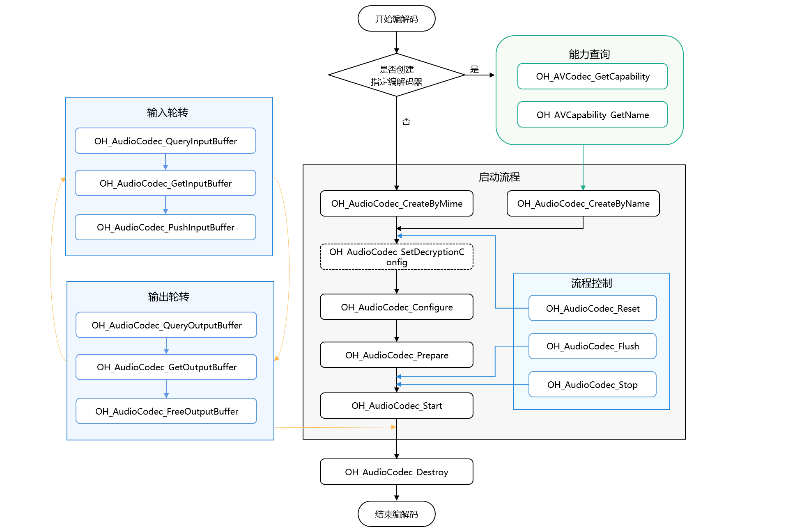

# 音频解码同步模式

开发者可以调用本模块的Native API接口，完成同步模式的音频解码，即将媒体数据解码为PCM码流。

支持的解码能力请参考[AVCodec支持的格式](avcodec-support-formats.md#音频解码)。

**适用场景**

通常推荐使用异步模式，详细内容请参考[音频解码](audio-decoding.md)。若需要主动请求buffer去送帧，则可以使用同步模式。
将音视频文件解码为PCM码流，通常需要以下步骤：[媒体数据解析](audio-video-demuxer.md) -> 音频解码。
本指南描述音频解码过程：输入音频帧和解码出PCM码流。

## 开发指导

详细的API说明请参考[AudioCodec](../../reference/apis-avcodec-kit/_audio_codec.md)。

参考以下示例代码，完成音频解码的全流程，包括：创建解码器、设置解码参数（采样率/码率/声道数等）、开始/刷新/重置/销毁资源。

在应用开发过程中，开发者应按顺序调用方法，执行操作，否则系统可能会抛出异常或生成其他未定义的行为。具体顺序可参考下列开发步骤及对应说明。

音频编解码同步模式调用关系图如下所示：

- 虚线表示可选。

- 实线表示必选。



### 在 CMake 脚本中链接动态库

```cmake
target_link_libraries(sample PUBLIC libnative_media_codecbase.so)
target_link_libraries(sample PUBLIC libnative_media_core.so)
target_link_libraries(sample PUBLIC libnative_media_acodec.so)
```
> **说明：**
>
> 上述'sample'字样仅为示例，开发者需根据实际工程目录进行自定义。

### 开发步骤

1. 添加头文件和命名空间。

    ```cpp
    #include <multimedia/player_framework/native_avcodec_audiocodec.h>
    #include <multimedia/native_audio_channel_layout.h>
    #include <multimedia/player_framework/native_avcapability.h>
    #include <multimedia/player_framework/native_avcodec_base.h>
    #include <multimedia/player_framework/native_avformat.h>
    #include <multimedia/player_framework/native_avbuffer.h>

    // c++标准库命名空间。
    using namespace std;
    ```

2. 创建解码器实例对象，OH_AVCodec *为解码器实例指针。

   应用可以通过媒体类型或编解码器名称创建解码器。

   方法一：通过Mimetype创建解码器。
    ```c++
    // 通过Mimetype创建解码器，这里示例创建的是AAC编码格式，第二个入参设置false表示当前是解码。
    OH_AVCodec *audioDec_ = OH_AudioCodec_CreateByMime(OH_AVCODEC_MIMETYPE_AUDIO_AAC, false);
    ```
   方法二：通过codec name创建解码器。
    ```c++
    // 通过codec name创建解码器。
    OH_AVCapability *capability = OH_AVCodec_GetCapability(OH_AVCODEC_MIMETYPE_AUDIO_AAC, false);
    const char *name = OH_AVCapability_GetName(capability);
    OH_AVCodec *audioDec_ = OH_AudioCodec_CreateByName(name);
    ```

3. （可选）OH_AudioCodec_SetDecryptionConfig设置解密配置。

    当获取到DRM信息（参考[音视频解封装](audio-video-demuxer.md)开发步骤第4步）后，通过此接口进行解密配置。

    DRM相关接口详见[DRM](../../reference/apis-drm-kit/capi-drm.md)。

    此接口需在Prepare前调用。

    添加头文件：

    ```c++
    #include <multimedia/drm_framework/native_mediakeysystem.h>
    #include <multimedia/drm_framework/native_mediakeysession.h>
    #include <multimedia/drm_framework/native_drm_err.h>
    #include <multimedia/drm_framework/native_drm_common.h>
    ```
    在CMake脚本中链接动态库：

    ``` cmake
    target_link_libraries(sample PUBLIC libnative_drm.so)
    ```

    使用示例：
    ```c++
    // 根据DRM信息创建指定的DRM系统, 以创建"com.clearplay.drm"为例。
    MediaKeySystem *system = nullptr;
    int32_t ret = OH_MediaKeySystem_Create("com.clearplay.drm", &system);
    if (system == nullptr) {
        printf("create media key system failed");
        return;
    }

    // 创建解密会话。
    MediaKeySession *session = nullptr;
    DRM_ContentProtectionLevel contentProtectionLevel = CONTENT_PROTECTION_LEVEL_SW_CRYPTO;
    ret = OH_MediaKeySystem_CreateMediaKeySession(system, &contentProtectionLevel, &session);
    if (ret != DRM_OK) {
        // 如果创建失败，请查看DRM接口文档及日志信息。
        printf("create media key session failed.");
        return;
    }
    if (session == nullptr) {
        printf("media key session is nullptr.");
        return;
    }
    // 获取许可证请求、设置许可证响应等。
    // 设置解密信息。将解密会话设置到解码器中。当前音频解密不支持安全解码器，设置为false。
    bool secureAudio = false;
    ret = OH_AudioCodec_SetDecryptionConfig(audioDec_, session, secureAudio);
    ```

4. 调用OH_AudioCodec_Configure()配置解码器。

   配置选项key值说明：

   |             key              |       描述       |                AAC                 | Flac |               Vorbis               | MPEG |       G711mu        |          AMR(amrnb、amrwb)         | APE |          G711a          |
   | ---------------------------- | :--------------: | :--------------------------------: | :--: | :--------------------------------: | :--: | :-----------------: | :-------------------------------: | :--: | :----------------------: |
   | OH_MD_KEY_ENABLE_SYNC_MODE   |   同步模式配置,打开同步模式时，必须配置为1   | 同步模式必须 | 同步模式必须 | 同步模式必须 | 同步模式必须 | 同步模式必须 | 同步模式必须 | 同步模式必须 | 同步模式必须 |
   | OH_MD_KEY_AUD_SAMPLE_RATE    |      采样率      |                必须                | 必须 |                必须                 | 必须 |        必须          |                必须                | 必须 |           必须           |
   | OH_MD_KEY_AUD_CHANNEL_COUNT  |      声道数      |                必须                | 必须 |                必须                 | 必须 |        必须          |                必须                | 必须 |           必须           |
   | OH_MD_KEY_MAX_INPUT_SIZE     |    最大输入长度   |                可选                | 可选 |                可选                 | 可选 |        可选           |               可选                | 可选 |          可选            |
   | OH_MD_KEY_AAC_IS_ADTS        |     是否adts     |             可选，默认1             |  -   |                 -                  |  -   |         -             |               -                  |  -  |         -                |
   | OH_MD_KEY_AUDIO_SAMPLE_FORMAT   |  输出音频流格式  | 可选（SAMPLE_S16LE，SAMPLE_F32LE） | 可选 | 可选（SAMPLE_S16LE，SAMPLE_F32LE） |  可选 | 可选（默认SAMPLE_S16LE）| 可选（SAMPLE_S16LE，SAMPLE_F32LE）| 可选 | 可选（默认SAMPLE_S16LE）|
   | OH_MD_KEY_BITRATE               |       码率      |                可选                | 可选 |                可选                | 可选 |         可选           |              可选                 | 可选 |         可选           |
   | OH_MD_KEY_IDENTIFICATION_HEADER |    ID Header    |                 -                  |  -   |    必须（和Codec_Config二选一）    |  -   |          -            |                -                  |  -  |           -            |
   | OH_MD_KEY_SETUP_HEADER          |   Setup Header  |                 -                  |  -   |    必须（和Codec_Config二选一）    |  -   |          -            |                -                 |  -  |            -            |
   | OH_MD_KEY_CODEC_CONFIG          | 编解码器特定数据 |                可选                 |  -   |   必须（和上述ID和Setup二选一）    |  -   |           -            |                -                 | 可选 |           -            |
   
   以下各音频解码类型参数范围说明：

   | 音频解码类型 |                                          采样率(Hz)                                              | 声道数 |
   | ----------- | ----------------------------------------------------------------------------------------------  | :----: |
   | AAC         | 8000、11025、12000、16000、22050、24000、32000、44100、48000、64000、88200、96000                 |  1~8   |
   | Flac        | 8000、11025、12000、16000、22050、24000、32000、44100、48000、64000、88200、96000、192000         |  1~8   |
   | Vorbis      | 8000、11025、12000、16000、22050、24000、32000、44100、48000、64000、88200、96000、176400、192000 |  1~8   |
   | MPEG(MP3)   | 8000、11025、12000、16000、22050、24000、32000、44100、48000                                     |  1~2   |
   | G711mu      | 8000                                                                                            |   1    |
   | AMR(amrnb)  | 8000                                                                                            |   1    |
   | AMR(amrwb)  | 16000                                                                                           |   1    |
   | APE         | 8000、11025、12000、16000、22050、24000、32000、44100、48000、64000、88200、96000、176400、192000 |  1~2   |
   | G711a       | 8000、11025、12000、16000、22050、24000、32000、44100、48000                                     |  1~6   |
   <!--RP4-->
   <!--RP4End-->

   ```c++
   // 配置音频采样率（必须）。
   constexpr uint32_t DEFAULT_SAMPLERATE = 44100;
   // 配置音频声道数（必须）。
   constexpr uint32_t DEFAULT_CHANNEL_COUNT = 2;
   // 配置是否为ADTS解码（aac解码时可选）。
   constexpr uint32_t DEFAULT_AAC_TYPE = 1;
   OH_AVFormat *format = OH_AVFormat_Create();
   // 写入format。
   OH_AVFormat_SetIntValue(format, OH_MD_KEY_AUD_SAMPLE_RATE, DEFAULT_SAMPLERATE);
   OH_AVFormat_SetIntValue(format, OH_MD_KEY_AUD_CHANNEL_COUNT, DEFAULT_CHANNEL_COUNT);
   OH_AVFormat_SetIntValue(format, OH_MD_KEY_AAC_IS_ADTS, DEFAULT_AAC_TYPE);
   OH_AVFormat_SetIntValue(format, OH_MD_KEY_ENABLE_SYNC_MODE, 1); // 同步模式配置。
   // 配置解码器。
   OH_AVErrCode ret = OH_AudioCodec_Configure(audioDec_, format);
   if (ret != AV_ERR_OK) {
       // 异常处理。
   }
   ```

5. 调用OH_AudioCodec_Prepare()，解码器就绪。

   ```c++
   OH_AVErrCode ret = OH_AudioCodec_Prepare(audioDec_);
   if (ret != AV_ERR_OK) {
       // 异常处理。
   }
   ```

6. 调用OH_AudioCodec_Start()启动解码器，进入运行态。

   添加头文件：
    ```c++
    #include <fstream>
    ```

   使用示例：
    ```c++
    ifstream inputFile_;
    ofstream outFile_;

    // 根据实际使用情况填写输入文件路径。为便于演示音频解码功能，此处输入文件包含音频帧及相关信息，而非可直接播放的音频文件。
    const char* inputFilePath = "/";
    // 根据实际使用情况填写输出文件路径。本指南仅演示音频解码功能，解码后的PCM数据保存到文件中，未作进一步处理。
    const char* outputFilePath = "/";
    // 打开待解码二进制文件路径。
    inputFile_.open(inputFilePath, ios::in | ios::binary); 
    // 配置解码文件输出路径。
    outFile_.open(outputFilePath, ios::out | ios::binary);
    // 开始解码。
    OH_AVErrCode ret = OH_AudioCodec_Start(audioDec_);
    if (ret != AV_ERR_OK) {
        // 异常处理。
    }
    ```
   
7. （可选）调用OH_AVCencInfo_SetAVBuffer()，设置cencInfo。

    如果当前播放的节目是DRM加密节目，并且由上层应用进行[媒体数据解析](audio-video-demuxer.md)，则需要调用OH_AVCencInfo_SetAVBuffer()将cencInfo设置给AVBuffer，以实现媒体数据的解密。

    添加头文件：

    ```c++
    #include <multimedia/player_framework/native_cencinfo.h>
    ```
    在CMake脚本中链接动态库：

    ``` cmake
    target_link_libraries(sample PUBLIC libnative_media_avcencinfo.so)
    ```

    使用示例：
    ```c++
    auto buffer = signal_->inBufferQueue_.front();
    uint32_t keyIdLen = DRM_KEY_ID_SIZE;
    uint8_t keyId[] = {
        0xd4, 0xb2, 0x01, 0xe4, 0x61, 0xc8, 0x98, 0x96,
        0xcf, 0x05, 0x22, 0x39, 0x8d, 0x09, 0xe6, 0x28};
    uint32_t ivLen = DRM_KEY_IV_SIZE;
    uint8_t iv[] = {
        0xbf, 0x77, 0xed, 0x51, 0x81, 0xde, 0x36, 0x3e,
        0x52, 0xf7, 0x20, 0x4f, 0x72, 0x14, 0xa3, 0x95};
    uint32_t encryptedBlockCount = 0;
    uint32_t skippedBlockCount = 0;
    uint32_t firstEncryptedOffset = 0;
    uint32_t subsampleCount = 1;
    DrmSubsample subsamples[1] = { {0x10, 0x16} };
    // 创建CencInfo实例。
    OH_AVCencInfo *cencInfo = OH_AVCencInfo_Create();
    if (cencInfo == nullptr) {
        // 异常处理。
    }
    // 设置解密算法。
    OH_AVErrCode errNo = OH_AVCencInfo_SetAlgorithm(cencInfo, DRM_ALG_CENC_AES_CTR);
    if (errNo != AV_ERR_OK) {
        // 异常处理。
    }
    // 设置KeyId和Iv。
    errNo = OH_AVCencInfo_SetKeyIdAndIv(cencInfo, keyId, keyIdLen, iv, ivLen);
    if (errNo != AV_ERR_OK) {
        // 异常处理。
    }
    // 设置Sample信息。
    errNo = OH_AVCencInfo_SetSubsampleInfo(cencInfo, encryptedBlockCount, skippedBlockCount, firstEncryptedOffset,
        subsampleCount, subsamples);
    if (errNo != AV_ERR_OK) {
        // 异常处理。
    }
    // 设置模式：KeyId、Iv和SubSamples已被设置。
    errNo = OH_AVCencInfo_SetMode(cencInfo, DRM_CENC_INFO_KEY_IV_SUBSAMPLES_SET);
    if (errNo != AV_ERR_OK) {
        // 异常处理。
    }
    // 将CencInfo设置到AVBuffer中。
    errNo = OH_AVCencInfo_SetAVBuffer(cencInfo, buffer);
    if (errNo != AV_ERR_OK) {
        // 异常处理。
    }
    // 销毁CencInfo实例。
    errNo = OH_AVCencInfo_Destroy(cencInfo);
    if (errNo != AV_ERR_OK) {
        // 异常处理。
    }
    ```
   
8. 同步模式调用，写入待解码的数据，获取解码的输出。

   读取数据：
   ```c++
   // size是待解码数据的每帧帧长度。pts是每帧的时间戳，用于指示音频应该何时被播放。
   // size和pts的获取来源：音视频资源文件或者待解码的数据流。
   // 如果是解码音视频资源文件，则需要从解封装OH_AVDemuxer_ReadSampleBuffer的buffer中获取。
   // 如果是解码数据流，则需要从数据流的提供者获取。
   // 此处为了介绍解码功能以测试文件中保存的size和pts为示例。
   bool DecoderFillInputBuffer(OH_AVBuffer *buffer, ifstream &inputFile)
   {
       OH_AVCodecBufferAttr attr;
       memset(&attr, 0, sizeof(attr));
       attr.flags = AVCODEC_BUFFER_FLAGS_EOS;
       bool finished = true;
       do {
           int64_t size;
           inputFile.read(reinterpret_cast<char *>(&size), sizeof(size));
           if (inputFile.eof() || inputFile.gcount() != sizeof(size)) {
               break;
           }
           inputFile.read(reinterpret_cast<char *>(&attr.pts), sizeof(attr.pts));
           if (inputFile.gcount() != sizeof(attr.pts)) {
               break;
           }
           attr.size = static_cast<int32_t>(size);
           if (attr.size > 0) {
               inputFile.read((char *)OH_AVBuffer_GetAddr(buffer), attr.size);
               attr.flags = AVCODEC_BUFFER_FLAGS_NONE;
               finished = false;
           }
       } while (0);
       OH_AVBuffer_SetBufferAttr(buffer, &attr);
       return finished;
   }
   bool InputOneFrame(OH_AVCodec *codec, ifstream &inputFile)
   {
       uint32_t index = 0;
       bool finished = true;
       OH_AVErrCode ret = OH_AudioCodec_QueryInputBuffer(codec, &index, 20000); // 20000us
       if (ret == AV_ERR_TRY_AGAIN_LATER) {
           // 超时，异常处理，设置的超时时间过短或输入输出buffer没有消耗/释放导致解码阻塞。
           return finished;
       }
       if (ret != AV_ERR_OK) {
           // 异常处理。
           return finished;
       }
       OH_AVBuffer *inputBuf = OH_AudioCodec_GetInputBuffer(codec, index);
       if (inputBuf == nullptr) {
           // 异常处理。
           return finished;
       }
       finished = DecoderFillInputBuffer(inputBuf, inputFile);
       OH_AudioCodec_PushInputBuffer(codec, index);
       return finished;
   }
   
   ```

   需开发者填充完整的输入数据后调用。

   结束时需要对flags标识成AVCODEC_BUFFER_FLAGS_EOS。

    ```c++
    bool inputFinished = false;
    for (;;) {
        if (!inputFinished) {
            inputFinished = InputOneFrame(audioDec_, inputFile_);
        }
        uint32_t index;
        OH_AVErrCode ret = OH_AudioCodec_QueryOutputBuffer(audioDec_, &index, 20000); // 20000us
        if (ret == AV_ERR_TRY_AGAIN_LATER) {
            // 超时，异常处理，设置的超时时间过短或输入输出buffer没有消耗/释放导致解码阻塞。
            continue;
        } else if (ret == AV_ERR_STREAM_CHANGED) {
            // 解码输出参数变化后的回调处理，应用根据实际情况进行处理。
            OH_AVFormat *outFormat = OH_AudioCodec_GetOutputDescription(audioDec_);
            int32_t sampleRate;
            int32_t channelCount;
            int32_t sampleFormat;
            if (OH_AVFormat_GetIntValue(outFormat, OH_MD_KEY_AUD_SAMPLE_RATE, &sampleRate)) {
                // 判断采样率是否发生变化，进行对应处理。
            }
            if (OH_AVFormat_GetIntValue(outFormat, OH_MD_KEY_AUD_CHANNEL_COUNT, &channelCount)) {
                // 判断声道数是否发生变化，进行对应处理。
            }
            if (OH_AVFormat_GetIntValue(outFormat, OH_MD_KEY_AUDIO_SAMPLE_FORMAT, &sampleFormat)) {
                // 判断音频采样格式是否发生变化，进行对应处理。
            }
            continue;
        }
        if (ret != AV_ERR_OK) {
            // 异常处理。
            break;
        }
        OH_AVBuffer *outputBuf = OH_AudioCodec_GetOutputBuffer(audioDec_, index);
        if (outputBuf == nullptr) {
            // 异常处理。
            break;
        }
        OH_AVCodecBufferAttr attr;
        if (OH_AVBuffer_GetBufferAttr(outputBuf, &attr) != AV_ERR_OK) {
            // 异常处理。
            break;
        }
        if (attr.flags & AVCODEC_BUFFER_FLAGS_EOS) {
            OH_AudioCodec_FreeOutputBuffer(audioDec_, index);
            // 解码输出结束。
            break;
        }
        outFile_.write(reinterpret_cast<char *>(OH_AVBuffer_GetAddr(outputBuf)), attr.size);
        OH_AudioCodec_FreeOutputBuffer(audioDec_, index);
    }
    ```

9. （可选）调用OH_AudioCodec_Flush()刷新解码器。

    调用OH_AudioCodec_Flush()后，解码器仍处于运行态，但会清空当前队列，释放已解码的数据。刷新前获取到的输入输出buffer都无法接续使用。

    此时需要调用OH_AudioCodec_Start()重新开始解码。

    使用情况：
    * 之前输入的数据不再使用的场景，例如在解封装seek之后，调用刷新。
    * 在文件EOS之后，需要调用刷新。
    * 在执行过程中遇到可继续执行的错误时（即OH_AudioCodec_IsValid 为true）调用。

    ```c++
    // 刷新解码器audioDec_。
    OH_AVErrCode ret = OH_AudioCodec_Flush(audioDec_);
    if (ret != AV_ERR_OK) {
        // 异常处理。
    }
    // 重新开始解码。
    ret = OH_AudioCodec_Start(audioDec_);
    if (ret != AV_ERR_OK) {
        // 异常处理。
    }
    ```

10. （可选）调用OH_AudioCodec_Reset()重置解码器。

    调用OH_AudioCodec_Reset()后，解码器回到初始化的状态，需要先调用OH_AudioCodec_Configure()重新配置，再调用OH_AudioCodec_Start()重新开始解码。

    ```c++
    // 重置解码器audioDec_。
    OH_AVErrCode ret = OH_AudioCodec_Reset(audioDec_);
    if (ret != AV_ERR_OK) {
        // 异常处理。
    }
    // 重新配置解码器参数。
    ret = OH_AudioCodec_Configure(audioDec_, format);
    if (ret != AV_ERR_OK) {
        // 异常处理。
    }
    ```

11. 调用OH_AudioCodec_Stop()停止解码器。

    停止后，可以通过调用OH_AudioCodec_Start()重新进入已启动状态（started）。停止前获取到的输入输出buffer都无法接续使用，需要在启动后重新获取输入输出buffer。

    ```c++
    // 终止解码器audioDec_。
    OH_AVErrCode ret = OH_AudioCodec_Stop(audioDec_);
    if (ret != AV_ERR_OK) {
        // 异常处理。
    }
    ```

12. 调用OH_AudioCodec_Destroy()销毁解码器实例，释放资源。

    > **说明：**
    >
    > 禁止重复销毁解码器。

    ```c++
    // 调用OH_AudioCodec_Destroy, 销毁解码器。
    OH_AVErrCode ret = OH_AudioCodec_Destroy(audioDec_);
    if (ret != AV_ERR_OK) {
        // 异常处理。
    } else {
        audioDec_ = NULL; // 不可重复destroy。
    }
    ```
