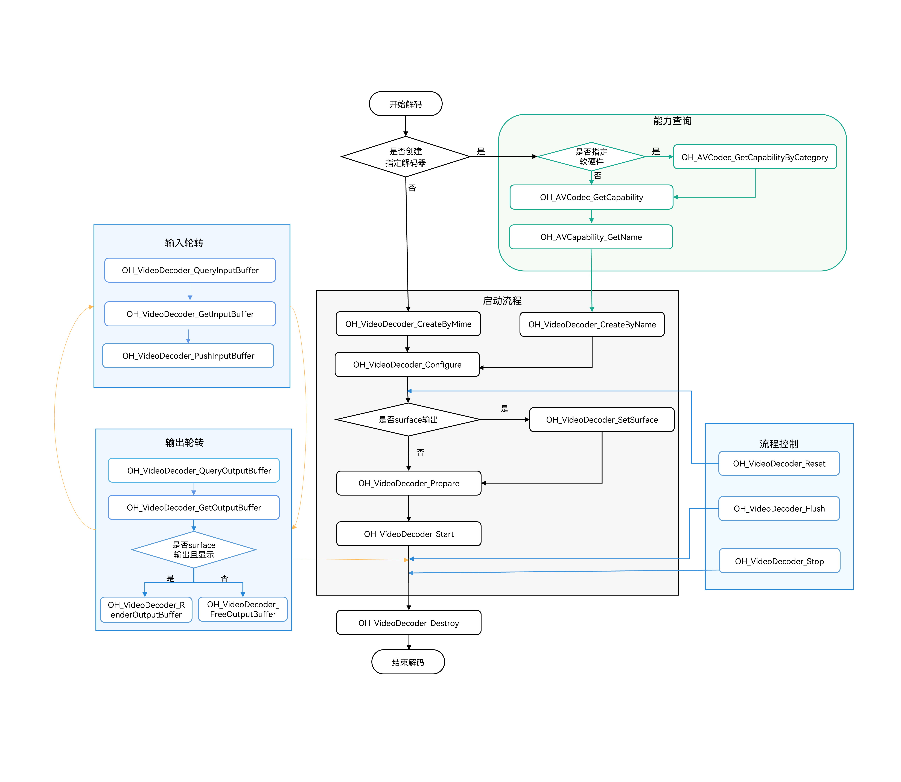

# 视频解码同步模式

<!--Kit: AVCodec Kit-->
<!--Subsystem: Multimedia-->
<!--Owner: @zhanghongran-->
<!--Designer: @dpy2650--->
<!--Tester: @cyakee-->
<!--Adviser: @zengyawen-->

从API 20开始，支持视频解码同步模式。

开发者可以调用本模块的Native API接口，完成同步模式的视频解码。

当前支持的解码能力，请参考[AVCodec支持的格式](avcodec-support-formats.md#视频解码)。

视频解码的限制约束、支持的能力、状态机调用关系请参考[视频解码](video-decoding.md)。

## 适用场景

通常情况下，推荐使用异步模式。若需要主动请求buffer去送帧，则可以采用同步模式。


## 开发指导

详细的API说明请参考[VideoDecoder](../../reference/apis-avcodec-kit/_video_decoder.md)。

- 虚线表示可选。

- 实线表示必选。



### 在CMake脚本中链接动态库

``` cmake
target_link_libraries(sample PUBLIC libnative_media_codecbase.so)
target_link_libraries(sample PUBLIC libnative_media_core.so)
target_link_libraries(sample PUBLIC libnative_media_vdec.so)
```

> **说明：**
>
> 上述'sample'字样仅为示例，此处由开发者根据实际工程目录自定义。
>

### 定义基础结构

本部分示例代码按照C++17标准编写，仅作参考。

1. 添加头文件。

    ```c++
    #include <multimedia/player_framework/native_avcodec_videodecoder.h>
    #include <multimedia/player_framework/native_avcapability.h>
    #include <multimedia/player_framework/native_avcodec_base.h>
    #include <multimedia/player_framework/native_avformat.h>
    #include <multimedia/player_framework/native_avbuffer.h>
    #include <multimedia/player_framework/native_averrors.h>
    #include <native_buffer/native_buffer.h>
    #include <memory>
    #include <fstream>
    #include <mutex>
    #include <shared_mutex>
    #include <string.h>
    ```
    
2. 全局变量（仅作参考，可以根据实际情况将其封装到对象中）。

    ```c++
    // 视频帧宽度。
    int32_t width = 320;
    // 视频帧高度。
    int32_t height = 240;
    // 视频像素格式。
    OH_AVPixelFormat pixelFormat = AV_PIXEL_FORMAT_NV12;
    // 解码器同步锁。
    std::shared_mutex codecMutex;
    // 解码器实例指针。
    OH_AVCodec *videoDec = nullptr;
    // 解码输出。
    bool outputDone = false;
    // 解码输入。
    bool inputDone = false;
    std::unique_ptr<std::ifstream> inFile_;
    ```

### Surface模式

参考以下示例代码，可以完成Surface模式下视频解码的全流程，实现同步模式的数据轮转。此处以输入H.264码流文件，解码送显输出为例。


1. 创建解码器实例。

    通过名称创建解码器。示例中的变量说明如下：

    - videoDec：视频解码器实例的指针。
    - capability：解码器能力查询实例的指针。
    - OH_AVCODEC_MIMETYPE_VIDEO_AVC：AVC格式视频编解码器。

    ```c++
    // 创建硬件解码器实例。
    OH_AVCapability *capability= OH_AVCodec_GetCapabilityByCategory(OH_AVCODEC_MIMETYPE_VIDEO_AVC, false, HARDWARE);
    const char *name = OH_AVCapability_GetName(capability);
    OH_AVCodec *videoDec = OH_VideoDecoder_CreateByName(name);
    if (videoDec == nullptr) {
        printf("create videoDec failed");
        return;
    }
    ```
2. 调用OH_VideoDecoder_Configure()配置解码器。

    - 详细可配置选项的说明请参考[媒体数据键值对](../../reference/apis-avcodec-kit/_codec_base.md#媒体数据键值对)。
    - 参数校验规则请参考[OH_VideoDecoder_Configure()](../../reference/apis-avcodec-kit/_video_decoder.md#oh_videodecoder_configure)。
    - 参数取值范围可以通过能力查询接口获取，具体示例请参考[获取支持的编解码能力](obtain-supported-codecs.md)。

    目前支持的所有格式都必须配置以下选项：视频帧宽度、视频帧高度。

    ```c++

    auto format = std::shared_ptr<OH_AVFormat>(OH_AVFormat_Create(), OH_AVFormat_Destroy);
    if (format == nullptr) {
        // 异常处理。
    }
    // 写入format。
    OH_AVFormat_SetIntValue(format.get(), OH_MD_KEY_WIDTH, width); // 必须配置。
    OH_AVFormat_SetIntValue(format.get(), OH_MD_KEY_HEIGHT, height); // 必须配置。
    OH_AVFormat_SetIntValue(format.get(), OH_MD_KEY_PIXEL_FORMAT, pixelFormat);
    OH_AVFormat_SetIntValue(format.get(), OH_MD_KEY_ENABLE_SYNC_MODE, 1); // 同步模式配置。
    // 配置解码器。
    OH_AVErrCode ret = OH_VideoDecoder_Configure(videoDec, format.get());
    if (ret != AV_ERR_OK) {
        // 异常处理。
    }
    ```

    > **注意：**
    >
    > 1. 要使能视频解码同步模式，必须将OH_MD_KEY_ENABLE_SYNC_MODE配置为1。
    > 2. 同步模式在调用OH_VideoDecoder_Configure接口前不能调用OH_VideoDecoder_RegisterCallback接口，否则为异步模式。
    >

3. 设置surface。

   示例中的变量说明如下：
   - nativeWindow：获取方式请参考[视频解码Surface模式](video-decoding.md#surface模式)的“步骤-6：设置surface”。

    ```c++
    // 设置surface。
    // 配置送显窗口参数。
    OH_AVErrCode ret = OH_VideoDecoder_SetSurface(videoDec, nativeWindow);  
    if (ret != AV_ERR_OK) {
        // 异常处理。
    }
    ```


4. 调用OH_VideoDecoder_Prepare()解码器就绪。

    该接口将在解码器运行前进行一些数据的准备工作。

    ```c++
    OH_AVErrCode ret = OH_VideoDecoder_Prepare(videoDec);
    if (ret != AV_ERR_OK) {
        // 异常处理。
    }
    ```

5. 调用OH_VideoDecoder_Start()启动解码器。

    ```c++
    // 启动解码器，开始解码。
    OH_AVErrCode ret = OH_VideoDecoder_Start(videoDec);
    if (ret != AV_ERR_OK) {
        // 异常处理。
    }
    ```

6. 获取可用buffer并写入码流至解码器。

    - 调用[OH_VideoDecoder_QueryInputBuffer](../../reference/apis-avcodec-kit/_video_decoder.md#oh_videodecoder_queryinputbuffer)接口获取下一个可用的输入缓冲区（buffer）的索引（index）。
    - 根据获取的索引（index），调用[OH_VideoDecoder_GetInputBuffer](../../reference/apis-avcodec-kit/_video_decoder.md#oh_videodecoder_getinputbuffer)接口获取对应的缓冲区（buffer）实例。
    - 将待解码数据写入该缓冲区（buffer）后，调用[OH_VideoDecoder_PushInputBuffer](../../reference/apis-avcodec-kit/_video_decoder.md#oh_videodecoder_pushinputbuffer)接口提交至解码器进行解码。当所有待处理数据全部传递给解码器后，需要将flag标识成AVCODEC_BUFFER_FLAGS_EOS，通知解码器输入结束。


    送入输入队列进行解码，示例中的变量说明如下：
    - size、offset、pts、frameData：输入尺寸、偏移量、时间戳、帧数据等字段信息，获取方式可以参考[媒体数据解析](./audio-video-demuxer.md#开发步骤)“步骤-9：开始解封装，循环获取sample”。
    - flags：缓冲区标记的类别，请参考[OH_AVCodecBufferFlags](../../reference/apis-avcodec-kit/capi-native-avbuffer-info-h.md#oh_avcodecbufferflags)。

    ```c++
    bool DecoderInput(OH_AVCodec *videoDec, int64_t timeoutUs)
    {    
        uint32_t index;
        std::shared_lock<std::shared_mutex> lock(codecMutex);

        OH_AVErrCode ret = OH_VideoDecoder_QueryInputBuffer(videoDec, &index, timeoutUs);
        switch (ret) {
            case AV_ERR_OK: {
                OH_AVBuffer *buffer = OH_VideoDecoder_GetInputBuffer(videoDec, index);
                if (buffer == nullptr) {
                    // 异常处理。
                    return false;
                }
                // 写入码流数据。
                uint8_t *addr = OH_AVBuffer_GetAddr(buffer);
                if (addr == nullptr) {
                   // 异常处理。
                   return false;
                }
                // buffer数据填充。
                int32_t capacity = OH_AVBuffer_GetCapacity(buffer);
                if (size > capacity) {
                    // 异常处理。
                }
                memcpy(addr, frameData, size);

                OH_AVCodecBufferAttr info;
                // buffer属性配置。
                // 配置帧数据的输入尺寸、偏移量、时间戳等字段信息。
                info.size = size;
                info.offset = offset;
                info.pts = pts;
                if (inFile_->eof()) {
                    info.flags = AVCODEC_BUFFER_FLAGS_EOS;
                } else {
                    info.flags = flags;
                }
                OH_AVErrCode setBufferRet = OH_AVBuffer_SetBufferAttr(buffer, &info);
                if (setBufferRet != AV_ERR_OK) {
                    // 异常处理。
                    return false;
                }    
                OH_AVErrCode pushInputRet = OH_VideoDecoder_PushInputBuffer(videoDec, index);
                if (pushInputRet != AV_ERR_OK) {
                    // 异常处理。
                    return false;
                }
                if (inFile_->eof()) {
                    inputDone = 1;
                }
                break;
            }
            case AV_ERR_TRY_AGAIN_LATER: {
                break;
            }
            default: {
                // 异常处理。
                return false;
            }    
        }
        return true;
    }
    ```

7. 获取可用buffer显示并释放解码帧。

   - 调用[OH_VideoDecoder_QueryOutputBuffer](../../reference/apis-avcodec-kit/_video_decoder.md#oh_videodecoder_queryoutputbuffer)接口获取下一个可用的输出缓冲区（buffer）的索引（index）。
   - 根据获取的索引（index），调用[OH_VideoDecoder_GetOutputBuffer](../../reference/apis-avcodec-kit/_video_decoder.md#oh_videodecoder_getoutputbuffer)接口获取对应的缓冲区（buffer）实例。
   - 根据开发者设置的isRender标志决定后续操作：若无需送显，则调用[OH_VideoDecoder_FreeOutputBuffer](../../reference/apis-avcodec-kit/_video_decoder.md#oh_videodecoder_freeoutputbuffer)接口释放解码帧。若需送显，则可调用[OH_VideoDecoder_RenderOutputBuffer](../../reference/apis-avcodec-kit/_video_decoder.md#oh_videodecoder_renderoutputbuffer)接口显示并自动释放解码帧，或调用[OH_VideoDecoder_RenderOutputBufferAtTime](../../reference/apis-avcodec-kit/_video_decoder.md#oh_videodecoder_renderoutputbufferattime)接口在指定时间点显示并释放解码帧。


    ```c++
    bool DecoderOutput(OH_AVCodec *videoDec, int64_t timeoutUs)
    {
        uint32_t index;
        std::shared_lock<std::shared_mutex> lock(codecMutex);

        OH_AVErrCode ret = OH_VideoDecoder_QueryOutputBuffer(videoDec, &index, timeoutUs);
        switch (ret) {
            case AV_ERR_OK: {
                OH_AVBuffer *buffer = OH_VideoDecoder_GetOutputBuffer(videoDec, index);
                if (buffer == nullptr) {
                    // 异常处理。
                    return false;
                }
            
                // 获取解码后信息。
                OH_AVCodecBufferAttr info;
                OH_AVErrCode getBufferRet = OH_AVBuffer_GetBufferAttr(buffer, &info);
                if (getBufferRet != AV_ERR_OK) {
                    // 异常处理。                    
                    return false;
                }
                if (info.flags & AVCODEC_BUFFER_FLAGS_EOS) {
                    outputDone = 1;
                }
                
                // 解码输出数据处理。
                // 值由开发者决定。
                bool isRender;
                bool isNeedRenderAtTime;
                OH_AVErrCode result = AV_ERR_OK;
                if (isRender) {
                    // 显示并释放已完成处理的信息，index为对应buffer队列的下标。
                    if (isNeedRenderAtTime){
                        // 获取系统绝对时间，renderTimestamp由开发者结合业务指定显示时间。
                        int64_t renderTimestamp =
                            std::chrono::duration_cast<std::chrono::nanoseconds>(std::chrono::high_resolution_clock::now().time_since_epoch()).count();
                        result = OH_VideoDecoder_RenderOutputBufferAtTime(videoDec, index, renderTimestamp);
                    } else {
                        result = OH_VideoDecoder_RenderOutputBuffer(videoDec, index);
                    }
                } else {
                    // 释放已完成处理的信息。
                    result = OH_VideoDecoder_FreeOutputBuffer(videoDec, index);
                }
                if (result != AV_ERR_OK) {
                    // 异常处理。
                    return false;
                }
                break;
            }
            case AV_ERR_TRY_AGAIN_LATER: {
                break;
            }
            case AV_ERR_STREAM_CHANGED: {
                auto format = std::shared_ptr<OH_AVFormat>(OH_VideoDecoder_GetOutputDescription(videoDec), OH_AVFormat_Destroy);
                if (format == nullptr) {
                    // 异常处理。
                }
                // 获取新宽高。
                bool getIntRet = OH_AVFormat_GetIntValue(format.get(), OH_MD_KEY_VIDEO_PIC_WIDTH, &width) &&
                                 OH_AVFormat_GetIntValue(format.get(), OH_MD_KEY_VIDEO_PIC_HEIGHT, &height);
                if (!getIntRet) {
             	    // 异常处理。
                }
                break;
            }
            default: {
                // 异常处理。
                return false;
            }
        }
        return true;
    }
    ```

8. 解码器送帧/出帧处理循环。

    ```c++
    bool result = true;
    int64_t timeoutUs = 0; // 单位：微秒（us），负值：无限等待；0：立即退出；正值：指定时间后结束后退出。

    while (!outputDone && result) {
        if (!inputDone) {
            result = DecoderInput(videoDec, timeoutUs);
        }
        if (!outputDone) {
            result = DecoderOutput(videoDec, timeoutUs);
        }
    }
    ```

9. （可选）调用OH_VideoDecoder_Flush()刷新解码器。

    调用OH_VideoDecoder_Flush接口后，解码器仍处于运行态，但会清除解码器中缓存的输入和输出数据及参数集如H.264格式的PPS/SPS。
    此时需要调用[OH_VideoDecoder_Start](../../reference/apis-avcodec-kit/_video_decoder.md#oh_videodecoder_start)接口重新开始解码。

    ```c++
    // 通过codecMutex来避免调用Flush接口，状态切换后，解码线程还在跑会退出循环的问题。
    std::unique_lock<std::shared_mutex> lock(codecMutex);
    // 刷新解码器videoDec。
    OH_AVErrCode ret = OH_VideoDecoder_Flush(videoDec);
    if (ret != AV_ERR_OK) {
        // 异常处理。
    }

    // 重新开始解码。
    ret = OH_VideoDecoder_Start(videoDec);
    if (ret != AV_ERR_OK) {
        // 异常处理。
    }
    ```

10. （可选）调用OH_VideoDecoder_Reset()重置解码器。

    调用OH_VideoDecoder_Reset接口后，解码器回到初始化的状态，需要调用接口[OH_VideoDecoder_Configure](../../reference/apis-avcodec-kit/_video_decoder.md#oh_videodecoder_configure)、[OH_VideoDecoder_SetSurface](../../reference/apis-avcodec-kit/_video_decoder.md#oh_videodecoder_setsurface)和[OH_VideoDecoder_Prepare](../../reference/apis-avcodec-kit/_video_decoder.md#oh_videodecoder_prepare)重新配置。

    ```c++
    // 重置解码器videoDec。
    std::unique_lock<std::shared_mutex> lock(codecMutex);
    OH_AVErrCode resetRet = OH_VideoDecoder_Reset(videoDec);
    if (resetRet != AV_ERR_OK) {
        // 异常处理。
    }
 
    // 重新配置解码器参数。
    auto format = std::shared_ptr<OH_AVFormat>(OH_AVFormat_Create(), OH_AVFormat_Destroy);
    if (format == nullptr) {
        // 异常处理。
    }
    OH_AVErrCode configRet = OH_VideoDecoder_Configure(videoDec, format.get());
    if (configRet != AV_ERR_OK) {
        // 异常处理。
    }

    // Surface模式需要重新配置surface，而Buffer模式不需要配置surface。
    OH_AVErrCode setRet = OH_VideoDecoder_SetSurface(videoDec, nativeWindow);
    if (setRet != AV_ERR_OK) {
        // 异常处理。
    }
    // 解码器重新就绪。
    OH_AVErrCode prepareRet = OH_VideoDecoder_Prepare(videoDec);
    if (prepareRet != AV_ERR_OK) {
        // 异常处理。
    }
    ```

    > **注意：**
    >
    > 解码器回到初始化的状态，调用OH_VideoDecoder_Configure接口重新配置解码器参数时，同步模式需要重新配置OH_MD_KEY_ENABLE_SYNC_MODE为1，否则为异步模式。
    >

11. （可选）调用OH_VideoDecoder_Stop()停止解码器。

    调用OH_VideoDecoder_Stop()后，解码器保留解码实例，释放输入输出buffer。

    ```c++
    // 终止解码器videoDec。
    std::unique_lock<std::shared_mutex> lock(codecMutex);
    OH_AVErrCode ret = OH_VideoDecoder_Stop(videoDec);
    if (ret != AV_ERR_OK) {
        // 异常处理。
    }
    ```

12. 调用OH_VideoDecoder_Destroy()销毁解码器实例，释放资源。

    ```c++
    // 调用OH_VideoDecoder_Destroy，注销解码器。
    std::unique_lock<std::shared_mutex> lock(codecMutex);
    OH_AVErrCode ret = AV_ERR_OK;
    if (videoDec != nullptr) {
        ret = OH_VideoDecoder_Destroy(videoDec);
        videoDec = nullptr;
    }
    if (ret != AV_ERR_OK) {
        // 异常处理。
    }
    ```

    > **说明：**
    >
    > 执行该步骤之后，需要开发者将videoDec指向nullptr，防止野指针导致程序错误。
    >

### Buffer模式

参考以下示例代码，可以完成Buffer模式下视频解码的全流程，实现同步模式的数据轮转。此处以输入H.264码流文件，解码成YUV文件为例。

1. 创建解码器实例。

    与Surface模式相同，此处不再赘述。

    ```c++
    // 通过codecname创建解码器，应用有特殊需求，比如选择支持某种分辨率规格的解码器，可先查询capability，再根据codec name创建解码器。
    OH_AVCapability *capability = OH_AVCodec_GetCapability(OH_AVCODEC_MIMETYPE_VIDEO_AVC, false);
    const char *name = OH_AVCapability_GetName(capability);
    OH_AVCodec *videoDec = OH_VideoDecoder_CreateByName(name);
    if (videoDec == nullptr) {
        printf("create videoDec failed");
        return;
    }
    ```

2. 调用OH_VideoDecoder_Configure()配置解码器。

    与Surface模式相同，此处不再赘述。

    ```c++

    auto format = std::shared_ptr<OH_AVFormat>(OH_AVFormat_Create(), OH_AVFormat_Destroy);
    if (format == nullptr) {
        // 异常处理。
    }
    // 写入format。
    OH_AVFormat_SetIntValue(format.get(), OH_MD_KEY_WIDTH, width); // 必须配置。
    OH_AVFormat_SetIntValue(format.get(), OH_MD_KEY_HEIGHT, height); // 必须配置。
    OH_AVFormat_SetIntValue(format.get(), OH_MD_KEY_PIXEL_FORMAT, pixelFormat);
    OH_AVFormat_SetIntValue(format.get(), OH_MD_KEY_ENABLE_SYNC_MODE, 1); // 同步模式配置。
    // 配置解码器。
    OH_AVErrCode ret = OH_VideoDecoder_Configure(videoDec, format.get());
    if (ret != AV_ERR_OK) {
        // 异常处理。
    }
    ```

    > **注意：**
    >
    > 1. 要使能视频解码同步模式，必须将OH_MD_KEY_ENABLE_SYNC_MODE配置为1。
    > 2. 同步模式在调用OH_VideoDecoder_Configure接口前不能调用OH_VideoDecoder_RegisterCallback接口，否则为异步模式。
    >

3. 调用OH_VideoDecoder_Prepare()解码器就绪。

    该接口将在解码器运行前进行一些数据的准备工作。

    ```c++
    OH_AVErrCode ret = OH_VideoDecoder_Prepare(videoDec);
    if (ret != AV_ERR_OK) {
        // 异常处理。
    }
    ```

4. 调用OH_VideoDecoder_Start()启动解码器。

    ```c++
    std::unique_ptr<std::ofstream> outputFile = std::make_unique<std::ofstream>();
    if (outputFile != nullptr) {
        outputFile->open("/*yourpath*.yuv", std::ios::out | std::ios::binary | std::ios::ate);
    }
    // 启动解码器，开始解码。
    OH_AVErrCode ret = OH_VideoDecoder_Start(videoDec);
    if (ret != AV_ERR_OK) {
        // 异常处理。
    }
    ```

5. 获取可用buffer并写入码流至解码器。

    - 调用[OH_VideoDecoder_QueryInputBuffer](../../reference/apis-avcodec-kit/_video_decoder.md#oh_videodecoder_queryinputbuffer)接口获取下一个可用的输入缓冲区（buffer）的索引（index）。
    - 根据获取的索引（index），调用[OH_VideoDecoder_GetInputBuffer](../../reference/apis-avcodec-kit/_video_decoder.md#oh_videodecoder_getinputbuffer)接口获取对应的缓冲区（buffer）实例。
    - 将待解码数据写入该缓冲区（buffer）后，调用[OH_VideoDecoder_PushInputBuffer](../../reference/apis-avcodec-kit/_video_decoder.md#oh_videodecoder_pushinputbuffer)接口提交至解码器进行解码。当所有待处理数据全部传递给解码器后，需要将flag标识成AVCODEC_BUFFER_FLAGS_EOS，通知解码器输入结束。

    示例中的变量size、offset、pts、frameData、flags说明与Surface模式相同，此处不再赘述。

    ```c++
    bool DecoderInput(OH_AVCodec *videoDec, int64_t timeoutUs)
    {    
        uint32_t index;
        std::shared_lock<std::shared_mutex> lock(codecMutex);

        OH_AVErrCode ret = OH_VideoDecoder_QueryInputBuffer(videoDec, &index, timeoutUs);
        switch (ret) {
            case AV_ERR_OK: {
                OH_AVBuffer *buffer = OH_VideoDecoder_GetInputBuffer(videoDec, index);
                if (buffer == nullptr) {
                    // 异常处理。
                    return false;
                }
                // 写入码流数据。
                uint8_t *addr = OH_AVBuffer_GetAddr(buffer);
                if (addr == nullptr) {
                   // 异常处理。
                   return false;
                }
                // buffer数据填充。
                int32_t capacity = OH_AVBuffer_GetCapacity(buffer);
                if (size > capacity) {
                    // 异常处理。
                }
                memcpy(addr, frameData, size);

                OH_AVCodecBufferAttr info;
                // buffer属性配置。
                // 配置帧数据的输入尺寸、偏移量、时间戳等字段信息。
                info.size = size;
                info.offset = offset;
                info.pts = pts;
                if (inFile_->eof()) {
                    info.flags = AVCODEC_BUFFER_FLAGS_EOS;
                } else {
                    info.flags = flags;
                }
                OH_AVErrCode setBufferRet = OH_AVBuffer_SetBufferAttr(buffer, &info);
                if (setBufferRet != AV_ERR_OK) {
                    // 异常处理。
                    return false;
                }    
                OH_AVErrCode pushInputRet = OH_VideoDecoder_PushInputBuffer(videoDec, index);
                if (pushInputRet != AV_ERR_OK) {
                    // 异常处理。
                    return false;
                }
                if (inFile_->eof()) {
                    inputDone = 1;
                }
                break;
            }
            case AV_ERR_TRY_AGAIN_LATER: {
                break;
            }
            default: {
                // 异常处理。
                return false;
            }    
        }
        return true;
    }
    ```

6. 获取可用buffer并释放解码帧。

   - 调用[OH_VideoDecoder_QueryOutputBuffer](../../reference/apis-avcodec-kit/_video_decoder.md#oh_videodecoder_queryoutputbuffer)接口获取下一个可用的输出缓冲区（buffer）的索引（index）。
   - 根据获取的索引（index），调用[OH_VideoDecoder_GetOutputBuffer](../../reference/apis-avcodec-kit/_video_decoder.md#oh_videodecoder_getoutputbuffer)接口获取对应的缓冲区（buffer）实例。
   - 调用[OH_VideoDecoder_FreeOutputBuffer](../../reference/apis-avcodec-kit/_video_decoder.md#oh_videodecoder_freeoutputbuffer)接口释放解码帧。

    ```c++
    bool DecoderOutput(OH_AVCodec *videoDec, int64_t timeoutUs)
    {
        uint32_t index;
        int32_t cropTop = 0;
        int32_t cropBottom = 0;
        int32_t cropLeft = 0;
        int32_t cropRight = 0;
        int32_t widthStride = 0;
        int32_t heightStride = 0;
        std::shared_lock<std::shared_mutex> lock(codecMutex);

        OH_AVErrCode ret = OH_VideoDecoder_QueryOutputBuffer(videoDec, &index, timeoutUs);
        switch (ret) {
            case AV_ERR_OK: {
                OH_AVBuffer *buffer = OH_VideoDecoder_GetOutputBuffer(videoDec, index);
                if (buffer == nullptr) {
                    // 异常处理。
                    return false;
                }
            
                // 获取解码后信息。
                OH_AVCodecBufferAttr info;
                OH_AVErrCode getBufferRet = OH_AVBuffer_GetBufferAttr(buffer, &info);
                if (getBufferRet != AV_ERR_OK) {
                    // 异常处理。                    
                    return false;
                }
                if (info.flags & AVCODEC_BUFFER_FLAGS_EOS) {
                    outputDone = 1;
                }
                
                // 释放已完成处理的信息，index为对应buffer队列的下标。
                OH_AVErrCode freeOutputRet = OH_VideoDecoder_FreeOutputBuffer(videoDec, index);
                if (freeOutputRet != AV_ERR_OK) {
                    // 异常处理。
                    return false;
                }
                break;
            }
            case AV_ERR_TRY_AGAIN_LATER: {
                break;
            }
            case AV_ERR_STREAM_CHANGED: {
                auto format = std::shared_ptr<OH_AVFormat>(OH_VideoDecoder_GetOutputDescription(videoDec), OH_AVFormat_Destroy);
                if (format == nullptr) {
                    // 异常处理。
                }
                // 获取到变化后的视频宽、高、跨距。
                bool getIntRet = OH_AVFormat_GetIntValue(format.get(), OH_MD_KEY_VIDEO_PIC_WIDTH, &width) &&
                           OH_AVFormat_GetIntValue(format.get(), OH_MD_KEY_VIDEO_PIC_HEIGHT, &height) &&
                           OH_AVFormat_GetIntValue(format.get(), OH_MD_KEY_VIDEO_STRIDE, &widthStride) &&
                           OH_AVFormat_GetIntValue(format.get(), OH_MD_KEY_VIDEO_SLICE_HEIGHT, &heightStride) &&
                           // 获取裁剪矩形信息可选。
                           OH_AVFormat_GetIntValue(format.get(), OH_MD_KEY_VIDEO_CROP_TOP, &cropTop) &&
                           OH_AVFormat_GetIntValue(format.get(), OH_MD_KEY_VIDEO_CROP_BOTTOM, &cropBottom) &&
                           OH_AVFormat_GetIntValue(format.get(), OH_MD_KEY_VIDEO_CROP_LEFT, &cropLeft) &&
                           OH_AVFormat_GetIntValue(format.get(), OH_MD_KEY_VIDEO_CROP_RIGHT, &cropRight);
                if (!getIntRet) {
                 	// 异常处理。
                }
                break;
            }
            default: {
                // 异常处理。
                return false;
            }
        }
        return true;
    }
    ```

7. 解码器送帧/出帧处理循环。
  
    ```c++
    bool result = true;
    int64_t timeoutUs = 0; // 单位：微秒（us），负值：无限等待；0：立即退出；正值：等待指定时长后退出。

    while (!outputDone && result) {
        if (!inputDone) {
            result = DecoderInput(videoDec, timeoutUs);
        }
        if (!outputDone) {
            result = DecoderOutput(videoDec, timeoutUs);
        }
    }
    ```

后续流程（包括刷新、重置停止和销毁解码器）与Surface模式基本一致，请参考[Surface模式](#surface模式)的步骤9-12。