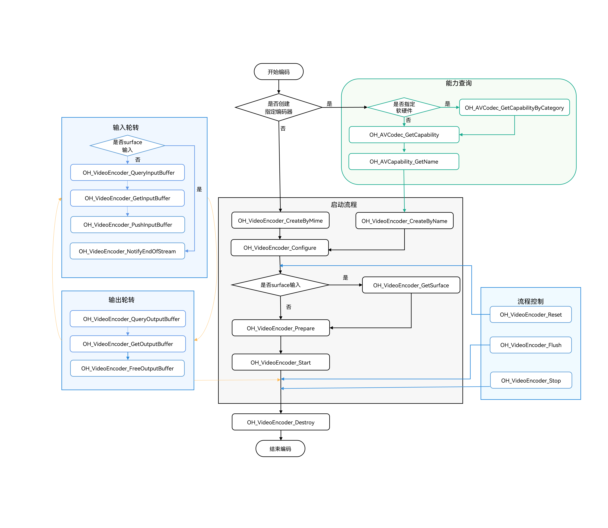

# 视频编码同步模式

<!--Kit: AVCodec Kit-->
<!--Subsystem: Multimedia-->
<!--Owner: @zhanghongran-->
<!--Designer: @dpy2650--->
<!--Tester: @cyakee-->
<!--Adviser: @zengyawen-->

从API 20开始，支持视频编码同步模式。

开发者可以调用本模块的Native API接口，完成同步模式的视频编码。

当前支持的编码能力，请参考[AVCodec支持的格式](avcodec-support-formats.md#视频编码)。

视频编码的限制约束、支持的能力、状态机调用关系请参考[视频编码](video-encoding.md)。

## 适用场景

通常情况下，推荐使用异步模式。若需要主动请求buffer去送帧，则可以采用同步模式。


## 开发指导

详细的API说明请参考[VideoEncoder](../../reference/apis-avcodec-kit/_video_encoder.md)。

- 虚线表示可选。

- 实线表示必选。



### 在CMake脚本中链接动态库

``` cmake
target_link_libraries(sample PUBLIC libnative_media_codecbase.so)
target_link_libraries(sample PUBLIC libnative_media_core.so)
target_link_libraries(sample PUBLIC libnative_media_venc.so)
```

> **说明：**
>
> 上述'sample'字样仅为示例，此处由开发者根据实际工程目录自定义。
>

### 定义基础结构

本部分示例代码按照C++17标准编写，仅作参考。

1. 添加头文件。

    ```c++
    #include <multimedia/player_framework/native_avcodec_videoencoder.h>
    #include <multimedia/player_framework/native_avcapability.h>
    #include <multimedia/player_framework/native_avcodec_base.h>
    #include <multimedia/player_framework/native_avformat.h>
    #include <multimedia/player_framework/native_avbuffer.h>
    #include <multimedia/player_framework/native_averrors.h>
    #include <native_buffer/native_buffer.h>
    #include <memory>
    #include <fstream>
    #include <mutex>
    #include <shared_mutex>
    ```
    
2. 全局变量（仅作参考，可以根据实际情况将其封装到对象中）。

    ```c++
    // 视频帧宽度。
    int32_t width = 320;
    // 视频帧高度。
    int32_t height = 240;
    // 视频宽跨距。
    int32_t widthStride = 0;
    // 视频高跨距。
    int32_t heightStride = 0;
    // 视频像素格式。
    OH_AVPixelFormat pixelFormat = AV_PIXEL_FORMAT_NV12;
    // 编码器同步锁。
    std::shared_mutex codecMutex;
    // 编码器实例指针。
    OH_AVCodec *videoEnc = nullptr;
    // 编码输出。
    bool outputDone = false;
    // 编码输入。
    bool inputDone = false;
    std::unique_ptr<std::ifstream> inFile_;
    ```

### Surface模式

参考以下示例代码，可以完成Surface模式下视频编码的全流程，实现同步模式的数据轮转。此处以输入surface数据，编码成H.264格式为例。


1. 创建编码器实例。

    通过名称创建编码器。示例中的变量说明如下：

    - videoEnc：视频编码器实例的指针。
    - capability：编码器能力查询实例的指针。
    - [OH_AVCODEC_MIMETYPE_VIDEO_AVC](../../reference/apis-avcodec-kit/_codec_base.md#oh_avcodec_mimetype_video_avc)：AVC格式视频编解码器。

    ```c++
    // 创建硬件编码器实例。
    OH_AVCapability *capability= OH_AVCodec_GetCapabilityByCategory(OH_AVCODEC_MIMETYPE_VIDEO_AVC, true, HARDWARE);
    const char *name = OH_AVCapability_GetName(capability);
    OH_AVCodec *videoEnc = OH_VideoEncoder_CreateByName(name);
    if (videoEnc == nullptr) {
        printf("create videoEnc failed");
        return;
    }
    ```

2. 调用OH_VideoEncoder_Configure()配置编码器。

    - 详细可配置选项的说明请参考[媒体数据键值对](../../reference/apis-avcodec-kit/_codec_base.md#媒体数据键值对)。
    - 参数校验规则请参考[OH_VideoEncoder_Configure()](../../reference/apis-avcodec-kit/_video_encoder.md#oh_videoencoder_configure)。
    - 参数取值范围可以通过能力查询接口获取，具体示例请参考[获取支持的编解码能力](obtain-supported-codecs.md)。

    目前支持的所有格式都必须配置以下选项：视频帧宽度、视频帧高度、视频像素格式。

    ```c++

    auto format = std::shared_ptr<OH_AVFormat>(OH_AVFormat_Create(), OH_AVFormat_Destroy);
    if (format == nullptr) {
        // 异常处理。
    }
    // 写入format。
    OH_AVFormat_SetIntValue(format.get(), OH_MD_KEY_WIDTH, width); // 必须配置。
    OH_AVFormat_SetIntValue(format.get(), OH_MD_KEY_HEIGHT, height); // 必须配置。
    OH_AVFormat_SetIntValue(format.get(), OH_MD_KEY_PIXEL_FORMAT, pixelFormat);// 必须配置。
    OH_AVFormat_SetIntValue(format.get(), OH_MD_KEY_ENABLE_SYNC_MODE, 1); // 同步模式配置。
    // 配置编码器。
    OH_AVErrCode ret = OH_VideoEncoder_Configure(videoEnc, format.get());
    if (ret != AV_ERR_OK) {
        // 异常处理。
    }
    ```

    > **注意：**
    >
    > 1. 要使能视频编码同步模式，必须将OH_MD_KEY_ENABLE_SYNC_MODE配置为1。
    > 2. 同步模式在调用OH_VideoEncoder_Configure接口前不能调用OH_VideoEncoder_RegisterCallback或OH_VideoEncoder_RegisterParameterCallback接口，否则为异步模式。
    > 3. 不支持Surface模式的随帧通路的同步模式。
    >

3. 设置surface。

   示例中的变量说明如下：
   - nativeWindow：获取方式请参考[视频编码Surface模式](video-encoding.md#surface模式)的“步骤-6：设置surface”。

    ```c++
    // 获取需要输入的surface，以进行编码。
    OH_AVErrCode ret = OH_VideoEncoder_GetSurface(videoEnc, &nativeWindow); 
    if (ret != AV_ERR_OK) {
        // 异常处理。
    }
    ```

4. 调用OH_VideoEncoder_Prepare()编码器就绪。

    该接口将在编码器运行前进行一些数据的准备工作。

    ```c++
    OH_AVErrCode ret = OH_VideoEncoder_Prepare(videoEnc);
    if (ret != AV_ERR_OK) {
        // 异常处理。
    }
    ```

5. 调用OH_VideoEncoder_Start()启动编码器。

    ```c++
    // 配置待编码文件路径。
    std::string_view outputFilePath = "/*yourpath*.h264";
    std::unique_ptr<std::ofstream> outputFile = std::make_unique<std::ofstream>();
    if (outputFile != nullptr) {
        outputFile->open(outputFilePath.data(), std::ios::out | std::ios::binary | std::ios::ate);
    }
    // 启动编码器，开始编码。
    OH_AVErrCode ret = OH_VideoEncoder_Start(videoEnc);
    if (ret != AV_ERR_OK) {
        // 异常处理。
    }
    ```

6. 获取可用buffer并释放编码帧。

   - 调用[OH_VideoEncoder_QueryOutputBuffer](../../reference/apis-avcodec-kit/_video_encoder.md#oh_videoencoder_queryoutputbuffer)接口获取下一个可用的输出缓冲区（buffer）的索引（index）。
   - 根据获取的索引（index），调用[OH_VideoEncoder_GetOutputBuffer](../../reference/apis-avcodec-kit/_video_encoder.md#oh_videoencoder_getoutputbuffer)接口获取对应的缓冲区（buffer）实例。
   - 调用[OH_VideoEncoder_FreeOutputBuffer](../../reference/apis-avcodec-kit/_video_encoder.md#oh_videoencoder_freeoutputbuffer)接口释放编码帧。

    ```c++
    bool EncoderOutput(OH_AVCodec *videoEnc, int64_t timeoutUs)
    {
        uint32_t index;
        std::shared_lock<std::shared_mutex> lock(codecMutex);

        OH_AVErrCode ret = OH_VideoEncoder_QueryOutputBuffer(videoEnc, &index, timeoutUs);
        switch (ret) {
            case AV_ERR_OK: {
                OH_AVBuffer *buffer = OH_VideoEncoder_GetOutputBuffer(videoEnc, index);
                if (buffer == nullptr) {
                    // 异常处理。
                    return false;
                }
            
                // 获取编码后信息。
                OH_AVCodecBufferAttr info;
                OH_AVErrCode getBufferRet = OH_AVBuffer_GetBufferAttr(buffer, &info);
                if (getBufferRet != AV_ERR_OK) {
                    // 异常处理。
                    return false;
                }
                if (info.flags & AVCODEC_BUFFER_FLAGS_EOS) {
                    outputDone = 1;
                }

                // 将编码完成帧数据buffer写入到对应输出文件中。
                uint8_t *addr = OH_AVBuffer_GetAddr(buffer);
                if (addr == nullptr) {
                   // 异常处理 
                   return false;
                }
                if (outputFile != nullptr && outputFile->is_open()) {
                    outputFile->write(reinterpret_cast<char *>(addr), info.size);
                }
                // 释放已完成写入的数据，index为对应输出队列下标。
                OH_AVErrCode freeOutputRet = OH_VideoEncoder_FreeOutputBuffer(videoEnc, index);
                if (freeOutputRet != AV_ERR_OK) {
                    // 异常处理。
                    return false;
                }
                break;
            }
            case AV_ERR_TRY_AGAIN_LATER: {
                break;
            }
            case AV_ERR_STREAM_CHANGED: {
                auto format = std::shared_ptr<OH_AVFormat>(OH_VideoEncoder_GetOutputDescription(videoEnc), OH_AVFormat_Destroy);
                if (format == nullptr) {
                    // 异常处理。
                }
                // 获取新宽高。
                bool getIntRet = OH_AVFormat_GetIntValue(format.get(), OH_MD_KEY_VIDEO_WIDTH, &width) &&
                                 OH_AVFormat_GetIntValue(format.get(), OH_MD_KEY_VIDEO_HEIGHT, &height);
                if (!getIntRet) {
                 	// 异常处理。
                }
                break;
            }
            default: {
                // 异常处理。
                return false;
            }
        }
        return true;
    }
    ```

7. 编码器出帧处理循环。

   ```c++
    bool result = true;
    int64_t timeoutUs = 0; // 单位：微秒（us），负值：无限等待；0：立即退出；正值：等待指定时长后退出。    

    while (!outputDone && result) {
        if (!outputDone ) {
            result = EncoderOutput(videoEnc, timeoutUs);
        }
    }
    ```

8. 调用OH_VideoEncoder_NotifyEndOfStream()通知编码器结束。

    ```c++
    // Surface模式：通知视频编码器输入流已结束，只能使用此接口进行通知。
    OH_AVErrCode ret = OH_VideoEncoder_NotifyEndOfStream(videoEnc);
    if (ret != AV_ERR_OK) {
        // 异常处理。
    }
    ```

9. （可选）调用OH_VideoEncoder_Flush()刷新编码器。

    调用OH_VideoEncoder_Flush接口后，编码器仍处于运行态，但会清除编码器中缓存的输入和输出数据及参数集如H.264格式的PPS/SPS。
    此时需要调用[OH_VideoEncoder_Start](../../reference/apis-avcodec-kit/_video_encoder.md#oh_videoencoder_start)接口重新开始编码。

    ```c++
    // 通过codecMutex来避免调用Flush接口，状态切换后，编码线程还在跑会退出循环的问题。
    std::unique_lock<std::shared_mutex> lock(codecMutex);
    // 刷新编码器videoEnc。
    OH_AVErrCode flushRet = OH_VideoEncoder_Flush(videoEnc);
    if (flushRet != AV_ERR_OK) {
        // 异常处理。
    }

    // 重新开始编码。
    OH_AVErrCode startRet = OH_VideoEncoder_Start(videoEnc);
    if (startRet != AV_ERR_OK) {
        // 异常处理。
    }
    ```

10. （可选）调用OH_VideoEncoder_Reset()重置编码器。

    调用OH_VideoEncoder_Reset接口后，编码器回到初始化的状态，需要调用接口[OH_VideoEncoder_Configure](../../reference/apis-avcodec-kit/_video_encoder.md#oh_videoencoder_configure)和[OH_VideoEncoder_Prepare](../../reference/apis-avcodec-kit/_video_encoder.md#oh_videoencoder_prepare)重新配置。

    ```c++
    // 重置编码器videoEnc。
    std::unique_lock<std::shared_mutex> lock(codecMutex);
    OH_AVErrCode resetRet = OH_VideoEncoder_Reset(videoEnc);
    if (resetRet != AV_ERR_OK) {
        // 异常处理。
    }
 
    // 重新配置编码器参数。
    auto format = std::shared_ptr<OH_AVFormat>(OH_AVFormat_Create(), OH_AVFormat_Destroy);
    if (format == nullptr) {
        // 异常处理。
    }
    OH_AVErrCode configRet = OH_VideoEncoder_Configure(videoEnc, format.get());
    if (configRet != AV_ERR_OK) {
        // 异常处理。
    }

    // 编码器重新就绪。
    OH_AVErrCode prepareRet = OH_VideoEncoder_Prepare(videoEnc);
    if (prepareRet != AV_ERR_OK) {
        // 异常处理。
    }
    ```

    > **注意：**
    >
    > 编码器回到初始化的状态，调用OH_VideoEncoder_Configure接口重新配置编码器参数时，同步模式需要重新配置OH_MD_KEY_ENABLE_SYNC_MODE为1，否则为异步模式。
    >

11. （可选）调用OH_VideoEncoder_Stop()停止编码器。

    调用OH_VideoEncoder_Stop接口后，编码器保留了编码实例，释放输入输出buffer。开发者可以直接调用OH_VideoEncoder_Start接口继续编码，输入的第一个buffer需要携带参数集，从IDR帧开始送入。

    ```c++
    // 终止编码器videoEnc。
    std::unique_lock<std::shared_mutex> lock(codecMutex);
    OH_AVErrCode ret = OH_VideoEncoder_Stop(videoEnc);
    if (ret != AV_ERR_OK) {
        // 异常处理。
    }
    ```

12. 调用OH_VideoEncoder_Destroy()销毁编码器实例，释放资源。

    ```c++
    // 注销编码器。
    std::unique_lock<std::shared_mutex> lock(codecMutex);
    OH_AVErrCode ret = AV_ERR_OK;
    if (videoEnc != nullptr) {
        ret = OH_VideoEncoder_Destroy(videoEnc);
        videoEnc = nullptr;
    }
    if (ret != AV_ERR_OK) {
        // 异常处理。
    }
    ```

    > **说明：**
    >
    > 执行该步骤之后，需要开发者将videoEnc指向nullptr，防止野指针导致程序错误。
    >

### Buffer模式

参考以下示例代码，可以完成Buffer模式下视频编码的全流程，实现同步模式的数据轮转。此处以输入YUV文件，编码成H.264格式为例。

1. 创建编码器实例。

    与Surface模式相同，此处不再赘述。

    ```c++
    // 通过codecname创建编码器，应用有特殊需求，比如选择支持某种分辨率规格的编码器，可先查询capability，再根据codec name创建编码器。
    OH_AVCapability *capability = OH_AVCodec_GetCapability(OH_AVCODEC_MIMETYPE_VIDEO_AVC, true);
    const char *name = OH_AVCapability_GetName(capability);
    OH_AVCodec *videoEnc = OH_VideoEncoder_CreateByName(name);
    if (videoEnc == nullptr) {
        printf("create videoEnc failed");
        return;
    }
    ```

2. 调用OH_VideoEncoder_Configure()配置编码器。

    与Surface模式相同，此处不再赘述。

    ```c++
    auto format = std::shared_ptr<OH_AVFormat>(OH_AVFormat_Create(), OH_AVFormat_Destroy);
    if (format == nullptr) {
        // 异常处理。
    }
    // 写入format。
    OH_AVFormat_SetIntValue(format.get(), OH_MD_KEY_WIDTH, width); // 必须配置。
    OH_AVFormat_SetIntValue(format.get(), OH_MD_KEY_HEIGHT, height); // 必须配置。
    OH_AVFormat_SetIntValue(format.get(), OH_MD_KEY_PIXEL_FORMAT, pixelFormat);// 必须配置。
    OH_AVFormat_SetIntValue(format.get(), OH_MD_KEY_ENABLE_SYNC_MODE, 1); // 同步模式配置。
    // 配置编码器。
    OH_AVErrCode ret = OH_VideoEncoder_Configure(videoEnc, format.get());
    if (ret != AV_ERR_OK) {
        // 异常处理。
    }
    ```

    > **注意：**
    >
    > 1. 要使能视频编码同步模式，必须将OH_MD_KEY_ENABLE_SYNC_MODE配置为1。
    > 2. 同步模式在调用OH_VideoEncoder_Configure接口前不能调用OH_VideoEncoder_RegisterCallback或OH_VideoEncoder_RegisterParameterCallback接口，否则为异步模式。
    >

3. 调用OH_VideoEncoder_Prepare()编码器就绪。

    该接口将在编码器运行前进行一些数据的准备工作。

    ```c++
    ret = OH_VideoEncoder_Prepare(videoEnc);
    if (ret != AV_ERR_OK) {
        // 异常处理。
    }
    ```

4. 调用OH_VideoEncoder_Start()启动编码器。

    配置输入文件、输出文件。

    ```c++
    // 配置待编码文件路径。
    std::string_view inputFilePath = "/*yourpath*.yuv";
    std::string_view outputFilePath = "/*yourpath*.h264";
    std::unique_ptr<std::ifstream> inputFile = std::make_unique<std::ifstream>();
    std::unique_ptr<std::ofstream> outputFile = std::make_unique<std::ofstream>();
    if (inputFile != nullptr) {
        inputFile->open(inputFilePath.data(), std::ios::in | std::ios::binary);
    }
    if (outputFile != nullptr) {
        outputFile->open(outputFilePath.data(), std::ios::out | std::ios::binary | std::ios::ate);
    }
    // 启动编码器，开始编码。
    OH_AVErrCode ret = OH_VideoEncoder_Start(videoEnc);
    if (ret != AV_ERR_OK) {
        // 异常处理。
    }
    ```

5. 获取可用buffer并写入码流至编码器

    - 调用[OH_VideoEncoder_QueryInputBuffer](../../reference/apis-avcodec-kit/_video_encoder.md#oh_videoencoder_queryinputbuffer)接口获取下一个可用的输入缓冲区（buffer）的索引（index）。
    - 根据获取的索引（index），调用[OH_VideoEncoder_GetInputBuffer](../../reference/apis-avcodec-kit/_video_encoder.md#oh_videoencoder_getinputbuffer)接口获取对应的缓冲区（buffer）实例。
    - 将需要编码的数据写入该缓冲区（buffer）后，调用[OH_VideoEncoder_PushInputBuffer](../../reference/apis-avcodec-kit/_video_encoder.md#oh_videoencoder_pushinputbuffer)接口将其送入编码输入队列进行编码。当所有待处理数据全部传递给编码器后，需要将flag标识成AVCODEC_BUFFER_FLAGS_EOS，通知编码器输入结束。


    示例中的变量size、offset、pts、frameData、flags说明与Surface模式相同，此处不再赘述。

    ```c++
    bool EncoderInput(OH_AVCodec *videoEnc, int64_t timeoutUs)
    {    
        uint32_t index;
        std::shared_lock<std::shared_mutex> lock(codecMutex);

        OH_AVErrCode ret = OH_VideoEncoder_QueryInputBuffer(videoEnc, &index, timeoutUs);
        switch (ret) {
            case AV_ERR_OK: {
                OH_AVBuffer *buffer = OH_VideoEncoder_GetInputBuffer(videoEnc, index);
                if (buffer == nullptr) {
                    // 异常处理。
                    return false;
                }

                // 写入图像数据。
                int32_t frameSize = 0;
                bool isFirstFrame = true;
                // 获取视频宽跨距和高跨距。
                if (isFirstFrame) {
                    auto format = std::shared_ptr<OH_AVFormat>(OH_VideoEncoder_GetInputDescription(videoEnc), OH_AVFormat_Destroy);
                    if (format == nullptr) {
                        // 异常处理。
                    }
                    bool getIntRet = OH_AVFormat_GetIntValue(format.get(), OH_MD_KEY_VIDEO_STRIDE, &widthStride) &&
                                     OH_AVFormat_GetIntValue(format.get(), OH_MD_KEY_VIDEO_SLICE_HEIGHT, &heightStride);
                     if (!getIntRet) {
                     	// 异常处理。
                     }
                    isFirstFrame = false;
                }
                if (widthStride == width && heightStride == height) {
                    frameSize = width * height * 3 / 2; // NV12像素格式下，每帧数据大小的计算公式。
                    // 处理文件流得到帧的长度，再将需要编码的数据写入到对应index的buffer中。
                    uint8_t *addr = OH_AVBuffer_GetAddr(buffer);
                    if (addr == nullptr) {
                       // 异常处理 
                       return false;
                    }
                    if (inputFile != nullptr && inputFile->is_open()) {
                        inputFile->read(reinterpret_cast<char *>(addr), frameSize);
                    }
                } else {
                    // 如果跨距不等于宽，开发者需要按照跨距进行偏移，详情请参考视频编码Buffer模式“步骤-8. 写入编码图像”。
                }

                // 配置buffer info信息。
                OH_AVCodecBufferAttr info;
                info.size = frameSize;
                info.offset = 0;
                info.pts = 0;
                OH_AVErrCode setBufferRet = OH_AVBuffer_SetBufferAttr(buffer, &info);
                if (setBufferRet != AV_ERR_OK) {
                    // 异常处理。
                    return false;
                }
                // 送入编码输入队列进行编码，index为对应输入队列的下标。
                OH_AVErrCode pushInputRet = OH_VideoEncoder_PushInputBuffer(videoEnc, index);
                if (pushInputRet != AV_ERR_OK) {
                    // 异常处理。
                    return false;
                }
                if (inFile_->eof()) {
                    inputDone = 1;
                }
                break;
            }
            case AV_ERR_TRY_AGAIN_LATER: {
                break;
            }
            default: {
                // 异常处理。
                return false;
            }    
        }
        return true;
    }
    ```


6. 获取可用buffer并释放编码帧。

   - 调用[OH_VideoEncoder_QueryOutputBuffer](../../reference/apis-avcodec-kit/_video_encoder.md#oh_videoencoder_queryoutputbuffer)接口获取下一个可用的输出缓冲区（buffer）的索引（index）。
   - 根据获取的索引（index），调用[OH_VideoEncoder_GetOutputBuffer](../../reference/apis-avcodec-kit/_video_encoder.md#oh_videoencoder_getoutputbuffer)接口获取对应的缓冲区（buffer）实例。
   - 调用[OH_VideoEncoder_FreeOutputBuffer](../../reference/apis-avcodec-kit/_video_encoder.md#oh_videoencoder_freeoutputbuffer)接口释放编码帧。
  

    ```c++
    bool EncoderOutput(OH_AVCodec *videoEnc, int64_t timeoutUs)
    {
        uint32_t index;
        std::shared_lock<std::shared_mutex> lock(codecMutex);

        OH_AVErrCode ret = OH_VideoEncoder_QueryOutputBuffer(videoEnc, &index, timeoutUs);
        switch (ret) {
            case AV_ERR_OK: {
                OH_AVBuffer *buffer = OH_VideoEncoder_GetOutputBuffer(videoEnc, index);
                if (buffer == nullptr) {
                    // 异常处理。
                    return false;
                }
            
                // 获取编码后信息。
                OH_AVCodecBufferAttr info;
                OH_AVErrCode getBufferRet = OH_AVBuffer_GetBufferAttr(buffer, &info);
                if (getBufferRet != AV_ERR_OK) {
                    // 异常处理。
                    return false;
                }
                // 将编码完成帧数据buffer写入到对应输出文件中。
                uint8_t *addr = OH_AVBuffer_GetAddr(buffer);
                if (addr == nullptr) {
                   // 异常处理 
                   return false;
                }
                if (outputFile != nullptr && outputFile->is_open()) {
                    outputFile->write(reinterpret_cast<char *>(addr), info.size);
                }
                if (info.flags & AVCODEC_BUFFER_FLAGS_EOS) {
                    outputDone = 1;
                }
                // 释放已完成处理的信息，index为对应buffer队列的下标。
                OH_AVErrCode freeOutputRet = OH_VideoEncoder_FreeOutputBuffer(videoEnc, index);
                if (freeOutputRet != AV_ERR_OK) {
                    // 异常处理。
                    return false;
                }
                break;
            }
            case AV_ERR_TRY_AGAIN_LATER: {
                break;
            }
            case AV_ERR_STREAM_CHANGED: {
                break;
            }
            default: {
                // 异常处理。
                return false;
            }
        }
        return true;
    }
    ```

7. 编码器送帧/出帧处理循环。
  
    ```c++
    bool result = true;
    int64_t timeoutUs = 0; // 单位：微秒（us），负值：无限等待；0：立即退出；正值：等待指定时长后退出。

    while (!outputDone && result) {
        if (!inputDone) {
            result = EncoderInput(videoEnc, timeoutUs);
        }
        if (!outputDone) {
            result = EncoderOutput(videoEnc, timeoutUs);
        }
    }
    ```

后续流程（包括刷新、重置、停止和销毁编码器）与Surface模式基本一致，请参考[Surface模式](#surface模式)的步骤9-12。