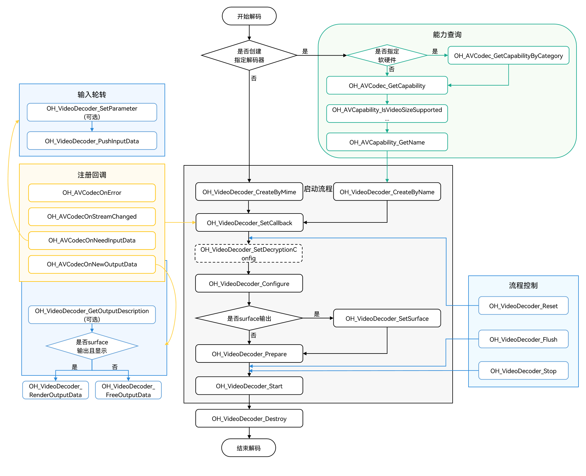

# 视频解码

开发者可以调用本模块的Native API接口，完成视频解码，即将媒体数据解码成YUV文件或送显。

<!--RP3--><!--RP3End-->

当前支持的解码能力请参考[AVCodec支持的格式](avcodec-support-formats.md#视频解码)。

<!--RP1--><!--RP1End-->

通过视频解码，应用可以实现以下重点能力，包括：

|          支持的能力                       |             使用简述                                                                     |
| --------------------------------------- | ---------------------------------------------------------------------------------- |
| 变分辨率         | 解码器支持输入码流分辨率发生变化，发生变化后会触发OH_VideoDecoder_RegisterCallback接口设置的回调函数OnStreamChanged()。具体可参考下文中：Surface模式步骤-3或Buffer模式步骤-3  |
| 动态切换surface  | 通过调用OH_VideoDecoder_SetSurface接口配置，仅Surface模式支持。具体可参考下文中：Surface模式步骤-6    |
| 低时延解码  | 通过调用OH_VideoDecoder_Configure接口配置，具体可参考下文中：Surface模式的步骤-5或Buffer模式步骤-5      |

## 限制约束

1. Buffer模式不支持HDRVivid解码。
2. Flush，Reset，Stop之后，重新Start时，需要重新传PPS/SPS。具体示例请参考[Surface模式](#surface模式)“步骤-13：调用OH_VideoDecoder_Flush()”。
3. Flush，Reset，Stop，Destroy在非回调线程中执行时，会等待所有回调执行完成后，将执行结果返回给用户。
4. 由于硬件解码器资源有限，每个解码器在使用完毕后都必须调用OH_VideoDecoder_Destroy接口来销毁实例并释放资源。
5. 视频解码输入码流仅支持AnnexB格式，且支持的AnnexB格式支持多slice，要求同一帧的多个slice一次送入解码器。
6. 在调用Flush，Reset，Stop的过程中，开发者不应对之前回调函数获取到的OH_AVBuffer继续进行操作。
7. DRM解密能力在[Surface模式](#surface模式)下既支持非安全视频通路，也支持安全视频通路，在[Buffer模式](#buffer模式)下仅支持非安全视频通路。
8. Buffer模式和Surface模式使用方式一致的接口，所以只提供了Surface模式的示例。
9. 在Buffer模式下，开发者通过输出回调函数OH_AVCodecOnNewOutputBuffer获取到OH_AVBuffer的指针实例后，必须通过调用OH_VideoDecoder_FreeOutputBuffer接口
   来通知系统该实例已被使用完毕。这样系统才能够将后续解码的数据写入到相应的位置。如果开发者在调用OH_AVBuffer_GetNativeBuffer接口时获取到OH_NativeBuffer指针实例，并且该实例的生命周期超过了当前的OH_AVBuffer指针实例，那么需要进行一次数据的拷贝操作。在这种情况下，开发者需要自行管理新生成的OH_NativeBuffer实例的生命周期，确保其正确使用和释放。
<!--RP6--><!--RP6End-->

## surface输出与buffer输出

1. 两者数据的输出方式不同。
2. 两者的适用场景不同：
    - surface输出是指用OHNativeWindow来传递输出数据，可以与其他模块对接，例如XComponent。
    - buffer输出是指经过解码的数据会以共享内存的方式输出。

3. 在接口调用的过程中，两种方式的接口调用方式基本一致，但存在以下差异点：
    - 在Surface模式下，可选择调用OH_VideoDecoder_FreeOutputBuffer接口丢弃输出帧（不送显）；在Buffer模式下，应用必须调用OH_VideoDecoder_FreeOutputBuffer接口释放数据。
    - Surface模式下，应用在解码器就绪前，必须调用OH_VideoDecoder_SetSurface接口设置OHNativeWindow，启动后，调用OH_VideoDecoder_RenderOutputBuffer接口将解码数据送显。
    - 输出回调传出的buffer，在Buffer模式下，可以获取共享内存的地址和数据信息；在Surface模式下，只能获取buffer的数据信息。

两种模式的开发步骤详细说明请参考：[Surface模式](#surface模式)和[Buffer模式](#buffer模式)。

## 状态机调用关系

如下为状态机调用关系图：


1. 有两种方式可以使解码器进入Initialized状态：
   - 初始创建解码器实例时，解码器处于Initialized状态。
   - 任何状态下，调用OH_VideoDecoder_Reset接口，解码器将会移回Initialized状态。

2. Initialized状态下，调用OH_VideoDecoder_Configure接口配置解码器，配置成功后解码器进入Configured状态。
3. Configured状态下，调用OH_VideoDecoder_Prepare接口进入Prepared状态。
4. Prepared状态下，调用OH_VideoDecoder_Start接口使解码器进入Executing状态：
   - 处于Executing状态时，调用OH_VideoDecoder_Stop接口可以使解码器返回到Prepared状态。

5. 在极少数情况下，解码器可能会遇到错误并进入Error状态。解码器的错误传递，可以通过队列操作返回无效值或者抛出异常：
   - Error状态下，可以调用解码器OH_VideoDecoder_Reset接口将解码器移到Initialized状态；或者调用OH_VideoDecoder_Destroy接口移动到最后的Released状态。

6. Executing状态具有三个子状态：Flushed、Running和End-of-Stream：
    - 在调用了OH_VideoDecoder_Start接口之后，解码器立即进入Running子状态。
    - 对于处于Executing状态的解码器，可以调用OH_VideoDecoder_Flush接口返回到Flushed子状态。
    - 当待处理数据全部传递给解码器后，在input buffers队列中为最后一个入队的input buffer中添加[AVCODEC_BUFFER_FLAGS_EOS](../../reference/apis-avcodec-kit/_core.md#oh_avcodecbufferflags-1)标记，遇到这个标记时，解码器会转换为End-of-Stream子状态。在此状态下，解码器不再接受新的输入，但是仍然会继续生成输出，直到输出到达尾帧。

7. 使用完解码器后，必须调用OH_VideoDecoder_Destroy接口销毁解码器实例，使解码器进入Released状态。

## 开发指导

详细的API说明请参考[API文档](../../reference/apis-avcodec-kit/_video_decoder.md)。
如下为视频解码调用关系图：

- 虚线表示可选。

- 实线表示必选。



### 在 CMake 脚本中链接动态库

``` cmake
target_link_libraries(sample PUBLIC libnative_media_codecbase.so)
target_link_libraries(sample PUBLIC libnative_media_core.so)
target_link_libraries(sample PUBLIC libnative_media_vdec.so)
```

> **说明：**
>
> 上述'sample'字样仅为示例，此处由开发者根据实际工程目录自定义。
>

### 定义基础结构

本部分示例代码按照C++17标准编写，仅作参考。开发者可以参考此部分，定义自己的buffer对象。

1. 添加头文件。

    ```c++
    #include <condition_variable>
    #include <memory>
    #include <mutex>
    #include <queue>
    #include <shared_mutex>
    ```

2. 解码器回调buffer的信息。

    ```c++
    struct CodecBufferInfo {
        CodecBufferInfo(uint32_t index, OH_AVBuffer *buffer): index(index), buffer(buffer), isValid(true) {}
        // 回调buffer。
        OH_AVBuffer *buffer = nullptr;
        // 回调buffer对应的index。
        uint32_t index = 0;
        // 判断当前buffer信息是否有效。
        bool isValid = true;
    };
    ```

3. 解码输入输出队列。

    ```c++
    class CodecBufferQueue {
    public:
        // 将回调buffer的信息传入队列。
        void Enqueue(const std::shared_ptr<CodecBufferInfo> bufferInfo)
        {
            std::unique_lock<std::mutex> lock(mutex_);
            bufferQueue_.push(bufferInfo);
            cond_.notify_all();
        }

        // 获取回调buffer的信息。
        std::shared_ptr<CodecBufferInfo> Dequeue(int32_t timeoutMs = 1000)
        {
            std::unique_lock<std::mutex> lock(mutex_);
            (void)cond_.wait_for(lock, std::chrono::milliseconds(timeoutMs), [this]() { return !bufferQueue_.empty(); });
            if (bufferQueue_.empty()) {
                return nullptr;
            }
            std::shared_ptr<CodecBufferInfo> bufferInfo = bufferQueue_.front();
            bufferQueue_.pop();
            return bufferInfo;
        }

        // 清空队列，之前的回调buffer设置为不可用。
        void Flush()
        {
            std::unique_lock<std::mutex> lock(mutex_);
            while (!bufferQueue_.empty()) {
                std::shared_ptr<CodecBufferInfo> bufferInfo = bufferQueue_.front();
                // Flush、Stop、Reset、Destroy操作之后，之前回调的buffer信息设置为无效。
                bufferInfo->isValid = false;
                bufferQueue_.pop();
            }
        }

    private:
        std::mutex mutex_;
        std::condition_variable cond_;
        std::queue<std::shared_ptr<CodecBufferInfo>> bufferQueue_;
    };
    ```

4. 全局变量

    仅做参考，可以根据实际情况将其封装到对象中。

    ```c++
    // 视频帧宽度。
    int32_t width = 320;
    // 视频帧高度。
    int32_t height = 240;
    // 视频像素格式。
     OH_AVPixelFormat pixelFormat = AV_PIXEL_FORMAT_NV12;
    // 视频宽跨距。
    int32_t widthStride = 0;
    // 视频高跨距。
    int32_t heightStride = 0;
    // 解码器实例指针。
    OH_AVCodec *videoDec = nullptr;
    // 解码器同步锁。
    std::shared_mutex codecMutex;
    // 解码器输入队列。
    CodecBufferQueue inQueue;
    // 解码器输出队列。
    CodecBufferQueue outQueue;
    ```

### Surface模式

参考以下示例代码，开发者可以完成Surface模式下视频解码的全流程。此处以H.264码流文件输入，解码送显输出为例。
本模块目前仅支持异步模式的数据轮转。

1. 添加头文件。

    ```c++
    #include <multimedia/player_framework/native_avcodec_videodecoder.h>
    #include <multimedia/player_framework/native_avcapability.h>
    #include <multimedia/player_framework/native_avcodec_base.h>
    #include <multimedia/player_framework/native_avformat.h>
    #include <multimedia/player_framework/native_avbuffer.h>
    #include <fstream>
    ```

2. 创建解码器实例。

    开发者可以通过名称或媒体类型创建解码器。示例中的变量说明如下：

    - videoDec：视频解码器实例的指针；
    - capability：解码器能力查询实例的指针；
    - OH_AVCODEC_MIMETYPE_VIDEO_AVC：AVC格式视频编解码器。

    ```c++
    // 通过codecname创建解码器，应用有特殊需求，比如选择支持某种分辨率规格的解码器，可先查询capability，再根据codec name创建解码器。
    OH_AVCapability *capability = OH_AVCodec_GetCapability(OH_AVCODEC_MIMETYPE_VIDEO_AVC, false);
    // 创建硬件解码器实例。
    OH_AVCapability *capability= OH_AVCodec_GetCapabilityByCategory(OH_AVCODEC_MIMETYPE_VIDEO_AVC, false, HARDWARE);
    const char *name = OH_AVCapability_GetName(capability);
    OH_AVCodec *videoDec = OH_VideoDecoder_CreateByName(name);
    ```

    ```c++
    // 通过MIME TYPE创建解码器，只能创建系统推荐的特定编解码器。
    // 涉及创建多路编解码器时，优先创建硬件解码器实例，硬件资源不够时再创建软件解码器实例。
    // 软/硬解: 创建H.264解码器实例。
    OH_AVCodec *videoDec = OH_VideoDecoder_CreateByMime(OH_AVCODEC_MIMETYPE_VIDEO_AVC);
    // 软/硬解: 创建H.265解码器实例。
    OH_AVCodec *videoDec = OH_VideoDecoder_CreateByMime(OH_AVCODEC_MIMETYPE_VIDEO_HEVC);
    ```

3. 调用OH_VideoDecoder_RegisterCallback()设置回调函数。

    注册回调函数指针集合OH_AVCodecCallback，包括：

    - OH_AVCodecOnError 解码器运行错误，返回的错误码详情请参见：[OH_AVCodecOnError](../../reference/apis-avcodec-kit/_codec_base.md#oh_avcodeconerror)；
    - OH_AVCodecOnStreamChanged 码流信息变化，如码流宽、高变化；
    - OH_AVCodecOnNeedInputBuffer 运行过程中需要新的输入数据，即解码器已准备好，可以输入数据；
    - OH_AVCodecOnNewOutputBuffer 运行过程中产生了新的输出数据，即解码完成（注：Surface模式buffer参数为空）。

    开发者可以通过处理该回调报告的信息，确保解码器正常运转。

    <!--RP2--><!--RP2End-->

    ```c++
    // 解码异常回调OH_AVCodecOnError实现。
    static void OnError(OH_AVCodec *codec, int32_t errorCode, void *userData)
    {
        // 回调的错误码由开发者判断处理。
        (void)codec;
        (void)errorCode;
        (void)userData;
    }

    // 解码数据流变化回调OH_AVCodecOnStreamChanged实现。
    static void OnStreamChanged(OH_AVCodec *codec, OH_AVFormat *format, void *userData)
    {
        // 可通过format获取到变化后的视频宽、高等。
        (void)codec;
        (void)userData;
        OH_AVFormat_GetIntValue(format, OH_MD_KEY_VIDEO_PIC_WIDTH, &width);
        OH_AVFormat_GetIntValue(format, OH_MD_KEY_VIDEO_PIC_HEIGHT, &height);
    }

    // 解码输入回调OH_AVCodecOnNeedInputBuffer实现。
    static void OnNeedInputBuffer(OH_AVCodec *codec, uint32_t index, OH_AVBuffer *buffer, void *userData)
    {
        // 输入帧的数据buffer和对应的index送入inQueue队列。
        (void)codec;
        (void)userData;
        inQueue.Enqueue(std::make_shared<CodecBufferInfo>(index, buffer));
    }

    // 解码输出回调OH_AVCodecOnNewOutputBuffer实现。
    static void OnNewOutputBuffer(OH_AVCodec *codec, uint32_t index, OH_AVBuffer *buffer, void *userData)
    {
        // 完成帧的数据buffer和对应的index送入outQueue队列。
        (void)codec;
        (void)userData;
        outQueue.Enqueue(std::make_shared<CodecBufferInfo>(index, buffer));
    }
    // 配置异步回调，调用 OH_VideoDecoder_RegisterCallback 接口。
    OH_AVCodecCallback cb = {&OnError, &OnStreamChanged, &OnNeedInputBuffer, &OnNewOutputBuffer};
    // 配置异步回调。
    int32_t ret = OH_VideoDecoder_RegisterCallback(videoDec, cb, nullptr); // nullptr:用户特定数据userData为空。
    if (ret != AV_ERR_OK) {
        // 异常处理。
    }
    ```

    > **说明：**
    >
    > 1. 在回调函数中，对数据队列进行操作时，需要注意多线程同步的问题。
    > 2. 播放视频时，若视频码流的SPS中包含颜色信息，解码器会把这些信息（RangeFlag、ColorPrimary、MatrixCoefficient、TransferCharacteristic）通过OH_AVCodecOnStreamChanged接口中的OH_AVFormat返回。
    > 3. 视频解码的Surface模式下，内部数据默认是走HEBC（High Efficiency Bandwidth Compression，高效带宽压缩），无法获取到widthStride和heightStride的值。
    >

4. （可选）OH_VideoDecoder_SetDecryptionConfig设置解密配置。在获取到DRM信息（参考[音视频解封装](audio-video-demuxer.md)开发步骤第4步），完成DRM许可证申请后，通过此接口进行解密配置。此接口需在Prepare前调用。在Surface模式下，DRM解密能力既支持安全视频通路，也支持非安全视频通路。DRM相关接口详见[DRM API文档](../../reference/apis-drm-kit/_drm.md)。

    添加头文件。

    ```c++
    #include <multimedia/drm_framework/native_mediakeysystem.h>
    #include <multimedia/drm_framework/native_mediakeysession.h>
    #include <multimedia/drm_framework/native_drm_err.h>
    #include <multimedia/drm_framework/native_drm_common.h>
    ```

    在 CMake 脚本中链接动态库。

    ``` cmake
    target_link_libraries(sample PUBLIC libnative_drm.so)
    ```

    <!--RP4-->使用示例：<!--RP4End-->

    ```c++
    // 根据DRM信息创建指定的DRM系统, 以创建"com.clearplay.drm"为例。
    MediaKeySystem *system = nullptr;
    int32_t ret = OH_MediaKeySystem_Create("com.clearplay.drm", &system);
    if (system == nullptr) {
        printf("create media key system failed");
        return;
    }

    // 创建解密会话，如果使用安全视频通路，应创建CONTENT_PROTECTION_LEVEL_HW_CRYPTO及其以上内容保护级别的MediaKeySession；
    // 如果使用非安全视频通路，应创建CONTENT_PROTECTION_LEVEL_SW_CRYPTO及以上内容保护级别的MediaKeySession。
    MediaKeySession *session = nullptr;
    DRM_ContentProtectionLevel contentProtectionLevel = CONTENT_PROTECTION_LEVEL_SW_CRYPTO;
    ret = OH_MediaKeySystem_CreateMediaKeySession(system, &contentProtectionLevel, &session);
    if (ret != DRM_OK) {
        // 如创建失败，请查看DRM接口文档及日志信息。
        printf("create media key session failed.");
        return;
    }
    if (session == nullptr) {
        printf("media key session is nullptr.");
        return;
    }

    // 获取许可证请求、设置许可证响应等。

    // 设置解密配置, 即将解密会话、安全视频通路标志设置到解码器中。
    // 如果DRM解决方案支持安全视频通路，在使用安全视频通路时，需将secureVideoPath设置为true，并在此之前须创建安全解码器。
    // 即在步骤2使用OH_VideoDecoder_CreateByName函数、参数为解码器名称后拼接.secure（如“[CodecName].secure”）创建安全解码器。
    bool secureVideoPath = false;
    ret = OH_VideoDecoder_SetDecryptionConfig(videoDec, session, secureVideoPath);
    ```

5. 调用OH_VideoDecoder_Configure()配置解码器。

    详细可配置选项的说明请参考[视频专有键值对](../../reference/apis-avcodec-kit/_codec_base.md#媒体数据键值对)。

    参数校验规则请参考[OH_VideoDecoder_Configure() 参考文档](../../reference/apis-avcodec-kit/_video_decoder.md#oh_videodecoder_configure)。

    参数取值范围可以通过能力查询接口获取，具体示例请参考[获取支持的编解码能力](obtain-supported-codecs.md)。

    目前支持的所有格式都必须配置以下选项：视频帧宽度、视频帧高度、视频像素格式。

    ```c++

    OH_AVFormat *format = OH_AVFormat_Create();
    // 写入format。
    OH_AVFormat_SetIntValue(format, OH_MD_KEY_WIDTH, width); // 必须配置。
    OH_AVFormat_SetIntValue(format, OH_MD_KEY_HEIGHT, height); // 必须配置。
    OH_AVFormat_SetIntValue(format, OH_MD_KEY_PIXEL_FORMAT, pixelFormat);
    // 可选，配置低时延解码。
    OH_AVFormat_SetIntValue(format, OH_MD_KEY_VIDEO_ENABLE_LOW_LATENCY, 1);
    // 配置解码器。
    int32_t ret = OH_VideoDecoder_Configure(videoDec, format);
    if (ret != AV_ERR_OK) {
        // 异常处理。
    }
    OH_AVFormat_Destroy(format);
    ```

6. 设置surface。

    本例中的nativeWindow，有两种方式获取：
    1. 如果解码后直接显示，则从XComponent组件获取，获取方式请参考 [XComponent](../../reference/apis-arkui/arkui-ts/ts-basic-components-xcomponent.md)；
    2. 如果解码后接OpenGL后处理，则从NativeImage获取，获取方式请参考 [NativeImage](../../graphics/native-image-guidelines.md)。

    Surface模式，开发者可以在解码过程中执行该步骤，即动态切换surface。

    ```c++
    // 配置送显窗口参数。
    int32_t ret = OH_VideoDecoder_SetSurface(videoDec, nativeWindow);    // 从XComponent获取nativeWindow。
    if (ret != AV_ERR_OK) {
        // 异常处理。
    }
    // 配置视频与显示屏匹配模式（缓冲区按原比例缩放，使得缓冲区的较小边与窗口匹配，较长边超出窗口的部分被视为透明）。
    OH_NativeWindow_NativeWindowSetScalingModeV2(nativeWindow, OH_SCALING_MODE_SCALE_CROP_V2);
    ```

7. （可选）OH_VideoDecoder_SetParameter()动态配置解码器surface参数。
    详细可配置选项的说明请参考[视频专有键值对](../../reference/apis-avcodec-kit/_codec_base.md#媒体数据键值对)。

    ```c++
    OH_AVFormat *format = OH_AVFormat_Create();
    // 配置显示旋转角度。
    OH_AVFormat_SetIntValue(format, OH_MD_KEY_ROTATION, 90);
    int32_t ret = OH_VideoDecoder_SetParameter(videoDec, format);
    OH_AVFormat_Destroy(format);
    ```

8. 调用OH_VideoDecoder_Prepare()解码器就绪。

    该接口将在解码器运行前进行一些数据的准备工作。

    ```c++
    ret = OH_VideoDecoder_Prepare(videoDec);
    if (ret != AV_ERR_OK) {
        // 异常处理。
    }
    ```

9. 调用OH_VideoDecoder_Start()启动解码器。

    ```c++
    // 启动解码器，开始解码。
    int32_t ret = OH_VideoDecoder_Start(videoDec);
    if (ret != AV_ERR_OK) {
        // 异常处理。
    }
    ```

10. （可选）调用OH_AVCencInfo_SetAVBuffer()，设置cencInfo。

    若当前播放的节目是DRM加密节目，应用自行实现媒体解封装功能而非使用系统[解封装](audio-video-demuxer.md)功能时，需调用OH_AVCencInfo_SetAVBuffer()将cencInfo设置到AVBuffer，这样AVBuffer携带待解密的数据以及cencInfo，以实现AVBuffer中媒体数据的解密。当应用使用系统[解封装](audio-video-demuxer.md)功能时，则无需调用此接口。

    添加头文件。

    ```c++
    #include <multimedia/player_framework/native_cencinfo.h>
    ```

    在 CMake 脚本中链接动态库。

    ``` cmake
    target_link_libraries(sample PUBLIC libnative_media_avcencinfo.so)
    ```

    使用示例：
    - buffer：回调函数OnNeedInputBuffer传入的参数。
    ```c++
    uint32_t keyIdLen = DRM_KEY_ID_SIZE;
    uint8_t keyId[] = {
        0xd4, 0xb2, 0x01, 0xe4, 0x61, 0xc8, 0x98, 0x96,
        0xcf, 0x05, 0x22, 0x39, 0x8d, 0x09, 0xe6, 0x28};
    uint32_t ivLen = DRM_KEY_IV_SIZE;
    uint8_t iv[] = {
        0xbf, 0x77, 0xed, 0x51, 0x81, 0xde, 0x36, 0x3e,
        0x52, 0xf7, 0x20, 0x4f, 0x72, 0x14, 0xa3, 0x95};
    uint32_t encryptedBlockCount = 0;
    uint32_t skippedBlockCount = 0;
    uint32_t firstEncryptedOffset = 0;
    uint32_t subsampleCount = 1;
    DrmSubsample subsamples[1] = { {0x10, 0x16} };
    // 创建CencInfo实例。
    OH_AVCencInfo *cencInfo = OH_AVCencInfo_Create();
    if (cencInfo == nullptr) {
        // 异常处理。
    }
    // 设置解密算法。
    OH_AVErrCode errNo = OH_AVCencInfo_SetAlgorithm(cencInfo, DRM_ALG_CENC_AES_CTR);
    if (errNo != AV_ERR_OK) {
        // 异常处理。
    }
    // 设置KeyId和Iv。
    errNo = OH_AVCencInfo_SetKeyIdAndIv(cencInfo, keyId, keyIdLen, iv, ivLen);
    if (errNo != AV_ERR_OK) {
        // 异常处理。
    }
    // 设置Sample信息。
    errNo = OH_AVCencInfo_SetSubsampleInfo(cencInfo, encryptedBlockCount, skippedBlockCount, firstEncryptedOffset,
        subsampleCount, subsamples);
    if (errNo != AV_ERR_OK) {
        // 异常处理。
    }
    // 设置模式：KeyId、Iv和SubSamples已被设置。
    errNo = OH_AVCencInfo_SetMode(cencInfo, DRM_CENC_INFO_KEY_IV_SUBSAMPLES_SET);
    if (errNo != AV_ERR_OK) {
        // 异常处理。
    }
    // 将CencInfo设置到AVBuffer中。
    errNo = OH_AVCencInfo_SetAVBuffer(cencInfo, buffer);
    if (errNo != AV_ERR_OK) {
        // 异常处理。
    }
    // 销毁CencInfo实例。
    errNo = OH_AVCencInfo_Destroy(cencInfo);
    if (errNo != AV_ERR_OK) {
        // 异常处理。
    }
    ```

11. 调用OH_VideoDecoder_PushInputBuffer()写入解码码流。

    送入输入队列进行解码，以下示例中：

    - buffer：回调函数OnNeedInputBuffer传入的参数，可以通过[OH_AVBuffer_GetAddr](../../reference/apis-avcodec-kit/_core.md#oh_avbuffer_getaddr)接口获取输入码流虚拟地址；
    - index：回调函数OnNeedInputBuffer传入的参数，与buffer唯一对应的标识；
    - size, offset, pts, frameData：输入尺寸、偏移量、时间戳、帧数据等字段信息，获取方式可以参考[音视频解封装](./audio-video-demuxer.md)“步骤-9：开始解封装，循环获取sample”；
    - flags：缓冲区标记的类别，请参考[OH_AVCodecBufferFlags](../../reference/apis-avcodec-kit/_core.md#oh_avcodecbufferflags)。

    ```c++
    std::shared_ptr<CodecBufferInfo> bufferInfo = inQueue.Dequeue();
    std::shared_lock<std::shared_mutex> lock(codecMutex);
    if (bufferInfo == nullptr || !bufferInfo->isValid) {
        // 异常处理。
    }
    // 写入码流数据。
    uint8_t *addr = OH_AVBuffer_GetAddr(bufferInfo->buffer);
    int32_t capcacity = OH_AVBuffer_GetCapacity(bufferInfo->buffer);
    if (size > capcacity) {
        // 异常处理。
    }
    memcpy(addr, frameData, size);
    // 配置帧数据的输入尺寸、偏移量、时间戳等字段信息。
    OH_AVCodecBufferAttr info;
    info.size = size;
    info.offset = offset;
    info.pts = pts;
    info.flags = flags;
    // info信息写入buffer。
    int32_t ret = OH_AVBuffer_SetBufferAttr(bufferInfo->buffer, &info);
    if (ret != AV_ERR_OK) {
        // 异常处理。
    }
    // 送入解码输入队列进行解码，index为对应buffer队列的下标。
    ret = OH_VideoDecoder_PushInputBuffer(videoDec, bufferInfo->index);
    if (ret != AV_ERR_OK) {
        // 异常处理。
    }
    ```

12. 调用OH_VideoDecoder_RenderOutputBuffer()/OH_VideoDecoder_RenderOutputBufferAtTime()显示并释放解码帧，
    或调用OH_VideoDecoder_FreeOutputBuffer()释放解码帧。
    以下示例中：

    - index：回调函数OnNewOutputBuffer传入的参数，与buffer唯一对应的标识；
    - buffer：回调函数OnNewOutputBuffer传入的参数，Surface模式开发者无法通过[OH_AVBuffer_GetAddr](../../reference/apis-avcodec-kit/_core.md#oh_avbuffer_getaddr)接口获取图像虚拟地址。

    ```c++
    std::shared_ptr<CodecBufferInfo> bufferInfo = outQueue.Dequeue();
    std::shared_lock<std::shared_mutex> lock(codecMutex);
    if (bufferInfo == nullptr || !bufferInfo->isValid) {
        // 异常处理。
    }
    // 获取解码后信息。
    OH_AVCodecBufferAttr info;
    int32_t ret = OH_AVBuffer_GetBufferAttr(bufferInfo->buffer, &info);
    if (ret != AV_ERR_OK) {
        // 异常处理。
    }
    // 值由开发者决定。
    bool isRender;
    bool isNeedRenderAtTime;
    if (isRender) {
        // 显示并释放已完成处理的信息，index为对应buffer队列的下标。
        if (isNeedRenderAtTime){
            // 获取系统绝对时间，renderTimestamp由开发者结合业务指定显示时间。
            int64_t renderTimestamp =
                std::chrono::duration_cast<std::chrono::nanoseconds>(std::chrono::high_resolution_clock::now().time_since_epoch()).count();
            ret = OH_VideoDecoder_RenderOutputBufferAtTime(videoDec, bufferInfo->index, renderTimestamp);
        } else {
           ret = OH_VideoDecoder_RenderOutputBuffer(videoDec, bufferInfo->index);
        }

    } else {
        // 释放已完成处理的信息。
        ret = OH_VideoDecoder_FreeOutputBuffer(videoDec, bufferInfo->index);
    }
    if (ret != AV_ERR_OK) {
        // 异常处理。
    }

    ```

    > **注意：**
    > 如果要获取buffer的属性，如pixel_format、stride等可通过调用[OH_NativeWindow_NativeWindowHandleOpt](../../reference/apis-arkgraphics2d/_native_window.md#oh_nativewindow_nativewindowhandleopt)接口获取。
    >

13. （可选）调用OH_VideoDecoder_Flush()刷新解码器。

    调用OH_VideoDecoder_Flush接口后，解码器仍处于运行态，但会清除解码器中缓存的输入和输出数据及参数集如H.264格式的PPS/SPS。
    此时需要调用OH_VideoDecoder_Start接口重新开始解码。
    以下示例中：

    - xpsData, xpsSize：PPS/SPS信息，获取方式可以参考[音视频解封装](./audio-video-demuxer.md)。

    ```c++
    std::unique_lock<std::shared_mutex> lock(codecMutex);
    // 刷新解码器videoDec。
    int32_t ret = OH_VideoDecoder_Flush(videoDec);
    if (ret != AV_ERR_OK) {
        // 异常处理。
    }
    inQueue.Flush();
    outQueue.Flush();
    // 重新开始解码。
    ret = OH_VideoDecoder_Start(videoDec);
    if (ret != AV_ERR_OK) {
        // 异常处理。
    }

    std::shared_ptr<CodecBufferInfo> bufferInfo = outQueue.Dequeue();
    if (bufferInfo == nullptr || !bufferInfo->isValid) {
        // 异常处理。
    }
    // 重传PPS/SPS。
    // 配置帧数据PPS/SPS信息。
    uint8_t *addr = OH_AVBuffer_GetAddr(bufferInfo->buffer);
    int32_t capcacity = OH_AVBuffer_GetCapacity(bufferInfo->buffer);
    if (xpsSize > capcacity) {
        // 异常处理。
    }
    memcpy(addr, xpsData, xpsSize);
    OH_AVCodecBufferAttr info;
    info.flags = AVCODEC_BUFFER_FLAG_CODEC_DATA;
    // info信息写入buffer。
    ret = OH_AVBuffer_SetBufferAttr(bufferInfo->buffer, &info);
    if (ret != AV_ERR_OK) {
        // 异常处理。
    }
    // 将帧数据推送到解码器中，index为对应buffer队列的下标。
    ret = OH_VideoDecoder_PushInputBuffer(videoDec, bufferInfo->index);
    if (ret != AV_ERR_OK) {
        // 异常处理。
    }

    ```

    > **注意：**
    > Flush之后，重新调用OH_VideoDecoder_Start接口时，需要重新传PPS/SPS。
    >

14. （可选）调用OH_VideoDecoder_Reset()重置解码器。

    调用OH_VideoDecoder_Reset接口后，解码器回到初始化的状态，需要调用OH_VideoDecoder_Configure接口、OH_VideoDecoder_SetSurface接口和OH_VideoDecoder_Prepare接口重新配置。

    ```c++
    std::unique_lock<std::shared_mutex> lock(codecMutex);
    // 重置解码器videoDec。
    int32_t ret = OH_VideoDecoder_Reset(videoDec);
    if (ret != AV_ERR_OK) {
        // 异常处理。
    }
    inQueue.Flush();
    outQueue.Flush();
    // 重新配置解码器参数。
    ret = OH_VideoDecoder_Configure(videoDec, format);
    if (ret != AV_ERR_OK) {
        // 异常处理。
    }
    // Surface模式重新配置surface，而Buffer模式不需要配置surface。
    ret = OH_VideoDecoder_SetSurface(videoDec, nativeWindow);
    if (ret != AV_ERR_OK) {
        // 异常处理。
    }
    // 解码器重新就绪。
    ret = OH_VideoDecoder_Prepare(videoDec);
    if (ret != AV_ERR_OK) {
        // 异常处理。
    }
    ```

15. （可选）调用OH_VideoDecoder_Stop()停止解码器。

    调用OH_VideoDecoder_Stop()后，解码器保留了解码实例，释放输入输出buffer。开发者可以直接调用OH_VideoDecoder_Start接口继续解码，输入的第一个buffer需要携带参数集，从IDR帧开始送入。

    ```c++
    std::unique_lock<std::shared_mutex> lock(codecMutex);
    // 终止解码器videoDec。
    int32_t ret = OH_VideoDecoder_Stop(videoDec);
    if (ret != AV_ERR_OK) {
        // 异常处理。
    }
    inQueue.Flush();
    outQueue.Flush();
    ```

16. 调用OH_VideoDecoder_Destroy()销毁解码器实例，释放资源。

    > **说明：**
    >
    > 1. 不能在回调函数中调用；
    > 2. 执行该步骤之后，需要开发者将videoDec指向nullptr，防止野指针导致程序错误。
    >

    ```c++
    std::unique_lock<std::shared_mutex> lock(codecMutex);
    // 调用OH_VideoDecoder_Destroy，注销解码器。
    int32_t ret = AV_ERR_OK;
    if (videoDec != nullptr) {
        ret = OH_VideoDecoder_Destroy(videoDec);
        videoDec = nullptr;
    }
    if (ret != AV_ERR_OK) {
        // 异常处理。
    }
    inQueue.Flush();
    outQueue.Flush();
    ```

### Buffer模式

参考以下示例代码，开发者可以完成Buffer模式下视频解码的全流程。此处以H.264文件输入，解码成YUV文件为例。
本模块目前仅支持异步模式的数据轮转。

1. 添加头文件。

    ```c++
    #include <multimedia/player_framework/native_avcodec_videodecoder.h>
    #include <multimedia/player_framework/native_avcapability.h>
    #include <multimedia/player_framework/native_avcodec_base.h>
    #include <multimedia/player_framework/native_avformat.h>
    #include <multimedia/player_framework/native_avbuffer.h>
    #include <native_buffer/native_buffer.h>
    #include <fstream>
    ```

2. 创建解码器实例。

    与Surface模式相同，此处不再赘述。

    ```c++
    // 通过codecname创建解码器，应用有特殊需求，比如选择支持某种分辨率规格的解码器，可先查询capability，再根据codec name创建解码器。
    OH_AVCapability *capability = OH_AVCodec_GetCapability(OH_AVCODEC_MIMETYPE_VIDEO_AVC, false);
    const char *name = OH_AVCapability_GetName(capability);
    OH_AVCodec *videoDec = OH_VideoDecoder_CreateByName(name);
    ```

    ```c++
    // 通过MIME TYPE创建解码器，只能创建系统推荐的特定编解码器。
    // 涉及创建多路编解码器时，优先创建硬件解码器实例，硬件资源不够时再创建软件解码器实例。
    // 软/硬解: 创建H.264解码器。
    OH_AVCodec *videoDec = OH_VideoDecoder_CreateByMime(OH_AVCODEC_MIMETYPE_VIDEO_AVC);
    // 硬解: 创建H.265解码器。
    OH_AVCodec *videoDec = OH_VideoDecoder_CreateByMime(OH_AVCODEC_MIMETYPE_VIDEO_HEVC);
    ```

3. 调用OH_VideoDecoder_RegisterCallback()设置回调函数。

    注册回调函数指针集合OH_AVCodecCallback，包括：

    - OH_AVCodecOnError 解码器运行错误，返回的错误码详情请参见：[OH_AVCodecOnError](../../reference/apis-avcodec-kit/_codec_base.md#oh_avcodeconerror)；
    - OH_AVCodecOnStreamChanged 码流信息变化，如码流宽、高变化；
    - OH_AVCodecOnNeedInputBuffer 运行过程中需要新的输入数据，即解码器已准备好，可以输入数据；
    - OH_AVCodecOnNewOutputBuffer 运行过程中产生了新的输出数据，即解码完成。

    开发者可以通过处理该回调报告的信息，确保解码器正常运转。

    <!--RP2--><!--RP2End-->

    ```c++
    int32_t cropTop = 0;
    int32_t cropBottom = 0;
    int32_t cropLeft = 0;
    int32_t cropRight = 0;
    bool isFirstFrame = true;
    // 解码异常回调OH_AVCodecOnError实现。
    static void OnError(OH_AVCodec *codec, int32_t errorCode, void *userData)
    {
        // 回调的错误码由开发者判断处理。
        (void)codec;
        (void)errorCode;
        (void)userData;
    }
    
    // 解码数据流变化回调OH_AVCodecOnStreamChanged实现。
    static void OnStreamChanged(OH_AVCodec *codec, OH_AVFormat *format, void *userData)
    {
        // 可选, 开发者需要获取视频宽、高、跨距等时可配置。
        // 可通过format获取到变化后的视频宽、高、跨距等。
        (void)codec;
        (void)userData;
        OH_AVFormat_GetIntValue(format, OH_MD_KEY_VIDEO_PIC_WIDTH, &width);
        OH_AVFormat_GetIntValue(format, OH_MD_KEY_VIDEO_PIC_HEIGHT, &height);
        OH_AVFormat_GetIntValue(format, OH_MD_KEY_VIDEO_STRIDE, &widthStride);
        OH_AVFormat_GetIntValue(format, OH_MD_KEY_VIDEO_SLICE_HEIGHT, &heightStride);
        // 获取裁剪矩形信息可选。
        OH_AVFormat_GetIntValue(format, OH_MD_KEY_VIDEO_CROP_TOP, &cropTop);
        OH_AVFormat_GetIntValue(format, OH_MD_KEY_VIDEO_CROP_BOTTOM, &cropBottom);
        OH_AVFormat_GetIntValue(format, OH_MD_KEY_VIDEO_CROP_LEFT, &cropLeft);
        OH_AVFormat_GetIntValue(format, OH_MD_KEY_VIDEO_CROP_RIGHT, &cropRight);
    }
    
    // 解码输入回调OH_AVCodecOnNeedInputBuffer实现。
    static void OnNeedInputBuffer(OH_AVCodec *codec, uint32_t index, OH_AVBuffer *buffer, void *userData)
    {
        // 输入帧的数据buffer和对应的index送入inQueue队列。
        (void)codec;
        (void)userData;
        inQueue.Enqueue(std::make_shared<CodecBufferInfo>(index, buffer));
    }
    
    // 解码输出回调OH_AVCodecOnNewOutputBuffer实现。
    static void OnNewOutputBuffer(OH_AVCodec *codec, uint32_t index, OH_AVBuffer *buffer, void *userData)
    {
        // 可选, 开发者需要获取视频宽、高、跨距等时可配置。
        // 获取视频宽、高、跨距。
        if (isFirstFrame) {
            OH_AVFormat *format = OH_VideoDecoder_GetOutputDescription(codec);
            OH_AVFormat_GetIntValue(format, OH_MD_KEY_VIDEO_PIC_WIDTH, &width);
            OH_AVFormat_GetIntValue(format, OH_MD_KEY_VIDEO_PIC_HEIGHT, &height);
            OH_AVFormat_GetIntValue(format, OH_MD_KEY_VIDEO_STRIDE, &widthStride);
            OH_AVFormat_GetIntValue(format, OH_MD_KEY_VIDEO_SLICE_HEIGHT, &heightStride);
            // 获取裁剪矩形信息可选。
            OH_AVFormat_GetIntValue(format, OH_MD_KEY_VIDEO_CROP_TOP, &cropTop);
            OH_AVFormat_GetIntValue(format, OH_MD_KEY_VIDEO_CROP_BOTTOM, &cropBottom);
            OH_AVFormat_GetIntValue(format, OH_MD_KEY_VIDEO_CROP_LEFT, &cropLeft);
            OH_AVFormat_GetIntValue(format, OH_MD_KEY_VIDEO_CROP_RIGHT, &cropRight);
            OH_AVFormat_Destroy(format);
            isFirstFrame = false;
        }
        // 完成帧的数据buffer和对应的index送入outQueue队列。
        (void)userData;
        outQueue.Enqueue(std::make_shared<CodecBufferInfo>(index, buffer));
    }
    // 配置异步回调，调用OH_VideoDecoder_RegisterCallback接口。
    OH_AVCodecCallback cb = {&OnError, &OnStreamChanged, &OnNeedInputBuffer, &OnNewOutputBuffer};
    // 配置异步回调。
    int32_t ret = OH_VideoDecoder_RegisterCallback(videoDec, cb, nullptr); // nullptr:用户特定数据userData为空。
    if (ret != AV_ERR_OK) {
        // 异常处理。
    }
    ```

    > **说明：**
    >
    > 在回调函数中，对数据队列进行操作时，需要注意多线程同步的问题。
    >

4. （可选）OH_VideoDecoder_SetDecryptionConfig设置解密配置。在获取到DRM信息（参考[音视频解封装](audio-video-demuxer.md)开发步骤第4步），完成DRM许可证申请后，通过此接口进行解密配置。此接口需在Prepare前调用。在Buffer模式下，DRM解密能力仅支持非安全视频通路。DRM相关接口详见[DRM API文档](../../reference/apis-drm-kit/_drm.md)。

    添加头文件。

    ```c++
    #include <multimedia/drm_framework/native_mediakeysystem.h>
    #include <multimedia/drm_framework/native_mediakeysession.h>
    #include <multimedia/drm_framework/native_drm_err.h>
    #include <multimedia/drm_framework/native_drm_common.h>
    ```

    在 CMake 脚本中链接动态库。

    ``` cmake
    target_link_libraries(sample PUBLIC libnative_drm.so)
    ```

    使用示例：

    ```c++
    // 根据DRM信息创建指定的DRM系统, 以创建"com.clearplay.drm"为例。
    MediaKeySystem *system = nullptr;
    int32_t ret = OH_MediaKeySystem_Create("com.clearplay.drm", &system);
    if (system == nullptr) {
        printf("create media key system failed");
        return;
    }

    // 创建解密会话。
    // 使用非安全视频通路，应创建CONTENT_PROTECTION_LEVEL_SW_CRYPTO及以上内容保护级别的MediaKeySession。
    MediaKeySession *session = nullptr;
    DRM_ContentProtectionLevel contentProtectionLevel = CONTENT_PROTECTION_LEVEL_SW_CRYPTO;
    ret = OH_MediaKeySystem_CreateMediaKeySession(system, &contentProtectionLevel, &session);
    if (ret != DRM_OK) {
        // 如创建失败，请查看DRM接口文档及日志信息。
        printf("create media key session failed.");
        return;
    }
    if (session == nullptr) {
        printf("media key session is nullptr.");
        return;
    }
    // 获取许可证请求、设置许可证响应等。
    // 设置解密配置, 即将解密会话、安全视频通路标志设置到解码器中。
    bool secureVideoPath = false;
    ret = OH_VideoDecoder_SetDecryptionConfig(videoDec, session, secureVideoPath);
    ```

5. 调用OH_VideoDecoder_Configure()配置解码器。

    与Surface模式相同，此处不再赘述。

    ```c++
    OH_AVFormat *format = OH_AVFormat_Create();
    // 写入format。
    OH_AVFormat_SetIntValue(format, OH_MD_KEY_WIDTH, width); // 必须配置。
    OH_AVFormat_SetIntValue(format, OH_MD_KEY_HEIGHT, height); // 必须配置。
    OH_AVFormat_SetIntValue(format, OH_MD_KEY_PIXEL_FORMAT, pixelFormat);
    // 配置解码器。
    int32_t ret = OH_VideoDecoder_Configure(videoDec, format);
    if (ret != AV_ERR_OK) {
        // 异常处理。
    }
    OH_AVFormat_Destroy(format);
    ```

6. 调用OH_VideoDecoder_Prepare()解码器就绪。

    该接口将在解码器运行前进行一些数据的准备工作。

    ```c++
    int32_t ret = OH_VideoDecoder_Prepare(videoDec);
    if (ret != AV_ERR_OK) {
        // 异常处理。
    }
    ```

7. 调用OH_VideoDecoder_Start()启动解码器。

    ```c++
    std::unique_ptr<std::ofstream> outputFile = std::make_unique<std::ofstream>();
    outputFile->open("/*yourpath*.yuv", std::ios::out | std::ios::binary | std::ios::ate);
    // 启动解码器，开始解码。
    int32_t ret = OH_VideoDecoder_Start(videoDec);
    if (ret != AV_ERR_OK) {
        // 异常处理。
    }
    ```

8. （可选）调用OH_AVCencInfo_SetAVBuffer()，设置cencInfo。

    与Surface模式相同，此处不再赘述。

    使用示例：

    ```c++
    uint32_t keyIdLen = DRM_KEY_ID_SIZE;
    uint8_t keyId[] = {
        0xd4, 0xb2, 0x01, 0xe4, 0x61, 0xc8, 0x98, 0x96,
        0xcf, 0x05, 0x22, 0x39, 0x8d, 0x09, 0xe6, 0x28};
    uint32_t ivLen = DRM_KEY_IV_SIZE;
    uint8_t iv[] = {
        0xbf, 0x77, 0xed, 0x51, 0x81, 0xde, 0x36, 0x3e,
        0x52, 0xf7, 0x20, 0x4f, 0x72, 0x14, 0xa3, 0x95};
    uint32_t encryptedBlockCount = 0;
    uint32_t skippedBlockCount = 0;
    uint32_t firstEncryptedOffset = 0;
    uint32_t subsampleCount = 1;
    DrmSubsample subsamples[1] = { {0x10, 0x16} };
    // 创建CencInfo实例。
    OH_AVCencInfo *cencInfo = OH_AVCencInfo_Create();
    if (cencInfo == nullptr) {
        // 异常处理。
    }
    // 设置解密算法。
    OH_AVErrCode errNo = OH_AVCencInfo_SetAlgorithm(cencInfo, DRM_ALG_CENC_AES_CTR);
    if (errNo != AV_ERR_OK) {
        // 异常处理。
    }
    // 设置KeyId和Iv。
    errNo = OH_AVCencInfo_SetKeyIdAndIv(cencInfo, keyId, keyIdLen, iv, ivLen);
    if (errNo != AV_ERR_OK) {
        // 异常处理。
    }
    // 设置Sample信息。
    errNo = OH_AVCencInfo_SetSubsampleInfo(cencInfo, encryptedBlockCount, skippedBlockCount, firstEncryptedOffset,
        subsampleCount, subsamples);
    if (errNo != AV_ERR_OK) {
        // 异常处理。
    }
    // 设置模式：KeyId、Iv和SubSamples已被设置。
    errNo = OH_AVCencInfo_SetMode(cencInfo, DRM_CENC_INFO_KEY_IV_SUBSAMPLES_SET);
    if (errNo != AV_ERR_OK) {
        // 异常处理。
    }
    // 将CencInfo设置到AVBuffer中。
    errNo = OH_AVCencInfo_SetAVBuffer(cencInfo, buffer);
    if (errNo != AV_ERR_OK) {
        // 异常处理。
    }
    // 销毁CencInfo实例。
    errNo = OH_AVCencInfo_Destroy(cencInfo);
    if (errNo != AV_ERR_OK) {
        // 异常处理。
    }
    ```

9. 调用OH_VideoDecoder_PushInputBuffer()写入解码码流。

    与Surface模式相同，此处不再赘述。

    ```c++
    std::shared_ptr<CodecBufferInfo> bufferInfo = inQueue.Dequeue();
    std::shared_lock<std::shared_mutex> lock(codecMutex);
    if (bufferInfo == nullptr || !bufferInfo->isValid) {
        // 异常处理。
    }
    // 写入码流数据。
    uint8_t *addr = OH_AVBuffer_GetAddr(bufferInfo->buffer);
    int32_t capcacity = OH_AVBuffer_GetCapacity(bufferInfo->buffer);
    if (size > capcacity) {
        // 异常处理。
    }
    memcpy(addr, frameData, size);
    // 配置帧数据的输入尺寸、偏移量、时间戳等字段信息。
    OH_AVCodecBufferAttr info;
    info.size = size;
    info.offset = offset;
    info.pts = pts;
    info.flags = flags;
    // info信息写入buffer。
    ret = OH_AVBuffer_SetBufferAttr(bufferInfo->buffer, &info);
    if (ret != AV_ERR_OK) {
        // 异常处理。
    }
    // 送入解码输入队列进行解码，index为对应buffer队列的下标。
    int32_t ret = OH_VideoDecoder_PushInputBuffer(videoDec, bufferInfo->index);
    if (ret != AV_ERR_OK) {
        // 异常处理。
    }
    ```

10. 调用OH_VideoDecoder_FreeOutputBuffer()释放解码帧。

    以下示例中：

    - index：回调函数OnNewOutputBuffer传入的参数，与buffer唯一对应的标识；
    - buffer： 回调函数OnNewOutputBuffer传入的参数，可以通过[OH_AVBuffer_GetAddr](../../reference/apis-avcodec-kit/_core.md#oh_avbuffer_getaddr)接口获取图像虚拟地址。

    ```c++
    std::shared_ptr<CodecBufferInfo> bufferInfo = outQueue.Dequeue();
    std::shared_lock<std::shared_mutex> lock(codecMutex);
    if (bufferInfo == nullptr || !bufferInfo->isValid) {
        // 异常处理。
    }
    // 获取解码后信息。
    OH_AVCodecBufferAttr info;
    int32_t ret = OH_AVBuffer_GetBufferAttr(bufferInfo->buffer, &info);
    if (ret != AV_ERR_OK) {
        // 异常处理。
    }
    // 将解码完成数据data写入到对应输出文件中。
    outputFile->write(reinterpret_cast<char *>(OH_AVBuffer_GetAddr(bufferInfo->buffer)), info.size);
    // Buffer模式，释放已完成写入的数据，index为对应buffer队列的下标。
    ret = OH_VideoDecoder_FreeOutputBuffer(videoDec, bufferInfo->index);
    if (ret != AV_ERR_OK) {
        // 异常处理。
    }
    ```

    NV12/NV21图像如果需要依次将Y,U,V三个分量拷贝至另一块buffer中，以NV12图像为例，按行拷贝示例如下：

    以NV12图像为例，width、height、wStride、hStride图像排布参考下图：

    - OH_MD_KEY_VIDEO_PIC_WIDTH表示width；
    - OH_MD_KEY_VIDEO_PIC_HEIGHT表示height；
    - OH_MD_KEY_VIDEO_STRIDE表示wStride；
    - OH_MD_KEY_VIDEO_SLICE_HEIGHT表示hStride。

    

    添加头文件。

    ```c++
    #include <string.h>
    ```

    使用示例：

    ```c++
    // 源内存区域的宽、高，通过回调函数OnStreamChanged或接口OH_VideoDecoder_GetOutputDescription获取。
    struct Rect
    {
        int32_t width;
        int32_t height;
    };

    struct DstRect // 目标内存区域的宽、高跨距，由开发者自行设置。
    {
        int32_t wStride;
        int32_t hStride;
    };
    // 源内存区域的宽、高跨距，通过回调函数OnStreamChanged或接口OH_VideoDecoder_GetOutputDescription获取。
    struct SrcRect
    {
        int32_t wStride;
        int32_t hStride;
    };

    Rect rect = {320, 240};
    DstRect dstRect = {320, 240};
    SrcRect srcRect = {320, 256};
    uint8_t* dst = new uint8_t[dstRect.hStride * dstRect.wStride * 3 / 2]; // 目标内存区域的指针。
    uint8_t* src = new uint8_t[srcRect.hStride * srcRect.wStride * 3 / 2]; // 源内存区域的指针。
    uint8_t* dstTemp = dst;
    uint8_t* srcTemp = src;

    // Y 将Y区域的源数据复制到另一个区域的目标数据中。
    for (int32_t i = 0; i < rect.height; ++i) {
        //将源数据的一行数据复制到目标数据的一行中。
        memcpy(dstTemp, srcTemp, rect.width);
        // 更新源数据和目标数据的指针，进行下一行的复制。每更新一次源数据和目标数据的指针都向下移动一个wStride。
        dstTemp += dstRect.wStride;
        srcTemp += srcRect.wStride;
    }
    // padding。
    // 更新源数据和目标数据的指针，指针都向下移动一个padding。
    dstTemp += (dstRect.hStride - rect.height) * dstRect.wStride;
    srcTemp += (srcRect.hStride - rect.height) * srcRect.wStride;
    rect.height >>= 1;
    // UV 将UV区域的源数据复制到另一个区域的目标数据中。
    for (int32_t i = 0; i < rect.height; ++i) {
        memcpy(dstTemp, srcTemp, rect.width);
        dstTemp += dstRect.wStride;
        srcTemp += srcRect.wStride;
    }

    delete[] dst;
    dst = nullptr;
    delete[] src;
    src = nullptr;
    ```

    硬件解码在处理buffer数据时（释放数据前），输出回调开发者收到的AVbuffer是宽、高对齐后的图像数据。
    一般需要获取数据的宽、高、跨距、像素格式来保证解码输出数据被正确的处理。

    具体实现请参考：[Buffer模式](#buffer模式)的步骤3-调用OH_VideoDecoder_RegisterCallback()设置回调函数来获取数据的宽、高、跨距、像素格式。

后续流程（包括刷新解码器、重置解码器、停止解码器、销毁解码器）与Surface模式基本一致，请参考[Surface模式](#surface模式)的步骤13-16。

<!--RP5-->
<!--RP5End-->