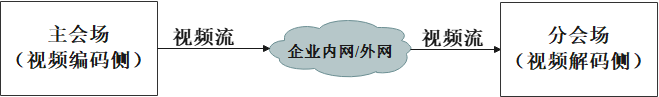
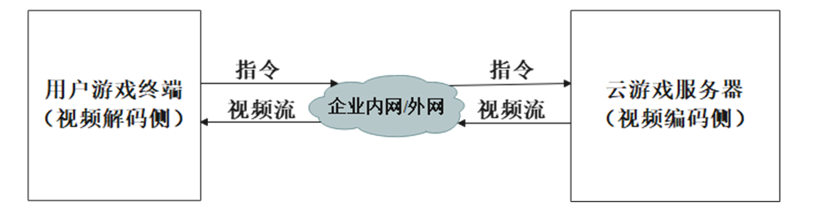
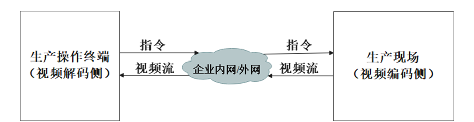
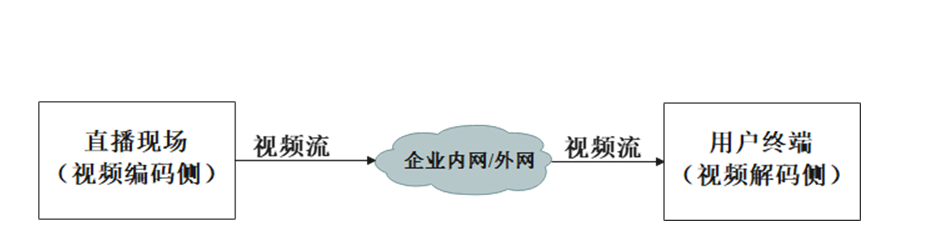
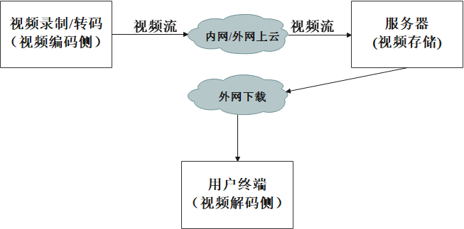

# 典型场景的视频编码配置

描述AVCodec在不同应用场景下的推荐配置参数，供调用者根据实际应用场景进行视频编码应用的开发。

视频编码包括低时延、直播、离线转码等主要场景。


## 通用开发步骤

**在CMake脚本中链接动态库**

```cmake
target_link_libraries(sample PUBLIC libnative_media_codecbase.so)
target_link_libraries(sample PUBLIC libnative_media_core.so)
target_link_libraries(sample PUBLIC libnative_media_venc.so)
```

> **说明：**
>
> 上述'sample'字样仅为示例，此处由调用者根据实际工程目录自定义。
>

**添加头文件**

```c++
#include <multimedia/player_framework/native_avcodec_videoencoder.h>
#include <multimedia/player_framework/native_avcapability.h>
#include <multimedia/player_framework/native_avcodec_base.h>
#include <multimedia/player_framework/native_avformat.h>
#include <fstream>
```

## 低时延场景

低时延场景涵盖了视频会议、云游戏、互动直播以及生产远程操作等，这些均是对端到端时延有较高要求的交互式应用。下图展示了典型的低时延场景。

a. 视频会议（单向）:

   

b. 云游戏场景:

   

c. 生产操作场景:

   


**开发指导**

基础编码流程请参考[视频编码](video-encoding.md)，下面仅针对编码器配置阶段做具体说明。

1. 校验特性。
   
   在创建编码器实例前，可校验当前视频编码器是否支持低时延特性。若支持，则可以使能编码低时延特性。

    ```c++
    // 1.1 获取对应视频编码器能力句柄，此处以H.265为例
    OH_AVCapability *cap = OH_AVCodec_GetCapability(OH_AVCODEC_MIMETYPE_VIDEO_HEVC, true);
    // 1.2 通过特性能力查询接口校验是否支持低时延特性
    bool isSupported = OH_AVCapability_IsFeatureSupported(cap, VIDEO_LOW_LATENCY);
    ```

2. 配置编码器参数。

    在配置编码器参数阶段，配置适合低时延场景的编码参数。

    ```c++
    // 2.1 创建配置AVFormat
    OH_AVFormat *format = OH_AVFormat_Create();

    // 2.2 填充使能参数键值对（以1080p@15fps SDR输入源为例）
    OH_AVFormat_SetIntValue(format, OH_MD_KEY_WIDTH, 1920); // 视频宽
    OH_AVFormat_SetIntValue(format, OH_MD_KEY_HEIGHT, 1080); // 视频高
    OH_AVFormat_SetIntValue(format, OH_MD_KEY_PIXEL_FORMAT, AV_PIXEL_FORMAT_NV12); // YUV排布格式
    OH_AVFormat_SetIntValue(format, OH_MD_KEY_RANGE_FLAG, 0); // 0:limited range/TV 1:full range/PC
    OH_AVFormat_SetIntValue(format, OH_MD_KEY_COLOR_PRIMARIES, OH_ColorPrimary::COLOR_PRIMARY_BT709); // 视频源色域
    OH_AVFormat_SetIntValue(format, OH_MD_KEY_TRANSFER_CHARACTERISTICS, OH_TransferCharacteristic::TRANSFER_CHARACTERISTIC_BT709); // OETF/EOTF曲线
    OH_AVFormat_SetIntValue(format, OH_MD_KEY_MATRIX_COEFFICIENTS, OH_MatrixCoefficient:: MATRIX_COEFFICIENT_BT709); // 视频YUV和RGB转换矩阵
    OH_AVFormat_SetIntValue(format, OH_MD_KEY_PROFILE, OH_HEVCProfile::HEVC_PROFILE_MAIN); // 编码profile
    OH_AVFormat_SetDoubleValue(format, OH_MD_KEY_FRAME_RATE, 15.0); // 视频帧率
    OH_AVFormat_SetIntValue(format, OH_MD_KEY_VIDEO_ENABLE_LOW_LATENCY, 1); // 低时延场景必选, 使能低时延特性：YUV进一帧，出一帧码流数据
    OH_AVFormat_SetIntValue(format, OH_MD_KEY_I_FRAME_INTERVAL, -1);
    OH_AVFormat_SetIntValue(format, OH_MD_KEY_VIDEO_ENCODE_BITRATE_MODE, OH_VideoEncodeBitrateMode::CBR); // 码控模式配置为CBR
    OH_AVFormat_SetLongValue(format, OH_MD_KEY_BITRATE, 1500000); // 设置码率为1.5Mbps

    // 2.3 参数配置
    int32_t ret = OH_VideoEncoder_Configure(videoEnc, format);
    if (ret != AV_ERR_OK) {
        // 异常处理
    }
    // 2.4 配置完成后销毁AVFormat
    OH_AVFormat_Destroy(format);
    ```

    > **注意：**
    > 低时延场景需要配置B帧个数为0。
    >

3. 配置解码器参数。

    视频编码器使能低时延特性后，对应地，解码器也需要配置适合低时延场景的解码参数。

    在 CMake 脚本中链接动态库。
    ``` cmake
    target_link_libraries(sample PUBLIC libnative_media_vdec.so)
    ```

    添加头文件。
    ```c++
    #include <multimedia/player_framework/native_avcodec_videodecoder.h>
    ```

    ```c++
    // 3.1 创建配置AVFormat
    OH_AVFormat *format = OH_AVFormat_Create();

    // 3.2 写入format
    OH_AVFormat_SetIntValue(format, OH_MD_KEY_WIDTH, 1920); // 视频宽，必须配置
    OH_AVFormat_SetIntValue(format, OH_MD_KEY_HEIGHT, 1080); // 视频高，必须配置
    OH_AVFormat_SetIntValue(format, OH_MD_KEY_PIXEL_FORMAT, AV_PIXEL_FORMAT_NV12); // YUV排布格式
    // 必选，配置低时延解码
    OH_AVFormat_SetIntValue(format, OH_MD_KEY_VIDEO_ENABLE_LOW_LATENCY, 1); // 低时延场景必选，使能低时延特性：YUV进一帧，出一帧码流数据

    // 3.3 配置解码器
    int32_t ret = OH_VideoDecoder_Configure(videoDec, format);
    if (ret != AV_ERR_OK) {
        // 异常处理
    }
    // 3.4 配置完成后销毁AVFormat
    OH_AVFormat_Destroy(format);
    ```
    如果需要适配网络波动，推荐结合采用[时域可分层视频编码](video-encoding-temporal-scalability.md)配置。

## 直播场景

直播场景包括泛娱乐直播、游戏直播、赛事直播等，这些均是对视频端到端时延要求不高的应用场景。

   


**开发指导**

基础编码流程请参考[视频编码](video-encoding.md)，下面仅针对编码器配置阶段做具体说明。

1. （可选）校验特性。
   
   在创建编码器实例前，可校验当前视频编码器是否支持低时延特性。若支持，则可以使能编码低时延特性。

    ```c++
    // 1.1 获取对应视频编码器能力句柄，此处以H.265为例
    OH_AVCapability *cap = OH_AVCodec_GetCapability(OH_AVCODEC_MIMETYPE_VIDEO_HEVC, true);
    // 1.2 通过特性能力查询接口校验是否支持低时延特性
    bool isSupported = OH_AVCapability_IsFeatureSupported(cap, VIDEO_LOW_LATENCY);
    ```

2. 配置编码器参数。

    在配置编码器参数阶段，配置适合直播场景的编码参数。

    ```c++
    // 2.1 创建配置用临时AVFormat
    OH_AVFormat *format = OH_AVFormat_Create();
    // 2.2 填充使能参数键值对（以1080p@15fps SDR输入源为例）
    OH_AVFormat_SetIntValue(format, OH_MD_KEY_WIDTH, 1920); // 视频宽
    OH_AVFormat_SetIntValue(format, OH_MD_KEY_HEIGHT, 1080); // 视频高
    OH_AVFormat_SetIntValue(format, OH_MD_KEY_PIXEL_FORMAT, AV_PIXEL_FORMAT_NV12); // YUV排布格式
    OH_AVFormat_SetIntValue(format, OH_MD_KEY_RANGE_FLAG, 0); // 0:limited range/TV 1:full range/PC
    OH_AVFormat_SetIntValue(format, OH_MD_KEY_COLOR_PRIMARIES, OH_ColorPrimary::COLOR_PRIMARY_BT709); // 视频源色域
    OH_AVFormat_SetIntValue(format, OH_MD_KEY_TRANSFER_CHARACTERISTICS, OH_TransferCharacteristic::TRANSFER_CHARACTERISTIC_BT709); // OETF/EOTF曲线
    OH_AVFormat_SetIntValue(format, OH_MD_KEY_MATRIX_COEFFICIENTS, OH_MatrixCoefficient:: MATRIX_COEFFICIENT_BT709); // 视频YUV和RGB转换矩阵
    OH_AVFormat_SetIntValue(format, OH_MD_KEY_PROFILE, OH_HEVCProfile::HEVC_PROFILE_MAIN); // 编码profile
    OH_AVFormat_SetDoubleValue(format, OH_MD_KEY_FRAME_RATE, 22); // 视频帧率
    OH_AVFormat_SetIntValue(format, OH_MD_KEY_VIDEO_ENABLE_LOW_LATENCY, 1); // 直播场景如果时延要求高，可选设置，使能低时延特性：YUV进一帧，出一帧码流数据
    OH_AVFormat_SetIntValue(format, OH_MD_KEY_I_FRAME_INTERVAL, 2000); // 关键帧间隔2s
    OH_AVFormat_SetIntValue(format, OH_MD_KEY_VIDEO_ENCODE_BITRATE_MODE, OH_VideoEncodeBitrateMode::VBR); // 码控模式配置为VBR
    OH_AVFormat_SetLongValue(format, OH_MD_KEY_BITRATE, 2500000); // 设置码率为2.5Mbps// 2.3 参数配置
    int32_t ret = OH_VideoEncoder_Configure(videoEnc, format);
    if (ret != AV_ERR_OK) {
        // 异常处理
    }
    // 2.4 配置完成后销毁临时AVFormat
    OH_AVFormat_Destroy(format);
    ```


## 离线转码场景

离线转码场景包括电视剧、电影、网络短剧、直播回放、编辑导出等多种应用场景，为了适配支持不同显示规格（如480p、1080p、4K等）终端、不同码流格式（如H.264、H.265等）的终端，以及不同带宽条件下的多种情况，在内容制作端对源进行离线转码，生成多种尺寸、多种码率、多种编码格式的视频码流文件，供用户分享或者观看。

   


**开发指导**

基础编码流程请参考[视频编码](video-encoding.md)，下面仅针对编码器配置阶段做具体说明。

配置编码器参数。
   
在配置编码器参数阶段，配置适合离线转码场景的编码参数。

```c++
// 1. 创建配置AVFormat
OH_AVFormat *format = OH_AVFormat_Create();
// 2. 填充使能参数键值对（以1080p@15fps SDR输入源为例）
OH_AVFormat_SetIntValue(format, OH_MD_KEY_WIDTH, 1920); // 视频宽
OH_AVFormat_SetIntValue(format, OH_MD_KEY_HEIGHT, 1080); // 视频高
OH_AVFormat_SetIntValue(format, OH_MD_KEY_PIXEL_FORMAT, AV_PIXEL_FORMAT_NV12); // YUV排布格式
OH_AVFormat_SetIntValue(format, OH_MD_KEY_RANGE_FLAG, 0); // 0:limited range/TV 1:full range/PC
OH_AVFormat_SetIntValue(format, OH_MD_KEY_COLOR_PRIMARIES, OH_ColorPrimary::COLOR_PRIMARY_BT709); // 视频源色域
OH_AVFormat_SetIntValue(format, OH_MD_KEY_TRANSFER_CHARACTERISTICS, OH_TransferCharacteristic::TRANSFER_CHARACTERISTIC_BT709); // OETF/EOTF曲线
OH_AVFormat_SetIntValue(format, OH_MD_KEY_MATRIX_COEFFICIENTS, OH_MatrixCoefficient:: MATRIX_COEFFICIENT_BT709); // 视频YUV和RGB转换矩阵
OH_AVFormat_SetIntValue(format, OH_MD_KEY_PROFILE, OH_HEVCProfile::HEVC_PROFILE_MAIN); // 编码profile
OH_AVFormat_SetDoubleValue(format, OH_MD_KEY_FRAME_RATE, 25); // 视频帧率
OH_AVFormat_SetIntValue(format, OH_MD_KEY_I_FRAME_INTERVAL, 5000); // 关键帧间隔5s
OH_AVFormat_SetIntValue(format, OH_MD_KEY_VIDEO_ENCODE_BITRATE_MODE, OH_VideoEncodeBitrateMode::VBR); // 码控模式配置为VBR
OH_AVFormat_SetLongValue(format, OH_MD_KEY_BITRATE, 3000000); // 设置码率为3Mbps
// 3. 参数配置
int32_t ret = OH_VideoEncoder_Configure(videoEnc, format);
if (ret != AV_ERR_OK) {
    // 异常处理
}
// 4. 配置完成后销毁AVFormat
OH_AVFormat_Destroy(format);
```
