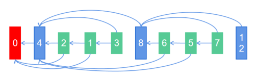
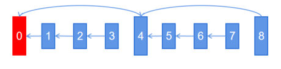
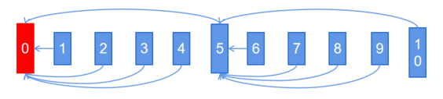

# 视频编码扩展特性——时域可分级视频编码
## 概念介绍

可分级视频编码（Scalable Video Coding），是传统视频编码的扩展特性，其特点是能一次编码出可时域伸缩、空域伸缩、质量域伸缩的码流结构。通过差异化选择解码帧组合新的视频码流，覆盖因网络、终端能力和用户需求不同的差异化需求。

因仅需在传统视频编码流程中开放参考关系指定能力就能实现**时域可分级视频编码**，时域可分级在主流芯片厂商的硬件编码器上支持度远高于空域分级和质量域分级。**API12仅支持时域分级视频编码。**

主流时域可分级编码有分级B编码和分级P编码。
*分级B编码：可按需丢弃帧上图中B帧，不影响视频正常播放：3（7）-> 1（5）-> 2（6）*

*分级P编码：可按需丢弃上图中小P帧，不影响视频正常播放：3（7）-> 2（6）-> 1（5）*


其中分级B编码依赖芯片厂商支持基础B帧编码，**API12仅支持时域分级P编码。**

## 适用场景
基于上述描述的时域分级编码特点，可以利用时域分级结构，自适应动态变化的传输压力或解码压力，推荐以下使用场景：
* 场景1：接受测无缓存或低缓存的实时编码传输场景，例如网络视频会议、网络视频直播、短距协同办公等。
* 场景2：有视频预览播放或倍速播放需求的视频编码录制场景。

## 接口介绍
API12提供两套独立设置时域分级编码的接口。
### 1）时域可分级特性
**从易用维度设计了一套叫时域可分级(temporal_scalability)特性的静态配置，适用于稳定和简单的时域分级结构，初始配置，全局生效**。
在configure阶段配置使能参数`OH_MD_KEY_VIDEO_ENCODER_ENABLE_TEMPORAL_SCALABILITY`，并按需配置时域图片组参数，包括时域图片组大小`OH_MD_KEY_VIDEO_ENCODER_TEMPORAL_GOP_SIZE`，以及时域图片组内的参考方式`OH_MD_KEY_VIDEO_ENCODER_TEMPORAL_GOP_REFERENCE_MODE`。
时域图片组大小参数，可在[2, GopSize)范围内配置，影响时域关键帧之间的间隔，用户需要基于自身业务场景下抽帧需求自定义关键帧密度。
时域图片组参考方式参数，影响非关键帧参考方式。包括相邻参考`ADJACENT_REFERENCE`压和跨帧参考`JUMP_REFERENCE`。相邻参考相对跨帧参考拥有更好的压缩性能，跨帧参考相对相邻参考拥有更好的丢帧自由度。
*时域Gop4，相邻参考模式：*

*时域Gop5，跨帧参考模式：*



### 2）长期参考帧特性
**从灵活维度设计了一套长期参考帧(long_term_reference)特性的动态配置，适用于灵活和复杂的时域分级结构，逐帧配置**。在configure阶段除配置使能参数`OH_MD_KEY_VIDEO_ENCODER_LTR_FRAME_COUNT`外，还需要开启随帧参数配置通路，其中surface输入场景需要注册随帧参数回调`OH_VideoEncoder_OnNeedInputParameter`，buffer模式需要使用用`AVBuffer`接口配置。在输入回调轮转中，配置并下发随帧参数，动态控制编码结构。
*注意：两套配置不能一起开启，若两套一起开启，则动态配置会失效。若涉及需要动态配置场景，请不要使能静态配置，直接使用动态配置即可。*

## 开发指导
基础编码流程请参考[视频编码开发指导](video_encoding.md)，下面仅针与基础视频编码过程中存在的区别做具体说明。

### 1）时域可分级特性开发指导
在surface输入和buffer输入两种模式下无差别，以surface输入模式H.264编码为例介绍：
1. 添加头文件。
    *和基础视频编码一致*
2. 创建编码器实例对象。
    *和基础视频编码一致*
3. 调用OH_VideoEncoder_RegisterCallback()设置回调函数。
    *和基础视频编码一致*
4. 调用OH_VideoEncoder_Configure()配置编码器。
    除基础视频编码配置外，您还需要通过如下流程配置时域可分级特性
    ```c++
    // 1. 基础配置，此处只列举必选以及和时域分级编码相关参数
    OH_AVFormat *format = OH_AVFormat_Create();
    // 1.1 必选基础配置
    OH_AVFormat_SetIntValue(format, OH_MD_KEY_WIDTH, 1920);
    OH_AVFormat_SetIntValue(format, OH_MD_KEY_HEIGHT, 1080);
    OH_AVFormat_SetIntValue(format, OH_MD_KEY_PIXEL_FORMAT, AV_PIXEL_FORMAT_NV12);
    // 1.2 (可选) 影响GopSize的配置
    OH_AVFormat_SetDoubleValue(format, OH_MD_KEY_FRAME_RATE, 30.0);
    OH_AVFormat_SetIntValue(format, OH_MD_KEY_I_FRAME_INTERVAL, 2000);
    // 2. 通过能力查询接口确认视频编码器是否时域可分级特性
    OH_AVCapability *capability = OH_AVCodec_GetCapability  (OH_AVCODEC_MIMETYPE_VIDEO_AVC, true);
    bool isSupported = OH_AVCapability_isFeatureSupported(capability, VIDEO_ENCODER_TEMPORAL_SCALABILITY);
    // 3. 若支持，配置时域可分级特性相关参数，包括使能参数和时域Gop参数
    if (isSupported) {
        // 3.1 (必选)配置时域可分级特性使能参数
        OH_AVFormat_SetIntValue(format, OH_MD_KEY_VIDEO_ENCODER_ENABLE_TEMPORAL_SCALABILITY, 1);
        // 3.2 (可选)配置时域可分级特性时域Gop尺寸参数，取值范围为[2, GopSize), 若不配置，将使用默认配置
        OH_AVFormat_SetIntValue(format, OH_MD_KEY_VIDEO_ENCODER_TEMPORAL_GOP_SIZE, 6);
        // 3.3 (可选)配置时域可分级特性时域Gop参考模式，可选ADJACENT_REFERENCE和JUMP_REFERENCE，若不配置，将使用默认配置
        OH_AVFormat_SetIntValue(format, OH_MD_KEY_VIDEO_ENCODER_TEMPORAL_GOP_REFERENCE_MODE, ADJACENT_REFERENCE);
    }
    // 4. 时域可分级特性参数随其他参数一起向下配置
    int32_t ret = OH_VideoEncoder_Configure(videoEnc, format);
    if (ret != AV_ERR_OK) {
        // 异常处理
    }
    OH_AVFormat_Destroy(format);
    ```
5. 调用OH_VideoEncoder_Prepare()编码器就绪。
    *和基础视频编码一致*
6. 获取Surface。
    *和基础视频编码一致*
7. 调用OH_VideoEncoder_Start()启动编码器。
    *和基础视频编码一致*
8. （可选）在运行过程中动态配置编码器参数。
    *注意：时域分级编码特性使能后，不能通过`OH_VideoEncoder_SetParameter`接口配置`OH_MD_KEY_REQUEST_I_FRAME`，否则因生效时间随机，参考帧关系可能会错乱。如需使用请求动态IDR帧，请使用随帧参数通路随帧配置，参考xxx，此处不做详述。*
9.  写出编码码流。
    *和基础视频编码一致*
10. 调用OH_VideoEncoder_NotifyEndOfStream()通知编码器码流结束。
    *和基础视频编码一致*
11. 调用OH_VideoEncoder_FreeOutputBuffer()释放编码帧。
    *和基础视频编码一致*
12. （可选）调用OH_VideoEncoder_Flush()刷新编码器。
    *和基础视频编码一致*
13. （可选）调用OH_VideoEncoder_Reset()重置编码器。
    *和基础视频编码一致*
14. （可选）调用OH_VideoEncoder_Stop()停止编码器。
    *和基础视频编码一致*
15. 调用OH_VideoEncoder_Destroy()销毁编码器实例，释放资源。
    *和基础视频编码一致*


### 2）长期参考帧特性开发指导
// 待实施
 


