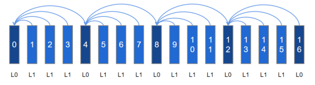

# 时域可分层视频编码
## 基础概念
### 时域可分层视频编码介绍
**可分层视频编码**，又叫可分级视频编码、可伸缩视频编码，是视频编码的扩展标准，目前常用的包含SVC（H.264编码标准采用的可伸缩扩展）和SHVC（H.265编码标准采用的可扩展标准）。

其特点是能一次编码出时域分层、空域分层、质量域分层的码流结构，满足因网络、终端能力和用户需求不同带来的的差异化需求。

**时域可分层视频编码**, 是指能编码出时域分层码流的视频编码，下图是通过参考关系构建的4层时域分层码流结构。


从高到低逐层丢弃部分层级的码流（丢弃顺序L3->L2->L1），能实现不同程度的帧率伸缩，以满足传输和解码能力的变化需求。

如下图所示，是上述4层时域分层码流结构丢弃L3后组成的新的码流结构，能在解码正常的情况下实现帧率减半的效果。其他层的丢弃同理。


### 时域分层码流结构介绍
基础码流是由一个或多个独立图像组（Group Of Pictures，简称GOP）组合而成的。GOP是在编码中一组从I帧开始到I帧结束的连续的可独立解码的图像组。

时域分层码流可以在GOP内继续细分为独立的一个或多个时域图像组（Temporal Group Of Pictures, 简称TGOP），每一个TGOP由一个基本层和后续的一个或多个增强层组合而成，如上述4层时域分层码流结构中的帧0到帧7是一个TGOP。

* **基本层（Base Layer, 简称BL）：** 是GOP中的最底层（L0）。在时域分层中，该层用最低帧率进行编码。

* **增强层（Enhance Layer简称EL）：** 是BL之上的层级，由低到高可以分为多层（L1,L2,L3）。在时域分层中，最低层的EL依据BL获得的编码信息，进一步编码帧率更高的层级，更高层的EL会依据BL或低层EL，来编码比低层更高帧率的视频。


### 如何实现时域分层码流结构
时域分层码流结构的实现是依靠参考关系逐帧指定实现的，参考帧按在解码图像缓存区（Decoded Picture Buffer，简称DPB）驻留的时长分为短期参考帧和长期参考帧。

* **短期参考帧（Short-Term Reference，简称STR）：** 是不能长期驻留在DPB中的参考帧，更新方式是先进先出，如果DPB满，旧的短期参考帧会被移出DPB。

* **长期参考帧（Long-Term Reference，简称LTR）：** 是能长期驻留在DPB中的参考帧，通过标记替换的方式更新，不主动标记替换就不会更新。

虽然STR个数大于1时，也能实现一定的跨帧参考结构，但受限于存在时效过短，时域分层结构支持的跨度有限。LTR则不存在上述问题，也能覆盖短期参考帧跨帧场景。优选使用LTR实现时域分层码流结构。


## 适用场景
基于上述描述的时域分层编码特点，推荐以下场景使用：

- 场景1：播放侧无缓存或低缓存的实时编码传输场景，例如视频会议、视频直播、协同办公等。

- 场景2：有视频预览播放或倍速播放需求的视频编码录制场景。

若开发场景不涉及动态调整时域参考结构，且分层结构简单，则推荐使用[全局时域可分层特性](#全局时域可分层特性feature_temporal_scalability)，否则使能[长期参考帧特性](#长期参考帧特性feature_long-term_reference)。


## 约束和限制

- 不可以混用全局时域可分层特性和长期参考帧特性。

  由于底层实现归一，全局时域可分层特性和长期参考帧特性不能同时开启。

- 叠加强制IDR配置时，请使用随帧通路。

  参考帧仅在GOP内有效，刷新I帧后，DPB随之清空, 参考帧随之也会被清空。

  因此参考关系的指定受I帧刷新位置影响很大，使能时域分层能力后若需要通过`OH_MD_KEY_REQUEST_I_FRAME`临时请求I帧，**应避免使用生效时`OH_VideoEncoder_SetParameter`方式。**

  应使用随帧配置方式，参考随帧配置通路相关指导。

- 支持`OH_AVBuffer`回调通路，不支持`OH_AVMemory`回调通路。

   新特性依赖随帧特性，应避免使用`OH_AVMemory`回调`OH_AVCodecAsyncCallback`，应使用`OH_AVBuffer`回调`OH_AVCodecCallback`。

- 支持时域P分层，不支持时域B分层。

  时域可分层编码按分层帧类型分为基于P帧的时域分层和基于B帧的时域编码，当前支持分层P编码，不支持分层B编码。


## 全局时域可分层特性（Feature_Temporal_Scalability）
### 接口介绍
全局时域可层特性，适用于编码稳定和简单的时域分层结构，初始配置，全局生效，不支持动态修改。开发配置参数如下：

| 配置参数 | 语义                         |
| -------- | ---------------------------- |
| OH_MD_KEY_VIDEO_ENCODER_ENABLE_TEMPORAL_SCALABILITY  |  全局时域分层编码使能参数 |
| OH_MD_KEY_VIDEO_ENCODER_TEMPORAL_GOP_SIZE  | 全局时域分层编码TGOP大小参数 |
| OH_MD_KEY_VIDEO_ENCODER_TEMPORAL_GOP_REFERENCE_MODE  | 全局时域分层编码TGOP参考模式  |

* **全局时域分层编码使能参数：** 在configure阶段配置，仅特性支持才会真正使能成功。

* **全局时域分层编码TGOP大小参数：** 可选配置，影响时域关键帧之间的间隔，用户需要基于自身业务场景下抽帧需求自定义关键帧密度，可在[2, GopSize)范围内配置，若不配置则使用默认值

* **全局时域分层编码TGOP参考模式参数：** 可选配置，影响非关键帧参考模式。包括相邻参考`ADJACENT_REFERENCE`和跨帧参考`JUMP_REFERENCE`。相邻参考相对跨帧参考拥有更好的压缩性能，跨帧参考相对相邻参考拥有更好的丢帧自由度，如不配置则使用默认值。

使用举例1：TGOP=4，相邻参考模式


使用举例2：TGOP=4，跨帧参考模式




### 开发指导
基础编码流程请参考[视频编码开发指导](video-encoding.md)，下面仅针与基础视频编码过程中存在的区别做具体说明。

1. 在初始阶段创建编码实例时，校验当前视频编码器是否支持全局时域可分层特性。

    ```c++
    // 1.1 获取对应视频编码器能力句柄，此处以H.264为例
    OH_AVCapability *cap = OH_AVCodec_GetCapability(OH_AVCODEC_MIMETYPE_VIDEO_AVC, true);
    // 1.2 通过特性能力查询接口校验是否支持全局时域可分层特性
    bool isSupported = OH_AVCapability_isFeatureSupported(cap, VIDEO_ENCODER_TEMPORAL_SCALABILITY);
    ```

    若支持，则可以使能全局时域可分层特性。

2. 在配置阶段，配置全局时域分层编码特性参数。

    ```c++
    constexpr int32_t TGOP_SIZE = 3; 
    // 2.1 创建配置用临时AVFormat
    OH_AVFormat *format = OH_AVFormat_Create();
    // 2.2 填充使能参数键值对
    OH_AVFormat_SetIntValue(format, OH_MD_KEY_VIDEO_ENCODER_ENABLE_TEMPORAL_SCALABILITY, 1);
    // 2.3 (可选)填充TGOP大小和TGOP内参考模式键值对
    OH_AVFormat_SetIntValue(format, OH_MD_KEY_VIDEO_ENCODER_TEMPORAL_GOP_SIZE, TGOP_SIZE);
    OH_AVFormat_SetIntValue(format, OH_MD_KEY_VIDEO_ENCODER_TEMPORAL_GOP_REFERENCE_MODE, ADJACENT_REFERENCE);
    // 2.4 Configure配置
    int32_t ret = OH_VideoEncoder_Configure(videoEnc, format);
    if (ret != AV_ERR_OK) {
        // 异常处理
    }
    // 2.5 配置完成后销毁临时AVFormat
    OH_AVFormat_Destroy(format);
    ```

3. （可选）在运行阶段输出轮转中，获取码流对应时域层级信息。

   开发者可基于已配置的TGOP参数，按编码出帧数目周期性获取。

    通过配置周期获取示例代码如下：

    ```c++
    uint32_t outPoc = 0;
    // 通过输出回调中有效帧数，获取TGOP内相对位置，对照配置确认层级
    static void OnNewOutputBuffer(OH_AVCodec *codec, uint32_t index, OH_AVBuffer *buffer, void *userData)
    {
        // 注：若涉及复杂处理流程，建议相关
        struct OH_AVCodecBufferAttr attr;
        (void)buffer->GetBufferAttr(attr);
        // 刷新I帧后poc归零
        if (attr.flags | AVCODEC_BUFFER_FLAG_KEY_FRAME) {
            outPoc = 0;
        }
        // 没有帧码流只有XPS的输出需要跳过
        if (attr.flags != AVCODEC_BUFFER_FLAG_CODEC_DATA) {
            int32_t tGopInner = outPoc % TGOP_SIZE;
            outPoc++;
        }
    }
    ```

4. （可选）在运行阶段输出轮转中，使用步骤3获取的时域层级信息，自适应传输或自适应解码。

    基于获取的时域可分层码流和对应的层级信息，开发者可选择需要的层级进行传输，或携带至对端自适应选帧解码。


## 长期参考帧特性（Feature_Long-Term_Reference）

待提供