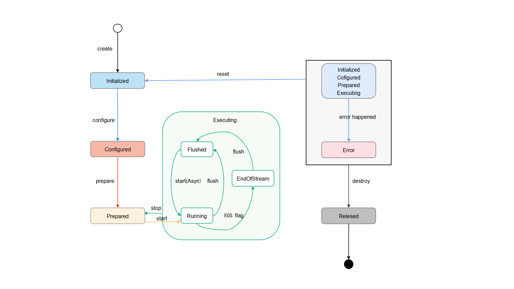
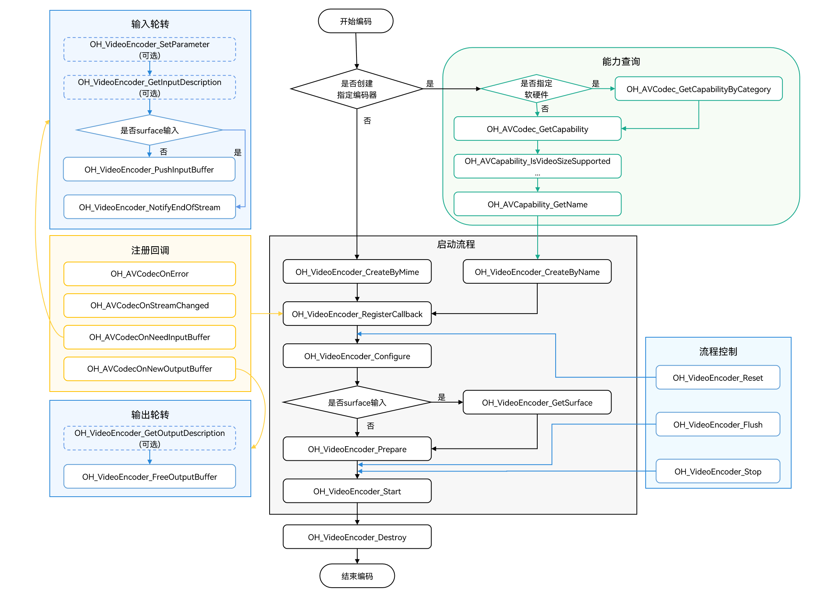
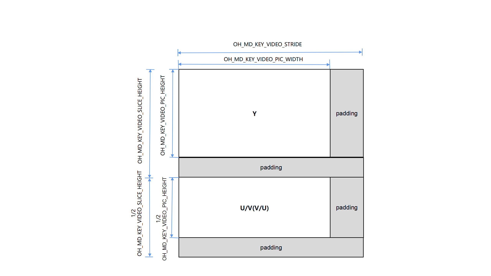

# 视频编码

调用者可以调用本模块的Native API接口，完成视频编码，即将未压缩的视频数据压缩成视频码流。

<!--RP3--><!--RP3End-->

当前支持的编码能力如下：

| 容器规格 | 视频编码类型                 |
| -------- | ---------------------------- |
| mp4      | HEVC（H.265）、 AVC（H.264） |

目前仅支持硬件编码，基于MimeType创建编码器时，支持配置为H264 (OH_AVCODEC_MIMETYPE_VIDEO_AVC) 和 H265 (OH_AVCODEC_MIMETYPE_VIDEO_HEVC)。

每一种编码的能力范围，可以通过[获取支持的编解码能力](obtain-supported-codecs.md)获取。

<!--RP1--><!--RP1End-->

视频编码支持以下能力：

<!--RP4-->
|          支持的能力                       |                              使用简述                                            |
| --------------------------------------- | ---------------------------------------------------------------------------------- |
| 分层编码 <br> 设置LTR帧、参考帧                      | 具体可参考：[时域可分层视频编码](video-encoding-temporal-scalability.md)        |
<!--RP4End-->

## 限制约束
1. Buffer模式不支持10bit的图像数据。
2. 由于硬件编码器资源有限，每个编码器在使用完毕后都必须调用OH_VideoEncoder_Destroy接口来销毁实例并释放资源。
3. 一旦调用Flush，Reset，Stop接口，会触发系统回收OH_AVBuffer，调用者不应对之前回调函数获取到的OH_AVBuffer继续进行操作。
4. Buffer模式和Surface模式使用方式一致的接口，所以只提供了Surface模式的示例。
5. 在Buffer模式下，调用者通过输入回调函数OH_AVCodecOnNeedInputBuffer获取到OH_AVBuffer的指针对象后，必须通过调用OH_VideoEncoder_PushInputBuffer接口
   来通知系统该对象已被使用完毕。这样系统才能够将该对象里面的数据进行编码。如果调用者在调用OH_AVBuffer_GetNativeBuffer接口时获取到OH_NativeBuffer指针对象，并且该对象的生命周期超过了当前的OH_AVBuffer指针对象，那么需要进行一次数据的拷贝操作。在这种情况下，调用者需要自行管理新生成的OH_NativeBuffer对象的生命周期，确保其正确使用和释放。


## surface输入与buffer输入

1. 两者的数据来源不同。

2. 两者的适用场景不同：
- surface输入是指用OHNativeWindow来传递输入数据，可以与其他模块对接，例如相机模块。
- buffer输入是指有一块预先分配好的内存区域，调用者需要将原始数据拷贝进这块内存区域中。更适用于从文件中读取视频数据等场景。

3. 在接口调用的过程中，两种方式的接口调用方式基本一致，但存在以下差异点：
 - Buffer模式下，调用者通过OH_VideoEncoder_PushInputBuffer接口输入数据；Surface模式下，调用者应在编码器就绪前调用OH_VideoEncoder_GetSurface接口，获取OHNativeWindow用于传递视频数据。
 - Buffer模式下，调用者通过OH_AVBuffer中的attr传入结束flag，编码器读取到尾帧后，停止编码；Surface模式下，需要调用OH_VideoEncoder_NotifyEndOfStream接口通知编码器输入流结束。

两种模式的开发步骤详细说明请参考：[Surface模式](#surface模式)和[Buffer模式](#buffer模式)。

## 状态机调用关系
如下为状态机调用关系图：




1. 有两种方式可以使编码器进入Initialized状态：
   - 初始创建编码器实例时，编码器处于Initialized状态。
   - 任何状态下，调用OH_VideoEncoder_Reset接口，编码器将会移回Initialized状态。

2. Initialized状态下，调用OH_VideoEncoder_Configure接口配置编码器，配置成功后编码器进入Configured状态。
3. Configured状态下，调用OH_VideoEncoder_Prepare()进入Prepared状态。
4. Prepared状态下，调用OH_VideoEncoder_Start接口使编码器进入Executing状态：
   - 处于Executing状态时，调用OH_VideoEncoder_Stop接口可以使编码器返回到Prepared状态。

5. 在极少数情况下，编码器可能会遇到错误并进入Error状态。编码器的错误传递，可以通过队列操作返回无效值或者抛出异常：
   - Error状态下，可以调用OH_VideoEncoder_Reset接口将编码器移到Initialized状态；或者调用OH_VideoEncoder_Destroy接口移动到最后的Released状态。

6. Executing 状态具有三个子状态：Flushed、Running和End-of-Stream：
   - 在调用了OH_VideoEncoder_Start接口之后，编码器立即进入Running子状态。
   - 对于处于Executing状态的编码器，可以调用OH_VideoEncoder_Flush接口返回到Flushed子状态。
   - 当待处理数据全部传递给编码器后，可以在input buffers队列中为最后一个入队的input buffer中添加[AVCODEC_BUFFER_FLAGS_EOS](../../reference/apis-avcodec-kit/_core.md#oh_avcodecbufferflags-1)标记，遇到这个标记时，编码器会转换为End-of-Stream子状态。在此状态下，编码器不再接受新的输入，但是仍然会继续生成输出，直到输出到达尾帧。

7. 使用完编码器后，必须调用OH_VideoEncoder_Destroy接口销毁编码器实例。使编码器进入Released状态。

## 开发指导

详细的API说明请参考[API文档](../../reference/apis-avcodec-kit/_video_encoder.md)。
如下为视频编码调用关系图：

- 虚线表示可选。

- 实线表示必选。



### 在 CMake 脚本中链接动态库

```cmake
target_link_libraries(sample PUBLIC libnative_media_codecbase.so)
target_link_libraries(sample PUBLIC libnative_media_core.so)
target_link_libraries(sample PUBLIC libnative_media_venc.so)
```
> **说明：**
>
> 上述'sample'字样仅为示例，此处由调用者根据实际工程目录自定义。
>

### Surface模式

参考以下示例代码，调用者可以完成Surface模式下视频编码的全流程。此处以surface数据输入，编码成H.264格式为例。
本模块目前仅支持异步模式的数据轮转。

1. 添加头文件。

    ```cpp
    #include <multimedia/player_framework/native_avcodec_videoencoder.h>
    #include <multimedia/player_framework/native_avcapability.h>
    #include <multimedia/player_framework/native_avcodec_base.h>
    #include <multimedia/player_framework/native_avformat.h>
    #include <multimedia/player_framework/native_avbuffer.h>
    #include <fstream>
    ```

2. 全局变量。

    ```c++
    // 配置视频帧宽度（必须）
    int32_t width = 320; 
    // 配置视频帧高度（必须）
    int32_t height = 240;
    // 配置视频像素格式（必须）
    constexpr OH_AVPixelFormat DEFAULT_PIXELFORMAT = AV_PIXEL_FORMAT_NV12;
    int32_t widthStride = 0;
    int32_t heightStride = 0;
    ```
   
3. 创建编码器实例对象。

    调用者可以通过名称或媒体类型创建编码器。示例中的变量说明如下：

    - videoEnc：视频编码器实例的指针；
    - capability：编解码器能力查询实例的指针；
    - OH_AVCODEC_MIMETYPE_VIDEO_AVC：AVC格式视频编解码器。

    创建方式示例如下：

    ```c++
    // 通过codec name创建编码器，应用有特殊需求，比如选择支持某种分辨率规格的编码器，可先查询capability，再根据codec name创建编码器。
    OH_AVCapability *capability = OH_AVCodec_GetCapability(OH_AVCODEC_MIMETYPE_VIDEO_AVC, true);
    // 创建硬件编码器实例
    OH_AVCapability *capability= OH_AVCodec_GetCapabilityByCategory(OH_AVCODEC_MIMETYPE_VIDEO_AVC, false, HARDWARE);
    const char *codecName = OH_AVCapability_GetName(capability);
    OH_AVCodec *videoEnc = OH_VideoEncoder_CreateByName(codecName);
    ```

    ```c++
    // 通过MIME TYPE创建编码器，只能创建系统推荐的特定编解码器
    // 只能创建硬件编码器
    OH_AVCodec *videoEnc = OH_VideoEncoder_CreateByMime(OH_AVCODEC_MIMETYPE_VIDEO_AVC);
    ```

4. 调用OH_VideoEncoder_RegisterCallback()设置回调函数。

    注册回调函数指针集合OH_AVCodecCallback，包括：

    - OH_AVCodecOnError 编码器运行错误，返回的错误码详情请参见[OH_AVCodecOnError](../../reference/apis-avcodec-kit/_codec_base.md#oh_avcodeconerror)；
    - OH_AVCodecOnStreamChanged  码流信息变化，如格式变化等；
    - OH_AVCodecOnNeedInputBuffer 输入回调无作用，调用者通过获取的surface输入数据；
    - OH_AVCodecOnNewOutputBuffer 运行过程中产生了新的输出数据，即编码完成。

    <!--RP2--><!--RP2End-->

    示例如下所示：

    <!--RP5-->
    ```c++
    // 设置OH_AVCodecOnError 回调函数，编码异常
    static void OnError(OH_AVCodec *codec, int32_t errorCode, void *userData)
    {
        // 回调的错误码由调用者判断处理
        (void)codec;
        (void)errorCode;
        (void)userData;
    }
    ```
    <!--RP5End-->

    ```c++
    // 设置OH_AVCodecOnStreamChanged 回调函数，编码数据流变化
    static void OnStreamChanged(OH_AVCodec *codec, OH_AVFormat *format, void *userData)
    {
        // 编码场景，该回调函数无作用
        (void)codec;
        (void)format;
        (void)userData;
    }
    ```

    ```c++
    // 设置 OH_AVCodecOnNeedInputBuffer 回调函数，编码输入帧送入数据队列
    static void OnNeedInputBuffer(OH_AVCodec *codec, uint32_t index, OH_AVBuffer *buffer, void *userData)
    {
        // Surface模式下，该回调函数无作用，调用者通过获取的surface输入数据
        (void)userData;
        (void)index;
        (void)buffer;
    }
    ```

    <!--RP6-->
    ```c++
    // 设置 OH_AVCodecOnNewOutputBuffer 回调函数，编码完成帧送入输出队列
    static void OnNewOutputBuffer(OH_AVCodec *codec, uint32_t index, OH_AVBuffer *buffer, void *userData)
    {
        // 完成帧buffer对应的index，送入outIndexQueue队列
        // 完成帧的数据buffer送入outBufferQueue队列
        // 数据处理
        // 释放编码帧
    }
    ```
    <!--RP6End-->

    ```c++
    // 配置异步回调，调用 OH_VideoEncoder_RegisterCallback()接口
    OH_AVCodecCallback cb = {&OnError, &OnStreamChanged, &OnNeedInputBuffer, &OnNewOutputBuffer};
    int32_t ret = OH_VideoEncoder_RegisterCallback(videoEnc, cb, NULL); // NULL:用户特定数据userData为空 
    if (ret != AV_ERR_OK) {
        // 异常处理
    }
    ```

    > **说明：**
    > 在回调函数中，对数据队列进行操作时，需要注意多线程同步的问题。
    >

5. （可选）调用OH_VideoEncoder_RegisterParameterCallback()在Configur接口之前注册随帧通路回调。

    详情请参考[时域可分层视频编码](video-encoding-temporal-scalability.md)。

    <!--RP7-->
    ```c++
    // 5.1 编码输入参数回调OH_VideoEncoder_OnNeedInputParameter实现
    static void OnNeedInputParameter(OH_AVCodec *codec, uint32_t index, OH_AVFormat *parameter, void *userData)
    {
        // 输入帧parameter对应的index，送入InParameterIndexQueue队列
        // 输入帧的数据parameter送入InParameterQueue队列
        // 数据处理
        // 随帧参数写入
    }

    // 5.2 注册随帧参数回调
    OH_VideoEncoder_OnNeedInputParameter inParaCb = OnNeedInputParameter;
    OH_VideoEncoder_RegisterParameterCallback(videoEnc, inParaCb, NULL); // NULL:用户特定数据userData为空
    ```
    <!--RP7End-->

6. 调用OH_VideoEncoder_Configure()配置编码器。

    详细可配置选项的说明请参考[视频专有键值对](../../reference/apis-avcodec-kit/_codec_base.md#媒体数据键值对)。
    
    参数校验规则请参考[OH_VideoEncoder_Configure()参考文档](../../reference/apis-avcodec-kit/_video_encoder.md#oh_videoencoder_configure)。

    参数取值范围可以通过能力查询接口获取，具体示例请参考[获取支持的编解码能力文档](obtain-supported-codecs.md)。

    目前支持的所有格式都必须配置以下选项：视频帧宽度、视频帧高度、视频像素格式。示例中的变量如下：

    - DEFAULT_WIDTH：320像素宽度；
    - DEFAULT_HEIGHT：240像素高度；
    - DEFAULT_PIXELFORMAT： 像素格式，因为示例使用YUV的文件保存的像素格式是NV12，所以设置为 AV_PIXEL_FORMAT_NV12。

    ```c++
    // 配置视频帧速率
    double frameRate = 30.0;
    // 配置视频YUV值范围标志
    bool rangeFlag = false;
    // 配置视频原色
    int32_t primary = static_cast<int32_t>(OH_ColorPrimary::COLOR_PRIMARY_BT709);
    // 配置传输特性
    int32_t transfer = static_cast<int32_t>(OH_TransferCharacteristic::TRANSFER_CHARACTERISTIC_BT709);
    // 配置最大矩阵系数
    int32_t matrix = static_cast<int32_t>(OH_MatrixCoefficient::MATRIX_COEFFICIENT_IDENTITY);
    // 配置编码Profile
    int32_t profile = static_cast<int32_t>(OH_AVCProfile::AVC_PROFILE_HIGH);
    // 配置编码比特率模式
    int32_t rateMode = static_cast<int32_t>(OH_VideoEncodeBitrateMode::VBR);
    // 配置关键帧的间隔，单位为毫秒
    int32_t iFrameInterval = 1000;
    // 配置比特率
    int64_t bitRate = 5000000;
    // 配置编码质量
    int64_t quality = 90;

    OH_AVFormat *format = OH_AVFormat_Create();
    OH_AVFormat_SetIntValue(format, OH_MD_KEY_WIDTH, width); // 必须配置
    OH_AVFormat_SetIntValue(format, OH_MD_KEY_HEIGHT, height); // 必须配置
    OH_AVFormat_SetIntValue(format, OH_MD_KEY_PIXEL_FORMAT, DEFAULT_PIXELFORMAT); // 必须配置

    OH_AVFormat_SetDoubleValue(format, OH_MD_KEY_FRAME_RATE, frameRate);
    OH_AVFormat_SetIntValue(format, OH_MD_KEY_RANGE_FLAG, rangeFlag);
    OH_AVFormat_SetIntValue(format, OH_MD_KEY_COLOR_PRIMARIES, primary);
    OH_AVFormat_SetIntValue(format, OH_MD_KEY_TRANSFER_CHARACTERISTICS, transfer);
    OH_AVFormat_SetIntValue(format, OH_MD_KEY_MATRIX_COEFFICIENTS, matrix);
    OH_AVFormat_SetIntValue(format, OH_MD_KEY_I_FRAME_INTERVAL, iFrameInterval);
    OH_AVFormat_SetIntValue(format, OH_MD_KEY_PROFILE, profile);
    //只有当OH_MD_KEY_BITRATE = CQ时，才需要配置OH_MD_KEY_QUALITY
    if (rateMode == static_cast<int32_t>(OH_VideoEncodeBitrateMode::CQ)) {
        OH_AVFormat_SetIntValue(format, OH_MD_KEY_QUALITY, quality);
    } else if (rateMode == static_cast<int32_t>(OH_VideoEncodeBitrateMode::CBR) ||
               rateMode == static_cast<int32_t>(OH_VideoEncodeBitrateMode::VBR)){
        OH_AVFormat_SetLongValue(format, OH_MD_KEY_BITRATE, bitRate);
    }
    OH_AVFormat_SetIntValue(format, OH_MD_KEY_VIDEO_ENCODE_BITRATE_MODE, rateMode);
    int32_t ret = OH_VideoEncoder_Configure(videoEnc, format);
    if (ret != AV_ERR_OK) {
        // 异常处理
    }
    OH_AVFormat_Destroy(format);
    ```

    > **注意：**
    > 配置非必须参数错误时，会返回AV_ERR_INVAILD_VAL错误码。但OH_VideoEncoder_Configure()不会失败，而是使用默认值继续执行。
    >

7. 获取Surface。

    获取编码器Surface模式的OHNativeWindow输入，获取surface需要在准备编码器之前完成。

    ```c++
    // 获取需要输入的surface，以进行编码
    OHNativeWindow *nativeWindow;
    int32_t ret = OH_VideoEncoder_GetSurface(videoEnc, &nativeWindow);
    if (ret != AV_ERR_OK) {
        // 异常处理
    }
    // 通过OHNativeWindow*变量类型，可通过生产者接口获取待填充数据地址。
    ```
    OHNativeWindow*变量类型的使用方法请参考图形子系统 [OHNativeWindow](../../reference/apis-arkgraphics2d/_native_window.md#ohnativewindow)

8. 调用OH_VideoEncoder_Prepare()编码器就绪。

    该接口将在编码器运行前进行一些数据的准备工作。

    ```c++
    int32_t ret = OH_VideoEncoder_Prepare(videoEnc);
    if (ret != AV_ERR_OK) {
        // 异常处理
    }
    ```

9. 调用OH_VideoEncoder_Start()启动编码器。

    ```c++
    // 配置待编码文件路径
    std::string_view outputFilePath = "/*yourpath*.h264";
    std::unique_ptr<std::ofstream> outputFile = std::make_unique<std::ofstream>();
    outputFile->open(outputFilePath.data(), std::ios::out | std::ios::binary | std::ios::ate);
    // 启动编码器，开始编码
    int32_t ret = OH_VideoEncoder_Start(videoEnc);
    if (ret != AV_ERR_OK) {
        // 异常处理
    }
    ```

10. （可选）OH_VideoEncoder_SetParameter()在运行过程中动态配置编码器参数。
    详细可配置选项的说明请参考[视频专有键值对](../../reference/apis-avcodec-kit/_codec_base.md#媒体数据键值对)。

    <!--RP8-->
    ```c++
    OH_AVFormat *format = OH_AVFormat_Create();
    // 支持动态请求IDR帧
    OH_AVFormat_SetIntValue(format, OH_MD_KEY_REQUEST_I_FRAME, true);
    int32_t ret = OH_VideoEncoder_SetParameter(videoEnc, format);
    if (ret != AV_ERR_OK) {
        // 异常处理
    }
    OH_AVFormat_Destroy(format);
    ```
    <!--RP8End-->

11. 写入编码图像。
    在之前的第7步中，开发者已经对OH_VideoEncoder_GetSurface接口返回的OHNativeWindow*类型变量进行配置。因为编码所需的数据，由配置的Surface进行持续地输入，所以开发者无需对OnNeedInputBuffer回调函数进行处理，也无需使用OH_VideoEncoder_PushInputBuffer接口输入数据。

12. （可选）调用OH_VideoEncoder_PushInputParameter()通知编码器随帧参数配置输入完成。
    在之前的第5步中，调用者已经注册随帧通路回调

    以下示例中：

    - index：回调函数OnNeedInputParameter传入的参数，与buffer唯一对应的标识。

    ```c++
    int32_t ret = OH_VideoEncoder_PushInputParameter(videoEnc, index);
    if (ret != AV_ERR_OK) {
        // 异常处理
    }
    ```

13. 调用OH_VideoEncoder_NotifyEndOfStream()通知编码器结束。

    ```c++
    // Surface模式：通知视频编码器输入流已结束，只能使用此接口进行通知
    // 不能像Buffer模式中将flag设为AVCODEC_BUFFER_FLAGS_EOS，再调用OH_VideoEncoder_PushInputBuffer接口通知编码器输入结束
    int32_t ret = OH_VideoEncoder_NotifyEndOfStream(videoEnc);
    if (ret != AV_ERR_OK) {
        // 异常处理
    }
    ```

14. 调用OH_VideoEncoder_FreeOutputBuffer()释放编码帧。

    以下示例中：

    - index：回调函数OnNewOutputBuffer传入的参数，与buffer唯一对应的标识。
    - buffer：回调函数OnNewOutputBuffer传入的参数，可以通过[OH_AVBuffer_GetAddr](../../reference/apis-avcodec-kit/_core.md#oh_avbuffer_getaddr)接口得到共享内存地址的指针。
    ```c++
    // 获取编码后信息
    OH_AVCodecBufferAttr info;
    int32_t ret = OH_AVBuffer_GetBufferAttr(buffer, &info);
    if (ret != AV_ERR_OK) {
        // 异常处理
    }
    // 将编码完成帧数据buffer写入到对应输出文件中
    outputFile->write(reinterpret_cast<char *>(OH_AVBuffer_GetAddr(buffer)), info.size);
    // 释放已完成写入的数据，index为对应输出队列下标
    ret = OH_VideoEncoder_FreeOutputBuffer(videoEnc, index);
    if (ret != AV_ERR_OK) {
        // 异常处理
    }
    ```

15. （可选）调用OH_VideoEncoder_Flush()刷新编码器。

    调用OH_VideoEncoder_Flush接口后，编码器仍处于运行态，但会清除编码器中缓存的输入和输出数据及参数集如H264格式的PPS/SPS。

    此时需要调用OH_VideoEncoder_Start接口重新开始编码。

    ```c++
    // 刷新编码器videoEnc
    int32_t ret = OH_VideoEncoder_Flush(videoEnc);
    if (ret != AV_ERR_OK) {
        // 异常处理
    }
    // 重新开始编码
    ret = OH_VideoEncoder_Start(videoEnc);
    if (ret != AV_ERR_OK) {
        // 异常处理
    }
    ```

16. （可选）调用OH_VideoEncoder_Reset()重置编码器。

    调用OH_VideoEncoder_Reset接口后，编码器将回到初始化的状态，需要调用OH_VideoEncoder_Configure接口和OH_VideoEncoder_Prepare接口重新配置。

    ```c++
    // 重置编码器videoEnc
    int32_t ret = OH_VideoEncoder_Reset(videoEnc);
    if (ret != AV_ERR_OK) {
        // 异常处理
    }
    // 重新配置编码器参数
    ret = OH_VideoEncoder_Configure(videoEnc, format);
    if (ret != AV_ERR_OK) {
        // 异常处理
    }
    // 编码器重新就绪
    ret = OH_VideoEncoder_Prepare(videoEnc);
    if (ret != AV_ERR_OK) {
        // 异常处理
    }
    ```

17. （可选）调用OH_VideoEncoder_Stop()停止编码器。

    调用OH_VideoEncoder_Stop接口后，编码器保留了编码实例，释放输入输出buffer。调用者可以直接调用OH_VideoEncoder_Start接口继续编码，

    输入的第一个buffer需要携带参数集，从IDR帧开始送入。

    ```c++
    // 终止编码器videoEnc
    int32_t ret = OH_VideoEncoder_Stop(videoEnc);
    if (ret != AV_ERR_OK) {
        // 异常处理
    }
    ```

18. 调用OH_VideoEncoder_Destroy()销毁编码器实例，释放资源。

    > **说明：**
    >
    > 不能在回调函数中调用；
    > 执行该步骤之后，需要调用者将videoEnc指向NULL，防止野指针导致程序错误。
    >

    ```c++
    // 释放nativeWindow实例
    if(nativeWindow != NULL){
        int32_t ret = OH_NativeWindow_DestroyNativeWindow(nativeWindow);
        nativeWindow = NULL;
    }
    if (ret != AV_ERR_OK) {
        // 异常处理
    }
    // 调用OH_VideoEncoder_Destroy，注销编码器
    if (videoEnc != NULL) {
        ret = OH_VideoEncoder_Destroy(videoEnc);
        videoEnc = NULL;
    }
    if (ret != AV_ERR_OK) {
        // 异常处理
    }
    ```

### Buffer模式

参考以下示例代码，调用者可以完成Buffer模式下视频编码的全流程。此处以YUV文件输入，编码成H.264格式为例。
本模块目前仅支持异步模式的数据轮转。

1. 添加头文件。

    ```cpp
    #include <multimedia/player_framework/native_avcodec_videoencoder.h>
    #include <multimedia/player_framework/native_avcapability.h>
    #include <multimedia/player_framework/native_avcodec_base.h>
    #include <multimedia/player_framework/native_avformat.h>
    #include <multimedia/player_framework/native_avbuffer.h>
    #include <fstream>
    ```

2. 创建编码器实例对象。

    与Surface模式相同，此处不再赘述。

    ```c++
    // 通过codec name创建编码器，应用有特殊需求，比如选择支持某种分辨率规格的编码器，可先查询capability，再根据codec name创建编码器。
    OH_AVCapability *capability = OH_AVCodec_GetCapability(OH_AVCODEC_MIMETYPE_VIDEO_AVC, true);
    const char *codecName = OH_AVCapability_GetName(capability);
    OH_AVCodec *videoEnc = OH_VideoEncoder_CreateByName(codecName);
    ```

    ```c++
    // 通过MIME TYPE创建编码器，只能创建系统推荐的特定编解码器
    // 涉及创建多路编解码器时，优先创建硬件编码器实例，硬件资源不够时再创建软件编码器实例
    OH_AVCodec *videoEnc = OH_VideoEncoder_CreateByMime(OH_AVCODEC_MIMETYPE_VIDEO_AVC);
    ```

3. 调用OH_VideoEncoder_RegisterCallback()设置回调函数。

    注册回调函数指针集合OH_AVCodecCallback，包括：
    - OH_AVCodecOnError 编码器运行错误，返回的错误码详情请参见[OH_AVCodecOnError](../../reference/apis-avcodec-kit/_codec_base.md#oh_avcodeconerror)；
    - OH_AVCodecOnStreamChanged 码流信息变化，如格式变化等；
    - OH_AVCodecOnNeedInputBuffer 运行过程中需要新的输入数据，即编码器已准备好，可以输入YUV/RGB数据；
    - OH_AVCodecOnNewOutputBuffer 运行过程中产生了新的输出数据，即编码完成。

    调用者可以通过处理该回调报告的信息，确保编码器正常运转。

    <!--RP2--><!--RP2End-->

    <!--RP9-->
    ```c++
    bool isFirstFrame = true;
    ```
    <!--RP9End-->

    ```c++
    // 编码异常回调OH_AVCodecOnError实现
    static void OnError(OH_AVCodec *codec, int32_t errorCode, void *userData)
    {
        // 回调的错误码由调用者判断处理
        (void)codec;
        (void)errorCode;
        (void)userData;
    }
    ```
    
    ```c++
    // 编码数据流变化回调OH_AVCodecOnStreamChanged实现
    static void OnStreamChanged(OH_AVCodec *codec, OH_AVFormat *format, void *userData)
    {
        // 编码场景，该回调函数无作用
        (void)codec;
        (void)format;
        (void)userData;
    }
    ```
    
    ```c++
    // 编码输入回调OH_AVCodecOnNeedInputBuffer实现
    static void OnNeedInputBuffer(OH_AVCodec *codec, uint32_t index, OH_AVBuffer *buffer, void *userData)
    {
        // 输入帧buffer对应的index，送入InIndexQueue队列
        // 输入帧的数据buffer送入InBufferQueue队列
        // 获取视频宽高跨距
        if (isFirstFrame) {
            OH_AVFormat *format = OH_VideoEncoder_GetInputDescription(codec);
            OH_AVFormat_GetIntValue(format, OH_MD_KEY_VIDEO_STRIDE, &widthStride);
            OH_AVFormat_GetIntValue(format, OH_MD_KEY_VIDEO_SLICE_HEIGHT, &heightStride);
            OH_AVFormat_Destroy(format);
            isFirstFrame = false;
        }
        // 数据处理
        // 写入编码图像
        // 通知编码器码流结束
    }
    ```
    
    <!--RP10-->
    ```c++
    // 编码输出回调OH_AVCodecOnNewOutputBuffer实现
    static void OnNewOutputBuffer(OH_AVCodec *codec, uint32_t index, OH_AVBuffer *buffer, void *userData)
    {
        // 完成帧buffer对应的index，送入outIndexQueue队列
        // 完成帧的数据buffer送入outBufferQueue队列
        // 数据处理
        // 释放编码帧
    }
    ```
    <!--RP10End-->
    
    ```c++
    // 配置异步回调，调用 OH_VideoEncoder_RegisterCallback 接口
    OH_AVCodecCallback cb = {&OnError, &OnStreamChanged, &OnNeedInputBuffer, &OnNewOutputBuffer};
    int32_t ret = OH_VideoEncoder_RegisterCallback(videoEnc, cb, NULL);
    if (ret != AV_ERR_OK) {
        // 异常处理
    }
    ```

    > **说明：**
    >
    > 在回调函数中，对数据队列进行操作时，需要注意多线程同步的问题。
    >

4. 调用OH_VideoEncoder_Configure()配置编码器。

    与Surface模式相同，此处不再赘述。

    ```c++
    OH_AVFormat *format = OH_AVFormat_Create();
    // 写入format
    OH_AVFormat_SetIntValue(format, OH_MD_KEY_WIDTH, width);
    OH_AVFormat_SetIntValue(format, OH_MD_KEY_HEIGHT, height);
    OH_AVFormat_SetIntValue(format, OH_MD_KEY_PIXEL_FORMAT, DEFAULT_PIXELFORMAT);
    // 配置编码器
    int32_t ret = OH_VideoEncoder_Configure(videoEnc, format);
    if (ret != AV_ERR_OK) {
        // 异常处理
    }
    OH_AVFormat_Destroy(format);
    ```

5. 调用OH_VideoEncoder_Prepare()编码器就绪。

    该接口将在编码器运行前进行一些数据的准备工作。

    ```c++
    ret = OH_VideoEncoder_Prepare(videoEnc);
    if (ret != AV_ERR_OK) {
        // 异常处理
    }
    ```

6. 调用OH_VideoEncoder_Start()启动编码器，进入运行态。

    启动编码器后，回调函数将开始响应事件。所以，需要先配置输入文件、输出文件。

    ```c++
    // 配置待编码文件路径
    std::string_view inputFilePath = "/*yourpath*.yuv";
    std::string_view outputFilePath = "/*yourpath*.h264";
    std::unique_ptr<std::ifstream> inputFile = std::make_unique<std::ifstream>();
    std::unique_ptr<std::ofstream> outputFile = std::make_unique<std::ofstream>();
    inputFile->open(inputFilePath.data(), std::ios::in | std::ios::binary);
    outputFile->open(outputFilePath.data(), std::ios::out | std::ios::binary | std::ios::ate);
    // 启动编码器，开始编码
    int32_t ret = OH_VideoEncoder_Start(videoEnc);
    if (ret != AV_ERR_OK) {
        // 异常处理
    }
    ```

7. （可选）在运行过程中动态配置编码器参数。

   <!--RP11-->
    ```c++
    OH_AVFormat *format = OH_AVFormat_Create();
    // 支持动态请求IDR帧
    OH_AVFormat_SetIntValue(format, OH_MD_KEY_REQUEST_I_FRAME, true);
    int32_t ret = OH_VideoEncoder_SetParameter(videoEnc, format);
    if (ret != AV_ERR_OK) {
        // 异常处理
    }
    OH_AVFormat_Destroy(format);
    ```
    <!--RP11End-->

8. 调用OH_VideoEncoder_PushInputBuffer()写入编码图像。

    送入输入队列进行编码，以下示例中：

    - buffer：回调函数OnNeedInputBuffer传入的参数，可以通过[OH_AVBuffer_GetAddr](../../reference/apis-avcodec-kit/_core.md#oh_avbuffer_getaddr)接口得到共享内存地址的指针；
    - index：回调函数OnNeedInputBuffer传入的参数，与buffer唯一对应的标识；
    - flags：缓冲区标记的类别，请参考[OH_AVCodecBufferFlags](../../reference/apis-avcodec-kit/_core.md#oh_avcodecbufferflags)
    - stride: 获取到的buffer数据的跨距。

    ```c++
    if (stride == width) {
        // 处理文件流得到帧的长度，再将需要编码的数据写入到对应index的buffer中
        int32_t frameSize = width * height * 3 / 2; // NV12像素格式下，每帧数据大小的计算公式
        inputFile->read(reinterpret_cast<char *>(OH_AVBuffer_GetAddr(buffer)), frameSize);
    } else {
        // 如果跨距不等于宽，需要调用者按照跨距进行偏移，具体可参考以下示例
    }
    // 配置buffer info信息
    OH_AVCodecBufferAttr info;
    info.size = frameSize;
    info.offset = 0;
    info.pts = 0;
    info.flags = flags;
    ret = OH_AVBuffer_SetBufferAttr(buffer, &info);
    if (ret != AV_ERR_OK) {
        // 异常处理
    }
    // 送入编码输入队列进行编码，index为对应输入队列的下标
    int32_t ret = OH_VideoEncoder_PushInputBuffer(videoEnc, index);
    if (ret != AV_ERR_OK) {
        // 异常处理
    }
    ```
    对跨距进行偏移，以NV12图像为例，示例如下：

    以NV12图像为例，width、height、wStride、hStride图像排布参考下图：

    - OH_MD_KEY_VIDEO_PIC_WIDTH表示width；
    - OH_MD_KEY_VIDEO_PIC_HEIGHT表示height；
    - OH_MD_KEY_VIDEO_STRIDE表示wStride；
    - OH_MD_KEY_VIDEO_SLICE_HEIGHT表示hStride。

    

    添加头文件。

    ```c++
    #include <string.h>
    ```
    使用示例：

    ```c++
    struct Rect   // 源内存区域的宽、高，由调用者自行设置
    {
        int32_t width;
        int32_t height;
    };

    struct DstRect // 目标内存区域的宽、高跨距，通过接口OH_VideoEncoder_GetInputDescription获取
    {
        int32_t wStride;
        int32_t hStride;
    };

    struct SrcRect // 源内存区域的宽、高跨距，由调用者自行设置
    {
        int32_t wStride;
        int32_t hStride;
    };

    Rect rect = {320, 240};
    DstRect dstRect = {320, 256};
    SrcRect srcRect = {320, 250};
    uint8_t* dst = new uint8_t[dstRect.hStride * dstRect.wStride * 3 / 2]; // 目标内存区域的指针
    uint8_t* src = new uint8_t[srcRect.hStride * srcRect.wStride * 3 / 2]; // 源内存区域的指针
    uint8_t* dstTemp = dst;
    uint8_t* srcTemp = src;

    // Y 将Y区域的源数据复制到另一个区域的目标数据中
    for (int32_t i = 0; i < rect.height; ++i) {
        //将源数据的一行数据复制到目标数据的一行中
        memcpy_s(dstTemp, srcTemp, rect.width);
        // 更新源数据和目标数据的指针，进行下一行的复制。每更新一次源数据和目标数据的指针都向下移动一个wStride
        dstTemp += dstRect.wStride;
        srcTemp += srcRect.wStride;
    }
    // padding
    // 更新源数据和目标数据的指针，指针都向下移动一个padding
    dstTemp += (dstRect.hStride - rect.height) * dstRect.wStride;
    srcTemp += (srcRect.hStride - rect.height) * srcRect.wStride;
    rect.height >>= 1;
    // UV 将UV区域的源数据复制到另一个区域的目标数据中
    for (int32_t i = 0; i < rect.height; ++i) {
        memcpy_s(dstTemp, srcTemp, rect.width);
        dstTemp += dstRect.wStride;
        srcTemp += srcRect.wStride;
    }

    delete[] dst;
    dst = nullptr;
    delete[] src;
    src = nullptr;
    ```
    硬件编码在处理buffer数据时（推送数据前），需要调用者拷贝宽高对齐后的图像数据到输入回调的AVbuffer中。
    一般需要获取数据的宽高、跨距、像素格式来保证编码输入数据被正确的处理。
    
    具体实现请参考：[Buffer模式](#buffer模式)的步骤3-调用OH_VideoEncoder_RegisterCallback接口设置回调函数来获取数据的宽高、跨距、像素格式。
   

9. 通知编码器结束。

    以下示例中：
    - index：回调函数OnNeedInputBuffer传入的参数，与buffer唯一对应的标识。
    - buffer：回调函数OnNeedInputBuffer传入的参数，可以通过[OH_AVBuffer_GetAddr](../../reference/apis-avcodec-kit/_core.md#oh_avbuffer_getaddr)接口得到共享内存地址的指针；

    与“8. 写入编码图像”一样，使用同一个接口OH_VideoEncoder_PushInputBuffer，通知编码器输入结束，需要将flag标识成AVCODEC_BUFFER_FLAGS_EOS。

    ```c++
    OH_AVCodecBufferAttr info;
    info.size = 0;
    info.offset = 0;
    info.pts = 0;
    info.flags = AVCODEC_BUFFER_FLAGS_EOS;
    int32_t ret = OH_AVBuffer_SetBufferAttr(buffer, &info);
    if (ret != AV_ERR_OK) {
        // 异常处理
    }
    ret = OH_VideoEncoder_PushInputBuffer(videoEnc, index);
    if (ret != AV_ERR_OK) {
        // 异常处理
    }
    ```

10. 调用OH_VideoEncoder_FreeOutputBuffer()释放编码帧。
    与Surface模式相同，此处不再赘述。

    ```c++
    // 获取编码后信息
    OH_AVCodecBufferAttr info;
    int32_t ret = OH_AVBuffer_GetBufferAttr(buffer, &info);
    if (ret != AV_ERR_OK) {
        // 异常处理
    }
    // 将编码完成帧数据buffer写入到对应输出文件中
    outputFile->write(reinterpret_cast<char *>(OH_AVBuffer_GetAddr(buffer)), info.size);
    // 释放已完成写入的数据，index为对应输出队列的下标
    ret = OH_VideoEncoder_FreeOutputBuffer(videoEnc, index);
    if (ret != AV_ERR_OK) {
        // 异常处理
    }
    ```

后续流程（包括刷新编码器、重置编码器、停止编码器、销毁编码器）与Surface模式一致，请参考[Surface模式](#surface模式)的步骤15-18。
