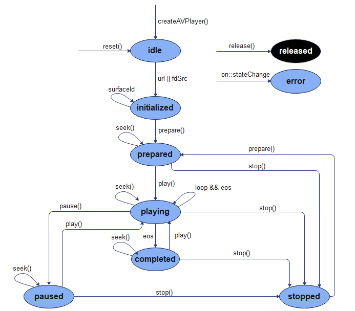
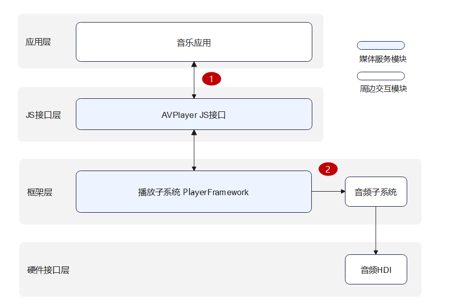
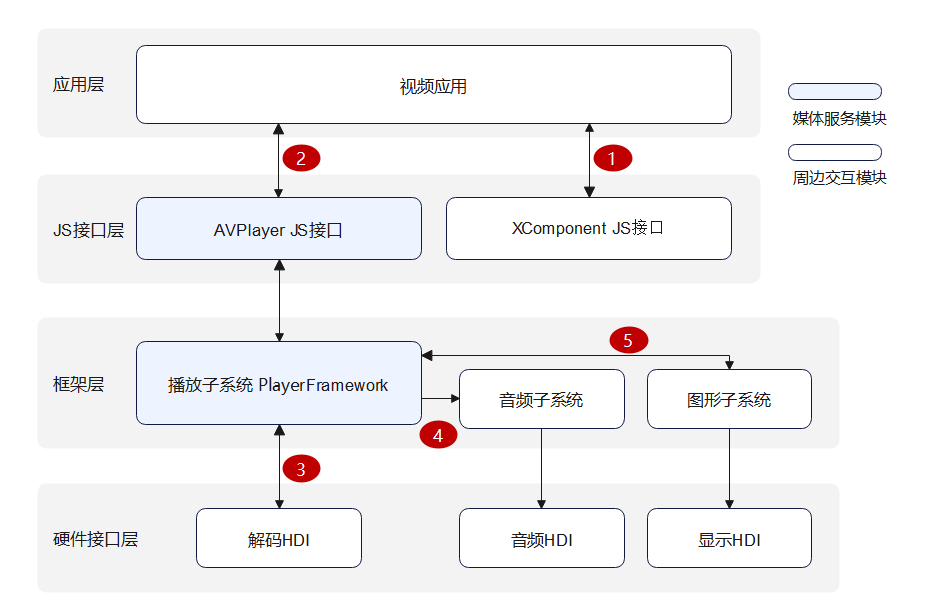

# AVPlayer播放器开发指导

## 简介

AVPlayer主要工作是将Audio/Video媒体资源转码为可供渲染的图像和可听见的音频模拟信号，并通过输出设备进行播放，同时对播放任务进行管理，包括开始播放、暂停播放、停止播放、释放资源、设置音量、跳转播放位置、获取轨道信息等功能控制。

## 运作机制

该模块提供了播放状态变化示意图[AVPlayerState](../reference/apis/js-apis-media.md#avplayerstate9)、音频播放外部模块交互图和视频播放外部模块交互图。

**图1** 播放状态变化示意图<a name = avplayer_state></a>  




**图2** 音频播放外部模块交互图



**说明**：应用通过调用JS接口层提供的AVPlayer js接口实现相应功能时，框架层会通过Player Framework的播放服务解析成音频数据流，音频数据流经过软件解码后输出至Audio Framework的音频服务，由音频子系统输出至硬件接口层的音频HDI，实现音频播放功能。完整的音乐播放器工作需要：应用(应用适配)、Player Framework、Audio Framework、Audio HDI(驱动适配)共同实现。

*注意：音频播放需要音频子系统配合*

1. 应用把url传递给AVPlayer JS。
2. 播放服务把音频PCM数据流输出给音频服务，音频服务输出给Audio HDI。


**图3** 视频播放外部模块交互图



**说明**：应用通过调用JS接口层提供的AVPlayer js接口实现相应功能时，框架层会通过Player Framework的播放服务解析成单独的音频数据流和视频数据流，音频数据流经过软件解码后输出至Audio Framework的音频服务，由音频子系统输出至硬件接口层的音频HDI，实现音频播放功能。视频数据流经过硬件(推荐)/软件解码后输出至Graphic Framework的渲染服务（Renderer Service），由RS子系统输出至硬件接口层的显示HDI。完整的视频播放器工作需要：应用(应用适配)、XCompomemt组件、Player Framework、Graphic Framework、Audio Framework、Display HDI(驱动适配)和Audio HDI(驱动适配)共同实现。

*注意：视频播放需要显示、音频、解码等多个子系统配合。*

1. 应用从Xcomponent组件获取surfaceID，[获取方式](../reference/arkui-ts/ts-basic-components-xcomponent.md)。
2. 应用把url、surfaceID传递给AVPlayer JS。
3. 播放服务把视频ES数据流输出给Codec HDI，解码获得视频帧(NV12/NV21/RGBA)。
4. 播放服务把音频PCM数据流输出给音频服务，音频服务输出给Audio HDI。
5. 播放服务把视频帧(NV12/NV21/RGBA)输出给RS服务，RS服务输出给Display HDI。

## 兼容性说明

推荐使用主流的播放格式和主流分辨率，不建议开发者自制非常或者异常码流，以免产生无法播放、卡住、花屏等兼容性问题。若发生此类问题不会影响系统，退出码流播放即可。

主流的播放格式和主流分辨率如下：

| 视频容器规格 |                     规格描述                      |               分辨率               |
| :----------: | :-----------------------------------------------: | :--------------------------------: |
|     mp4      | 视频格式：H264/MPEG2/MPEG4/H263 音频格式：AAC/MP3 | 主流分辨率，如1080P/720P/480P/270P |
|     mkv      | 视频格式：H264/MPEG2/MPEG4/H263 音频格式：AAC/MP3 | 主流分辨率，如1080P/720P/480P/270P |
|      ts      |   视频格式：H264/MPEG2/MPEG4 音频格式：AAC/MP3    | 主流分辨率，如1080P/720P/480P/270P |
|     webm     |          视频格式：VP8 音频格式：VORBIS           | 主流分辨率，如1080P/720P/480P/270P |

| 音频容器规格  |   规格描述   |
| :----------: | :----------: |
|     m4a      | 音频格式：AAC |
|     aac      | 音频格式：AAC |
|     mp3      | 音频格式：MP3 |
|     ogg      | 音频格式：VORBIS |
|     wav      | 音频格式：PCM |

## 开发指导

详细API含义可参考：[媒体服务API文档AVPlayer](../reference/apis/js-apis-media.md#avplayer9)

### 播放流程说明

播放的全流程场景包含：创建实例，设置资源，设置窗口(视频)，准备播放(获取轨道信息/音量/倍速/焦点模式/缩放模式/设置bitrates)，播控(播放/暂停/Seek/音量/停止)，重置资源，销毁播放

1：创建实例[createAVPlayer()](../reference/apis/js-apis-media.md#mediacreateavplayer9)，AVPlayer初始化[idle](#avplayer_state)状态

2：设置业务需要的监听事件，搭配全流程场景使用

3：设置资源 [url](../reference/apis/js-apis-media.md#avplayer_属性)，AVPlayer进入[initialized](#avplayer_state)状态，此时可以设置视频窗口 [surfaceId](../reference/apis/js-apis-media.md#avplayer_属性)，支持的规格可参考：[AVPlayer属性说明](../reference/apis/js-apis-media.md#avplayer_属性)

4：准备播放 [prepare()](../reference/apis/js-apis-media.md#avplayer_prepare)，AVPlayer进入[prepared](#avplayer_state)状态

5：视频播控：播放 [play()](../reference/apis/js-apis-media.md#avplayer_play)，暂停 [pause()](../reference/apis/js-apis-media.md#avplayer_pause)，跳转 [seek()](../reference/apis/js-apis-media.md#avplayer_seek)，停止 [stop()](../reference/apis/js-apis-media.md#avplayer_stop) 等操作

6：重置资源 [reset()](../reference/apis/js-apis-media.md#avplayer_reset)，AVPlayer重新进入[idle](#avplayer_state)状态，允许更换资源 [url](../reference/apis/js-apis-media.md#avplayer_属性)

7：销毁播放 [release()](../reference/apis/js-apis-media.md#avplayer_release)，AVPlayer进入[released](#avplayer_state)状态，退出播放

> **说明：**
>
> prepared/playing/paused/compeled 状态时，播放引擎处于工作状态，这需要占用系统较多的运行内存，当客户端暂时不使用播放器时，要求调用 reset() 或 release() 回收。

### 监听事件

| 事件类型                                          | 说明                                                         |
| ------------------------------------------------- | ------------------------------------------------------------ |
| stateChange<a name = stateChange></a>             | 必要事件，监听播放器的状态机                                 |
| error<a name = error></a>                         | 必要事件，监听播放器的错误信息                               |
| durationUpdate<a name = durationUpdate></a>       | 用于进度条，监听进度条长度，刷新资源时长                     |
| timeUpdate<a name = timeUpdate></a>               | 用于进度条，监听进度条当前位置，刷新当前时间                 |
| seekDone<a name = seekDone></a>                   | 响应api调用，监听seek()请求完成情况                          |
| speedDone<a name = speedDone></a>                 | 响应api调用，监听setSpeed()请求完成情况                      |
| volumeChange<a name = volumeChange></a>           | 响应api调用，监听setVolume()请求完成情况                     |
| bitrateDone<a name = bitrateDone></a>             | 响应api调用，用于HLS协议流，监听setBitrate()请求完成情况     |
| availableBitrates<a name = availableBitrates></a> | 用于HLS协议流，监听HLS资源的可选bitrates，用于setBitrate()   |
| bufferingUpdate<a name = bufferingUpdate></a>     | 用于网络播放，监听网络播放缓冲信息                           |
| startRenderFrame<a name = startRenderFrame></a>   | 用于视频播放，监听视频播放首帧渲染时间                       |
| videoSizeChange<a name = videoSizeChange></a>     | 用于视频播放，监听视频播放的宽高信息，可用于调整窗口大小、比例 |
| audioInterrupt<a name = audioInterrupt></a>       | 用于视频播放，监听音频焦点切换信息，搭配属性audioInterruptMode使用 |

### 

### 全量接口示例

```js
import media from '@ohos.multimedia.media'
import audio from '@ohos.multimedia.audio';
import fileIO from '@ohos.fileio'

const TAG = 'AVPlayerDemo:'
export class AVPlayerDemo {
  private count:number = 0
  private avPlayer
  private surfaceID:string // surfaceID用于播放画面显示，具体的值需要通过Xcomponent接口获取，相关文档链接见上面Xcomponent创建方法

  // 注册avplayer回调函数
  setAVPlayerCallback() {
    // 状态机变化回调函数
    this.avPlayer.on('stateChange', async (state, reason) => {
      switch (state) {
        case 'idle': // 成功调用reset接口后触发该状态机上报
          console.info(TAG + 'state idle called')
          this.avPlayer.release() // 释放avplayer对象
          break;
        case 'initialized': // avplayer 设置播放源后触发该状态上报
          console.info(TAG + 'state initialized called ')
          this.avPlayer.surfaceId = this.surfaceID // 设置显示画面，当播放的资源为纯音频时无需设置
          this.avPlayer.prepare().then(() => {
            console.info(TAG+ 'prepare success');
          }, (err) => {
            console.error(TAG + 'prepare filed,error message is :' + err.message)
          })
          break;
        case 'prepared': // prepare调用成功后上报该状态机
          console.info(TAG + 'state prepared called')
          this.avPlayer.play() // 调用播放接口开始播放
          break;
        case 'playing': // play成功调用后触发该状态机上报
          console.info(TAG + 'state playing called')
          if (this.count == 0) {
            this.avPlayer.pause() // 调用暂停播放接口
          } else {
            this.avPlayer.seek(10000, media.SeekMode.SEEK_PREV_SYNC) // 前向seek置10秒处,触发seekDone回调函数
          }
          break;
        case 'paused': // pause成功调用后触发该状态机上报
          console.info(TAG + 'state paused called')
          if (this.count == 0) {
            this.count++
            this.avPlayer.play() // 继续调用播放接口开始播放
          }
          break;
        case 'completed': // 播放结束后触发该状态机上报
          console.info(TAG + 'state completed called')
          this.avPlayer.stop() //调用播放结束接口
          break;
        case 'stopped': // stop接口成功调用后触发该状态机上报
          console.info(TAG + 'state stopped called')
          this.avPlayer.reset() // 调用reset接口初始化avplayer状态
          break;
        case 'released':
          console.info(TAG + 'state released called')
          break;
        case 'error':
          console.info(TAG + 'state error called')
          break;
        default:
          console.info(TAG + 'unkown state :' + state)
          break;
      }
    })
    // 时间上报监听函数
    this.avPlayer.on('timeUpdate', (time:number) => {
      console.info(TAG + 'timeUpdate success,and new time is :' + time)
    })
    // 音量变化回调函数
    this.avPlayer.on('volumeChange', (vol:number) => {
      console.info(TAG + 'volumeChange success,and new volume is :' + vol)
      this.avPlayer.setSpeed(media.AVPlayerSpeed.SPEED_FORWARD_2_00_X) // 设置两倍速播放，并触发speedDone回调
    })
    // 视频播放结束触发回调
    this.avPlayer.on('endOfStream', () => {
      console.info(TAG + 'endOfStream success')
    })
    // seek操作回调函数
    this.avPlayer.on('seekDone', (seekDoneTime:number) => {
      console.info(TAG + 'seekDone success,and seek time is:' + seekDoneTime)
      this.avPlayer.setVolume(0.5) // 设置音量为0.5，并触发volumeChange回调函数
    })
    // 设置倍速播放回调函数
    this.avPlayer.on('speedDone', (speed:number) => {
      console.info(TAG + 'speedDone success,and speed value is:' + speed)
    })
    // bitrate设置成功回调函数
    this.avPlayer.on('bitrateDone', (bitrate:number) => {
      console.info(TAG + 'bitrateDone success,and bitrate value is:' + bitrate)
    })
    // 缓冲上报回调函数
    this.avPlayer.on('bufferingUpdate', (infoType: media.BufferingInfoType, value: number) => {
      console.info(TAG + 'bufferingUpdate success,and infoType value is:' + infoType + ', value is :' + value)
    })
    // 首帧上报回调函数
    this.avPlayer.on('startRenderFrame', () => {
      console.info(TAG + 'startRenderFrame success')
    })
    // 视频宽高上报回调函数
    this.avPlayer.on('videoSizeChange', (width: number, height: number) => {
      console.info(TAG + 'videoSizeChange success,and width is:' + width + ', height is :' + height)
    })
    // 焦点上报回调函数
    this.avPlayer.on('audioInterrupt', (info: audio.InterruptEvent) => {
      console.info(TAG + 'audioInterrupt success,and InterruptEvent info is:' + info)
    })
    // HLS上报所有支持的比特率
    this.avPlayer.on('availableBitrates', (bitrates: Array<number>) => {
      console.info(TAG + 'availableBitrates success,and availableBitrates length is:' + bitrates.length)
    })
  }

  async avPlayerDemo() {
    // 创建avPlayer实例对象
    this.avPlayer = await media.createAVPlayer()
    let fdPath = 'fd://'
    let pathDir = "/data/storage/el2/base/haps/entry/files" // pathDir在FA模型和Stage模型的获取方式不同，请参考开发步骤首行的说明，根据实际情况自行获取。
    // path路径的码流可通过"hdc file send D:\xxx\H264_AAC.mp4 /data/app/el2/100/base/ohos.acts.multimedia.media.avplayer/haps/entry/files" 命令，将其推送到设备上
    let path = pathDir  + '/H264_AAC.mp4'
    await fileIO.open(path).then((fdNumber) => {
      fdPath = fdPath + '' + fdNumber
      console.info('open fd success fd is' + fdPath)
    }, (err) => {
      console.info('open fd failed err is' + err)
    }).catch((err) => {
      console.info('open fd failed err is' + err)
    });
    this.avPlayer.url = fdPath
  }
}
```

### 正常播放场景

```js
import media from '@ohos.multimedia.media'
import fileIO from '@ohos.fileio'

const TAG = 'AVPlayerDemo:'
export class AVPlayerDemo {
  private avPlayer
  private surfaceID:string // surfaceID用于播放画面显示，具体的值需要通过Xcomponent接口获取，相关文档链接见上面Xcomponent创建方法

  // 注册avplayer回调函数
  setAVPlayerCallback() {
    // 状态机变化回调函数
    this.avPlayer.on('stateChange', async (state, reason) => {
      switch (state) {
        case 'idle': // 成功调用reset接口后触发该状态机上报
          console.info(TAG + 'state idle called')
          break;
        case 'initialized': // avplayer 设置播放源后触发该状态上报
          console.info(TAG + 'state initialized called ')
          this.avPlayer.surfaceId = this.surfaceID // 设置显示画面，当播放的资源为纯音频时无需设置
          this.avPlayer.prepare().then(() => {
            console.info(TAG+ 'prepare success');
          }, (err) => {
            console.error(TAG + 'prepare filed,error message is :' + err.message)
          })
          break;
        case 'prepared': // prepare调用成功后上报该状态机
          console.info(TAG + 'state prepared called')
          this.avPlayer.play() // 调用播放接口开始播放
          break;
        case 'playing': // play成功调用后触发该状态机上报
          console.info(TAG + 'state playing called')
          break;
        case 'paused': // pause成功调用后触发该状态机上报
          console.info(TAG + 'state paused called')
          break;
        case 'completed': // 播放结束后触发该状态机上报
          console.info(TAG + 'state completed called')
          this.avPlayer.stop() //调用播放结束接口
          break;
        case 'stopped': // stop接口成功调用后触发该状态机上报
          console.info(TAG + 'state stopped called')
          this.avPlayer.release() // 调用reset接口初始化avplayer状态
          break;
        case 'released':
          console.info(TAG + 'state released called')
          break;
        case 'error':
          console.info(TAG + 'state error called')
          break;
        default:
          console.info(TAG + 'unkown state :' + state)
          break;
      }
    })
  }

  async avPlayerDemo() {
    // 创建avPlayer实例对象
    this.avPlayer = await media.createAVPlayer()
    let fdPath = 'fd://'
    let pathDir = "/data/storage/el2/base/haps/entry/files" // pathDir在FA模型和Stage模型的获取方式不同，请参考开发步骤首行的说明，根据实际情况自行获取。
    // path路径的码流可通过"hdc file send D:\xxx\H264_AAC.mp4 /data/app/el2/100/base/ohos.acts.multimedia.media.avplayer/haps/entry/files" 命令，将其推送到设备上
    let path = pathDir  + '/H264_AAC.mp4'
    await fileIO.open(path).then((fdNumber) => {
      fdPath = fdPath + '' + fdNumber
      console.info('open fd success fd is' + fdPath)
    }, (err) => {
      console.info('open fd failed err is' + err)
    }).catch((err) => {
      console.info('open fd failed err is' + err)
    });
    this.avPlayer.url = fdPath
  }
}
```

### 视频切换场景

```js
import media from '@ohos.multimedia.media'
import fileIO from '@ohos.fileio'

const TAG = 'AVPlayerDemo:'
export class AVPlayerDemo {
  private count:number = 0
  private avPlayer
  private surfaceID:string // surfaceID用于播放画面显示，具体的值需要通过Xcomponent接口获取，相关文档链接见上面Xcomponent创建方法

  // 注册avplayer回调函数
  setAVPlayerCallback() {
    // 状态机变化回调函数
    this.avPlayer.on('stateChange', async (state, reason) => {
      switch (state) {
        case 'idle': // 成功调用reset接口后触发该状态机上报
          console.info(TAG + 'state idle called')
          break;
        case 'initialized': // avplayer 设置播放源后触发该状态上报
          console.info(TAG + 'state initialized called ')
          this.avPlayer.surfaceId = this.surfaceID // 设置显示画面，当播放的资源为纯音频时无需设置
          this.avPlayer.prepare().then(() => {
            console.info(TAG+ 'prepare success');
          }, (err) => {
            console.error(TAG + 'prepare filed,error message is :' + err.message)
          })
          break;
        case 'prepared': // prepare调用成功后上报该状态机
          console.info(TAG + 'state prepared called')
          this.avPlayer.loop = true // 设置单曲循环播放，单曲循环播放至结尾后会触发endOfStream回调
          this.avPlayer.play() // 调用播放接口开始播放
          break;
        case 'playing': // play成功调用后触发该状态机上报
          console.info(TAG + 'state playing called')
          break;
        case 'paused': // pause成功调用后触发该状态机上报
          console.info(TAG + 'state paused called')
          break;
        case 'completed': // 播放结束后触发该状态机上报
          console.info(TAG + 'state completed called')
          // 当第二次触发endOfStream回调后取消循环播放，再次播放到结尾后触发completed状态机上报
          this.avPlayer.stop() //调用播放结束接口
          break;
        case 'stopped': // stop接口成功调用后触发该状态机上报
          console.info(TAG + 'state stopped called')
          this.avPlayer.release() // 调用reset接口初始化avplayer状态
          break;
        case 'released':
          console.info(TAG + 'state released called')
          break;
        case 'error':
          console.info(TAG + 'state error called')
          break;
        default:
          console.info(TAG + 'unkown state :' + state)
          break;
      }
    })
    // 视频播放结束触发回调
    this.avPlayer.on('endOfStream', () => {
      console.info(TAG + 'endOfStream success')
      if (this.count == 1) {
        this.avPlayer.loop = false // 取消循环播放
      } else {
        this.count++
      }
    })
  }

  async avPlayerDemo() {
    // 创建avPlayer实例对象
    this.avPlayer = await media.createAVPlayer()
    let fdPath = 'fd://'
    let pathDir = "/data/storage/el2/base/haps/entry/files" // pathDir在FA模型和Stage模型的获取方式不同，请参考开发步骤首行的说明，根据实际情况自行获取。
    // path路径的码流可通过"hdc file send D:\xxx\H264_AAC.mp4 /data/app/el2/100/base/ohos.acts.multimedia.media.avplayer/haps/entry/files" 命令，将其推送到设备上
    let path = pathDir  + '/H264_AAC.mp4'
    await fileIO.open(path).then((fdNumber) => {
      fdPath = fdPath + '' + fdNumber
      console.info('open fd success fd is' + fdPath)
    }, (err) => {
      console.info('open fd failed err is' + err)
    }).catch((err) => {
      console.info('open fd failed err is' + err)
    });
    this.avPlayer.url = fdPath
  }
}
```
### 单曲循环场景

```js
import media from '@ohos.multimedia.media'
import fileIO from '@ohos.fileio'

const TAG = 'AVPlayerDemo:'
export class AVPlayerDemo {
  private count:number = 0
  private avPlayer
  private surfaceID:string // surfaceID用于播放画面显示，具体的值需要通过Xcomponent接口获取，相关文档链接见上面Xcomponent创建方法

  async nextVideo() {
    let fdPath = 'fd://'
    let pathDir = "/data/storage/el2/base/haps/entry/files" // pathDir在FA模型和Stage模型的获取方式不同，请参考开发步骤首行的说明，根据实际情况自行获取。
    // path路径的码流可通过"hdc file send D:\xxx\H264_MP3.mp4 /data/app/el2/100/base/ohos.acts.multimedia.media.avplayer/haps/entry/files" 命令，将其推送到设备上
    let path = pathDir  + '/H264_MP3.mp4'
    await fileIO.open(path).then((fdNumber) => {
      fdPath = fdPath + '' + fdNumber
      console.info('open fd success fd is' + fdPath)
    }, (err) => {
      console.info('open fd failed err is' + err)
    }).catch((err) => {
      console.info('open fd failed err is' + err)
    });
    this.avPlayer.url = fdPath // 再次触发initialized状态机上报
  }

  // 注册avplayer回调函数
  setAVPlayerCallback() {
    // 状态机变化回调函数
    this.avPlayer.on('stateChange', async (state, reason) => {
      switch (state) {
        case 'idle': // 成功调用reset接口后触发该状态机上报
          console.info(TAG + 'state idle called')
          await this.nextVideo() // 切换下一个视频播放
          break;
        case 'initialized': // avplayer 设置播放源后触发该状态上报
          console.info(TAG + 'state initialized called ')
          this.avPlayer.surfaceId = this.surfaceID // 设置显示画面，当播放的资源为纯音频时无需设置
          this.avPlayer.prepare().then(() => {
            console.info(TAG+ 'prepare success');
          }, (err) => {
            console.error(TAG + 'prepare filed,error message is :' + err.message)
          })
          break;
        case 'prepared': // prepare调用成功后上报该状态机
          console.info(TAG + 'state prepared called')
          this.avPlayer.play() // 调用播放接口开始播放
          break;
        case 'playing': // play成功调用后触发该状态机上报
          console.info(TAG + 'state playing called')
          break;
        case 'paused': // pause成功调用后触发该状态机上报
          console.info(TAG + 'state paused called')
          break;
        case 'completed': // 播放结束后触发该状态机上报
          console.info(TAG + 'state completed called')
          if (this.count == 0) {
            this.count++
            this.avPlayer.reset() //调用重置接口准备切换下一个视频
          } else {
            this.avPlayer.release() //切换视频后播放至结尾释放avplayer对象
          }
          break;
        case 'stopped': // stop接口成功调用后触发该状态机上报
          console.info(TAG + 'state stopped called')
          break;
        case 'released':
          console.info(TAG + 'state released called')
          break;
        case 'error':
          console.info(TAG + 'state error called')
          break;
        default:
          console.info(TAG + 'unkown state :' + state)
          break;
      }
    })
  }

  async avPlayerDemo() {
    // 创建avPlayer实例对象
    this.avPlayer = await media.createAVPlayer()
    let fdPath = 'fd://'
    let pathDir = "/data/storage/el2/base/haps/entry/files" // pathDir在FA模型和Stage模型的获取方式不同，请参考开发步骤首行的说明，根据实际情况自行获取。
    // path路径的码流可通过"hdc file send D:\xxx\H264_AAC.mp4 /data/app/el2/100/base/ohos.acts.multimedia.media.avplayer/haps/entry/files" 命令，将其推送到设备上
    let path = pathDir  + '/H264_AAC.mp4'
    await fileIO.open(path).then((fdNumber) => {
      fdPath = fdPath + '' + fdNumber
      console.info('open fd success fd is' + fdPath)
    }, (err) => {
      console.info('open fd failed err is' + err)
    }).catch((err) => {
      console.info('open fd failed err is' + err)
    });
    this.avPlayer.url = fdPath
  }
}
```

## 相关示例

针对AVPlayer播放器开发，有以下相关示例可供参考：

待补充