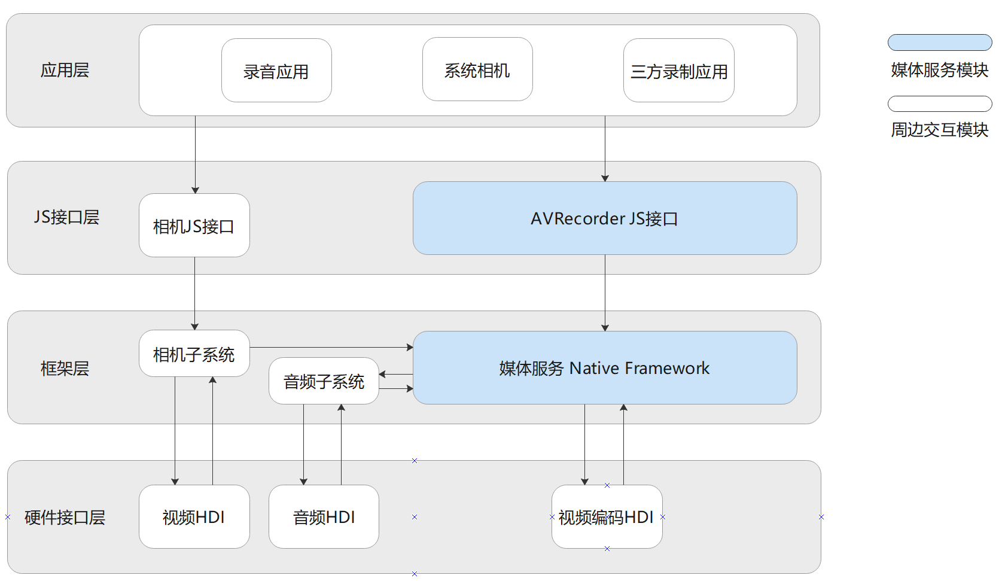

# 音视频录制开发指导

## 简介

音视频录制的主要工作是捕获音频信号，接收视频信号，完成音视频编码并保存到文件中，帮助开发者轻松实现音视频录制功能，包括开始录制、暂停录制、恢复录制、停止录制、释放资源等功能控制。它允许调用者指定录制的编码格式、封装格式、文件路径等参数。

## 运作机制

该模块提供了音视频录制状态变化示意图和音视频录制外部模块交互图。

**图1** 音视频录制状态变化示意图


**图2** 视频录制外部模块交互图--待修改



**说明**：音频录制时，框架层会通过Native Framework的媒体服务，调用音频子系统通过音频HDI捕获音频数据，通过软件编码封装后保存至文件中，实现音频录制功能。视频录制时，由相机子系统通过视频HDI捕获图像数据，媒体服务将图像数据通过视频编码HDI编码，再将编码后的图像数据封装至文件中，实现视频录制功能。通过音视频录制组合，可分别实现纯音频录制、纯视频录制，音视频录制。

## 约束与限制

开发者在进行录制功能开发前，需要先对所开发的应用配置相应权限。涉及音频录制，需要获取麦克风权限（ohos.permission.MICROPHONE），权限配置相关内容可参考：[访问控制权限申请指导](../security/accesstoken-guidelines.md)。

使用相机进行视频录制还需要与相机模块配合，接口使用以及权限获取详见[相机管理](../reference/apis/js-apis-camera.md)。

## 开发指导

详细API含义可参考：[媒体服务API文档AVRecorder](../reference/apis/js-apis-media.md#avrecorder9)

媒体库相关流程含义可参考：[媒体库管理](../reference/apis/js-apis-medialibrary.md)

相机相关流程含义可参考：[相机管理](../reference/apis/js-apis-camera.md)

### 音视频录制全流程场景

音视频录制全流程场景包含：创建实例、设置录制参数、获取输入surface、开始录制、暂停录制、恢复录制、停止录制、释放资源等流程。

音频录制相关配置参数范围，受到设备编解码性能，音频子系统性能等综合限制。

视频录制相关配置参数范围，受到设备编解码性能，相机子系统性能等综合限制。

```
import media from '@ohos.multimedia.media'
import camera from '@ohos.multimedia.camera'
import mediaLibrary from '@ohos.multimedia.mediaLibrary'

export class AVRecorderDemo {
  private testFdNumber; // 用于保存fd地址
  
  // 获取录制的音频文件fileName对应的fd,需借助媒体库能力。使用mediaLibrary需要添加以下权限, ohos.permission.MEDIA_LOCATION、ohos.permission.WRITE_MEDIA、ohos.permission.READ_MEDIA.
  async getFd(fileName) {
	// 实现方式参考媒体库资料文档。
	this.testFdNumber = "fd://" + fdNumber.toString(); // e.g. fd://54
  }

  // 当promise接口发生错误上上报的错误回调接口
  failureCallback(error) {
      console.info('error happened, error message is ' + error.message);
  }

  // 当promise接口发生异常时，系统调用的错误回调接口
  catchCallback(error) {
      console.info('catch error happened, error message is ' + error.message);
  }

  async AVRecorderDemo() {
    let AVRecorder; // AVRecorder空对象在createAVRecorder成功后赋值
    let surfaceID; // 从getInputSurface获取surfaceID，传递给相机的videoOutput
    await this.getFd('01.mp4');

    // 音视频录制相关参数配置，配置参数以实际硬件设备支持的范围为准
    let avProfile = {
        audioBitrate : 48000,
        audioChannels : 2,
        audioCodec : media.CodecMimeType.AUDIO_AAC,
        audioSampleRate : 48000,
        fileFormat : media.ContainerFormatType.CFT_MPEG_4,
        videoBitrate : 2000000,
        videoCodec : media.CodecMimeType.VIDEO_MPEG4,
        videoFrameWidth : 640,
        videoFrameHeight : 480,
        videoFrameRate : 30
    }
    let avConfig = {
        audioSourceType : media.AudioSourceType.AUDIO_SOURCE_TYPE_MIC,
        videoSourceType : media.VideoSourceType.VIDEO_SOURCE_TYPE_SURFACE_YUV,
        profile : avProfile,
        url : 'fd://',
        rotation : 0,
        location : { latitude : 30, longitude : 130 }
    }
    
    // 创建AVRecorder对象
    await media.createAVRecorder().then((recorder) => {
      console.info('case createAVRecorder called');
      if (typeof (recorder) != 'undefined') {
        AVRecorder = recorder;
        console.info('createAVRecorder success');
      } else {
        console.info('createAVRecorder failed');
      }
    }, this.failureCallback).catch(this.catchCallback);

    // 对象创建成功后创建on('stateChange')和on('error')监听回调用于监听状态机变化和错误上报
    AVRecorder.on('stateChange', async (state, reason) => {
        console.info('case state has changed, new state is :' + state);
        switch (state) {
        // 用户可以根据需求在不同状态设置自己想要进行的行为
            case 'idle':
                // 调用rest接口后触发idle状态；create后也在idle状态
                break;
            case 'prepared':
                // 调用prepare接口后触发prepared状态;
                break;
            case 'started':
                // 调用start接口后触发started状态;
                break;
            case 'paused':
                // 调用pause接口后触发paused状态;
                break;
            case 'stopped':
                // 调用stop接口后触发stopped状态;
                break;
            case 'released':
                // 调用release接口后触发released状态;
                break;
            case 'error':
                // error状态说明底层出错，用户需排查错误，重新创建avRecorder;
                break;
            default:
                console.info('case state is unknown');
        }
    });
    AVRecorder.on('error', (err) => {
        // 监听非接口类错误上报
        console.info('case avRecorder.on(error) called, errMessage is ' + err.message);
    });

    // 调用prepare完成音频录制前的准备工作；底层实际是根据prepare的入参来判断是音频录制、视频录制还是音视频录制
    await AVRecorder.prepare(avConfig).then(() => {
      console.info('prepare success');
    }, this.failureCallback).catch(this.catchCallback);

    // 包含视频的录制需要调用getInputSurface接口，并将返回值surfaceID传递给camera相关接口
    await AVRecorder.getInputSurface().then((surface) => {
      console.info('getInputSurface success');
      surfaceID = surface; // surfaceID给camera的createVideoOutput()作为其中的一个入参
    }, this.failureCallback).catch(this.catchCallback);

    // 视频录制依赖相机相关接口，以下需要先调用相机起流接口后才能继续执行，具体的相机接口调用请参考sample用例
    // 视频录制启动接口
    await AVRecorder.start().then(() => {
      console.info('start success');
    }, this.failureCallback).catch(this.catchCallback);

    // 调用pause接口时需要暂停camera出流
    await AVRecorder.pause().then(() => {
      console.info('pause success');
    }, this.failureCallback).catch(this.catchCallback);

    // 调用resume接口时需要恢复camera出流
    await AVRecorder.resume().then(() => {
      console.info('resume success');
    }, this.failureCallback).catch(this.catchCallback);

    // 停止camera出流后，停止视频录制
    await AVRecorder.stop().then(() => {
      console.info('stop success');
    }, this.failureCallback).catch(this.catchCallback);

    // 重置录制相关配置
    await AVRecorder.reset().then(() => {
      console.info('reset success');
    }, this.failureCallback).catch(this.catchCallback);

   // 关闭监听回调，如果用户不自行调用off接口，在调用release后，设置的回调接口也会无效
    AVRecorder.off('stateChange');
    AVRecorder.off('error');

    // 释放视频录制相关资源并释放camera对象相关资源
    await AVRecorder.release().then(() => {
      console.info('release success');
    }, this.failureCallback).catch(this.catchCallback);

    // 相关对象置null
    AVRecorder = undefined;
    surfaceID = undefined;
  }
}
```

### 纯音频录制全流程场景

纯音频录制全流程场景包含：创建实例、设置录制参数、开始录制、暂停录制、恢复录制、停止录制、释放资源等流程。

音频录制相关配置参数范围，受到设备编解码性能，音频子系统性能等综合限制。

```
import media from '@ohos.multimedia.media'
import mediaLibrary from '@ohos.multimedia.mediaLibrary'

export class AudioRecorderDemo {
  private testFdNumber; // 用于保存fd地址
  
  // 获取录制的音频文件fileName对应的fd,需借助媒体库能力。使用mediaLibrary需要添加以下权限, ohos.permission.MEDIA_LOCATION、ohos.permission.WRITE_MEDIA、ohos.permission.READ_MEDIA
  async getFd(fileName) {
	// 实现方式参考媒体库资料文档。
	this.testFdNumber = "fd://" + fdNumber.toString(); // e.g. fd://54
  }

  // 当promise接口发生错误上报的错误回调接口
  failureCallback(error) {
      console.info('error happened, error message is ' + error.message);
  }

  // 当promise接口发生异常时，系统调用的错误回调接口
  catchCallback(error) {
      console.info('catch error happened, error message is ' + error.message);
  }

  async audioRecorderDemo() {
    let audioRecorder; // audioRecorder空对象在createAVRecorder成功后赋值
    await this.getFd('01.m4a');
    // 音频录制相关参数配置
    let audioProfile = {
        audioBitrate : 48000,
        audioChannels : 2,
        audioCodec : media.CodecMimeType.AUDIO_AAC,
        audioSampleRate : 48000,
        fileFormat : media.ContainerFormatType.CFT_MPEG_4,
    }
    let audioConfig = {
        audioSourceType : media.AudioSourceType.AUDIO_SOURCE_TYPE_MIC,
        profile : audioProfile,
        url : this.testFdNumber,
        rotation : 0,
        location : { latitude : 30, longitude : 130 }
    }
    
    // 创建audioRecorder对象
    await media.createAVRecorder().then((recorder) => {
      console.info('case createAVRecorder called');
      if (typeof (recorder) != 'undefined') {
        audioRecorder = recorder;
        console.info('createAudioRecorder success');
      } else {
        console.info('createAudioRecorder failed');
      }
    }, this.failureCallback).catch(this.catchCallback);

    // 对象创建成功后创建on('stateChange')和on('error')监听回调用于监听状态机变化和错误上报
    audioRecorder.on('stateChange', async (state, reason) => {
        console.info('case state has changed, new state is :' + state);
        switch (state) {
        // 用户可以根据需求在不同状态设置自己想要进行的行为
            case 'idle':
                // 调用rest接口后触发idle状态；create后也在idle状态
                break;
            case 'prepared':
                // 调用prepare接口后触发prepared状态;
                break;
            case 'started':
                // 调用start接口后触发started状态;
                break;
            case 'paused':
                // 调用pause接口后触发paused状态;
                break;
            case 'stopped':
                // 调用stop接口后触发stopped状态;
                break;
            case 'released':
                // 调用release接口后触发released状态;
                break;
            case 'error':
                // error状态说明底层出错，用户需排查错误，重新创建avRecorder;
                break;
            default:
                console.info('case state is unknown');
        }
    });
    audioRecorder.on('error', (err) => {
        // 监听非接口类错误上报
        console.info('case avRecorder.on(error) called, errMessage is ' + err.message);
    });

    // 调用prepare完成音频录制前的准备工作；底层实际是根据prepare的入参来判断是音频录制、视频录制还是音视频录制
    await audioRecorder.prepare(audioConfig).then(() => {
      console.info('prepare success');
    }, this.failureCallback).catch(this.catchCallback);

    // 调用start接口启动音频录制
    await audioRecorder.start().then(() => {
      console.info('start success');
    }, this.failureCallback).catch(this.catchCallback);

    // 调用pause接口暂停音频录制
    await audioRecorder.pause().then(() => {
      console.info('pause success');
    }, this.failureCallback).catch(this.catchCallback);

    // 调用resume接口恢复音频录制
    await audioRecorder.resume().then(() => {
      console.info('resume success');
    }, this.failureCallback).catch(this.catchCallback);

    // 调用stop接口停止音频录制
    await audioRecorder.stop().then(() => {
      console.info('stop success');
    }, this.failureCallback).catch(this.catchCallback);

    // 调用reset接口重置录制相关配置
    await audioRecorder.reset().then(() => {
      console.info('reset success');
    }, this.failureCallback).catch(this.catchCallback);

   // 关闭监听回调，如果用户不自行调用off接口，在调用release后，设置的回调接口也会无效
    avRecorder.off('stateChange');
    avRecorder.off('error');

    // 调用release接口释放音频录制相关资源
    await audioRecorder.release().then(() => {
      console.info('release success');
    }, this.failureCallback).catch(this.catchCallback);

    // 相关对象置null
    audioRecorder = undefined;
  }
}

```

### 纯视频录制全流程场景

纯视频录制全流程场景包含：创建实例、设置录制参数、获取输入surface、开始录制、暂停录制、恢复录制、停止录制、释放资源等流程。

视频录制相关配置参数范围，受到设备编解码性能，相机子系统性能等综合限制。

```
import media from '@ohos.multimedia.media'
import camera from '@ohos.multimedia.camera'
import mediaLibrary from '@ohos.multimedia.mediaLibrary'

export class VideoRecorderDemo {
  private testFdNumber; // 用于保存fd地址
  
  // 获取录制的音频文件fileName对应的fd,需借助媒体库能力。使用mediaLibrary需要添加以下权限, ohos.permission.MEDIA_LOCATION、ohos.permission.WRITE_MEDIA、ohos.permission.READ_MEDIA.
  async getFd(fileName) {
	// 实现方式参考媒体库资料文档。
	this.testFdNumber = "fd://" + fdNumber.toString(); // e.g. fd://54
  }

  // 当promise接口发生错误上上报的错误回调接口
  failureCallback(error) {
      console.info('error happened, error message is ' + error.message);
  }

  // 当promise接口发生异常时，系统调用的错误回调接口
  catchCallback(error) {
      console.info('catch error happened, error message is ' + error.message);
  }

  async videoRecorderDemo() {
    let videoRecorder; // videoRecorder空对象在createAVRecorder成功后赋值
    let surfaceID; // 从getInputSurface获取surfaceID，传递给相机的videoOutput
    await this.getFd('01.mp4');

    // 纯视频录制相关参数配置，配置参数以实际硬件设备支持的范围为准
    let videoProfile = {
        fileFormat : media.ContainerFormatType.CFT_MPEG_4,
        videoBitrate : 2000000,
        videoCodec : media.CodecMimeType.VIDEO_MPEG4,
        videoFrameWidth : 640,
        videoFrameHeight : 480,
        videoFrameRate : 30
    }
    let videoConfig = {
        videoSourceType : media.VideoSourceType.VIDEO_SOURCE_TYPE_SURFACE_YUV,
        profile : videoProfile,
        url : 'fd://',
        rotation : 0,
        location : { latitude : 30, longitude : 130 }
    }
    
    // 创建videoRecorder对象
    await media.createAVRecorder().then((recorder) => {
      console.info('case createVideoRecorder called');
      if (typeof (recorder) != 'undefined') {
        videoRecorder = recorder;
        console.info('createVideoRecorder success');
      } else {
        console.info('createVideoRecorder failed');
      }
    }, this.failureCallback).catch(this.catchCallback);

    // 对象创建成功后创建on('stateChange')和on('error')监听回调用于监听状态机变化和错误上报
    videoRecorder.on('stateChange', async (state, reason) => {
        console.info('case state has changed, new state is :' + state);
        switch (state) {
        // 用户可以根据需求在不同状态设置自己想要进行的行为
            case 'idle':
                // 调用rest接口后触发idle状态；create后也在idle状态
                break;
            case 'prepared':
                // 调用prepare接口后触发prepared状态;
                break;
            case 'started':
                // 调用start接口后触发started状态;
                break;
            case 'paused':
                // 调用pause接口后触发paused状态;
                break;
            case 'stopped':
                // 调用stop接口后触发stopped状态;
                break;
            case 'released':
                // 调用release接口后触发released状态;
                break;
            case 'error':
                // error状态说明底层出错，用户需排查错误，重新创建avRecorder;
                break;
            default:
                console.info('case state is unknown');
        }
    });
    videoRecorder.on('error', (err) => {
        // 监听非接口类错误上报
        console.info('case avRecorder.on(error) called, errMessage is ' + err.message);
    });

    // 调用prepare完成音频录制前的准备工作；底层实际是根据prepare的入参来判断是音频录制、视频录制还是音视频录制
    await videoRecorder.prepare(videoConfig).then(() => {
      console.info('prepare success');
    }, this.failureCallback).catch(this.catchCallback);

    // 包含视频的录制需要调用getInputSurface接口，并将返回值surfaceID传递给camera相关接口
    await videoRecorder.getInputSurface().then((surface) => {
      console.info('getInputSurface success');
      surfaceID = surface; // surfaceID给camera的createVideoOutput()作为其中的一个入参
    }, this.failureCallback).catch(this.catchCallback);

    // 视频录制依赖相机相关接口，以下需要先调用相机起流接口后才能继续执行，具体的相机接口调用请参考sample用例
    // 视频录制启动接口
    await videoRecorder.start().then(() => {
      console.info('start success');
    }, this.failureCallback).catch(this.catchCallback);

    // 调用pause接口时需要暂停camera出流
    await videoRecorder.pause().then(() => {
      console.info('pause success');
    }, this.failureCallback).catch(this.catchCallback);

    // 调用resume接口时需要恢复camera出流
    await videoRecorder.resume().then(() => {
      console.info('resume success');
    }, this.failureCallback).catch(this.catchCallback);

    // 停止camera出流后，停止视频录制
    await videoRecorder.stop().then(() => {
      console.info('stop success');
    }, this.failureCallback).catch(this.catchCallback);

    // 重置录制相关配置
    await videoRecorder.reset().then(() => {
      console.info('reset success');
    }, this.failureCallback).catch(this.catchCallback);

   // 关闭监听回调，如果用户不自行调用off接口，在调用release后，设置的回调接口也会无效
    videoRecorder.off('stateChange');
    videoRecorder.off('error');

    // 释放视频录制相关资源并释放camera对象相关资源
    await videoRecorder.release().then(() => {
      console.info('release success');
    }, this.failureCallback).catch(this.catchCallback);

    // 相关对象置null
    videoRecorder = undefined;
    surfaceID = undefined;
  }
}
```


### 音视频录制APP

音视频录制APP案例包含：创建实例、设置录制参数、获取输入surface、开始录制、暂停录制、恢复录制、停止录制、释放资源等流程。

详细代码可参考：[AVRecorderDemo]([multimedia_player_framework: Implementation of media playback and recording | 媒体播放和录制功能实现 - Gitee.com](https://gitee.com/openharmony/multimedia_player_framework/tree/master/test/appdemo/AVRecorderDemo))