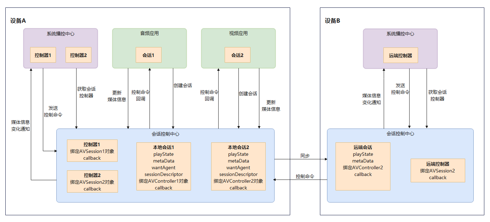

# AVSession开发概述

> **说明：**
>
> AVSession的所有接口均为系统接口，其功能仅提供给系统应用使用。

## 简介

  AVSession（Audio & Video Session），音视频会话，即媒体会话。
  - 对应用开发者而言，媒体会话提供了将应用内音视频接入系统播控中心的能力。
  - 对系统开发者而言，媒体会话提供了对系统音视频应用的媒体信息进行展示和统一的媒体播放控制的能力。

  通过AVSession，可以实现：

  1.统一播控入口，提升用户体验。

  当设备上安装了多个音视频类应用时，用户需要切换、进入不同的应用来控制播放。通过接入AVSession，音视频应用可以通过系统的统一播控入口（如播控中心）来控制设备上的媒体播放，无需切换不同应用，提升使用体验。

  2.完善音视频后台管控。
    
  当应用在后台自行启动音频播放时，用户难以快速定位对应的应用，造成体验问题。接入AVSession后，允许应用在后台进行音乐播放，便于用户在播控中心快速找到播放应用。

## 基本概念

- 媒体会话

  用于应用和播控中心之间进行信息交换的通道。会话的一端连接被控的媒体应用，另一端连接媒体应用的控制端（如播控中心）。应用接入了媒体会话后，可以通过媒体会话将媒体播放信息传递给控制端，并能够接收到控制端发出的控制命令。
  
- 媒体会话控制器

  媒体会话控制器的持有者可以控制接入了AVSession应用的播放行为。通过会话控制器，应用可以对应用进程的播放行为进行控制，支持获取应用的播放信息，发送播放控制命令，也支持监听应用的播放状态等的变化，确保媒体会话信息的同步。

- 播控中心
  
  系统统一的媒体控制中心，会话控制器的持有者。通过控制器发送命令来控制媒体的播放、暂停等。

## 实现原理

该模块提供了`AVSession`会话类和`AVSessionController`控制器类。

**图1** AVSession交互图

- 应用与播控中心交互：首先，音频应用创建`AVSession`对象，并设置会话信息（包括媒体元数据、对应拉起的Ability、播放状态等）。然后，播控中心创建`AVSessionController`，可获取会话相关信息，向音频应用发送播放命令。最后，音频应用响应播控中心的命令并更新播放状态。

- 支持分布式投播：当组网内的设备创建本地会话之后，播控中心或者音频应用可以根据设备列表选择想要投播的其他设备，将本地会话同步到远端，生成远端会话，并支持远端控制。需要控制远端会话时，通过远端控制器将控制命令发送到远端会话控制中心。

## 约束和限制

- 播控中心展示的播放信息，依赖媒体应用主动将媒体信息写入到AVSession。
- 播控中心控制媒体应用播放，依赖于媒体应用侧对控制命令的响应。
- AVSession只能够传递媒体播放信息和播放控制指令，不进行信息的展示和控制命令的执行。
- 普通应用不支持开发播控中心端。当普通音视频应用运行在OpenHarmony上时，默认控制端为系统应用播控中心，开发者无需做额外的操作。
- 播控中心为系统应用，当开发者需要基于OpenHarmony开发自己的系统时，可以开发本系统的播控中心应用。
- 为了解决音频在后台播放时用户无法获取到停止音频的入口，影响用户体验，AVSession服务增加了应用后台管控策略，只有应用接入了AVSession，才可以后台播放，否则当应用切后台时系统会强制暂停其音频播放。
