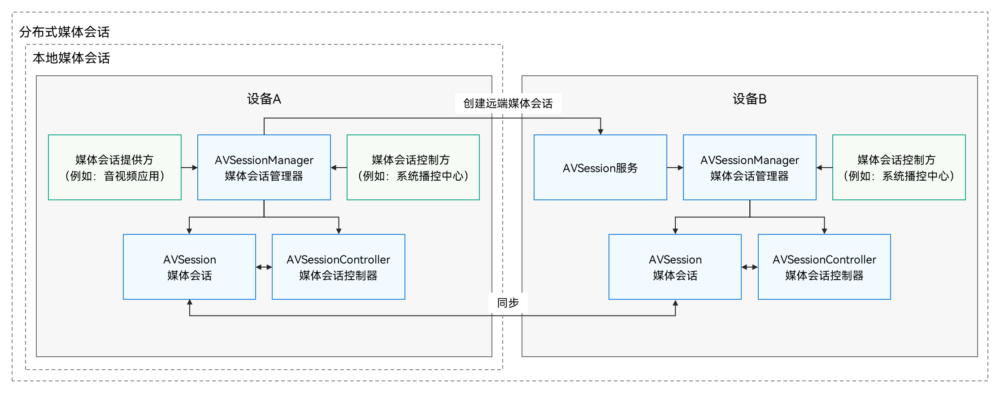

# AVSession Kit简介

AVSession Kit（Audio &amp; Video Session Kit，音视频播控服务）是系统提供的音视频管控服务，用于统一管理系统中所有音视频行为，帮助开发者快速构建音视频统一展示和控制能力。

## 能力范围

- 提供音视频统一管控能力，音视频类应用接入AVSession后，可以发送应用的数据（比如正在播放的歌曲、歌曲的播放状态等），用户可以通过系统播控中心、语音助手等应用切换多个应用、多个设备播放。

- 提供音频后台约束能力，音频接入AVSession后，可以进行后台音频播放。此功能需要同时申请后台任务。

## 亮点/特征

- **投播体验一致**

  提供音视频统一管控能力，音视频类应用接入AVSession后，可以发送应用的数据（比如正在播放的歌曲、歌曲的播放状态等）。

  用户可以通过系统播控中心、语音助手等应用切换多个应用、多个设备播放。

- **规范后台播放管理**

  通过播控中心，应用后台播放可见可控，音视频应用可统一控制。

  系统针对后台播放进行强制管控，未接入AVSession的应用在退到后台时，将会被强制暂停音频播放。解决应用在后台恶意播放，而用户无法找到对应应用无法关闭的问题。

## 基础概念

在开发前，需要先了解以下基础概念：

- 媒体会话（AVSession）

  媒体会话的一端连接被控的音视频应用，另一端连接音视频应用的控制端（如播控中心、语音助手等）。媒体会话提供了音视频应用和音视频应用控制端之间进行信息交换的通道。

- 媒体会话提供方

  媒体会话提供方指接入媒体会话的音视频应用。音视频应用接入媒体会话后，需要向媒体会话提供播放的媒体信息，例如播放曲目名称、播放状态等。同时，音视频应用需要通过媒体会话接收控制端发出的控制命令并进行正确响应。

- 媒体会话控制方

  媒体会话控制方指接入媒体会话并具有全局管控音视频行为功能的应用，例如系统播控中心、语音助手等。为便于开发者理解，下文将多处使用系统应用播控中心，作为媒体会话控制方举例。播控中心等系统应用接入媒体会话后，可以通过监听媒体会话获取最新的媒体信息，也可以通过媒体会话向音视频应用发出控制命令。

- 媒体会话控制器（AVSessionController）

  媒体会话控制器的持有者，一般指媒体会话控制方，可以控制媒体会话提供方的应用播放行为，也可以获取应用的播放信息，还可以监听音视频应用播放状态的变化，用于确保媒体会话信息在音视频应用和播控中心之间的同步。

- 媒体会话管理器（AVSessionManager）

  媒体会话管理器提供了管理媒体会话的能力，可以创建媒体会话、创建媒体会话控制器、发送系统控制事件，也支持对媒体会话的状态进行监听。

## 媒体会话交互过程

媒体会话分为本地和分布式两种场景。

- 本地媒体会话

  本地媒体会话在本地设备中的媒体会话提供方和媒体会话控制方之间建立连接，实现系统中音视频应用统一的媒体播放控制和媒体信息显示。

- 分布式媒体会话

  分布式媒体会话在跨设备场景中的媒体会话提供方和媒体会话控制方之间建立连接，实现音视频应用跨设备的媒体播放控制和媒体信息显示。例如，将设备A中播放的内容投播到设备B，并在设备B中进行播放控制。

## 约束和限制

所有需要进行后台播放的音视频应用，都需要同时接入AVSession和后台任务管理，未接入的应用在退到后台时，将会被强制暂停音频播放。

## 与相关Kit的关系

应用实现后台播放时，需要使用[BackgroundTasks Kit](../../task-management/background-task-overview.md)（后台任务管理）的能力，申请对应的长时任务，避免进入挂起（Suspend）状态。
