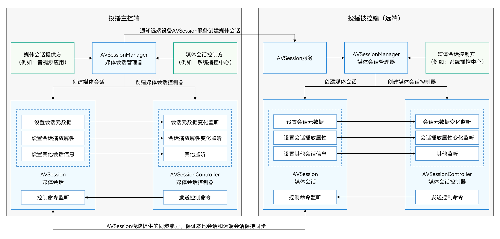

# 分布式媒体会话概述(仅对系统应用开放)

OpenHarmony提供的媒体会话允许用户把本地播放的媒体投播到远端分布式设备上，从而实现更好的播放效果，例如将平板上播放的音频投播到智能音箱。

当用户将音频媒体投播到远端设备后，可以实时将媒体信息同步到远端设备，同时远端被投播的设备也可以反向控制源端音源，进行上一首/下一首/播放/暂停等控制，用户层面上整个播放控制流程和本地播放一致。

## 交互过程

当本地投播主控端设备与远端被控端设备成功配对之后，主控端设备中的媒体会话控制方，可以通过媒体会话管理器将媒体投播到被控设备上，实现分布式媒体会话，交互过程如图所示。

媒体投播时，被控端设备上的AVSession服务会自动创建一个与主控设备保持同步的媒体会话，主控设备的会话信息、主控设备的命令事件与被控设备上的命令事件时刻保持同步。

## 分布式媒体会话流程

用户进行了分布式投播以后，在投播被控端自动创建出对应的媒体会话，两侧的媒体会话可以相互联动，具体体现在：

1. 主控端本地媒体会话服务接收到音频跨设备切换命令后将本端的媒体会话信息同步到远端。

2. 远端播控中心监听到新增会话后，创建对应会话的控制器。

3. 远端播控中心可以通过远端的控制器将控制命令发送到主控端本地媒体会话。

4. 主控端本地媒体会话接收远端控制命令后，回调到本端的音频类应用。

5. 主控端本地的媒体会话信息变更实时同步到远端播控中心显示。

6. 远端设备连接断开后，音频切回主控端本地并暂停播放（音频部件完成回切，媒体会话通知应用暂停）。

## 分布式媒体会话场景

应用通过分布式媒体会话进行投播时，存在两种场景：

- 系统投播：通过媒体会话控制方，例如播控中心，发起分布式投播。
  系统投播对所有应用生效。系统投播后，主控端设备中的所有音频默认从被控端设备播放。

- 应用投播：音视频应用在自身应用内通过集成投播组件发起分布式投播（当前暂未支持）。
  应用投播对单个应用生效。应用投播后，主控端设备中发起投播的应用音频从被控端设备播放，其它应用的音频依旧从主控端设备播放。

另外，投播支持抢占，后投播应用可以抢占之前投播的应用，在远端设备进行音频播放。

## 分布式媒体会话与分布式音频播放之间的关系

媒体会话服务在实现分布式媒体会话进行跨设备投播时，内部的实现逻辑可以粗略描述为：

- 调用了[分布式音频播放](../audio/distributed-audio-playback.md)能力的相关接口，将音频流投播到了远端设备。

- 通过分布式能力将媒体会话元数据投播到了远端设备，供远端设备获取并显示。

所以，通过分布式媒体会话进行投播，不仅可以实现在远端设备播放音频，而且可以让远端设备显示播放信息，同时借助媒体会话的机制，可以实现在远端设备上对播放的音频进行控制。
