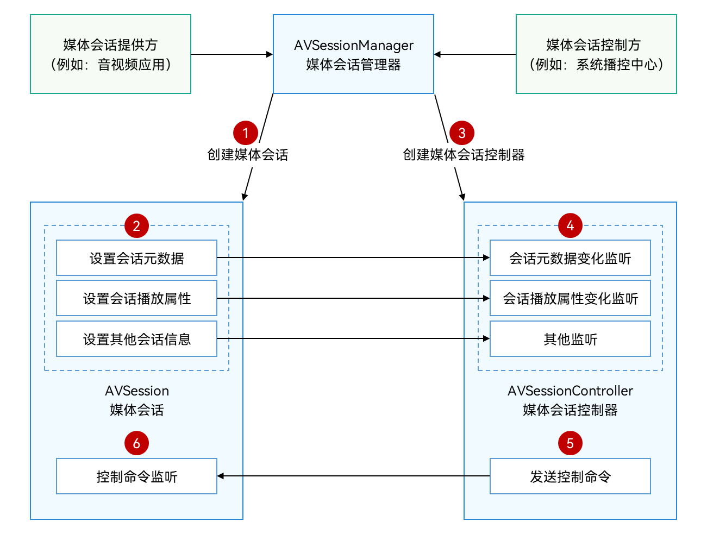

# 本地媒体会话概述

## 交互过程

本地媒体会话的数据源均在设备本地，交互过程如图所示。



此过程中涉及两大角色，媒体会话提供方和媒体会话控制方。

> **说明：**
>
> 媒体会话控制方为系统应用，三方应用可以成为媒体会话提供方。

本地媒体会话中，媒体会话提供方通过媒体会话管理器和媒体会话控制方进行信息交互：

1. 媒体会话提供方通过AVSessionManager创建AVSession对象。

2. 媒体会话提供方通过AVSession对象，设置会话元数据（媒体ID、标题、媒体时长等）、会话播放属性（播放状态、播放倍速、播放位置等）等。

3. 媒体会话控制方通过AVSessionManager创建AVSessionController对象。

4. 媒体会话控制方通过AVSessionController对象可以监听对应会话元数据变化、播放属性变化等。

5. 媒体会话控制方通过AVSessionController对象还可以向媒体会话发送控制命令。

6. 媒体会话提供方通过AVSession对象可以监听来自媒体会话控制方的控制命令，例如：“play”播放、“playNext”播放下一首、“fastForward”快进、 “setSpeed”设置播放倍数等。

## 媒体会话管理器

媒体会话管理器（AVSessionManager），提供了管理AVSession的能力，可以创建AVSession、创建AVSessionController、发送系统控制事件，也支持对AVSession的状态进行监听。

实际上，AVSessionManager与AVSession、AVSessionController对象不同，并不是一个具体的对象，它是媒体会话的根命名域。在实际编程过程中，可以通过如下方式引入：

```ts
import { avSession as AVSessionManager } from '@kit.AVSessionKit';
```

根命名域中的所有方法都可以作为AVSessionManager的方法。

例如，媒体会话提供方通过AVSessionManager创建媒体会话的示例如下所示：
 
```ts
import { BusinessError } from '@kit.BasicServicesKit';
import { avSession } from '@kit.AVSessionKit';
import { avSession as AVSessionManager } from '@kit.AVSessionKit';

@Entry
@Component
struct Index {
  @State message: string = 'hello world';

  build() {
    Column() {
      Text(this.message)
        .onClick(async () => {
          // 创建session。
          let context = this.getUIContext().getHostContext() as Context;
          let session: AVSessionManager.AVSession = await AVSessionManager.createAVSession(context, 'SESSION_NAME', 'audio');
          console.info(`session create done : sessionId : ${session.sessionId}`);
        })
    }
    .width('100%')
    .height('100%')
  }
}
```
<!--Del-->
例如，媒体会话控制方通过AVSessionManager创建媒体会话控制器的示例如下所示：

```ts
// 创建controller。
async function createController() {
  // 获取到所有存活session的描述符列表。
  let descriptorsArray: Array<AVSessionManager.AVSessionDescriptor> = await AVSessionManager.getAllSessionDescriptors();
  if (descriptorsArray.length > 0) {
    // 为了演示，我们简单取第一个描述符的sessionId用来创建对应的controller。
    let sessionId: string = descriptorsArray[0].sessionId;
    let avSessionController: AVSessionManager.AVSessionController = await AVSessionManager.createController(sessionId);
    console.info(`controller create done : sessionId : ${avSessionController.sessionId}`);
  }
}
```
<!--DelEnd-->

更多关于AVSessionManager的方法，可以参考[API文档](../../reference/apis-avsession-kit/js-apis-avsession.md)。
