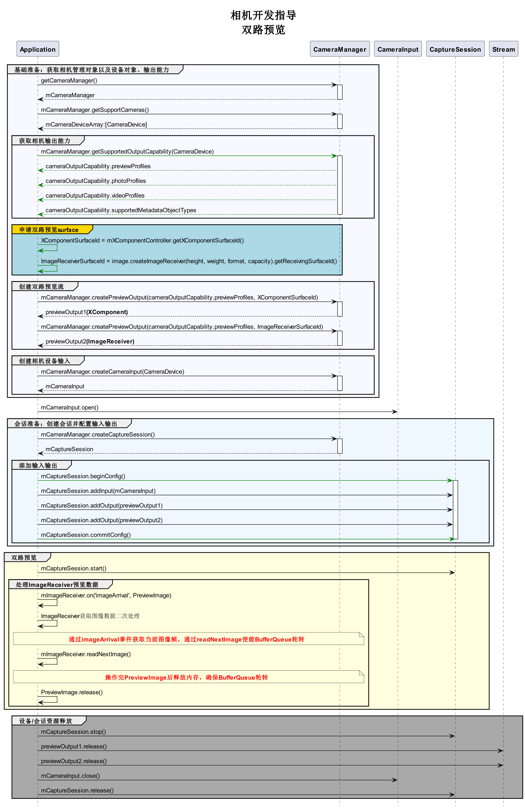

# 双路预览

相机应用通过控制相机，实现图像显示（预览）、照片保存（拍照）、视频录制（录像）等基础操作。相机开发模型为Surface模型，即应用通过Surface进行数据传递，通过ImageReceiver的surface获取拍照流的数据、通过XComponent的surface获取预览流的数据。

如果要实现双路预览，即将拍照流改为预览流，将拍照流中的surface改为预览流的surface，通过ImageReceiver的surface创建previewOutput，其余流程与拍照流和预览流一致。

详细的API说明请参考[Camera API参考](../reference/apis/js-apis-camera.md)。

## 约束与限制

- 暂不支持动态添加流，即不能在没有调用session.stop的情况下，调用addOutput添加流。
- 对ImageReceiver组件获取到的图像数据处理后，需要将对应的图像Buffer释放，确保Surface的BufferQueue正常轮转。

## 调用流程

双路方案调用流程图建议如下：



## 开发步骤

1. 导入image接口。

   创建双路预览流的SurfaceId，除XComponent组件的SurfaceId外，还需要使用ImageReceiver组件创建生成的SurfaceId，需要使用image模块提供的接口。

   ```js
   import image from '@ohos.multimedia.image';
   ```

2. 创建ImageReceiver组件Surface。

   ```js
   function getImageReceiverSurfaceId() {
       let receiver = image.createImageReceiver(640, 480, 4, 8);
       console.info('before ImageReceiver check');
       if (receiver !== undefined) {
         console.info('ImageReceiver is ok');
         let ImageReceiverSurfaceId = receiver.getReceivingSurfaceId();
         console.info('ImageReceived id: ' + JSON.stringify(ImageReceiverSurfaceId));
       } else {
         console.info('ImageReceiver is not ok');
       }
   }
   ```

3. 创建XComponent组件Surface。

   可参考[相机预览指导文档](camera-preview.md)。

   ```js
   // 创建XComponentController 
   mXComponentController: XComponentController = new XComponentController;                   
   build() {
       Flex() {
           // 创建XComponent
           XComponent({                                                                     
               id: '',
               type: 'surface',
               libraryname: '',
               controller: this.mXComponentController
           })
           .onLoad(() => {                                                                  
               // 设置Surface宽高（1920*1080），预览尺寸设置参考前面 previewProfilesArray 获取的当前设备所支持的预览分辨率大小去设置
               this.mXComponentController.setXComponentSurfaceSize({surfaceWidth:1920,surfaceHeight:1080});
               // 获取Surface ID
               globalThis.XComponentsurfaceId = this.mXComponentController.getXComponentSurfaceId();
           })
           .width('100%')                                                                 
           .height('100%')                                                                
       }
   }
   ```

4. 实现双路预览。

   将步骤2、3生成的两路SurfaceId通过createPreviewOutput方法传递到相机服务，创建两路预览流，其余流程按照正常预览流程开发。

   ```js
   let cameraManager = camera.getCameraManager(globalThis.abilityContext);
   let CamerasDevices = cameraManager.getSupportedCameras(); // 获取支持的相机设备对象

   // 正常写法通过下面方式获取实际情况下的profile对象
   // let profiles = await this.cameraManager.getSupportedOutputCapability(CamerasDevices[cameraDeviceIndex]); // 获取对应相机设备profiles
   // let previewProfiles = profiles.previewProfiles;

   // 预览流1
   let previewProfilesObj: camera.Profile;
   previewProfilesObj.size.width = 640;
   previewProfilesObj.size.height = 480;
   previewProfilesObj.format = 3;

   // 预览流2
   let previewProfilesObj2: camera.Profile;
   previewProfilesObj2.size.width = 640;
   previewProfilesObj2.size.height = 480;
   previewProfilesObj2.format = 3;

   // 创建 预览流1 输出对象
   let previewOutput = cameraManager.createPreviewOutput(previewProfilesObj, XComponentsurfaceId);

   // 创建 预览流2 输出对象
   let imageReceiverSurfaceId: string = await this.mReceiver.getReceivingSurfaceId();
   let previewOutput2 = cameraManager.createPreviewOutput(previewProfilesObj2, imageReceiverSurfaceId);

   // 创建cameraInput输出对象
   let cameraInput = cameraManager.createCameraInput(CamerasDevices[cameraDeviceIndex]);

   // 打开相机
   await cameraInput.open();

   // 会话流程
   let captureSession = await cameraManager.createCaptureSession();

   // 开始配置会话
   captureSession.beginConfig();

   // 把CameraInput加入到会话
   captureSession.addInput(cameraInput);

   // 把 预览流1 加入到会话
   captureSession.addOutput(previewOutput)

   // 把 预览流2 加入到会话
   captureSession.addOutput(previewOutput2);

   // 提交配置信息
   await captureSession.commitConfig();

   // 会话开始
   await captureSession.start();
   ```

5. 通过ImageReceiver实时获取预览图像。

   通过ImageReceiver组件中imageArrival事件监听获取底层返回的图像数据，详细的API说明请参考[Image API参考](../reference/apis/js-apis-image.md)。

   ```js
   this.receiver.on('imageArrival', () => {
       this.receiver.readNextImage((err, nextImage: image.Image) => {
           if (err || nextImage === undefined) {
               return;
           }
           nextImage.getComponent(image.ComponentType.JPEG, (errMsg, img) => {
           if (errMsg || img === undefined) {
               return;
           }
           let buffer;
           if (img.byteBuffer) {
               buffer = img.byteBuffer;
           } else {
               return;
           }
           // do something...;
           })
       })
   })
   ```
