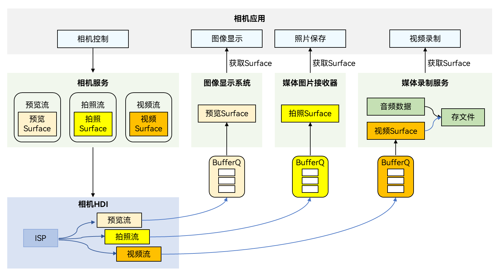

# 相机开发概述

开发者通过调用OpenHarmony相机服务提供的接口可以开发相机应用，应用通过访问和操作相机硬件，实现基础操作，如预览、拍照和录像；还可以通过接口组合完成更多操作，如控制闪光灯和曝光时间、对焦或调焦等。

## 开发模型

相机调用摄像头采集、加工图像视频数据，精确控制对应的硬件，灵活输出图像、视频内容，满足多镜头硬件适配（如广角、长焦、TOF）、多业务场景适配（如不同分辨率、不同格式、不同效果）的要求。

相机的工作流程如图所示，可概括为相机输入设备管理、会话管理和相机输出管理三部分。

- 相机设备调用摄像头采集数据，作为相机输入流。

- 会话管理可配置输入流，即选择哪些镜头进行拍摄。另外还可以配置闪光灯、曝光时间、对焦和调焦等参数，实现不同效果的拍摄，从而适配不同的业务场景。应用可以通过切换会话满足不同场景的拍摄需求。

- 配置相机的输出流，即将内容以预览流、拍照流或视频流输出。

**图1** 相机工作流程  

了解相机工作流程后，建议开发者了解相机的开发模型，便于更好地开发相机应用。

**图2** 相机开发模型  

相机应用通过控制相机，实现图像显示（预览）、照片保存（拍照）、视频录制（录像）等基础操作。在实现基本操作过程中，相机服务会控制相机设备采集和输出数据，采集的图像数据在相机底层的设备硬件接口（HDI，Hardware Device Interfaces），直接通过BufferQueue传递到具体的功能模块进行处理。BufferQueue在应用开发中无需关注，用于将底层处理的数据及时送到上层进行图像显示。

以视频录制为例进行说明，相机应用在录制视频过程中，媒体录制服务先创建一个视频Surface用于传递数据，并提供给相机服务，相机服务可控制相机设备采集视频数据，生成视频流。采集的数据通过底层相机HDI处理后，通过Surface将视频流传递给媒体录制服务，媒体录制服务对视频数据进行处理后，保存为视频文件，完成视频录制。
